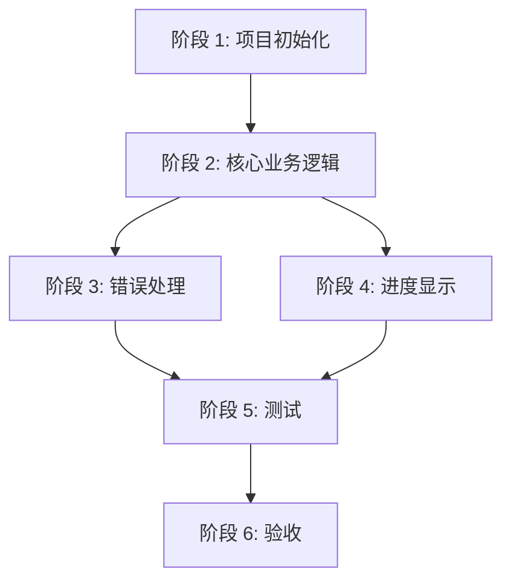

# ImageAutoInserter 任务清单 (v1.2)

> **版本**: v1.2  
> **最后更新**: 2026-03-06  
> **状态**: CLI 版本已完成

---

## 已完成任务

### 阶段 1：项目初始化 ✅

#### 基础架构
- [x] **Task 1.1**: 创建项目基础结构
  - [x] 创建目录结构（src/, tests/, assets/, dist/）
  - [x] 初始化 Python 虚拟环境
  - [x] 创建 requirements.txt（包含 openpyxl, Pillow, rarfile 等）
  - [x] 配置 .gitignore
- [x] **Task 1.2**: 配置开发环境
  - [x] 安装依赖包
  - [x] 配置 pytest 测试框架
  - [x] 配置代码规范工具

---

### 阶段 2：核心业务逻辑 ✅

#### 图片处理模块
- [x] **Task 2.1**: 图片处理器实现
  - [x] 从文件夹读取图片
  - [x] 从 ZIP 压缩包读取图片（完全内存处理）
  - [x] 从 RAR 压缩包读取图片（完全内存处理）
  - [x] 解析图片文件名，提取商品编码
  - [x] 图片尺寸调整（180×138 像素）
  - [x] 保持画质，不进行有损压缩

#### Excel 处理模块
- [x] **Task 2.2**: Excel 处理器实现
  - [x] 读取 Excel 文件（read_only 模式）
  - [x] 自动识别包含"商品编码"列的 Sheet
  - [x] **动态识别表头位置**（遍历每一行查找表头）
  - [x] **智能检查并添加 Picture 1/2/3 列**
  - [x] 嵌入图片到单元格（180×138 像素）
  - [x] 保存输出文件（原文件名_含图.xlsx）

#### 商品编码匹配模块
- [x] **Task 2.3**: 匹配器实现
  - [x] 从图片文件名提取商品编码
  - [x] 从 Excel 读取商品编码列表
  - [x] 匹配商品编码与图片
  - [x] 处理多图片情况（Picture 1/2/3）

---

### 阶段 3：错误处理 ✅

- [x] **Task 3.1**: 错误处理机制
  - [x] 详细错误提示（包含文件、行号、原因）
  - [x] 重试机制（最多 3 次）
  - [x] 跳过机制（记录错误继续处理）
  - [x] 错误日志生成

- [x] **Task 3.2**: 错误日志优化（v0.2.0）
  - [x] 只记录失败行（不记录成功日志）
  - [x] 智能错误分类（Excel 公式错误 vs 图片缺失）
  - [x] 精准问题定位（数据问题 vs 图片文件问题）
  - [x] 操作引导（为每种错误类型提供解决建议）

- [x] **Task 3.3**: Picture 字段变体识别（v0.2.0）
  - [x] 支持 24 种变体识别
  - [x] 单复数形式识别
  - [x] 缩写识别
  - [x] 拼写纠错
  - [x] 大小写统一

- [x] **Task 3.4**: 表头保持策略（v0.2.0）
  - [x] 识别但不修改原始表头
  - [x] 内部标准格式映射
  - [x] 新增列使用标准格式

- [x] **Task 3.5**: 动态列扩展（v0.2.0）
  - [x] 支持超过 3 张图片（最多 10 个 Picture 列）
  - [x] 按需添加列
  - [x] 智能扫描确定最大图片数

- [x] **Task 3.6**: 智能列位置优化（v0.2.0）
  - [x] 智能查找第一个空白列
  - [x] 避免覆盖已有数据的列
  - [x] 紧凑布局
  - [x] 自动跳过空表头列

---

### 阶段 4：进度显示 ✅

- [x] **Task 4.1**: 进度显示功能
  - [x] 实时显示当前处理进度（当前行/总行数）
  - [x] 显示当前处理动作
  - [x] 显示当前商品编码
  - [x] 显示图片来源
  - [x] 预估剩余时间
  - [x] 进度更新频率控制（每 5 行更新一次）

---

### 阶段 5：测试 ✅

- [x] **Task 5.1**: 单元测试
  - [x] 图片处理器测试
  - [x] Excel 处理器测试
  - [x] 匹配器测试
  - [x] 错误处理测试

- [x] **Task 5.2**: 集成测试
  - [x] 完整流程测试
  - [x] 边界条件测试
  - [x] 异常场景测试

---

### 阶段 6：验收 ✅

- [x] **Task 6.1**: 功能验收
  - [x] 核心功能验收（checklist.md）
  - [x] 非功能性验收

- [x] **Task 6.2**: 文档验收
  - [x] spec.md 完整性检查
  - [x] tasks.md 完整性检查
  - [x] checklist.md 完整性检查

---

## 任务依赖关系

---

## 变更历史

| 版本 | 日期 | 变更内容 |
|------|------|---------|
| v1.2 | 2026-03-06 | CLI 版本任务完成（v0.2.0 功能增强） |
| v1.1 | 2026-03-05 | 添加错误处理和进度显示任务 |
| v1.0 | 2026-03-04 | 初始版本，核心功能任务 |

---

**文档结束**
