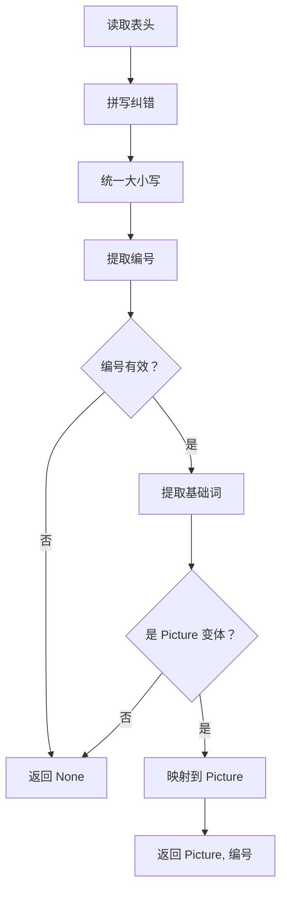
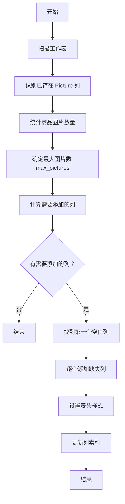

# DESIGN_Picture 变体支持

**创建日期**: 2026-03-11  
**状态**: 架构设计  
**基于文档**: [ALIGNMENT_Picture 变体支持.md](file:///Users/shimengyu/Documents/trae_projects/ImageAutoInserter/docs/ALIGNMENT_Picture 变体支持.md)

---

## 1. 架构概述

### 1.1 系统定位

```
┌─────────────────────────────────────────────────────────┐
│                    应用层（GUI/CLI）                      │
└─────────────────────────────────────────────────────────┘
                            ↓
┌─────────────────────────────────────────────────────────┐
│                  业务逻辑层（ProcessEngine）               │
└─────────────────────────────────────────────────────────┘
                            ↓
┌─────────────────────────────────────────────────────────┐
│               核心服务层（ExcelProcessor）                 │
│  ┌─────────────────────────────────────────────────────┐ │
│  │  变体识别模块  │  列管理模块  │  图片嵌入模块          │ │
│  └─────────────────────────────────────────────────────┘ │
└─────────────────────────────────────────────────────────┘
                            ↓
┌─────────────────────────────────────────────────────────┐
│              基础设施层（openpyxl/PIL）                    │
└─────────────────────────────────────────────────────────┘
```

### 1.2 设计原则

1. **单一职责** - 每个模块只负责一个功能点
2. **开闭原则** - 对扩展开放，对修改关闭
3. **向后兼容** - 不影响现有功能
4. **性能优先** - 识别时间 < 1ms/表头

---

## 2. 模块设计

### 2.1 模块划分

```
src/core/
├── excel_processor.py          # 现有文件，增强变体识别功能
├── process_engine.py           # 现有文件，增加图片扫描逻辑
└── picture_variant.py          # 【新增】变体识别核心模块
    ├── VariantRecognizer       # 变体识别器
    ├── SpellingCorrector       # 拼写纠错器
    └── PictureColumnMapper     # 列映射管理器
```

### 2.2 核心类设计

#### 2.2.1 VariantRecognizer（变体识别器）

```python
class VariantRecognizer:
    """
    Picture 变体识别器
    
    功能：
    1. 识别 24 种变体
    2. 提取编号
    3. 标准化映射
    
    属性：
        SUPPORTED_VARIANTS (Set[str]): 支持的基础词集合
        MAX_NUMBER (int): 最大编号（10）
    """
    
    # 支持的基础词（统一映射到 Picture）
    SUPPORTED_BASE_WORDS = {
        # 英文
        'picture', 'photo', 'image', 'figure',
        # 中文
        '图片', '照片', '图像', '图'
    }
    
    def __init__(self):
        """初始化识别器"""
        self.corrector = SpellingCorrector()
    
    def recognize(self, header: str) -> Optional[Tuple[str, int]]:
        """
        识别表头是否为 Picture 变体
        
        参数：
            header (str): 原始表头字符串
        
        返回：
            Optional[Tuple[str, int]]: (标准化名称，编号)
            - 如："Picture", 1
            - 如不是变体，返回 None
        
        示例：
            >>> recognizer.recognize("Picture1")
            ("Picture", 1)
            
            >>> recognizer.recognize("Photo 2")
            ("Picture", 2)
            
            >>> recognizer.recognize("图片 1")
            ("Picture", 1)
            
            >>> recognizer.recognize("Name")
            None
        """
        pass
    
    def _normalize(self, text: str) -> str:
        """标准化文本（纠错、大小写、去空格）"""
        pass
    
    def _extract_number(self, text: str) -> Optional[int]:
        """提取编号"""
        pass
    
    def _extract_base_word(self, text: str) -> Optional[str]:
        """提取基础词"""
        pass
```

#### 2.2.2 SpellingCorrector（拼写纠错器）

```python
class SpellingCorrector:
    """
    拼写纠错器
    
    功能：
    1. 常见拼写错误纠正
    2. 大小写统一
    3. 复数形式识别
    
    属性：
        CORRECTIONS (Dict[str, str]): 拼写纠错映射表
    """
    
    # 拼写纠错映射表
    CORRECTIONS = {
        # Photo 相关
        'photoes': 'photos',
        'foto': 'photo',
        'fotos': 'photos',
        
        # Picture 相关
        'pitures': 'pictures',
        'piture': 'picture',
        'picure': 'picture',
        'picures': 'pictures',
        'pictue': 'picture',
        'pictuers': 'pictures',
        
        # Image 相关
        'imgs': 'images',
        'imge': 'image',
        'imges': 'images',
        
        # Figure 相关
        'fig': 'figure',
        
        # 中文常见错误
        '图片片': '图片',
        '照照片': '照片',
    }
    
    def __init__(self):
        """初始化纠错器"""
        # 构建复数映射
        self.PLURAL_FORMS = {
            'pictures': 'picture',
            'photos': 'photo',
            'images': 'image',
            'figures': 'figure',
            '图片': '图片',  # 中文无复数
            '照片': '照片',
            '图像': '图像',
            '图': '图',
        }
    
    def correct(self, text: str) -> str:
        """
        纠正拼写错误
        
        参数：
            text (str): 原始文本
        
        返回：
            str: 纠正后的文本
        
        示例：
            >>> corrector.correct("Photoes")
            "Photos"
            
            >>> corrector.correct("Pitures")
            "Pictures"
        """
        # 转小写查找
        lower_text = text.lower()
        
        # 查找纠错映射
        if lower_text in self.CORRECTIONS:
            corrected = self.CORRECTIONS[lower_text]
            # 保持原始大小写格式
            return self._preserve_case(text, corrected)
        
        return text
    
    def _preserve_case(self, original: str, corrected: str) -> str:
        """保持原始大小写格式"""
        if original.isupper():
            return corrected.upper()
        elif original.istitle():
            return corrected.title()
        else:
            return corrected
    
    def get_base_word(self, text: str) -> Optional[str]:
        """
        获取基础词（去除复数）
        
        参数：
            text (str): 文本
        
        返回：
            Optional[str]: 基础词
        
        示例：
            >>> get_base_word("Pictures")
            "Picture"
            
            >>> get_base_word("图片")
            "图片"
        """
        lower_text = text.lower()
        
        if lower_text in self.PLURAL_FORMS:
            base = self.PLURAL_FORMS[lower_text]
            return self._preserve_case(text, base)
        
        return text
```

#### 2.2.3 PictureColumnMapper（列映射管理器）

```python
class PictureColumnMapper:
    """
    Picture 列映射管理器
    
    功能：
    1. 管理已存在的 Picture 列
    2. 计算需要添加的列
    3. 维护原始表头与标准映射
    
    属性：
        existing_columns (Dict[int, int]): {编号：列号}
        original_headers (Dict[int, str]): {编号：原始表头}
    """
    
    def __init__(self):
        """初始化映射管理器"""
        self.recognizer = VariantRecognizer()
        self.existing_columns: Dict[int, int] = {}
        self.original_headers: Dict[int, str] = {}
    
    def scan_worksheet(self, worksheet, header_row: int):
        """
        扫描工作表，识别已存在的 Picture 列
        
        参数：
            worksheet: openpyxl 工作表对象
            header_row (int): 表头行号
        """
        for col_idx in range(1, worksheet.max_column + 1):
            cell = worksheet.cell(row=header_row, column=col_idx)
            if cell.value:
                result = self.recognizer.recognize(str(cell.value))
                if result:
                    base_word, number = result
                    self.existing_columns[number] = col_idx
                    self.original_headers[number] = str(cell.value)
    
    def get_existing_columns(self) -> Dict[int, int]:
        """获取已存在的列"""
        return self.existing_columns
    
    def get_max_existing_number(self) -> int:
        """获取已存在的最大编号"""
        return max(self.existing_columns.keys()) if self.existing_columns else 0
    
    def calculate_needed_columns(self, max_pictures: int) -> List[int]:
        """
        计算需要添加的列编号
        
        参数：
            max_pictures (int): 最大图片数
        
        返回：
            List[int]: 需要添加的列编号列表
        
        示例：
            >>> mapper.existing_columns = {1: 18, 2: 19}
            >>> mapper.calculate_needed_columns(5)
            [3, 4, 5]
        """
        existing = set(self.existing_columns.keys())
        needed = set(range(1, max(max_pictures, 1) + 1))
        return sorted(needed - existing)
```

---

## 3. 数据流设计

### 3.1 变体识别流程



### 3.2 列添加流程



### 3.3 数据结构

```python
@dataclass
class PictureColumn:
    """Picture 列信息"""
    number: int              # 编号（1-10）
    original_header: str     # 原始表头
    column_index: int        # Excel 列索引
    is_existing: bool        # 是否已存在
    
    def to_dict(self) -> Dict[str, Any]:
        """转换为字典"""
        return {
            'number': self.number,
            'original_header': self.original_header,
            'column_index': self.column_index,
            'is_existing': self.is_existing
        }


@dataclass
class ColumnAdditionResult:
    """列添加结果"""
    added_columns: List[PictureColumn]  # 新增的列
    existing_columns: List[PictureColumn]  # 已存在的列
    total_columns: int  # 总列数
    
    def to_dict(self) -> Dict[str, Any]:
        """转换为字典"""
        return {
            'added': [col.to_dict() for col in self.added_columns],
            'existing': [col.to_dict() for col in self.existing_columns],
            'total': self.total_columns
        }
```

---

## 4. 接口设计

### 4.1 公共 API

#### 新增函数

```python
# src/core/picture_variant.py

def recognize_variant(header: str) -> Optional[Tuple[str, int]]:
    """
    识别 Picture 变体（公共接口）
    
    参数：
        header (str): 表头字符串
    
    返回：
        Optional[Tuple[str, int]]: (标准化名称，编号)
    
    示例：
        >>> recognize_variant("Picture1")
        ("Picture", 1)
        
        >>> recognize_variant("Photo 2")
        ("Picture", 2)
    """
    recognizer = VariantRecognizer()
    return recognizer.recognize(header)


def correct_spelling(text: str) -> str:
    """
    拼写纠错（公共接口）
    
    参数：
        text (str): 原始文本
    
    返回：
        str: 纠正后的文本
    """
    corrector = SpellingCorrector()
    return corrector.correct(text)
```

#### 修改现有方法

```python
# src/core/excel_processor.py

class ExcelProcessor:
    # ... 现有代码 ...
    
    def _column_exists(self, column_name: str) -> Optional[int]:
        """
        【增强】检查列是否存在（支持变体识别）
        
        参数：
            column_name (str): 列名（如"Picture 1"）
        
        返回：
            Optional[int]: 列号
        """
        # 原有逻辑 + 变体识别逻辑
        pass
    
    def add_picture_columns(self, max_pictures: int = None) -> Dict[str, int]:
        """
        【增强】添加 Picture 列（支持动态扩展）
        
        参数：
            max_pictures (int): 最大图片数（可选，默认扫描确定）
        
        返回：
            Dict[str, int]: {"Picture 1": 列号，...}
        """
        # 原有逻辑 + 动态扩展逻辑
        pass
    
    def scan_product_images(self) -> int:
        """
        【新增】扫描商品的图片数量
        
        返回：
            int: 最大图片数
        """
        pass
```

### 4.2 输入输出契约

#### 输入

```python
# 输入参数
{
    'excel_path': str,           # Excel 文件路径
    'image_source': str,         # 图片源路径
    'header_row': int,           # 表头行号（自动识别）
}
```

#### 输出

```python
# 输出结果
{
    'existing_columns': {
        1: 18,  # Picture 1 在第 18 列
        2: 19,  # Picture 2 在第 19 列
    },
    'added_columns': {
        3: 20,  # 添加 Picture 3 在第 20 列
    },
    'max_pictures': 3,  # 最大图片数
}
```

---

## 5. 异常处理

### 5.1 异常类型

```python
class PictureVariantError(Exception):
    """Picture 变体识别异常"""
    pass


class InvalidNumberError(PictureVariantError):
    """无效编号异常"""
    
    def __init__(self, number: int, message: str = ""):
        self.number = number
        self.message = message or f"编号 {number} 超出范围 (1-10)"
        super().__init__(self.message)


class UnrecognizedVariantError(PictureVariantError):
    """无法识别的变体异常"""
    
    def __init__(self, header: str):
        self.header = header
        self.message = f"无法识别的 Picture 变体：{header}"
        super().__init__(self.message)
```

### 5.2 异常处理策略

```python
def recognize(self, header: str) -> Optional[Tuple[str, int]]:
    """识别变体（不抛出异常，返回 None 表示失败）"""
    try:
        # 识别逻辑
        if number < 1 or number > 10:
            # 编号无效，静默跳过
            return None
        
        if base_word not in self.SUPPORTED_BASE_WORDS:
            # 不是支持的变体，静默跳过
            return None
        
        return ("Picture", number)
    
    except Exception as e:
        # 记录日志，但不中断
        logger.warning(f"识别变体失败：{header}, 错误：{e}")
        return None
```

---

## 6. 性能优化

### 6.1 缓存策略

```python
from functools import lru_cache

class VariantRecognizer:
    @lru_cache(maxsize=1024)
    def recognize(self, header: str) -> Optional[Tuple[str, int]]:
        """使用 LRU 缓存加速重复识别"""
        # 识别逻辑
        pass
```

### 6.2 批量处理

```python
def scan_worksheet(self, worksheet, header_row: int):
    """批量扫描工作表"""
    # 一次性读取整行，减少 IO 操作
    headers = list(worksheet.iter_rows(
        min_row=header_row,
        max_row=header_row,
        max_col=worksheet.max_column,
        values_only=True
    ))[0]
    
    # 批量识别
    for col_idx, header in enumerate(headers, start=1):
        if header:
            result = self.recognizer.recognize(str(header))
            if result:
                self.existing_columns[result[1]] = col_idx
```

### 6.3 性能目标

| 指标 | 目标值 | 测量方法 |
|------|--------|----------|
| 单次识别时间 | < 1ms | `timeit` 模块 |
| 100 列表头扫描 | < 50ms | 实际测试 |
| 内存占用增加 | < 10MB | `tracemalloc` 模块 |

---

## 7. 测试策略

### 7.1 单元测试

```python
# tests/test_picture_variant.py

class TestVariantRecognizer:
    """测试变体识别器"""
    
    def test_picture_variants(self):
        """测试 Picture 变体"""
        recognizer = VariantRecognizer()
        
        # 无空格
        assert recognizer.recognize("Picture1") == ("Picture", 1)
        assert recognizer.recognize("Picture2") == ("Picture", 2)
        
        # 有空格
        assert recognizer.recognize("Picture 1") == ("Picture", 1)
        
        # 大小写
        assert recognizer.recognize("PICTURE1") == ("Picture", 1)
        assert recognizer.recognize("picture1") == ("Picture", 1)
    
    def test_photo_variants(self):
        """测试 Photo 变体"""
        recognizer = VariantRecognizer()
        
        assert recognizer.recognize("Photo1") == ("Picture", 1)
        assert recognizer.recognize("Photo 2") == ("Picture", 2)
        assert recognizer.recognize("Photos1") == ("Picture", 1)
    
    def test_spelling_correction(self):
        """测试拼写纠错"""
        recognizer = VariantRecognizer()
        
        assert recognizer.recognize("Photoes1") == ("Picture", 1)
        assert recognizer.recognize("Pitures2") == ("Picture", 2)
    
    def test_chinese_variants(self):
        """测试中文变体"""
        recognizer = VariantRecognizer()
        
        assert recognizer.recognize("图片 1") == ("Picture", 1)
        assert recognizer.recognize("照片 2") == ("Picture", 2)
        assert recognizer.recognize("图像 3") == ("Picture", 3)
        assert recognizer.recognize("图 1") == ("Picture", 1)
    
    def test_invalid_input(self):
        """测试无效输入"""
        recognizer = VariantRecognizer()
        
        assert recognizer.recognize("Name") is None
        assert recognizer.recognize("Price") is None
        assert recognizer.recognize("Picture11") is None  # 编号>10
```

### 7.2 集成测试

```python
# tests/test_integration.py

class TestPictureColumnIntegration:
    """测试 Picture 列集成"""
    
    def test_mixed_variants(self):
        """测试混合变体识别"""
        # 创建测试 Excel
        wb = Workbook()
        ws = wb.active
        ws.cell(row=1, column=1, value="商品编码")
        ws.cell(row=1, column=2, value="Name")
        ws.cell(row=1, column=3, value="Photo1")
        ws.cell(row=1, column=4, value="Image 2")
        ws.cell(row=1, column=5, value="图片 3")
        
        # 保存并处理
        excel_path = save_test_excel(wb)
        processor = ExcelProcessor(excel_path)
        
        # 扫描
        sheet_info = processor.find_sheet_with_product_code()
        mapper = PictureColumnMapper()
        mapper.scan_worksheet(processor.workbook[sheet_info.name], sheet_info.header_row)
        
        # 验证
        assert 1 in mapper.existing_columns
        assert 2 in mapper.existing_columns
        assert 3 in mapper.existing_columns
    
    def test_dynamic_column_addition(self):
        """测试动态列添加"""
        # 已存在 Picture 1/2，需要添加 3/4/5
        wb = Workbook()
        ws = wb.active
        ws.cell(row=1, column=1, value="商品编码")
        ws.cell(row=1, column=2, value="Photo1")
        ws.cell(row=1, column=3, value="Photo2")
        
        excel_path = save_test_excel(wb)
        processor = ExcelProcessor(excel_path)
        sheet_info = processor.find_sheet_with_product_code()
        
        # 添加列（假设 max_pictures=5）
        result = processor.add_picture_columns(max_pictures=5)
        
        # 验证
        assert "Picture 1" in result  # 已存在
        assert "Picture 2" in result  # 已存在
        assert "Picture 3" in result  # 新增
        assert "Picture 4" in result  # 新增
        assert "Picture 5" in result  # 新增
```

### 7.3 回归测试

```python
# tests/test_regression.py

class TestRegression:
    """回归测试 - 确保现有功能不受影响"""
    
    def test_standard_picture_columns(self):
        """测试标准 Picture 列（向后兼容）"""
        wb = Workbook()
        ws = wb.active
        ws.cell(row=1, column=1, value="商品编码")
        ws.cell(row=1, column=2, value="Picture 1")
        ws.cell(row=1, column=3, value="Picture 2")
        ws.cell(row=1, column=4, value="Picture 3")
        
        excel_path = save_test_excel(wb)
        processor = ExcelProcessor(excel_path)
        sheet_info = processor.find_sheet_with_product_code()
        
        # 不应重复添加
        result = processor.add_picture_columns()
        
        assert len(result) == 3
        assert "Picture 1" in result
        assert "Picture 2" in result
        assert "Picture 3" in result
```

---

## 8. 文件结构

### 8.1 新增文件

```
src/core/
└── picture_variant.py          # 变体识别核心模块

tests/
└── test_picture_variant.py     # 单元测试
```

### 8.2 修改文件

```
src/core/
├── excel_processor.py          # 增强列识别和添加功能
└── process_engine.py           # 增加图片扫描逻辑

docs/
└── ALIGNMENT_Picture 变体支持.md  # 已创建
```

---

## 9. 迁移计划

### 9.1 向后兼容

- ✅ 现有 "Picture 1/2/3" 格式继续工作
- ✅ 不修改已有表头
- ✅ 所有现有测试保持通过

### 9.2 渐进式迁移

```
阶段 1: 新增变体识别模块（不影响现有代码）
阶段 2: 增强 _column_exists 方法（支持变体）
阶段 3: 增强 add_picture_columns 方法（支持动态扩展）
阶段 4: 全面测试和文档更新
```

---

## 10. 技术债务

### 10.1 已知限制

1. **不支持自定义前缀** - 如 `ProductImage`, `ItemPhoto`
2. **不支持嵌套表头** - 多行表头无法识别
3. **编号上限 10** - 超过 10 的编号视为无效

### 10.2 未来改进

1. **可配置编号上限** - 支持更多 Picture 列
2. **自定义前缀支持** - 用户可配置额外变体
3. **嵌套表头识别** - 支持复杂表头结构

---

## 11. 参考资源

### 11.1 相关文档

- [ALIGNMENT_Picture 变体支持.md](file:///Users/shimengyu/Documents/trae_projects/ImageAutoInserter/docs/ALIGNMENT_Picture 变体支持.md)
- [excel_processor.py](file:///Users/shimengyu/Documents/trae_projects/ImageAutoInserter/src/core/excel_processor.py)
- [process_engine.py](file:///Users/shimengyu/Documents/trae_projects/ImageAutoInserter/src/core/process_engine.py)

### 11.2 外部资源

- [openpyxl 文档](https://openpyxl.readthedocs.io/)
- [Python 正则表达式](https://docs.python.org/3/library/re.html)

---

**文档状态**: 待审批  
**最后更新**: 2026-03-11  
**负责人**: @shimengyu
