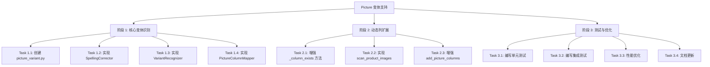

# TASK_Picture 变体支持

**创建日期**: 2026-03-11  
**状态**: 任务规划  
**基于文档**: [DESIGN_Picture 变体支持.md](file:///Users/shimengyu/Documents/trae_projects/ImageAutoInserter/docs/DESIGN_Picture 变体支持.md)

---

## 1. 任务概览

### 1.1 任务分解图



### 1.2 任务清单

| 阶段 | 任务数 | 预计时间 | 优先级 |
|------|--------|----------|--------|
| 阶段 1: 核心变体识别 | 4 | 3-4 小时 | High |
| 阶段 2: 动态列扩展 | 3 | 2-3 小时 | High |
| 阶段 3: 测试与优化 | 4 | 2-3 小时 | Medium |
| **总计** | **11** | **8-10 小时** | - |

---

## 2. 详细任务

### 阶段 1: 核心变体识别（3-4 小时）

#### Task 1.1: 创建 picture_variant.py 模块

**输入契约**:
- 前置条件：DESIGN 文档已审批
- 依赖：无
- 环境：Python 3.8+

**输出契约**:
- 交付物：`src/core/picture_variant.py`
- 验收标准：
  - [ ] 文件创建成功
  - [ ] 包含基础类结构
  - [ ] 导入语句正确
  - [ ] 无语法错误

**实现约束**:
- 技术栈：Python 3.8+
- 规范：遵循项目代码规范
- 必须包含模块文档字符串

**步骤**:
1. 创建文件 `src/core/picture_variant.py`
2. 添加模块文档字符串
3. 导入必要依赖
4. 定义基础类结构（空实现）

**预计时间**: 15 分钟

---

#### Task 1.2: 实现 SpellingCorrector 类

**输入契约**:
- 前置条件：Task 1.1 完成
- 依赖：picture_variant.py 基础结构
- 数据：拼写纠错映射表（来自 DESIGN 文档）

**输出契约**:
- 交付物：SpellingCorrector 类完整实现
- 验收标准：
  - [ ] CORRECTIONS 映射表完整
  - [ ] `correct()` 方法工作正常
  - [ ] `_preserve_case()` 方法正确
  - [ ] `get_base_word()` 方法正确
  - [ ] 单元测试通过

**实现约束**:
- 必须包含 15+ 个拼写错误纠正
- 必须支持大小写保持
- 必须支持复数识别

**步骤**:
1. 定义 CORRECTIONS 映射表
2. 定义 PLURAL_FORMS 映射表
3. 实现 `correct()` 方法
4. 实现 `_preserve_case()` 方法
5. 实现 `get_base_word()` 方法

**预计时间**: 45 分钟

---

#### Task 1.3: 实现 VariantRecognizer 类

**输入契约**:
- 前置条件：Task 1.2 完成
- 依赖：SpellingCorrector 类
- 数据：24 种变体列表（来自 DESIGN 文档）

**输出契约**:
- 交付物：VariantRecognizer 类完整实现
- 验收标准：
  - [ ] `recognize()` 方法工作正常
  - [ ] 支持 24 种变体识别
  - [ ] 正确提取编号（1-10）
  - [ ] 正确映射到 "Picture"
  - [ ] 单元测试通过

**实现约束**:
- 必须支持中英文变体
- 必须支持编号提取
- 必须使用缓存优化性能

**步骤**:
1. 定义 SUPPORTED_BASE_WORDS 集合
2. 实现 `recognize()` 方法
3. 实现 `_normalize()` 方法
4. 实现 `_extract_number()` 方法（正则表达式）
5. 实现 `_extract_base_word()` 方法
6. 添加 `@lru_cache` 装饰器

**预计时间**: 60 分钟

---

#### Task 1.4: 实现 PictureColumnMapper 类

**输入契约**:
- 前置条件：Task 1.3 完成
- 依赖：VariantRecognizer 类
- 环境：openpyxl 工作表对象

**输出契约**:
- 交付物：PictureColumnMapper 类完整实现
- 验收标准：
  - [ ] `scan_worksheet()` 方法正确扫描
  - [ ] `get_existing_columns()` 返回正确
  - [ ] `calculate_needed_columns()` 计算准确
  - [ ] 单元测试通过

**实现约束**:
- 必须支持批量扫描
- 必须维护原始表头映射
- 必须支持动态列计算

**步骤**:
1. 定义数据属性
2. 实现 `scan_worksheet()` 方法
3. 实现 `get_existing_columns()` 方法
4. 实现 `get_max_existing_number()` 方法
5. 实现 `calculate_needed_columns()` 方法

**预计时间**: 45 分钟

---

### 阶段 2: 动态列扩展（2-3 小时）

#### Task 2.1: 增强 _column_exists 方法

**输入契约**:
- 前置条件：阶段 1 完成
- 依赖：picture_variant.py 模块
- 现有代码：excel_processor.py:255

**输出契约**:
- 交付物：增强的 `_column_exists()` 方法
- 验收标准：
  - [ ] 支持变体识别
  - [ ] 向后兼容精确匹配
  - [ ] 单元测试通过

**实现约束**:
- 必须保持向后兼容
- 必须使用新的识别器

**步骤**:
1. 导入 VariantRecognizer
2. 修改 `_column_exists()` 方法
3. 添加变体识别逻辑
4. 保持原有精确匹配逻辑

**预计时间**: 30 分钟

---

#### Task 2.2: 实现 scan_product_images 方法

**输入契约**:
- 前置条件：Task 2.1 完成
- 依赖：ImageMatcher 类
- 现有代码：process_engine.py

**输出契约**:
- 交付物：`scan_product_images()` 方法
- 验收标准：
  - [ ] 正确扫描所有商品
  - [ ] 统计每个商品的图片数
  - [ ] 返回最大图片数
  - [ ] 单元测试通过

**实现约束**:
- 必须遍历所有数据行
- 必须使用 ImageMatcher
- 必须处理空商品编码

**步骤**:
1. 在 excel_processor.py 中添加方法
2. 遍历所有数据行
3. 获取商品编码
4. 使用 ImageMatcher 统计图片
5. 返回最大图片数

**预计时间**: 45 分钟

---

#### Task 2.3: 增强 add_picture_columns 方法

**输入契约**:
- 前置条件：Task 2.2 完成
- 依赖：scan_product_images() 方法
- 现有代码：excel_processor.py:278

**输出契约**:
- 交付物：增强的 `add_picture_columns()` 方法
- 验收标准：
  - [ ] 支持动态列扩展
  - [ ] 严格按需添加（1 张图片 1 列）
  - [ ] 最多添加 10 列
  - [ ] 使用 PictureColumnMapper
  - [ ] 返回 ColumnAdditionResult
  - [ ] 集成测试通过

**实现约束**:
- 必须严格按需扩展
- 必须编号上限 10
- 必须返回详细结果

**步骤**:
1. 修改方法签名，添加 `max_pictures` 参数
2. 调用 `scan_product_images()` 获取最大图片数
3. 创建 PictureColumnMapper
4. 扫描已存在列
5. 计算需要添加的列
6. 逐个添加缺失列
7. 返回 ColumnAdditionResult

**预计时间**: 60 分钟

---

### 阶段 3: 测试与优化（2-3 小时）

#### Task 3.1: 编写单元测试

**输入契约**:
- 前置条件：阶段 2 完成
- 依赖：所有实现代码
- 环境：pytest 测试框架

**输出契约**:
- 交付物：`tests/test_picture_variant.py`
- 验收标准：
  - [ ] SpellingCorrector 测试覆盖
  - [ ] VariantRecognizer 测试覆盖
  - [ ] PictureColumnMapper 测试覆盖
  - [ ] 所有测试通过
  - [ ] 覆盖率 > 90%

**实现约束**:
- 必须使用 pytest
- 必须覆盖边界情况
- 必须包含错误处理测试

**步骤**:
1. 创建测试文件
2. 编写 SpellingCorrector 测试
3. 编写 VariantRecognizer 测试（24 种变体）
4. 编写 PictureColumnMapper 测试
5. 运行测试，修复问题

**预计时间**: 60 分钟

---

#### Task 3.2: 编写集成测试

**输入契约**:
- 前置条件：Task 3.1 完成
- 依赖：所有单元测试通过
- 环境：pytest + 临时 Excel 文件

**输出契约**:
- 交付物：集成测试用例
- 验收标准：
  - [ ] 混合变体识别测试通过
  - [ ] 动态列添加测试通过
  - [ ] 回归测试通过
  - [ ] 所有测试通过

**实现约束**:
- 必须创建临时 Excel 文件
- 必须测试完整流程
- 必须验证结果

**步骤**:
1. 创建集成测试文件
2. 编写混合变体测试
3. 编写动态列添加测试
4. 编写回归测试
5. 运行测试，修复问题

**预计时间**: 45 分钟

---

#### Task 3.3: 性能优化

**输入契约**:
- 前置条件：Task 3.2 完成
- 依赖：所有测试通过
- 工具：timeit, tracemalloc

**输出契约**:
- 交付物：性能优化报告
- 验收标准：
  - [ ] 单次识别 < 1ms
  - [ ] 100 列表头扫描 < 50ms
  - [ ] 内存增加 < 10MB
  - [ ] 性能测试通过

**实现约束**:
- 必须使用缓存
- 必须批量处理
- 必须减少 IO 操作

**步骤**:
1. 运行性能测试
2. 识别性能瓶颈
3. 应用优化（缓存、批量处理）
4. 重新测试验证
5. 记录性能数据

**预计时间**: 30 分钟

---

#### Task 3.4: 文档更新

**输入契约**:
- 前置条件：Task 3.3 完成
- 依赖：所有功能完成
- 现有文档：README.md, spec.md

**输出契约**:
- 交付物：更新的文档
- 验收标准：
  - [ ] README.md 更新
  - [ ] spec.md 更新
  - [ ] 变更记录更新
  - [ ] 文档审核通过

**实现约束**:
- 必须包含 24 种变体说明
- 必须包含动态扩展说明
- 必须包含使用示例

**步骤**:
1. 更新 README.md（功能说明）
2. 更新 spec.md（变更记录）
3. 更新 CHANGELOG.md（版本日志）
4. 审核文档准确性

**预计时间**: 30 分钟

---

## 3. 任务依赖关系

### 3.1 依赖矩阵

| 任务 | 依赖任务 | 依赖类型 |
|------|----------|----------|
| 1.1 | - | 无 |
| 1.2 | 1.1 | 顺序 |
| 1.3 | 1.2 | 顺序 |
| 1.4 | 1.3 | 顺序 |
| 2.1 | 1.3 | 顺序 |
| 2.2 | 1.4 | 顺序 |
| 2.3 | 2.2 | 顺序 |
| 3.1 | 2.3 | 顺序 |
| 3.2 | 3.1 | 顺序 |
| 3.3 | 3.2 | 顺序 |
| 3.4 | 3.3 | 顺序 |

### 3.2 关键路径

```
1.1 → 1.2 → 1.3 → 1.4 → 2.2 → 2.3 → 3.1 → 3.2 → 3.3 → 3.4
         ↓
         2.1
```

**关键路径总时长**: 约 7.5 小时

---

## 4. 验收标准汇总

### 4.1 功能验收

- [ ] 支持 24 种变体识别
- [ ] 支持拼写纠错
- [ ] 支持动态列扩展（严格按需）
- [ ] 支持编号 1-10
- [ ] 保持原始表头不变
- [ ] 向后兼容

### 4.2 测试验收

- [ ] 单元测试覆盖率 > 90%
- [ ] 集成测试全部通过
- [ ] 回归测试全部通过
- [ ] 性能测试达标

### 4.3 文档验收

- [ ] README.md 已更新
- [ ] spec.md 已更新
- [ ] CHANGELOG.md 已更新
- [ ] 代码注释完整

---

## 5. 风险与缓解

### 5.1 技术风险

| 风险 | 概率 | 影响 | 缓解措施 |
|------|------|------|----------|
| 变体识别算法复杂 | 中 | 低 | 使用缓存，提前测试 |
| 拼写纠错误判 | 低 | 中 | 白名单机制 |
| 性能不达标 | 低 | 低 | 批量处理优化 |

### 5.2 进度风险

| 风险 | 概率 | 影响 | 缓解措施 |
|------|------|------|----------|
| 测试用例编写超时 | 中 | 中 | 优先核心测试 |
| 文档更新滞后 | 高 | 低 | 最后统一安排 |

---

## 6. 执行计划

### 6.1 阶段划分

**阶段 1: 核心变体识别** (3-4 小时)
- Task 1.1: 15 分钟
- Task 1.2: 45 分钟
- Task 1.3: 60 分钟
- Task 1.4: 45 分钟

**阶段 2: 动态列扩展** (2-3 小时)
- Task 2.1: 30 分钟
- Task 2.2: 45 分钟
- Task 2.3: 60 分钟

**阶段 3: 测试与优化** (2-3 小时)
- Task 3.1: 60 分钟
- Task 3.2: 45 分钟
- Task 3.3: 30 分钟
- Task 3.4: 30 分钟

### 6.2 里程碑

| 里程碑 | 达成条件 | 预计时间 |
|--------|----------|----------|
| M1: 核心模块完成 | Task 1.4 完成 | 2.5 小时 |
| M2: 功能实现完成 | Task 2.3 完成 | 5.5 小时 |
| M3: 测试全部通过 | Task 3.2 完成 | 7.5 小时 |
| M4: 项目完成 | Task 3.4 完成 | 8-10 小时 |

---

## 7. 质量门控

### 7.1 代码质量

- [ ] 遵循 PEP 8 规范
- [ ] 函数注释完整
- [ ] 变量命名清晰
- [ ] 无重复代码

### 7.2 测试质量

- [ ] 单元测试覆盖率 > 90%
- [ ] 边界情况覆盖
- [ ] 错误处理测试
- [ ] 性能测试通过

### 7.3 文档质量

- [ ] 文档与代码一致
- [ ] 示例代码可运行
- [ ] 变更记录完整
- [ ] 审核通过

---

**文档状态**: 待审批  
**最后更新**: 2026-03-11  
**负责人**: @shimengyu
