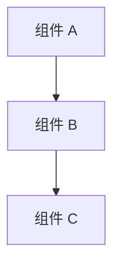
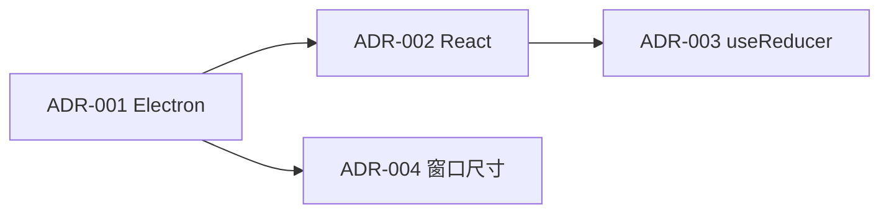
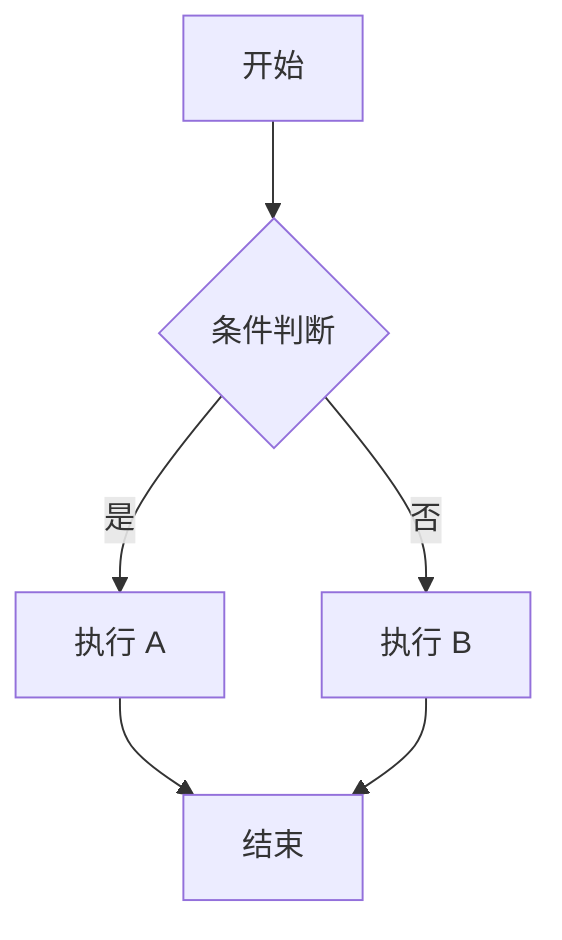
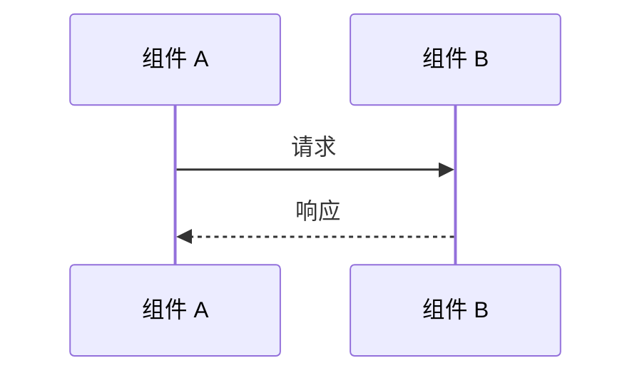
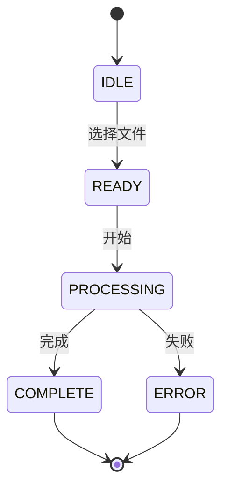

# ADR 模板：架构决策记录

> **模板版本**: v1.0  
> **创建日期**: 2026-03-08  
> **使用说明**: 复制此模板创建新的 ADR，编号从 006 开始递增

---

## 文档结构说明

本模板用于记录 ImageAutoInserter 项目中的重要架构决策。每个 ADR 应包含以下核心部分：

| 部分 | 说明 | 必填 |
|------|------|------|
| **标题** | ADR 编号 + 决策标题 | ✅ |
| **状态** | 决策当前状态 | ✅ |
| **背景** | 为什么要做这个决定 | ✅ |
| **决策** | 我们最终选择做什么 | ✅ |
| **考虑因素** | 考虑过的替代方案及优缺点 | ✅ |
| **决策理由** | 为什么选择这个方案 | ✅ |
| **后果** | 正面和负面影响 | ✅ |
| **参考链接** | 相关文档和资源 | ✅ |

---

## ADR 模板正文

```markdown
# ADR-NNN: 决策标题

**状态**: [状态标识]  
**日期**: YYYY-MM-DD  
**类型**: [决策类型]  
**影响范围**: [影响的功能模块/技术栈/流程]

---

## 背景

[项目名称] 需要 [描述需求或问题]。

### 项目需求

- **需求 1**: [具体需求描述]
- **需求 2**: [具体需求描述]
- **需求 3**: [具体需求描述]

### 候选方案

我们考虑了以下 [数量] 个主要方案：

1. **方案 1** - [简要描述]
2. **方案 2** - [简要描述]
3. **方案 3** - [简要描述]

[如有必要，说明为什么某些方案被排除在详细对比之外]

---

## 决策

选择 **[方案名称]** 作为 [决策主题]。

### 技术栈详情

```[语言/格式]
[具体的技术栈配置、版本号等]
```

### 架构模式

采用 [架构模式名称] 的模式：

```[语言]
[关键代码示例或架构图]
```

[如有必要，使用 Mermaid 架构图]



---

## 考虑因素

### [方案 1] 优势 ✅

| 优势 | 说明 | 重要性 |
|------|------|--------|
| **[优势 1]** | [具体说明] | 🔴 高 / 🟡 中 / 🟢 低 |
| **[优势 2]** | [具体说明] | 🔴 高 / 🟡 中 / 🟢 低 |

### [方案 1] 劣势 ❌

| 劣势 | 影响 | 缓解措施 |
|------|------|----------|
| **[劣势 1]** | [具体影响] | [如何缓解] |
| **[劣势 2]** | [具体影响] | [如何缓解] |

### [方案 2] 优势 ✅

| 优势 | 说明 | 实际价值 |
|------|------|----------|
| **[优势 1]** | [具体说明] | [对项目的实际价值] |

### [方案 2] 劣势 ❌

| 劣势 | 影响 | 严重性 |
|------|------|--------|
| **[劣势 1]** | [具体影响] | 🔴 高 / 🟡 中 / 🟢 低 |

[继续列出其他候选方案的优劣势]

---

## 决策理由

### 1. [理由 1 标题]

**[关键论点或现状描述]**:

[详细论述]

**[对比分析]**:

- **方案 1**: [分析]
- **方案 2**: [分析]

**结论**: [明确的结论]

### 2. [理由 2 标题]

[继续展开其他决策理由]

[如有必要，使用对比图表]

**工作量对比**:
```
方案 1：████████████████████ [数值]
方案 2：████████████████████████████████████████ [数值]
```

**结论**: [明确的结论]

[继续其他理由，建议 3-5 个主要理由]

---

## 后果

### ✅ 正面影响

1. **[影响 1]**
   - [具体说明 1]
   - [具体说明 2]
   - [具体说明 3]

2. **[影响 2]**
   - [具体说明]

[列出所有预期的正面影响]

### ⚠️ 负面影响

1. **[影响 1]**
   - [具体说明]
   
   **缓解**: [如何缓解或接受]

2. **[影响 2]**
   - [具体说明]
   
   **缓解**: [如何缓解或接受]

[列出所有预期的负面影响及缓解措施]

### 📋 需要遵循的规范

#### 1. [规范类别 1]

```[语言]
// ✅ 推荐：[说明]
[代码示例]

// ❌ 不推荐：[说明]
[代码示例]
```

#### 2. [规范类别 2]

[继续列出实施该决策需要遵循的规范和最佳实践]

---

## 替代方案

### 替代方案 1: [方案名称]

**适用场景**:
- [场景 1]
- [场景 2]

**不选择原因**:
- [原因 1]
- [原因 2]

### 替代方案 2: [方案名称]

**适用场景**:
- [场景 1]

**不选择原因**:
- [原因 1]

[列出所有认真考虑过但未选择的替代方案]

---

## 参考链接

### 官方文档

- [技术 1 官方文档](URL)
- [技术 2 官方文档](URL)

### 学习资源

- [教程/文章标题](URL)
- [最佳实践指南](URL)

### 开源项目参考

- [项目名称](GitHub URL)
- [项目名称](GitHub URL)

### 相关 ADR

- [ADR-XXX: 相关决策标题](./XXX-相关决策主题.md)

---

## 附录：决策过程记录

### 讨论时间线

- **YYYY-MM-DD**: [事件描述]
- **YYYY-MM-DD**: [事件描述]
- **YYYY-MM-DD**: 最终决策会议，确定 [方案]
- **YYYY-MM-DD**: 编写 ADR 文档

### 参与决策人员

- [角色]: [职责]
- [角色]: [职责]

### 关键决策因素排序

1. [因素 1]（最高优先级）
2. [因素 2]
3. [因素 3]
4. [因素 4]
5. [因素 5]

### [其他需要记录的信息]

[如用户调研摘要、性能测试数据、成本分析等]

---

**最后更新**: YYYY-MM-DD  
**下次审查**: YYYY-MM-DD（建议 6 个月后）
```

---

## 各部分编写指南

### 1. 标题格式

**格式**: `ADR-NNN: 决策标题`

- **编号规则**: 使用三位数字，从 001 开始递增（如 ADR-001、ADR-002）
- **标题要求**:
  - 简洁明了，不超过 20 个字
  - 使用问句或陈述句均可
  - 准确反映决策主题

**示例**:
```
✅ ADR-001: 为什么选择 Electron 而非 Tauri
✅ ADR-002: 为什么选择 React 而非 Vue/Svelte
✅ ADR-003: 为什么使用 useReducer 而非 Redux
❌ ADR-004: 关于桌面应用窗口尺寸策略的决策讨论（太长）
✅ ADR-004: 为什么固定窗口尺寸（800x600）
```

### 2. 状态字段

**所有可能的状态**:

| 状态 | 标识 | 说明 | 使用场景 |
|------|------|------|----------|
| **Proposed** | 📋 提议 | 正在讨论中的决策 | 创建 ADR 初稿时 |
| **Accepted** | ✅ 接受 | 已采纳并实施的决策 | 决策已实施 |
| **Deprecated** | ⚠️ 已弃用 | 已被新决策替代 | 决策不再使用，被新 ADR 替代 |
| **Superseded** | 🔄 被替代 | 被更新的 ADR 替代 | 明确指向替代的 ADR 编号 |
| **Rejected** | ❌ 已拒绝 | 讨论后未采纳 | 方案被明确拒绝 |
| **Abandoned** | 🚫 已放弃 | 中途放弃的决策 | 决策过程中断 |

**状态变更示例**:

```markdown
// 初始状态
**状态**: 📋 提议

// 决策实施后
**状态**: ✅ 接受

// 被新决策替代时
**状态**: 🔄 被替代  
**被替代 by**: [ADR-XXX: 新决策标题](./XXX-新决策主题.md)
```

### 3. 背景部分

**应包含的信息**:

1. **项目上下文**: 项目是什么，有什么特点
2. **面临的问题**: 需要解决什么问题或做什么决策
3. **需求和约束**: 有哪些明确的需求和限制条件
4. **候选方案概览**: 简要列出考虑的方案

**写作指南**:

- 使用简洁的语言描述问题
- 明确列出项目需求（使用列表）
- 说明为什么需要这个决策
- 提供足够的背景信息，让新团队成员也能理解

**示例结构**:

```markdown
## 背景

[项目名称] 需要 [描述需求或问题]。

### 项目需求

- **需求 1**: [具体描述]
- **需求 2**: [具体描述]
- **约束 1**: [具体描述]

### 候选方案

我们考虑了以下 [数量] 个主要方案：

1. **方案 1** - [简要描述]
2. **方案 2** - [简要描述]

[如有必要，说明排除某些方案的原因]
```

### 4. 决策部分

**应包含的信息**:

1. **明确的决策声明**: 清楚说明选择了什么
2. **技术栈详情**: 具体的版本号、配置等
3. **架构模式**: 如何实现这个决策
4. **关键代码示例**: 展示核心实现方式

**写作指南**:

- 第一段必须明确说明决策结果
- 使用粗体强调关键选择
- 提供具体的技术栈配置
- 包含代码示例或架构图

**示例**:

```markdown
## 决策

选择 **Electron 28.x (LTS)** 作为桌面应用框架。

### 技术栈详情

```json
{
  "electron": "^28.0.0",
  "typescript": "^5.0.0"
}
```

### 架构模式

采用 **Main Process + Renderer Process** 双进程架构：

- **Main Process**: Node.js 环境，负责窗口管理、文件系统
- **Renderer Process**: Chromium 环境，负责 UI 渲染
- **IPC 通信**: 使用 `ipcMain` / `ipcRenderer` 进行通信
```

### 5. 考虑因素部分

**应包含的信息**:

1. **每个方案的优劣势对比**
2. **使用表格形式清晰展示**
3. **标注重要性级别**
4. **提供缓解措施**

**写作指南**:

- 为每个候选方案创建独立的优劣势小节
- 使用统一的表格格式
- 重要性使用 emoji 标注（🔴 高、🟡 中、🟢 低）
- 劣势必须包含缓解措施

**表格格式**:

```markdown
### [方案名称] 优势 ✅

| 优势 | 说明 | 重要性 |
|------|------|--------|
| **[优势 1]** | [具体说明] | 🔴 高 |
| **[优势 2]** | [具体说明] | 🟡 中 |

### [方案名称] 劣势 ❌

| 劣势 | 影响 | 缓解措施 |
|------|------|----------|
| **[劣势 1]** | [具体影响] | [如何缓解] |
```

### 6. 决策理由部分

**应包含的信息**:

1. **3-5 个主要决策理由**
2. **每个理由的详细论述**
3. **方案对比分析**
4. **明确的结论**

**写作指南**:

- 每个理由使用独立的小节
- 按照重要性排序（最重要的在前）
- 使用"背景 → 对比 → 结论"的结构
- 使用数据、图表增强说服力

**示例结构**:

```markdown
## 决策理由

### 1. [理由标题]

**[现状或关键论点]**:

[详细论述]

**[对比分析]**:

- **方案 1**: [分析]
- **方案 2**: [分析]

**结论**: [明确的结论]

### 2. [理由标题]

[继续展开]
```

### 7. 后果部分

**应包含的信息**:

1. **正面影响**: 决策带来的好处
2. **负面影响**: 决策带来的问题或限制
3. **缓解措施**: 如何减轻负面影响
4. **实施规范**: 需要遵循的最佳实践

**写作指南**:

- 正面和负面影响分开列出
- 每个影响使用列表详细说明
- 负面影响必须包含缓解措施
- 提供具体的代码规范和示例

**示例**:

```markdown
## 后果

### ✅ 正面影响

1. **[影响 1]**
   - [具体说明 1]
   - [具体说明 2]

2. **[影响 2]**
   - [具体说明]

### ⚠️ 负面影响

1. **[影响 1]**
   - [具体说明]
   
   **缓解**: [缓解措施]

2. **[影响 2]**
   - [具体说明]
   
   **缓解**: [缓解措施]

### 📋 需要遵循的规范

#### 1. [规范类别]

```typescript
// ✅ 推荐：[说明]
[代码示例]

// ❌ 不推荐：[说明]
[代码示例]
```
```

### 8. 参考链接部分

**应包含的信息**:

1. **官方文档**: 相关技术的官方文档链接
2. **学习资源**: 教程、文章、最佳实践指南
3. **开源项目**: 参考的开源项目
4. **相关 ADR**: 本项目中相关的其他 ADR

**写作指南**:

- 分类列出不同类型的资源
- 使用有意义的链接文本
- 确保链接有效
- 优先提供中文资源（如有）

**示例**:

```markdown
## 参考链接

### 官方文档

- [React 官方文档](https://react.dev/)
- [Electron 官方文档](https://www.electronjs.org/)

### 学习资源

- [React 入门教程](https://react.dev/learn)
- [Electron 最佳实践](https://www.electronjs.org/docs/latest/tutorial/best-practices)

### 开源项目参考

- [VS Code](https://github.com/microsoft/vscode)
- [GitHub Desktop](https://github.com/desktop/desktop)

### 相关 ADR

- [ADR-001: 为什么选择 Electron](./001-why-electron.md)
```

---

## 编写 ADR 的检查清单

### 清晰性检查 ✅

- [ ] 标题是否简洁明了（不超过 20 字）？
- [ ] 决策声明是否清晰明确？
- [ ] 是否使用了简单直接的语言？
- [ ] 技术术语是否有必要的解释？
- [ ] 新团队成员能否理解？

### 完整性检查 ✅

- [ ] 是否包含所有必需部分？
- [ ] 背景是否提供了足够的上下文？
- [ ] 是否列出了所有认真考虑过的方案？
- [ ] 每个方案的优劣势是否完整？
- [ ] 决策理由是否有 3-5 个充分的论点？
- [ ] 是否列出了正面和负面影响？
- [ ] 负面影响是否有缓解措施？
- [ ] 是否提供了参考链接？

### 一致性检查 ✅

- [ ] 格式是否与现有 ADR 一致？
- [ ] 表格格式是否统一？
- [ ] 代码示例风格是否符合项目规范？
- [ ] 重要性标注是否一致（🔴/🟡/🟢）？
- [ ] 编号是否正确递增？
- [ ] 日期格式是否统一（YYYY-MM-DD）？

### 技术准确性检查 ✅

- [ ] 技术栈版本号是否准确？
- [ ] 代码示例是否可运行？
- [ ] 链接是否有效？
- [ ] 引用的数据是否有来源？
- [ ] 架构图是否正确（如使用）？

### 可维护性检查 ✅

- [ ] 是否记录了决策时间线？
- [ ] 是否列出了参与决策人员？
- [ ] 是否标注了下次审查日期？
- [ ] 是否预留了更新空间？

---

## 版本控制指南

### 如何更新 ADR

当以下情况发生时，应更新现有 ADR：

1. **实施细节变化**: 在"后果"部分添加补充说明
2. **发现新的替代方案**: 在"考虑因素"部分补充
3. **决策被部分修改**: 在对应部分添加更新说明

**更新步骤**:

```markdown
1. 在文件顶部添加更新记录：

**最后更新**: 2026-09-08  
**更新内容**: 补充了性能优化规范

2. 在对应部分添加更新内容

3. 在附录中添加更新说明：

### 更新历史

- **2026-09-08**: 补充了性能优化规范
- **2026-06-08**: 更新了技术栈版本号
```

### 如何弃用 ADR

当决策被新决策替代时：

```markdown
1. 在旧 ADR 顶部添加状态变更：

**状态**: 🔄 被替代  
**被替代 by**: [ADR-XXX: 新决策标题](./XXX-新决策主题.md)  
**弃用日期**: YYYY-MM-DD

2. 在背景部分添加说明：

> **注意**: 本决策已被 ADR-XXX 替代，仅供参考。

3. 在新 ADR 中引用旧 ADR：

### 相关 ADR

- [ADR-XXX: 旧决策标题](./XXX-旧决策主题.md) - 已被本决策替代
```

### 如何链接相关 ADR

当多个 ADR 相互关联时：

```markdown
## 参考链接

### 相关 ADR

- [ADR-001: 为什么选择 Electron](./001-why-electron.md) - 桌面应用框架选型
- [ADR-002: 为什么选择 React](./002-why-react.md) - UI 框架选型
- [ADR-003: 为什么使用 useReducer](./003-why-usereducer.md) - 状态管理方案

### 决策依赖关系


```

---

## 格式化指南

### Markdown 格式规范

1. **标题层级**:
   ```markdown
   # ADR 标题（一级标题，仅用于标题）
   ## 部分标题（二级标题，用于主要部分）
   ### 小节标题（三级标题，用于小节）
   #### 细分标题（四级标题，必要时使用）
   ```

2. **强调格式**:
   ```markdown
   **粗体**: 用于强调关键信息
   *斜体*: 用于术语或引用
   `行内代码`: 用于技术名词、代码片段
   ```

3. **列表格式**:
   ```markdown
   - 无序列表使用短横线
   - 有序列表使用数字 + 点
   - 嵌套列表缩进 2 个空格
   ```

4. **表格格式**:
   ```markdown
   | 列 1 | 列 2 | 列 3 |
   |------|------|------|
   | 内容 | 内容 | 内容 |
   ```

### Mermaid 图表使用

**流程图**:



**序列图**:



**状态图**:



**使用指南**:

- 仅在必要时使用图表（文字无法清晰表达时）
- 保持图表简洁，不超过 10 个节点
- 使用中文标注
- 在图表下方添加说明文字

### 代码块格式

1. **必须标注语言**:
   ````markdown
   ```typescript
   // 代码内容
   ```
   ````

2. **添加注释说明**:
   ```typescript
   // ✅ 推荐：使用函数组件
   export const App: React.FC = () => {
     return <div>Hello</div>;
   };

   // ❌ 不推荐：使用类组件
   class App extends React.Component {
     render() {
       return <div>Hello</div>;
     }
   }
   ```

3. **保持代码简洁**:
   - 仅展示关键部分
   - 省略无关细节
   - 使用注释说明省略部分

---

## 示例 ADR（参考 ADR-001 简化版）

```markdown
# ADR-006: 示例 ADR

**状态**: ✅ 接受  
**日期**: 2026-03-08  
**类型**: 技术栈选型  
**影响范围**: 示例影响范围

---

## 背景

本项目需要 [描述需求]。

### 项目需求

- **需求 1**: [具体描述]
- **需求 2**: [具体描述]

### 候选方案

我们考虑了以下方案：

1. **方案 1** - [描述]
2. **方案 2** - [描述]

---

## 决策

选择 **方案 1** 作为 [决策主题]。

### 技术栈详情

```json
{
  "package": "^1.0.0"
}
```

---

## 考虑因素

### 方案 1 优势 ✅

| 优势 | 说明 | 重要性 |
|------|------|--------|
| **优势 1** | 说明 | 🔴 高 |

### 方案 1 劣势 ❌

| 劣势 | 影响 | 缓解措施 |
|------|------|----------|
| **劣势 1** | 影响 | 措施 |

[继续其他方案]

---

## 决策理由

### 1. 理由 1

**论点**:

[论述]

**结论**: [结论]

### 2. 理由 2

[继续]

---

## 后果

### ✅ 正面影响

1. **影响 1**
   - 说明

### ⚠️ 负面影响

1. **影响 1**
   - 说明
   - **缓解**: 措施

### 📋 需要遵循的规范

```typescript
// ✅ 推荐
[代码]
```

---

## 替代方案

### 替代方案 1

**适用场景**:
- 场景

**不选择原因**:
- 原因

---

## 参考链接

### 官方文档

- [文档](URL)

### 相关 ADR

- [ADR-001](./001-why-electron.md)

---

## 附录：决策过程记录

### 讨论时间线

- **2026-03-08**: 最终决策

### 关键决策因素排序

1. 因素 1
2. 因素 2

---

**最后更新**: 2026-03-08  
**下次审查**: 2026-09-08
```

---

## 快速参考卡

### ADR 编写流程

```
1. 复制模板 → adr-template.md
2. 修改文件名 → NNN-决策主题.md
3. 填写标题和状态
4. 编写背景部分
5. 编写决策部分
6. 列出候选方案优劣势
7. 编写决策理由（3-5 个）
8. 列出正面和负面影响
9. 添加参考链接
10. 记录决策过程
11. 使用检查清单自查
12. 提交审核
```

### 状态速查

| 状态 | 标识 | 使用时机 |
|------|------|----------|
| Proposed | 📋 | 初稿/讨论中 |
| Accepted | ✅ | 已实施 |
| Deprecated | ⚠️ | 不再使用 |
| Superseded | 🔄 | 被新 ADR 替代 |
| Rejected | ❌ | 未采纳 |
| Abandoned | 🚫 | 中途放弃 |

### 重要性标注

- 🔴 高 - 关键因素，对决策有重大影响
- 🟡 中 - 重要因素，需要认真考虑
- 🟢 低 - 次要因素，影响较小

---

## 相关文档

- [ADR 合集 README](./README.md) - 查看所有 ADR 列表
- [项目主文档](../../../README.md) - 项目整体介绍
- [开发规范](../../../.trae/rules/trae-programming-rules.md) - 项目编码规范

---

**模板版本**: v1.0  
**最后更新**: 2026-03-08  
**维护者**: Backend Architect Team
