# GUI 重构项目数据流文档

> **版本**: v1.0  
> **创建日期**: 2026-03-08  
> **状态**: 设计完成  
> **适用范围**: ImageAutoInserter GUI 版本 (Electron + React + Python)  
> **配套文档**: [spec.md](../../.trae/specs/gui-redesign/spec.md), [mockup.md](./gui-redesign/mockup.md)

---

## 目录

1. [系统架构概览](#系统架构概览)
2. [文件选择流程](#文件选择流程)
3. [处理流程](#处理流程)
4. [状态同步流程](#状态同步流程)
5. [错误处理流程](#错误处理流程)
6. [IPC 消息格式](#ipc-消息格式)
7. [附录](#附录)

---

## 1. 系统架构概览

### 1.1 三层架构设计

本系统采用三层进程分离架构，确保 UI 响应性、系统安全性和功能可扩展性：

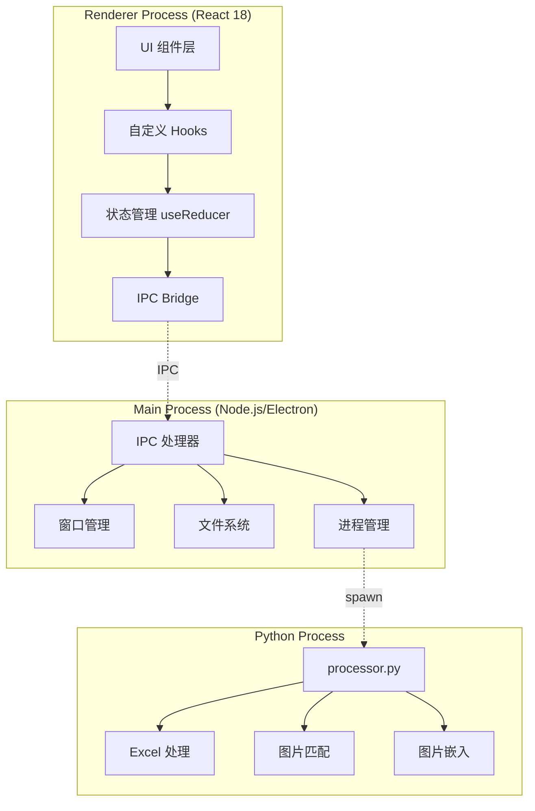

### 1.2 进程职责划分

| 进程 | 技术栈 | 核心职责 | 关键模块 |
|------|--------|---------|---------|
| **Renderer** | React 18 + TS 5 | UI 渲染、用户交互、状态展示 | App.tsx, components/, hooks/ |
| **Main** | Node.js + Electron 28 | 窗口管理、文件操作、进程调度 | main.ts, ipc-handlers.ts, file-ops.ts |
| **Python** | Python 3.8+ | Excel 处理核心逻辑、图片嵌入 | processor.py |

### 1.3 IPC 通信机制

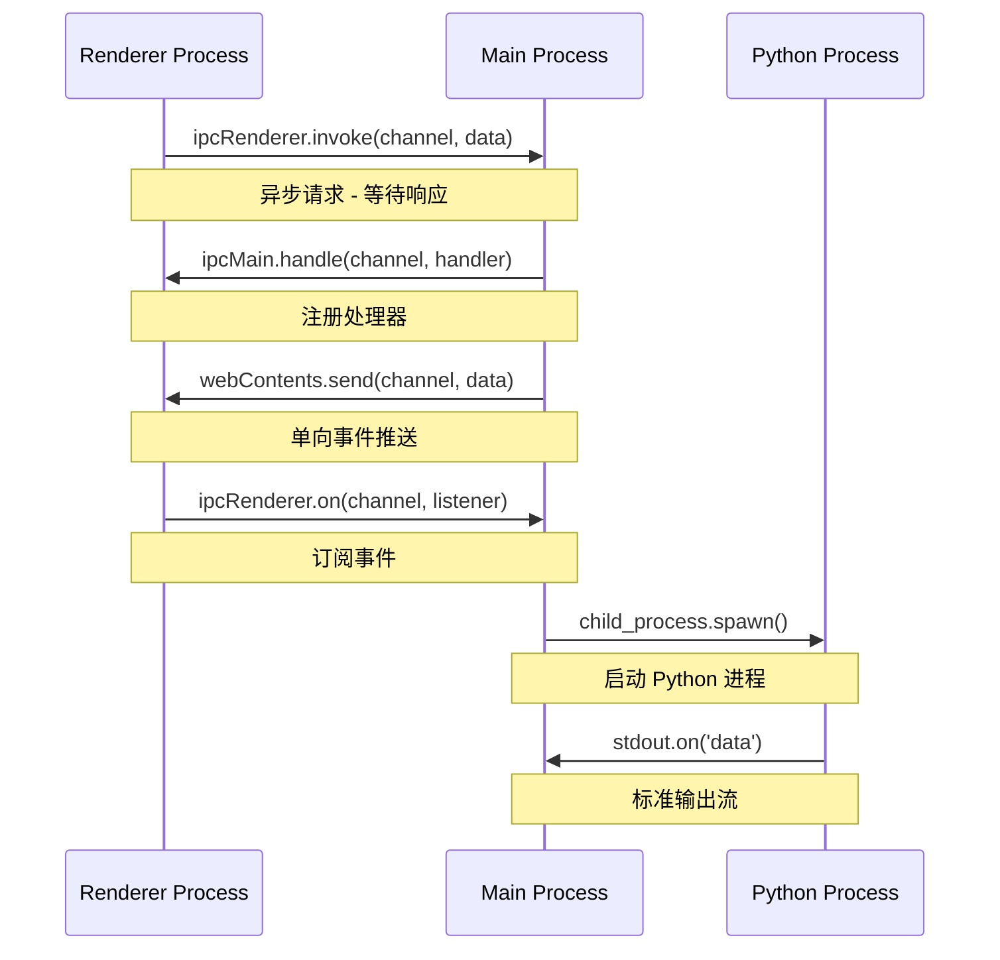

### 1.4 数据流向总览

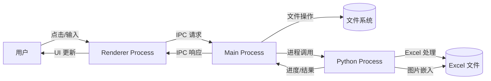

---

## 2. 文件选择流程

### 2.1 Excel 文件选择流程

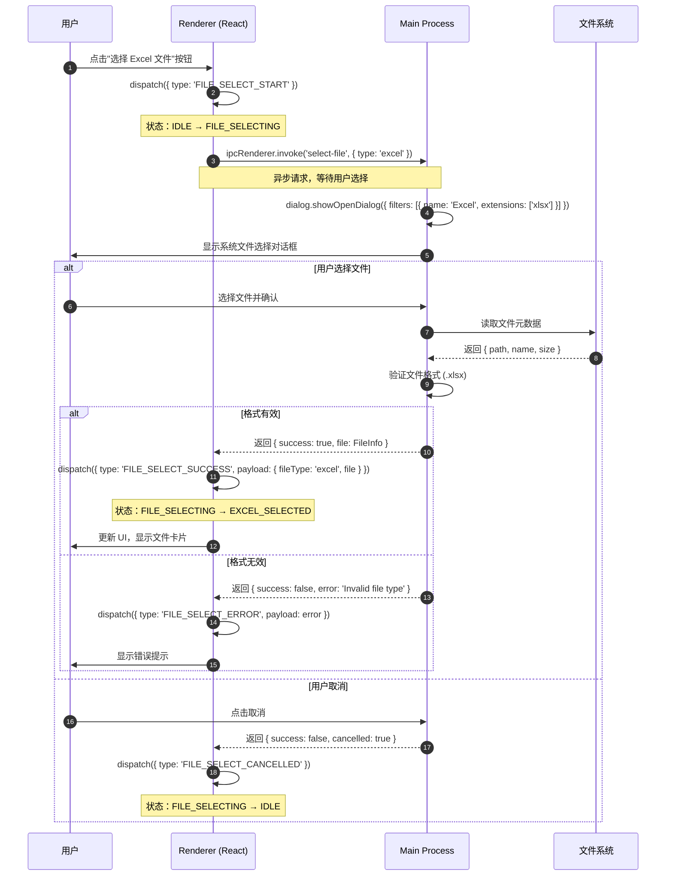

### 2.2 图片源选择流程

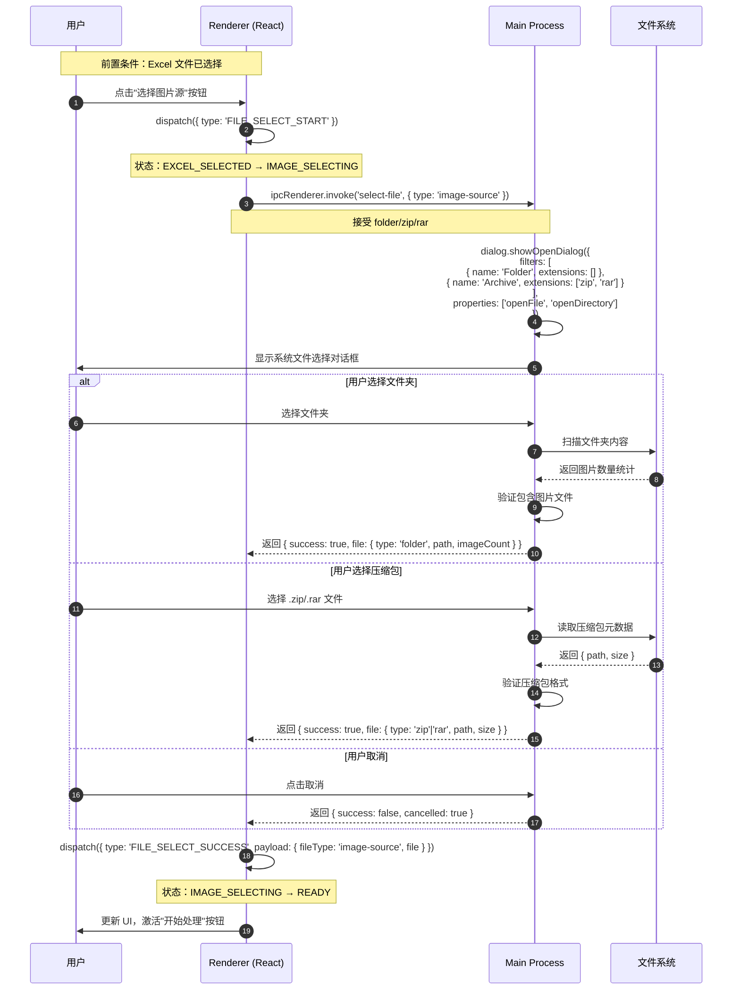

### 2.3 文件验证流程

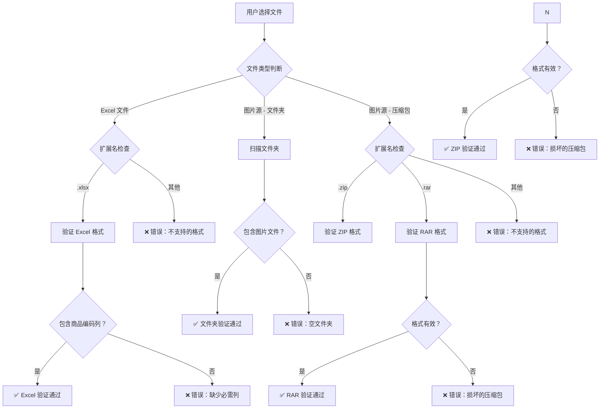

---

## 3. 处理流程

### 3.1 完整处理流程（用户 → Renderer → Main → Python）

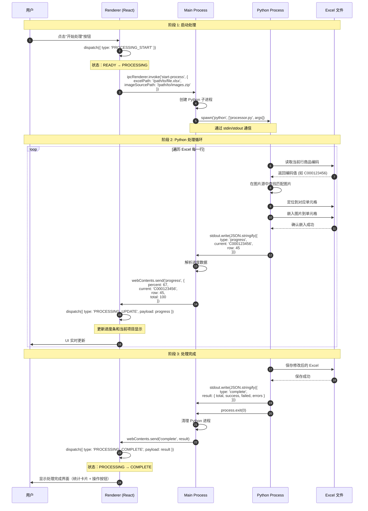

### 3.2 进度更新数据流

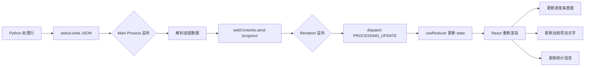

### 3.3 行处理循环详细流程

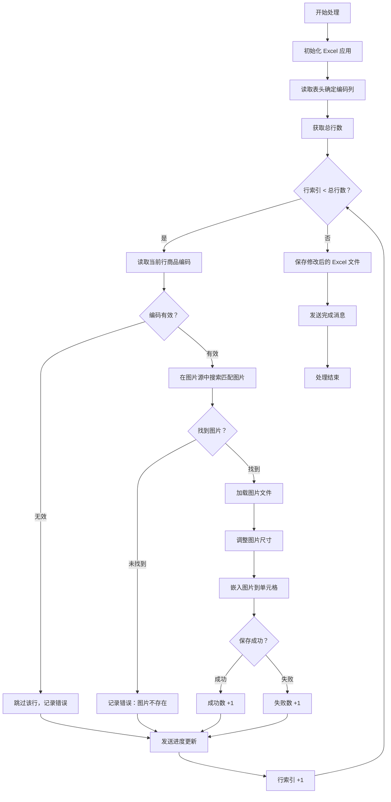

### 3.4 取消处理流程

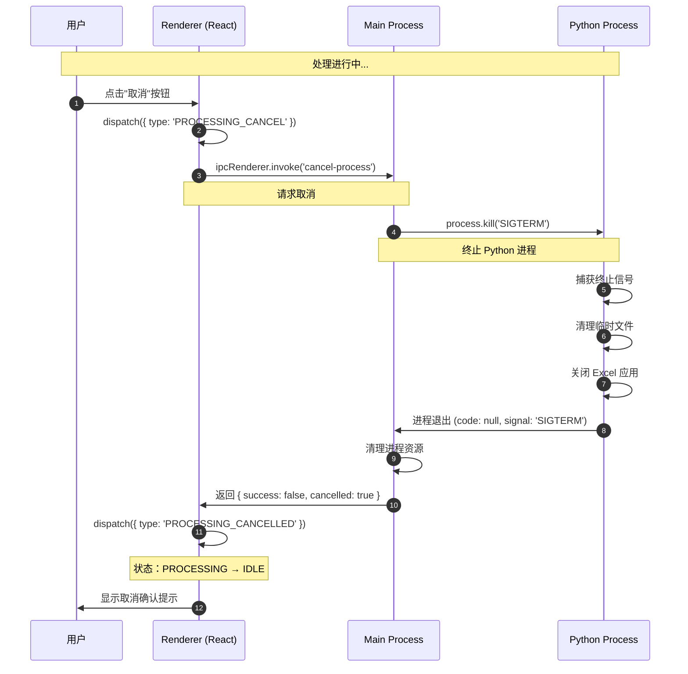

---

## 4. 状态同步流程

### 4.1 状态机转换图

基于 [spec.md](../../.trae/specs/gui-redesign/spec.md#状态机设计) 定义的状态机：

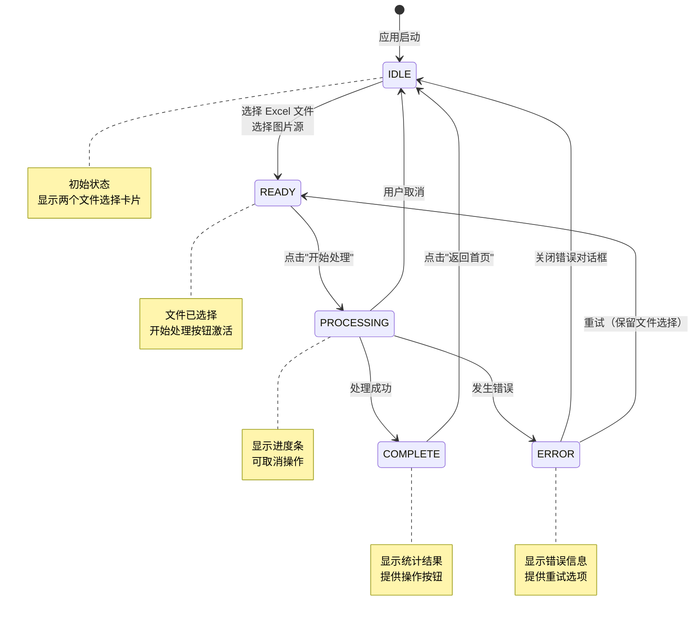

### 4.2 useReducer 数据流图

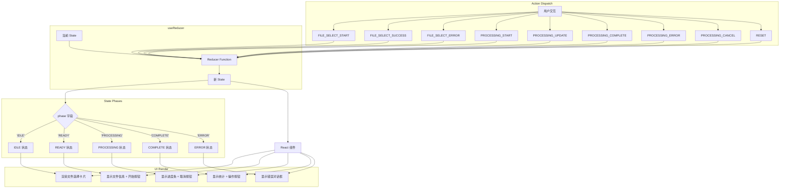

### 4.3 Action Dispatch 和 State 更新流程

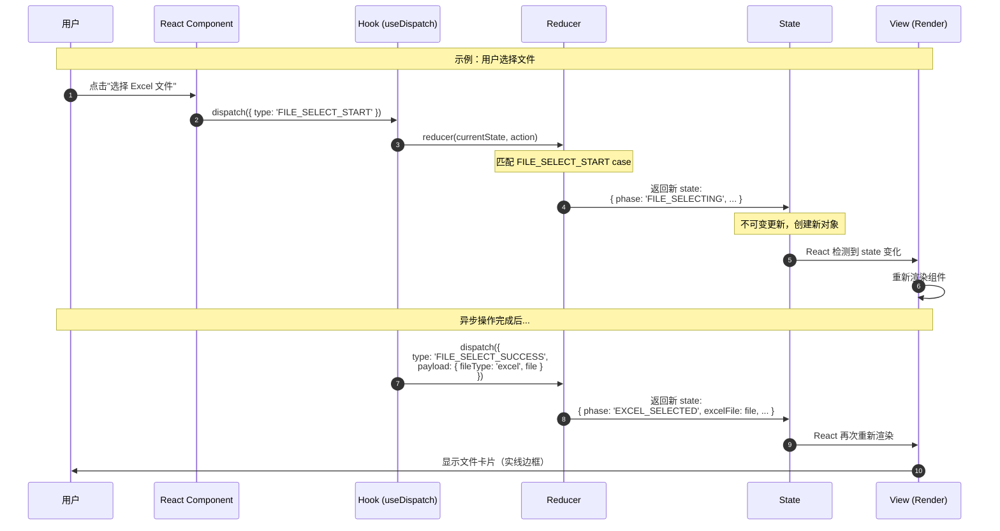

### 4.4 状态字段详细说明

```typescript
// 完整 State 类型定义
interface AppState {
  // 当前阶段（决定渲染哪个视图）
  phase: 'IDLE' | 'READY' | 'PROCESSING' | 'COMPLETE' | 'ERROR';
  
  // 文件选择信息（READY 阶段使用）
  excelFile: FileInfo | null;
  imageSource: FileInfo | null;
  
  // 处理进度（PROCESSING 阶段使用）
  progress: {
    percent: number;      // 0-100
    current: string;      // 当前处理的项目编码
    row: number;          // 当前行号
    total: number;        // 总行数
  } | null;
  
  // 处理结果（COMPLETE 阶段使用）
  result: ProcessingResult | null;
  
  // 错误信息（ERROR 阶段使用）
  error: {
    type: 'file' | 'process' | 'system';
    message: string;
    details?: string;
  } | null;
}

// 文件信息类型
interface FileInfo {
  name: string;           // 文件名
  path: string;           // 完整路径
  size: number;           // 文件大小（字节）
  type: 'excel' | 'folder' | 'zip' | 'rar';
  imageCount?: number;    // 图片数量（仅图片源）
}

// 处理结果类型
interface ProcessingResult {
  total: number;          // 总项目数
  success: number;        // 成功数
  failed: number;         // 失败数
  successRate: number;    // 成功率（百分比）
  errors: Array<{         // 错误详情列表
    item: string;         // 项目编码
    message: string;      // 错误消息
    row: number;          // 行号
    column: string;       // 列号
  }>;
}
```

---

## 5. 错误处理流程

### 5.1 错误分类和处理图

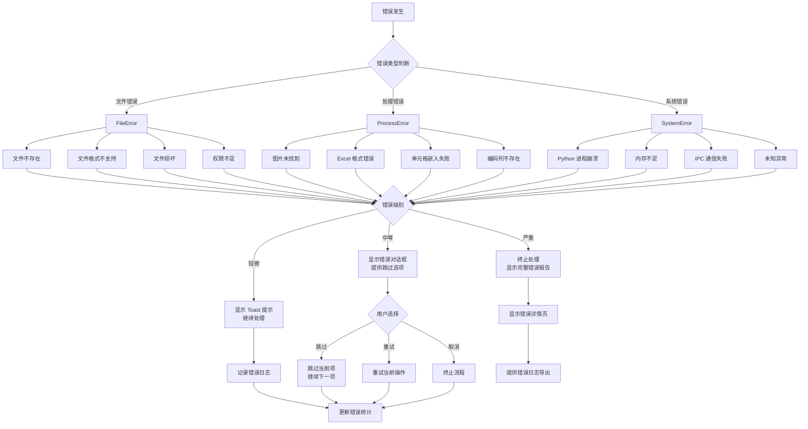

### 5.2 错误日志格式（JSON 结构）

```json
{
  "timestamp": "2026-03-08T14:30:45.123Z",
  "errorId": "err_20260308_143045_001",
  "sessionId": "session_abc123",
  
  "error": {
    "type": "process",
    "category": "image_not_found",
    "severity": "medium",
    "message": "图片文件未找到",
    "details": "商品编码 C000123789 对应的图片不存在"
  },
  
  "context": {
    "excelFile": "/Users/shimengyu/Documents/product_list.xlsx",
    "imageSource": "/Users/shimengyu/Downloads/product_images.zip",
    "currentRow": 45,
    "currentColumn": "C",
    "currentItem": "C000123789",
    "progress": {
      "percent": 67,
      "processed": 67,
      "total": 100
    }
  },
  
  "stack": {
    "python": [
      "File \"processor.py\", line 156, in process_row",
      "  image = find_matching_image(item_code, image_source)",
      "File \"processor.py\", line 89, in find_matching_image",
      "  raise FileNotFoundError(f\"Image not found: {item_code}\")"
    ],
    "main": [
      "at PythonProcess.handle (/src/main/python-bridge.ts:45:12)",
      "at EventEmitter.<anonymous> (/src/main/ipc-handlers.ts:78:5)"
    ]
  },
  
  "userAction": {
    "action": "skip",
    "timestamp": "2026-03-08T14:30:46.456Z"
  },
  
  "system": {
    "platform": "darwin",
    "arch": "arm64",
    "nodeVersion": "v18.16.0",
    "pythonVersion": "3.9.7",
    "electronVersion": "28.0.0",
    "memoryUsage": {
      "heapUsed": "145MB",
      "heapTotal": "256MB",
      "rss": "312MB"
    }
  }
}
```

### 5.3 用户操作流程（重试/跳过/取消）

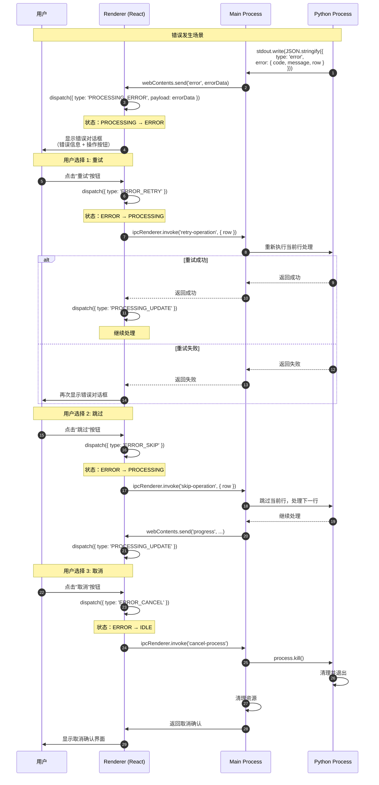

### 5.4 错误恢复策略

| 错误类型 | 严重级别 | 恢复策略 | 用户操作 |
|---------|---------|---------|---------|
| **文件不存在** | 中等 | 提示用户检查路径，提供重试 | 重试/跳过/取消 |
| **文件格式不支持** | 严重 | 终止处理，显示支持格式列表 | 取消/重新选择 |
| **图片未找到** | 轻微 | 记录错误，继续下一项 | 自动跳过 |
| **Excel 嵌入失败** | 中等 | 重试 3 次，失败则跳过 | 重试/跳过/取消 |
| **Python 进程崩溃** | 严重 | 重启进程，恢复到最后检查点 | 重试/取消 |
| **内存不足** | 严重 | 释放资源，建议分批处理 | 取消 |
| **权限错误** | 中等 | 提示用户检查文件权限 | 重试/取消 |

---

## 6. IPC 消息格式

### 6.1 Renderer → Main 消息

#### 6.1.1 select-file（选择文件）

```typescript
// 请求
interface SelectFileRequest {
  channel: 'select-file';
  payload: {
    type: 'excel' | 'image-source';
    accept?: string[];  // 可选，自定义接受的文件扩展名
  };
}

// 响应
interface SelectFileResponse {
  success: boolean;
  cancelled?: boolean;
  file?: FileInfo;
  error?: string;
}

// 使用示例
const result = await ipcRenderer.invoke('select-file', {
  type: 'excel',
  accept: ['.xlsx']
});

if (result.success) {
  console.log('Selected file:', result.file);
}
```

#### 6.1.2 start-process（开始处理）

```typescript
// 请求
interface StartProcessRequest {
  channel: 'start-process';
  payload: {
    excelPath: string;      // Excel 文件绝对路径
    imageSourcePath: string; // 图片源绝对路径
    options?: {
      skipExisting?: boolean;  // 跳过已嵌入图片的单元格
      columnMapping?: {        // 列映射配置
        itemCode: string;      // 商品编码列（默认：'C'）
        targetColumn: string;  // 目标列（默认：'D'）
      };
    };
  };
}

// 响应（立即返回，实际结果通过事件推送）
interface StartProcessResponse {
  success: boolean;
  processId?: number;
  error?: string;
}

// 使用示例
const result = await ipcRenderer.invoke('start-process', {
  excelPath: '/Users/shimengyu/Documents/product_list.xlsx',
  imageSourcePath: '/Users/shimengyu/Downloads/product_images.zip',
  options: {
    skipExisting: true,
    columnMapping: {
      itemCode: 'C',
      targetColumn: 'D'
    }
  }
});
```

#### 6.1.3 cancel-process（取消处理）

```typescript
// 请求
interface CancelProcessRequest {
  channel: 'cancel-process';
  payload: {};
}

// 响应
interface CancelProcessResponse {
  success: boolean;
  cancelled: boolean;
  error?: string;
}

// 使用示例
const result = await ipcRenderer.invoke('cancel-process');
if (result.cancelled) {
  console.log('Process cancelled by user');
}
```

#### 6.1.4 open-file（打开文件）

```typescript
// 请求
interface OpenFileRequest {
  channel: 'open-file';
  payload: {
    path: string;  // 文件绝对路径
  };
}

// 响应
interface OpenFileResponse {
  success: boolean;
  error?: string;
}

// 使用示例
await ipcRenderer.invoke('open-file', {
  path: '/Users/shimengyu/Documents/product_list_processed.xlsx'
});
```

#### 6.1.5 retry-operation（重试操作）

```typescript
// 请求
interface RetryOperationRequest {
  channel: 'retry-operation';
  payload: {
    row: number;        // 行号
    itemCode: string;   // 商品编码
  };
}

// 响应
interface RetryOperationResponse {
  success: boolean;
  error?: string;
}
```

#### 6.1.6 skip-operation（跳过操作）

```typescript
// 请求
interface SkipOperationRequest {
  channel: 'skip-operation';
  payload: {
    row: number;  // 行号
  };
}

// 响应
interface SkipOperationResponse {
  success: boolean;
}
```

### 6.2 Main → Renderer 消息

#### 6.2.1 progress（进度更新）

```typescript
// 事件
interface ProgressEvent {
  channel: 'progress';
  payload: {
    percent: number;        // 进度百分比 (0-100)
    current: string;        // 当前处理的项目编码
    row: number;            // 当前行号
    total: number;          // 总行数
    processed: number;      // 已处理数
    success: number;        // 成功数
    failed: number;         // 失败数
    estimatedRemaining?: string; // 预计剩余时间（可选）
  };
}

// 监听示例
ipcRenderer.on('progress', (event, data) => {
  dispatch({
    type: 'PROCESSING_UPDATE',
    payload: {
      percent: data.percent,
      current: data.current,
      row: data.row,
      total: data.total
    }
  });
});
```

#### 6.2.2 complete（处理完成）

```typescript
// 事件
interface CompleteEvent {
  channel: 'complete';
  payload: ProcessingResult;
}

interface ProcessingResult {
  total: number;          // 总项目数
  success: number;        // 成功数
  failed: number;         // 失败数
  successRate: number;    // 成功率（百分比）
  outputFile: string;     // 输出文件路径
  errors: Array<{
    item: string;         // 项目编码
    message: string;      // 错误消息
    row: number;          // 行号
    column: string;       // 列号
  }>;
}

// 监听示例
ipcRenderer.on('complete', (event, result) => {
  dispatch({
    type: 'PROCESSING_COMPLETE',
    payload: result
  });
});
```

#### 6.2.3 error（错误发生）

```typescript
// 事件
interface ErrorEvent {
  channel: 'error';
  payload: {
    type: 'file' | 'process' | 'system';
    code: string;         // 错误代码
    message: string;      // 错误消息
    details?: string;     // 详细信息
    row?: number;         // 相关行号
    column?: string;      // 相关列号
    item?: string;        // 相关项目编码
    recoverable: boolean; // 是否可恢复
  };
}

// 监听示例
ipcRenderer.on('error', (event, error) => {
  dispatch({
    type: 'PROCESSING_ERROR',
    payload: {
      type: error.type,
      message: error.message,
      details: error.details,
      recoverable: error.recoverable
    }
  });
});
```

#### 6.2.4 file-selected（文件已选择 - 可选）

```typescript
// 事件（用于文件选择后的额外验证）
interface FileSelectedEvent {
  channel: 'file-selected';
  payload: {
    fileType: 'excel' | 'image-source';
    file: FileInfo;
    validation?: {
      valid: boolean;
      warnings?: string[];
      info?: {
        imageCount?: number;
        rowCount?: number;
      };
    };
  };
}
```

### 6.3 IPC 通道完整列表

| 方向 | 通道名 | 类型 | 描述 |
|------|--------|------|------|
| **R→M** | `select-file` | invoke | 选择文件对话框 |
| **R→M** | `start-process` | invoke | 开始处理请求 |
| **R→M** | `cancel-process` | invoke | 取消处理请求 |
| **R→M** | `open-file` | invoke | 打开文件请求 |
| **R→M** | `retry-operation` | invoke | 重试操作请求 |
| **R→M** | `skip-operation` | invoke | 跳过操作请求 |
| **M→R** | `progress` | send/on | 进度更新推送 |
| **M→R** | `complete` | send/on | 处理完成推送 |
| **M→R** | `error` | send/on | 错误事件推送 |
| **M→R** | `file-selected` | send/on | 文件选择验证推送 |

---

## 7. 附录

### 7.1 TypeScript 类型定义汇总

```typescript
// src/shared/types.ts

// ============ 状态类型 ============
type AppStatePhase = 'IDLE' | 'READY' | 'PROCESSING' | 'COMPLETE' | 'ERROR';

interface AppState {
  phase: AppStatePhase;
  excelFile: FileInfo | null;
  imageSource: FileInfo | null;
  progress: ProgressInfo | null;
  result: ProcessingResult | null;
  error: ErrorInfo | null;
}

// ============ 文件类型 ============
interface FileInfo {
  name: string;
  path: string;
  size: number;
  type: 'excel' | 'folder' | 'zip' | 'rar';
  imageCount?: number;
}

// ============ 进度类型 ============
interface ProgressInfo {
  percent: number;
  current: string;
  row: number;
  total: number;
  processed: number;
  success: number;
  failed: number;
  estimatedRemaining?: string;
}

// ============ 结果类型 ============
interface ProcessingResult {
  total: number;
  success: number;
  failed: number;
  successRate: number;
  outputFile: string;
  errors: ProcessingError[];
}

interface ProcessingError {
  item: string;
  message: string;
  row: number;
  column: string;
}

// ============ 错误类型 ============
interface ErrorInfo {
  type: 'file' | 'process' | 'system';
  code: string;
  message: string;
  details?: string;
  row?: number;
  column?: string;
  item?: string;
  recoverable: boolean;
}

// ============ Action 类型 ============
type AppAction =
  | { type: 'FILE_SELECT_START' }
  | { type: 'FILE_SELECT_SUCCESS'; payload: { fileType: string; file: FileInfo } }
  | { type: 'FILE_SELECT_ERROR'; payload: string }
  | { type: 'FILE_SELECT_CANCELLED' }
  | { type: 'PROCESSING_START' }
  | { type: 'PROCESSING_UPDATE'; payload: ProgressInfo }
  | { type: 'PROCESSING_COMPLETE'; payload: ProcessingResult }
  | { type: 'PROCESSING_ERROR'; payload: ErrorInfo }
  | { type: 'PROCESSING_CANCEL' }
  | { type: 'PROCESSING_CANCELLED' }
  | { type: 'ERROR_RETRY' }
  | { type: 'ERROR_SKIP' }
  | { type: 'ERROR_CANCEL' }
  | { type: 'RESET' };

// ============ IPC 请求/响应类型 ============
interface IPCRequest<T = any> {
  channel: string;
  payload: T;
}

interface IPCResponse<T = any> {
  success: boolean;
  data?: T;
  error?: string;
}
```

### 7.2 Reducer 实现示例

```typescript
// src/renderer/state/appReducer.ts

import { AppState, AppAction } from '../shared/types';

const initialState: AppState = {
  phase: 'IDLE',
  excelFile: null,
  imageSource: null,
  progress: null,
  result: null,
  error: null,
};

export function appReducer(state: AppState, action: AppAction): AppState {
  switch (action.type) {
    case 'FILE_SELECT_START':
      return {
        ...state,
        phase: 'FILE_SELECTING' as any,
      };
    
    case 'FILE_SELECT_SUCCESS':
      return {
        ...state,
        [action.payload.fileType === 'excel' ? 'excelFile' : 'imageSource']: action.payload.file,
        phase: action.payload.fileType === 'image-source' && state.excelFile 
          ? 'READY' 
          : state.phase,
      };
    
    case 'PROCESSING_START':
      return {
        ...state,
        phase: 'PROCESSING',
        progress: {
          percent: 0,
          current: '',
          row: 0,
          total: 0,
          processed: 0,
          success: 0,
          failed: 0,
        },
      };
    
    case 'PROCESSING_UPDATE':
      return {
        ...state,
        progress: action.payload,
      };
    
    case 'PROCESSING_COMPLETE':
      return {
        ...state,
        phase: 'COMPLETE',
        result: action.payload,
        progress: null,
      };
    
    case 'PROCESSING_ERROR':
      return {
        ...state,
        phase: 'ERROR',
        error: action.payload,
        progress: null,
      };
    
    case 'RESET':
      return initialState;
    
    default:
      return state;
  }
}
```

### 7.3 相关文档索引

| 文档 | 路径 | 描述 |
|------|------|------|
| **规格文档** | `.trae/specs/gui-redesign/spec.md` | GUI 设计规格说明书 |
| **任务分解** | `.trae/specs/gui-redesign/tasks.md` | 任务拆分文档 |
| **验收清单** | `.trae/specs/gui-redesign/checklist.md` | 验收标准清单 |
| **Mockup** | `docs/design/gui-redesign/mockup.md` | 视觉设计 Mockup |
| **Wireframe** | `docs/design/gui-redesign/wireframe.md` | 线框图 |
| **ADR** | `docs/architecture/adr/README.md` | 架构决策记录 |

### 7.4 变更历史

| 版本 | 日期 | 变更内容 | 作者 |
|------|------|---------|------|
| v1.0 | 2026-03-08 | 初始版本，完成所有数据流设计 | Backend Architect |

---

**文档结束**
