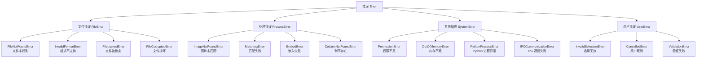
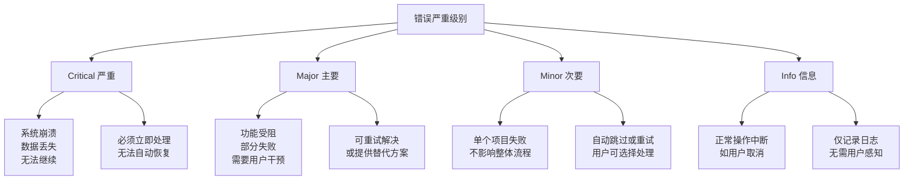
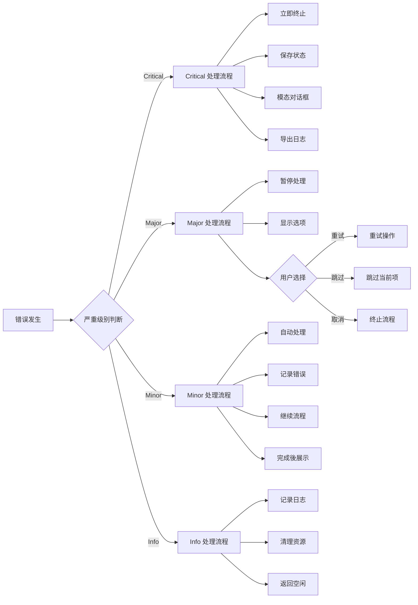
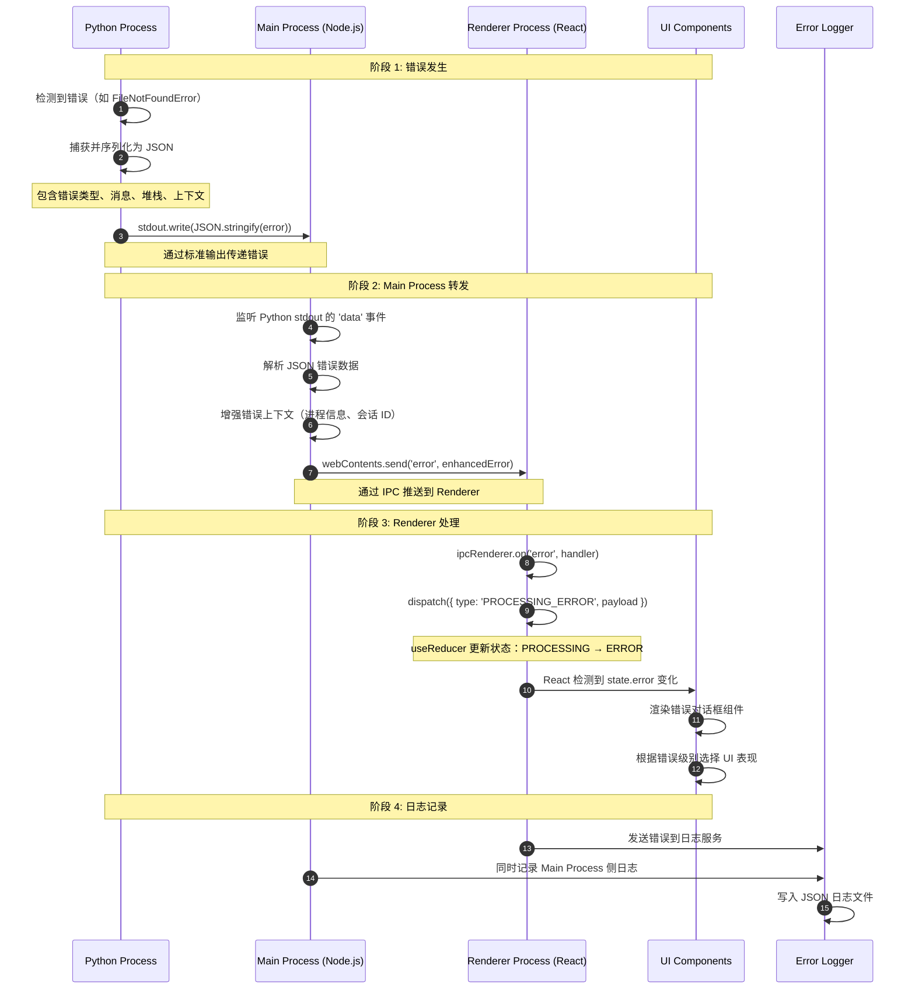
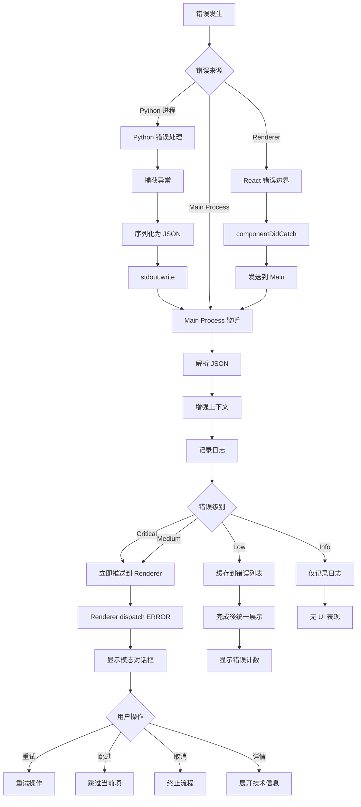
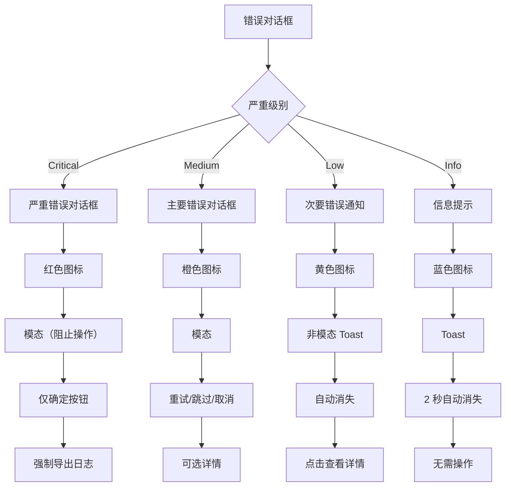
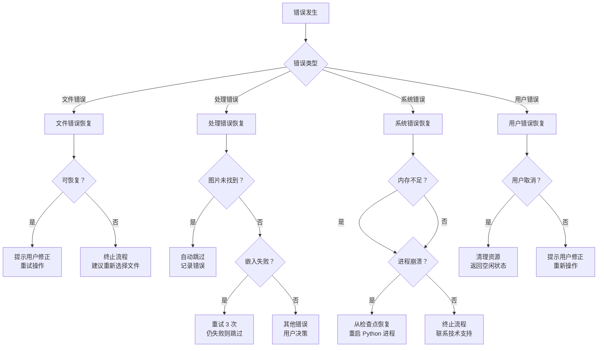
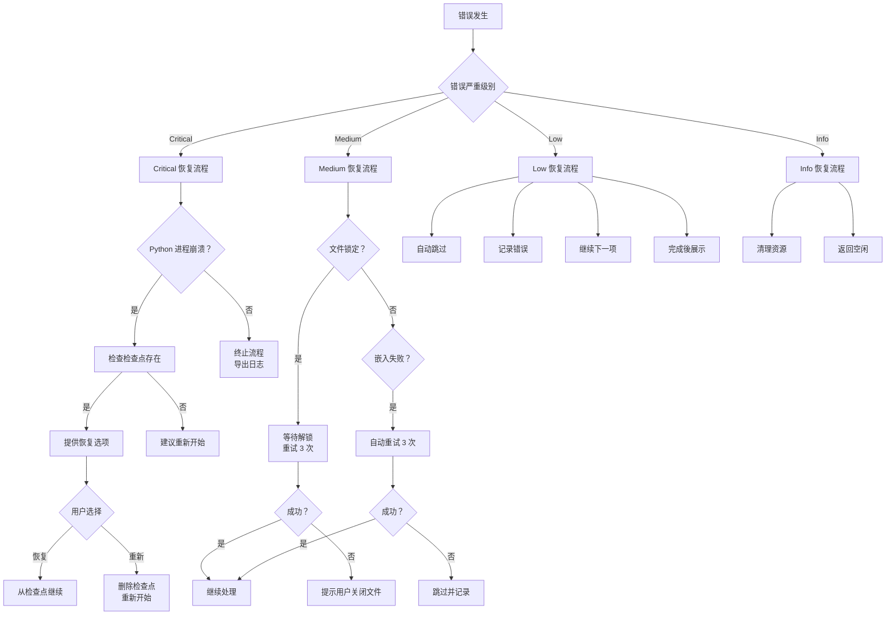

# 错误处理架构文档

> **版本**: v1.0  
> **创建日期**: 2026-03-08  
> **状态**: 设计完成  
> **适用范围**: ImageAutoInserter Electron + React + Python 架构  
> **配套文档**: [spec.md](../../.trae/specs/gui-redesign/spec.md), [data-flow.md](./data-flow.md)

---

## 目录

1. [错误处理哲学](#1-错误处理哲学)
2. [错误分类体系](#2-错误分类体系)
3. [错误严重级别](#3-错误严重级别)
4. [错误传播流程](#4-错误传播流程)
5. [错误处理模式](#5-错误处理模式)
6. [错误消息规范](#6-错误消息规范)
7. [错误日志规范](#7-错误日志规范)
8. [错误对话框设计](#8-错误对话框设计)
9. [代码实现示例](#9-代码实现示例)
10. [错误恢复策略](#10-错误恢复策略)

---

## 1. 错误处理哲学

### 1.1 核心原则

本系统的错误处理遵循以下核心原则：

#### 原则 1：Fail-Fast（快速失败）
> "尽早暴露错误，防止错误状态扩散。"

- **检测时机**: 在错误发生的第一时间检测并抛出
- **检测位置**: 在系统边界（文件 IO、网络调用、进程通信）立即验证
- **目的**: 防止错误状态污染后续处理逻辑，降低调试难度

**示例**:
```python
# ❌ 错误做法：延迟检测
def process_excel(path):
    # 直接使用，到深处才报错
    wb = openpyxl.load_workbook(path)
    # ... 处理 100 行后才发现文件损坏

# ✅ 正确做法：立即检测
def process_excel(path):
    # 在入口处立即验证
    if not os.path.exists(path):
        raise FileNotFoundError(f"Excel 文件不存在：{path}")
    if not path.endswith('.xlsx'):
        raise InvalidFormatError(f"不支持的文件格式：{path}")
    
    wb = openpyxl.load_workbook(path)
    # ... 安全处理
```

#### 原则 2：Graceful Degradation（优雅降级）
> "在可能的情况下继续服务，而不是完全崩溃。"

- **部分失败**: 单个商品图片嵌入失败不影响其他商品处理
- **降级策略**: 图片缺失时留空单元格，记录错误日志，继续处理下一行
- **用户感知**: 明确告知用户哪些成功、哪些失败，提供错误详情

**示例**:
```python
# ✅ 优雅降级处理
def process_all_rows(excel_path, image_source):
    results = {
        'total': 0,
        'success': 0,
        'failed': 0,
        'errors': []
    }
    
    for row in excel_rows:
        results['total'] += 1
        try:
            insert_image(row)
            results['success'] += 1
        except ImageNotFoundError as e:
            results['failed'] += 1
            results['errors'].append({
                'row': row.number,
                'item': row.item_code,
                'message': str(e)
            })
            # 继续处理下一行，不中断整体流程
    
    return results
```

#### 原则 3：用户友好（User-Friendly）
> "错误消息应该帮助用户解决问题，而不是展示技术细节。"

- **分层展示**: 先给用户友好的解决方案，再提供技术详情（可选展开）
- **行动导向**: 告诉用户"应该做什么"，而不是"系统发生了什么"
- **本地化**: 支持中英文双语错误消息

**示例**:
```typescript
// ❌ 技术化错误消息
{
  message: "FileNotFoundError: [Errno 2] No such file or directory: '/path/to/file.xlsx'"
}

// ✅ 用户友好错误消息
{
  title: "文件未找到",
  message: "系统找不到指定的 Excel 文件，请检查文件路径是否正确",
  resolution: "请重新选择 Excel 文件，或确认文件未被移动/删除",
  technicalDetails: "FileNotFoundError: [Errno 2] ... (用户可选择查看)"
}
```

#### 原则 4：可追溯性（Traceability）
> "每个错误都应该有完整的上下文信息，便于问题定位。"

- **错误 ID**: 为每个错误生成唯一标识符
- **会话追踪**: 记录错误发生时的会话 ID
- **完整堆栈**: 保存 Python、Main Process、Renderer 的完整调用栈
- **环境信息**: 记录系统平台、版本、内存使用等上下文

### 1.2 错误处理目标

| 目标 | 描述 | 衡量指标 |
|------|------|---------|
| **用户体验** | 最小化错误对用户的困扰 | 用户遇到错误后的操作成功率 > 80% |
| **问题定位** | 快速定位错误根本原因 | 平均问题定位时间 < 5 分钟 |
| **系统稳定性** | 防止错误导致系统崩溃 | 严重错误发生率 < 0.1% |
| **可恢复性** | 提供清晰的恢复路径 | 可恢复错误占比 > 90% |

---

## 2. 错误分类体系

### 2.1 错误分类总览



### 2.2 文件错误（FileError）

**定义**: 在文件操作过程中发生的错误，包括读取、写入、验证等环节。

#### 2.2.1 FileNotFoundError（文件未找到）

| 属性 | 值 |
|------|-----|
| **错误代码** | `ERR_FILE_NOT_FOUND` |
| **严重级别** | 中等（Medium） |
| **可恢复性** | 可恢复 |
| **触发场景** | 用户选择的文件路径不存在 |

**技术详情**:
```typescript
interface FileNotFoundError {
  type: 'file';
  code: 'ERR_FILE_NOT_FOUND';
  severity: 'medium';
  payload: {
    path: string;           // 尝试访问的文件路径
    fileType: 'excel' | 'image-source';
    exists: boolean;        // 路径是否存在
    parentExists: boolean;  // 父目录是否存在
  };
}
```

**用户消息**:
- **中文**: "系统找不到指定的文件，请检查文件路径是否正确"
- **英文**: "The specified file could not be found. Please check if the file path is correct"

**解决方案**:
1. 确认文件未被移动或删除
2. 检查文件路径是否包含特殊字符
3. 重新选择文件

---

#### 2.2.2 InvalidFormatError（格式不支持）

| 属性 | 值 |
|------|-----|
| **错误代码** | `ERR_INVALID_FORMAT` |
| **严重级别** | 中等（Medium） |
| **可恢复性** | 可恢复 |
| **触发场景** | 文件格式不符合系统要求 |

**技术详情**:
```typescript
interface InvalidFormatError {
  type: 'file';
  code: 'ERR_INVALID_FORMAT';
  severity: 'medium';
  payload: {
    path: string;           // 文件路径
    detectedFormat: string; // 检测到的格式
    expectedFormats: string[]; // 期望的格式列表
  };
}
```

**用户消息**:
- **中文**: "不支持的文件格式，系统仅支持 {格式列表} 格式"
- **英文**: "Unsupported file format. System only supports {format list}"

**解决方案**:
1. Excel 文件必须是 `.xlsx` 格式（不支持 `.xls`）
2. 图片源必须是文件夹、`.zip` 或 `.rar` 格式
3. 转换文件格式后重新选择

---

#### 2.2.3 FileLockedError（文件被锁定）

| 属性 | 值 |
|------|-----|
| **错误代码** | `ERR_FILE_LOCKED` |
| **严重级别** | 中等（Medium） |
| **可恢复性** | 可恢复 |
| **触发场景** | 文件正被其他程序占用 |

**技术详情**:
```typescript
interface FileLockedError {
  type: 'file';
  code: 'ERR_FILE_LOCKED';
  severity: 'medium';
  payload: {
    path: string;           // 文件路径
    lockedBy?: string;      // 占用文件的进程名（如可检测）
    isReadOnly: boolean;    // 是否为只读文件
  };
}
```

**用户消息**:
- **中文**: "文件正被其他程序使用，请关闭该文件后重试"
- **英文**: "The file is being used by another program. Please close it and try again"

**解决方案**:
1. 关闭正在编辑该文件的 Excel 或其他程序
2. 检查文件是否设置为只读
3. 重启系统后重试（极端情况）

---

#### 2.2.4 FileCorruptedError（文件损坏）

| 属性 | 值 |
|------|-----|
| **错误代码** | `ERR_FILE_CORRUPTED` |
| **严重级别** | 严重（Critical） |
| **可恢复性** | 不可恢复 |
| **触发场景** | 文件格式损坏或数据不完整 |

**技术详情**:
```typescript
interface FileCorruptedError {
  type: 'file';
  code: 'ERR_FILE_CORRUPTED';
  severity: 'critical';
  payload: {
    path: string;           // 文件路径
    fileType: 'excel' | 'zip' | 'rar';
    errorDetail: string;    // 具体损坏描述
    repairable: boolean;    // 是否可修复
  };
}
```

**用户消息**:
- **中文**: "文件已损坏，无法读取。请检查文件完整性或重新获取文件"
- **英文**: "The file is corrupted and cannot be read. Please check file integrity or obtain a new copy"

**解决方案**:
1. 重新下载或获取文件副本
2. 使用 Excel 修复工具尝试修复（如为 Excel 文件）
3. 联系文件提供方确认文件完整性

---

### 2.3 处理错误（ProcessError）

**定义**: 在业务逻辑处理过程中发生的错误，包括图片匹配、Excel 操作等。

#### 2.3.1 ImageNotFoundError（图片未找到）

| 属性 | 值 |
|------|-----|
| **错误代码** | `ERR_IMAGE_NOT_FOUND` |
| **严重级别** | 轻微（Low） |
| **可恢复性** | 自动跳过 |
| **触发场景** | 商品编码在图片源中没有匹配的图片 |

**技术详情**:
```typescript
interface ImageNotFoundError {
  type: 'process';
  code: 'ERR_IMAGE_NOT_FOUND';
  severity: 'low';
  payload: {
    itemCode: string;       // 商品编码
    expectedImages: number; // 期望的图片数量（如 3 张）
    foundImages: number;    // 实际找到的图片数量
    searchedPaths: string[]; // 搜索过的路径列表
  };
}
```

**用户消息**:
- **中文**: "商品编码 {编码} 对应的图片未找到，已跳过该商品"
- **英文**: "No matching image found for item code {code}. This item has been skipped"

**解决方案**:
1. 检查图片命名是否符合 `{商品编码}-{序号}.{格式}` 规范
2. 确认图片源包含该商品的图片
3. 查看错误日志中的详细搜索路径

**处理策略**: 自动跳过，记录错误，继续处理下一行

---

#### 2.3.2 MatchingError（匹配失败）

| 属性 | 值 |
|------|-----|
| **错误代码** | `ERR_MATCHING_FAILED` |
| **严重级别** | 中等（Medium） |
| **可恢复性** | 可恢复 |
| **触发场景** | 商品编码格式异常，无法解析 |

**技术详情**:
```typescript
interface MatchingError {
  type: 'process';
  code: 'ERR_MATCHING_FAILED';
  severity: 'medium';
  payload: {
    rawValue: string;       // 单元格原始值
    row: number;            // 行号
    column: string;         // 列号
    reason: 'empty' | 'invalid_format' | 'special_chars';
  };
}
```

**用户消息**:
- **中文**: "第{行}行的商品编码格式异常，无法匹配图片"
- **英文**: "Invalid item code format at row {row}, cannot match image"

**解决方案**:
1. 检查 Excel 中商品编码列的数据格式
2. 清除单元格中的空格、特殊字符
3. 确认商品编码与图片命名规则一致

---

#### 2.3.3 EmbedError（嵌入失败）

| 属性 | 值 |
|------|-----|
| **错误代码** | `ERR_EMBED_FAILED` |
| **严重级别** | 中等（Medium） |
| **可恢复性** | 可恢复（重试 3 次） |
| **触发场景** | 图片嵌入 Excel 单元格时失败 |

**技术详情**:
```typescript
interface EmbedError {
  type: 'process';
  code: 'ERR_EMBED_FAILED';
  severity: 'medium';
  payload: {
    itemCode: string;       // 商品编码
    row: number;            // 行号
    column: string;         // 目标列（如 Picture 1）
    imagePath: string;      // 图片路径
    retryCount: number;     // 已重试次数
    errorDetail: string;    // openpyxl 具体错误信息
  };
}
```

**用户消息**:
- **中文**: "图片嵌入失败（第{行}行），系统已重试{次数}次"
- **英文**: "Failed to embed image at row {row}. System has retried {count} times"

**解决方案**:
1. 系统自动重试（最多 3 次）
2. 检查图片文件是否损坏
3. 确认 Excel 文件未受保护

**处理策略**: 自动重试 3 次，仍失败则跳过并记录错误

---

#### 2.3.4 ColumnNotFoundError（列不存在）

| 属性 | 值 |
|------|-----|
| **错误代码** | `ERR_COLUMN_NOT_FOUND` |
| **严重级别** | 严重（Critical） |
| **可恢复性** | 不可恢复 |
| **触发场景** | Excel 中不存在"商品编码"列 |

**技术详情**:
```typescript
interface ColumnNotFoundError {
  type: 'process';
  code: 'ERR_COLUMN_NOT_FOUND';
  severity: 'critical';
  payload: {
    expectedColumn: string; // 期望的列名（"商品编码"）
    foundHeaders: string[]; // 实际找到的表头列表
    sheetName: string;      // Sheet 名称
    searchedRows: number;   // 搜索过的行数
  };
}
```

**用户消息**:
- **中文**: "Excel 中未找到"商品编码"列，请确认表格包含该列"
- **英文**: "Column '商品编码' not found in Excel. Please ensure the spreadsheet contains this column"

**解决方案**:
1. 确认 Excel 表格包含"商品编码"列（精确匹配，不接受变体）
2. 检查表头是否在第一行或适当位置
3. 确认没有合并单元格遮挡列名

**重要说明**: 系统**仅识别**"商品编码"这一精确术语，不接受任何变体

---

### 2.4 系统错误（SystemError）

**定义**: 由系统资源、权限、进程管理等底层问题引发的错误。

#### 2.4.1 PermissionError（权限不足）

| 属性 | 值 |
|------|-----|
| **错误代码** | `ERR_PERMISSION_DENIED` |
| **严重级别** | 中等（Medium） |
| **可恢复性** | 可恢复 |
| **触发场景** | 没有文件读写权限 |

**技术详情**:
```typescript
interface PermissionError {
  type: 'system';
  code: 'ERR_PERMISSION_DENIED';
  severity: 'medium';
  payload: {
    path: string;           // 文件/目录路径
    requiredPermission: 'read' | 'write' | 'execute';
    currentPermissions: string; // 当前权限（如 r--r--r--）
  };
}
```

**用户消息**:
- **中文**: "没有权限访问该文件，请检查文件权限设置"
- **英文**: "Permission denied to access this file. Please check file permissions"

**解决方案**:
1. macOS: 右键文件 → 显示简介 → 共享与权限 → 添加读写权限
2. Windows: 右键文件 → 属性 → 安全 → 编辑权限
3. 使用管理员权限运行应用

---

#### 2.4.2 OutOfMemoryError（内存不足）

| 属性 | 值 |
|------|-----|
| **错误代码** | `ERR_OUT_OF_MEMORY` |
| **严重级别** | 严重（Critical） |
| **可恢复性** | 不可恢复 |
| **触发场景** | 系统内存不足以完成操作 |

**技术详情**:
```typescript
interface OutOfMemoryError {
  type: 'system';
  code: 'ERR_OUT_OF_MEMORY';
  severity: 'critical';
  payload: {
    requiredMemory: string; // 需要的内存（如 "2.5GB"）
    availableMemory: string; // 可用内存（如 "512MB"）
    operation: string;      // 正在进行的操作
    processMemory: string;  // 当前进程内存使用
  };
}
```

**用户消息**:
- **中文**: "系统内存不足，无法完成操作。请关闭其他程序后重试"
- **英文**: "Insufficient system memory to complete the operation. Please close other applications and try again"

**解决方案**:
1. 关闭其他占用内存的程序（浏览器、其他 Office 文档等）
2. 分批处理大型 Excel 文件（如每次 50 行）
3. 增加系统虚拟内存（页面文件）

---

#### 2.4.3 PythonProcessError（Python 进程异常）

| 属性 | 值 |
|------|-----|
| **错误代码** | `ERR_PYTHON_PROCESS_CRASH` |
| **严重级别** | 严重（Critical） |
| **可恢复性** | 部分可恢复 |
| **触发场景** | Python 子进程意外退出或崩溃 |

**技术详情**:
```typescript
interface PythonProcessError {
  type: 'system';
  code: 'ERR_PYTHON_PROCESS_CRASH';
  severity: 'critical';
  payload: {
    exitCode: number | null; // 退出码（null 表示被信号终止）
    signal: string | null;   // 终止信号（如 "SIGTERM", "SIGKILL"）
    stderr: string;          // 标准错误输出
    lastProcessedRow?: number; // 最后处理的行号（用于恢复）
  };
}
```

**用户消息**:
- **中文**: "处理进程意外终止，系统已保存当前进度。是否从断点继续？"
- **英文**: "Processing process terminated unexpectedly. Progress has been saved. Continue from breakpoint?"

**解决方案**:
1. 系统提供"从断点继续"选项
2. 查看错误日志中的 Python 堆栈信息
3. 重启应用后重试

**恢复策略**: 提供检查点机制，支持从最后成功处理的行继续

---

#### 2.4.4 IPCCommunicationError（IPC 通信失败）

| 属性 | 值 |
|------|-----|
| **错误代码** | `ERR_IPC_FAILED` |
| **严重级别** | 严重（Critical） |
| **可恢复性** | 不可恢复 |
| **触发场景** | Renderer 与 Main Process 通信失败 |

**技术详情**:
```typescript
interface IPCCommunicationError {
  type: 'system';
  code: 'ERR_IPC_FAILED';
  severity: 'critical';
  payload: {
    channel: string;        // IPC 通道名称
    requestType: string;    // 请求类型（invoke/send）
    timeout: boolean;       // 是否超时
    errorMessage: string;   // 具体错误信息
  };
}
```

**用户消息**:
- **中文**: "系统内部通信失败，请重启应用"
- **英文**: "Internal system communication failed. Please restart the application"

**解决方案**:
1. 重启应用
2. 检查开发者工具控制台（Help → Toggle Developer Tools）
3. 提交错误日志给技术支持

---

### 2.5 用户错误（UserError）

**定义**: 由用户操作不当或主动取消引发的错误。

#### 2.5.1 InvalidSelectionError（选择无效）

| 属性 | 值 |
|------|-----|
| **错误代码** | `ERR_INVALID_SELECTION` |
| **严重级别** | 轻微（Low） |
| **可恢复性** | 可恢复 |
| **触发场景** | 用户选择了无效的文件或目录 |

**技术详情**:
```typescript
interface InvalidSelectionError {
  type: 'user';
  code: 'ERR_INVALID_SELECTION';
  severity: 'low';
  payload: {
    selectionType: 'excel' | 'image-source';
    selectedPath: string;   // 用户选择的路径
    reason: 'empty-folder' | 'no-images' | 'wrong-type';
  };
}
```

**用户消息**:
- **中文**: "选择无效，请重新选择正确的文件类型"
- **英文**: "Invalid selection. Please select the correct file type"

**解决方案**:
1. Excel 文件必须是 `.xlsx` 格式
2. 图片源文件夹必须包含图片文件
3. 压缩包必须是 `.zip` 或 `.rar` 格式

---

#### 2.5.2 CancelledError（用户取消）

| 属性 | 值 |
|------|-----|
| **错误代码** | `ERR_CANCELLED` |
| **严重级别** | 信息（Info） |
| **可恢复性** | 可恢复 |
| **触发场景** | 用户主动取消操作 |

**技术详情**:
```typescript
interface CancelledError {
  type: 'user';
  code: 'ERR_CANCELLED';
  severity: 'info';
  payload: {
    operation: 'file-select' | 'processing' | 'retry';
    progressAtCancel: {     // 取消时的进度
      percent: number;
      processedRows: number;
      totalRows: number;
    };
  };
}
```

**用户消息**:
- **中文**: "操作已取消"
- **英文**: "Operation cancelled"

**处理策略**: 不视为真正的错误，仅记录日志，清理资源

---

### 2.6 错误分类速查表

| 错误代码 | 错误名称 | 类别 | 严重级别 | 可恢复 | 自动处理 |
|---------|---------|------|---------|--------|---------|
| `ERR_FILE_NOT_FOUND` | 文件未找到 | File | Medium | ✅ | ❌ |
| `ERR_INVALID_FORMAT` | 格式不支持 | File | Medium | ✅ | ❌ |
| `ERR_FILE_LOCKED` | 文件被锁定 | File | Medium | ✅ | ❌ |
| `ERR_FILE_CORRUPTED` | 文件损坏 | File | Critical | ❌ | ❌ |
| `ERR_IMAGE_NOT_FOUND` | 图片未匹配 | Process | Low | ✅ | ✅ 跳过 |
| `ERR_MATCHING_FAILED` | 匹配失败 | Process | Medium | ✅ | ❌ |
| `ERR_EMBED_FAILED` | 嵌入失败 | Process | Medium | ✅ | ✅ 重试 3 次 |
| `ERR_COLUMN_NOT_FOUND` | 列不存在 | Process | Critical | ❌ | ❌ |
| `ERR_PERMISSION_DENIED` | 权限不足 | System | Medium | ✅ | ❌ |
| `ERR_OUT_OF_MEMORY` | 内存不足 | System | Critical | ❌ | ❌ |
| `ERR_PYTHON_PROCESS_CRASH` | Python 进程崩溃 | System | Critical | ⚠️ | ✅ 检查点恢复 |
| `ERR_IPC_FAILED` | IPC 通信失败 | System | Critical | ❌ | ❌ |
| `ERR_INVALID_SELECTION` | 选择无效 | User | Low | ✅ | ❌ |
| `ERR_CANCELLED` | 用户取消 | User | Info | ✅ | ✅ 清理资源 |

---

## 3. 错误严重级别

### 3.1 级别定义

系统采用四级错误严重级别分类：



### 3.2 各级别详细说明

#### 3.2.1 Critical（严重）

**定义**: 导致系统无法继续运行或数据丢失的错误。

**特征**:
- ❌ 无法自动恢复
- ❌ 必须终止当前操作
- ❌ 需要用户立即干预
- ❌ 可能导致数据丢失或损坏

**处理策略**:
1. 立即终止处理流程
2. 保存当前状态和进度（如可能）
3. 显示完整错误对话框（阻止继续操作）
4. 提供错误日志导出选项
5. 建议用户联系技术支持

**典型场景**:
- Excel 文件严重损坏
- 系统内存耗尽
- Python 进程崩溃且无法重启
- 输出文件写入失败

**UI 表现**:
- 红色错误图标
- 模态对话框（阻止其他操作）
- 仅显示"确定"和"导出错误日志"按钮
- 不提供重试选项（或仅允许重试 1 次）

---

#### 3.2.2 Major（主要）

**定义**: 影响核心功能但系统仍可部分运行的错误。

**特征**:
- ⚠️ 可能无法自动恢复
- ⚠️ 当前操作受阻
- ⚠️ 需要用户决策
- ✅ 不一定会丢失数据

**处理策略**:
1. 暂停处理流程
2. 显示错误对话框，提供多个选项
3. 允许用户选择：重试/跳过/取消
4. 记录详细错误日志

**典型场景**:
- 文件被其他程序锁定
- 图片嵌入失败（可重试）
- 商品编码格式异常
- 权限不足

**UI 表现**:
- 橙色警告图标
- 模态对话框
- 提供"重试"、"跳过"、"取消"按钮
- 可展开查看详细技术信息

---

#### 3.2.3 Minor（次要）

**定义**: 不影响整体流程的局部错误。

**特征**:
- ✅ 可自动恢复或跳过
- ✅ 不影响其他项目处理
- ✅ 用户可选择是否干预
- ✅ 不会丢失重要数据

**处理策略**:
1. 自动处理（跳过或重试）
2. 在进度界面显示警告计数
3. 处理完成后统一展示错误列表
4. 不中断用户操作流

**典型场景**:
- 单个商品图片未找到
- 非关键列数据缺失
- 图片格式不支持（跳过该图片）

**UI 表现**:
- 黄色警告图标
- Toast 提示或非模态通知
- 进度条显示成功/失败计数
- 完成后可查看错误详情

---

#### 3.2.4 Info（信息）

**定义**: 不视为真正错误的异常情况。

**特征**:
- ✅ 预期内的操作中断
- ✅ 无需恢复
- ✅ 仅记录日志
- ✅ 用户已知情

**典型场景**:
- 用户主动取消操作
- 文件选择对话框取消
- 超时会话自动清理

**处理策略**:
1. 不显示错误提示
2. 记录到日志（级别：INFO）
3. 清理资源，返回空闲状态
4. 不生成错误报告

**UI 表现**:
- 无错误提示
- 可能显示 Toast："操作已取消"
- 界面返回到安全状态

---

### 3.3 严重级别判定矩阵

使用以下矩阵快速判定错误级别：

| 影响范围 | 可自动恢复 | 数据风险 | 用户感知 | 严重级别 |
|---------|-----------|---------|---------|---------|
| 系统级 | ❌ | 高 | 必须 | **Critical** |
| 系统级 | ⚠️ 部分 | 中 | 必须 | **Critical** |
| 功能级 | ❌ | 中 | 必须 | **Major** |
| 功能级 | ✅ | 低 | 可选 | **Major** |
| 项目级 | ✅ | 无 | 事后 | **Minor** |
| 无 | ✅ | 无 | 无 | **Info** |

---

### 3.4 错误级别与处理策略映射



---

## 4. 错误传播流程

### 4.1 错误传播总览（Python → Main → Renderer → UI）



### 4.2 Python 层错误处理

#### 4.2.1 错误捕获和序列化

```python
# processor.py

import json
import sys
import traceback
from datetime import datetime
from typing import Dict, Any, Optional

class BaseError(Exception):
    """所有自定义错误的基类"""
    def __init__(self, message: str, code: str, severity: str, payload: Dict[str, Any]):
        self.message = message
        self.code = code
        self.severity = severity
        self.payload = payload
        self.timestamp = datetime.utcnow().isoformat()
        self.stack_trace = traceback.format_exc()
        super().__init__(self.message)
    
    def to_dict(self) -> Dict[str, Any]:
        """序列化为字典，便于 JSON 传输"""
        return {
            'type': self.__class__.__name__,
            'code': self.code,
            'severity': self.severity,
            'message': self.message,
            'payload': self.payload,
            'timestamp': self.timestamp,
            'stack_trace': self.stack_trace.split('\n') if self.stack_trace else []
        }

class ImageNotFoundError(BaseError):
    def __init__(self, item_code: str, searched_paths: list):
        super().__init__(
            message=f"商品编码 {item_code} 对应的图片未找到",
            code='ERR_IMAGE_NOT_FOUND',
            severity='low',
            payload={
                'itemCode': item_code,
                'searchedPaths': searched_paths
            }
        )

def process_excel_row(row_data: dict, image_source: str) -> dict:
    """处理单个 Excel 行"""
    try:
        item_code = row_data['商品编码']
        image_path = find_matching_image(item_code, image_source)
        
        if not image_path:
            raise ImageNotFoundError(item_code, [image_source])
        
        embed_image_to_cell(image_path, row_data['target_cell'])
        
        return {'success': True, 'row': row_data['row']}
    
    except ImageNotFoundError as e:
        # 发送错误到 Main Process
        send_error_to_main(e.to_dict())
        return {'success': False, 'error': e.to_dict(), 'row': row_data['row']}
    
    except Exception as e:
        # 未预期的错误，包装为系统错误
        error = BaseError(
            message=str(e),
            code='ERR_UNEXPECTED',
            severity='critical',
            payload={'originalError': str(e)}
        )
        send_error_to_main(error.to_dict())
        raise

def send_error_to_main(error_dict: dict):
    """通过 stdout 发送错误到 Main Process"""
    # 使用 JSON 格式，便于 Node.js 解析
    sys.stdout.write(json.dumps({
        'type': 'error',
        'data': error_dict
    }) + '\n')
    sys.stdout.flush()
```

---

#### 4.2.2 Python 错误输出格式

```json
{
  "type": "error",
  "data": {
    "type": "ImageNotFoundError",
    "code": "ERR_IMAGE_NOT_FOUND",
    "severity": "low",
    "message": "商品编码 C000123789 对应的图片未找到",
    "payload": {
      "itemCode": "C000123789",
      "searchedPaths": [
        "/Users/shimengyu/Downloads/product_images/C000123789-01.jpg",
        "/Users/shimengyu/Downloads/product_images/C000123789-02.jpg",
        "/Users/shimengyu/Downloads/product_images/C000123789-03.jpg"
      ]
    },
    "timestamp": "2026-03-08T14:30:45.123456",
    "stack_trace": [
      "Traceback (most recent call last):",
      "  File \"processor.py\", line 156, in process_row",
      "    image = find_matching_image(item_code, image_source)",
      "  File \"processor.py\", line 89, in find_matching_image",
      "    raise FileNotFoundError(f\"Image not found: {item_code}\")",
      "ImageNotFoundError: 商品编码 C000123789 对应的图片未找到"
    ]
  }
}
```

---

### 4.3 Main Process 层错误处理

#### 4.3.1 Python 进程错误监听

```typescript
// src/main/python-bridge.ts

import { spawn, ChildProcess } from 'child_process';
import { webContents } from 'electron';
import { v4 as uuidv4 } from 'uuid';

interface PythonError {
  type: string;
  code: string;
  severity: 'low' | 'medium' | 'critical' | 'info';
  message: string;
  payload: any;
  timestamp: string;
  stack_trace: string[];
}

interface PythonMessage {
  type: 'progress' | 'error' | 'complete';
  data: any;
}

class PythonProcessManager {
  private process: ChildProcess | null = null;
  private sessionId: string = '';
  private errorBuffer: PythonError[] = [];

  async spawn(excelPath: string, imageSourcePath: string): Promise<number> {
    this.sessionId = uuidv4();
    this.errorBuffer = [];

    this.process = spawn('python3', ['processor.py', excelPath, imageSourcePath]);

    // 监听标准输出（包括进度和错误）
    this.process.stdout?.on('data', (data: Buffer) => {
      const lines = data.toString().split('\n');
      
      for (const line of lines) {
        if (!line.trim()) continue;
        
        try {
          const message: PythonMessage = JSON.parse(line);
          this.handlePythonMessage(message);
        } catch (err) {
          console.error('Failed to parse Python output:', line, err);
        }
      }
    });

    // 监听标准错误（系统级错误）
    this.process.stderr?.on('data', (data: Buffer) => {
      const error = {
        type: 'PythonStderrError',
        code: 'ERR_PYTHON_STDERR',
        severity: 'critical' as const,
        message: data.toString(),
        timestamp: new Date().toISOString()
      };
      this.errorBuffer.push(error);
      this.forwardErrorToRenderer(error);
    });

    // 监听进程退出
    this.process.on('exit', (code, signal) => {
      this.handlePythonExit(code, signal);
    });

    return this.process.pid!;
  }

  private handlePythonMessage(message: PythonMessage): void {
    switch (message.type) {
      case 'error':
        this.handlePythonError(message.data);
        break;
      case 'progress':
        this.forwardProgressToRenderer(message.data);
        break;
      case 'complete':
        this.handlePythonComplete(message.data);
        break;
    }
  }

  private handlePythonError(error: PythonError): void {
    // 增强错误上下文
    const enhancedError = {
      ...error,
      sessionId: this.sessionId,
      processId: this.process?.pid,
      context: {
        excelFile: this.currentExcelPath,
        imageSource: this.currentImageSourcePath
      }
    };

    // 缓存错误
    this.errorBuffer.push(enhancedError);

    // 立即转发到 Renderer
    this.forwardErrorToRenderer(enhancedError);

    // 记录到日志文件
    this.logError(enhancedError);
  }

  private forwardErrorToRenderer(error: any): void {
    if (this.mainWindow?.webContents) {
      this.mainWindow.webContents.send('error', error);
    }
  }

  private logError(error: any): void {
    // 写入 JSON 日志文件
    const logPath = path.join(app.getPath('logs'), `error-${this.sessionId}.json`);
    fs.appendFileSync(logPath, JSON.stringify(error) + '\n');
  }
}
```

---

### 4.4 Renderer 层错误处理

#### 4.4.1 IPC 错误监听

```typescript
// src/renderer/hooks/useErrorHandling.ts

import { useEffect } from 'react';
import { ipcRenderer } from 'electron';
import { useDispatch } from 'react-redux';
import { appActions } from '../store/appSlice';

interface ElectronError {
  type: 'file' | 'process' | 'system' | 'user';
  code: string;
  severity: 'low' | 'medium' | 'critical' | 'info';
  message: string;
  details?: string;
  payload?: any;
  sessionId?: string;
  recoverable?: boolean;
}

export function useErrorHandling() {
  const dispatch = useDispatch();

  useEffect(() => {
    // 监听来自 Main Process 的错误事件
    const errorListener = (event: Electron.IpcRendererEvent, error: ElectronError) => {
      handleElectronError(error);
    };

    ipcRenderer.on('error', errorListener);

    // 清理监听器
    return () => {
      ipcRenderer.removeListener('error', errorListener);
    };
  }, [dispatch]);

  const handleElectronError = (error: ElectronError) => {
    console.error('[Renderer Error]', error);

    // 根据严重级别采取不同策略
    switch (error.severity) {
      case 'critical':
        handleCriticalError(error);
        break;
      case 'medium':
        handleMajorError(error);
        break;
      case 'low':
        handleMinorError(error);
        break;
      case 'info':
        handleInfoError(error);
        break;
    }
  };

  const handleCriticalError = (error: ElectronError) => {
    dispatch(appActions.setProcessingError({
      type: error.type,
      code: error.code,
      message: error.message,
      details: error.details,
      severity: error.severity,
      recoverable: false
    }));
  };

  const handleMajorError = (error: ElectronError) => {
    dispatch(appActions.setProcessingError({
      type: error.type,
      code: error.code,
      message: error.message,
      details: error.details,
      severity: error.severity,
      recoverable: true
    }));
  };

  const handleMinorError = (error: ElectronError) => {
    // 仅记录到错误列表，不中断流程
    dispatch(appActions.addMinorError(error));
  };

  const handleInfoError = (error: ElectronError) => {
    // 仅记录日志，不显示 UI
    console.log('[Info Error]', error.message);
  };
}
```

---

#### 4.4.2 React 错误边界（Error Boundaries）

```typescript
// src/renderer/components/ErrorBoundary.tsx

import React, { Component, ErrorInfo, ReactNode } from 'react';
import { ErrorDialog } from './ErrorDialog';

interface Props {
  children: ReactNode;
  fallback?: ReactNode;
}

interface State {
  hasError: boolean;
  error: Error | null;
  errorInfo: ErrorInfo | null;
}

export class ErrorBoundary extends Component<Props, State> {
  constructor(props: Props) {
    super(props);
    this.state = {
      hasError: false,
      error: null,
      errorInfo: null
    };
  }

  static getDerivedStateFromError(error: Error): Partial<State> {
    // 更新 state，触发错误 UI 渲染
    return {
      hasError: true,
      error
    };
  }

  componentDidCatch(error: Error, errorInfo: ErrorInfo): void {
    // 记录错误到日志服务
    this.logError(error, errorInfo);

    // 发送到 Main Process 进行全局错误追踪
    ipcRenderer.invoke('log-renderer-error', {
      message: error.message,
      stack: error.stack,
      componentStack: errorInfo.componentStack
    });

    console.error('[ErrorBoundary] Caught error:', error, errorInfo);
  }

  private async logError(error: Error, errorInfo: ErrorInfo): Promise<void> {
    try {
      await ipcRenderer.invoke('log-error', {
        type: 'renderer',
        code: 'ERR_REACT_ERROR',
        severity: 'critical',
        message: error.message,
        timestamp: new Date().toISOString(),
        stack: error.stack,
        componentStack: errorInfo.componentStack
      });
    } catch (err) {
      console.error('Failed to log error:', err);
    }
  }

  render(): ReactNode {
    if (this.state.hasError) {
      if (this.props.fallback) {
        return this.props.fallback;
      }

      // 显示错误对话框
      return (
        <ErrorDialog
          isOpen={true}
          title="组件渲染失败"
          message="界面组件发生错误，请刷新页面重试"
          details={this.state.error?.message}
          technicalDetails={this.state.errorInfo?.componentStack}
          severity="critical"
          onRetry={() => window.location.reload()}
          onClose={() => this.setState({ hasError: false })}
        />
      );
    }

    return this.props.children;
  }
}
```

---

### 4.5 错误传播决策树



---

## 5. 错误处理模式

### 5.1 Try-Catch-Finally 模式

#### 5.1.1 Python 层实现

```python
# processor.py

def process_excel_file(excel_path: str, image_source: str) -> ProcessingResult:
    """
    处理 Excel 文件的主函数
    
    参数:
        excel_path: Excel 文件路径
        image_source: 图片源路径（文件夹/压缩包）
    
    返回:
        ProcessingResult 包含处理统计和错误列表
    """
    result = ProcessingResult()
    
    try:
        # ===== 阶段 1: 前置验证 =====
        validate_excel_file(excel_path)  # 可能抛出 FileNotFoundError
        validate_image_source(image_source)  # 可能抛出 InvalidFormatError
        
        # ===== 阶段 2: 初始化 =====
        wb = openpyxl.load_workbook(excel_path)
        ws = find_item_code_column(wb)  # 可能抛出 ColumnNotFoundError
        
        # ===== 阶段 3: 处理循环 =====
        for row_idx, row in enumerate(ws.iter_rows(min_row=2), start=2):
            try:
                process_single_row(ws, row, image_source)
                result.success_count += 1
            except ImageNotFoundError as e:
                # Minor 错误：记录并继续
                result.add_error(e, row)
                result.failed_count += 1
            except EmbedError as e:
                # Major 错误：重试 3 次
                for retry in range(3):
                    try:
                        process_single_row(ws, row, image_source)
                        result.success_count += 1
                        break
                    except EmbedError:
                        if retry == 2:  # 最后一次重试失败
                            result.add_error(e, row)
                            result.failed_count += 1
                        time.sleep(0.5 * (retry + 1))  # 递增延迟
            
            # 发送进度更新
            send_progress_to_main({
                'current': row[0].value,
                'row': row_idx,
                'total': ws.max_row
            })
        
        # ===== 阶段 4: 保存 =====
        output_path = generate_output_path(excel_path)
        wb.save(output_path)
        result.output_file = output_path
        
    except FileNotFoundError as e:
        # Critical 错误：终止处理
        send_critical_error_to_main(e)
        raise
    except ColumnNotFoundError as e:
        # Critical 错误：终止处理
        send_critical_error_to_main(e)
        raise
    except Exception as e:
        # 未预期的错误
        unexpected_error = BaseError(
            message=f"未预期的错误：{str(e)}",
            code='ERR_UNEXPECTED',
            severity='critical',
            payload={'originalError': str(e)}
        )
        send_critical_error_to_main(unexpected_error)
        raise
    finally:
        # ===== 清理资源 =====
        if 'wb' in locals():
            wb.close()
        
        # 发送最终结果（无论成功失败）
        send_result_to_main(result)
    
    return result
```

---

#### 5.1.2 Main Process 层实现

```typescript
// src/main/ipc-handlers.ts

import { ipcMain, dialog, app } from 'electron';
import { PythonProcessManager } from './python-bridge';

const pythonManager = new PythonProcessManager();

export function registerIpcHandlers(mainWindow: BrowserWindow): void {
  
  // ===== 文件选择处理 =====
  ipcMain.handle('select-file', async (event, options: SelectFileOptions) => {
    try {
      const result = await dialog.showOpenDialog(mainWindow, {
        filters: getFileFilters(options.type),
        properties: options.type === 'image-source' 
          ? ['openFile', 'openDirectory'] 
          : ['openFile']
      });

      if (result.canceled) {
        return { success: false, cancelled: true };
      }

      const filePath = result.filePaths[0];
      
      // 验证文件
      await validateFile(filePath, options.type);
      
      return {
        success: true,
        file: await getFileInfo(filePath, options.type)
      };

    } catch (error) {
      // 分类处理错误
      if (error instanceof FileValidationError) {
        return {
          success: false,
          error: {
            type: 'file',
            code: 'ERR_INVALID_FORMAT',
            message: error.message
          }
        };
      }
      
      // 未预期错误
      throw error;
    }
  });

  // ===== 开始处理 =====
  ipcMain.handle('start-process', async (event, options: StartProcessOptions) => {
    try {
      // 启动 Python 进程
      const pid = await pythonManager.spawn(
        options.excelPath,
        options.imageSourcePath
      );

      return {
        success: true,
        processId: pid
      };

    } catch (error) {
      // Python 进程启动失败
      if (error instanceof PythonProcessError) {
        // 立即通知 Renderer
        mainWindow.webContents.send('error', {
          type: 'system',
          code: 'ERR_PYTHON_PROCESS_CRASH',
          severity: 'critical',
          message: error.message
        });
      }
      
      throw error;
    }
  });

  // ===== 取消处理 =====
  ipcMain.handle('cancel-process', async () => {
    try {
      await pythonManager.terminate();
      
      return {
        success: true,
        cancelled: true
      };

    } catch (error) {
      // 清理失败（进程已退出）
      console.error('Failed to cancel process:', error);
      return {
        success: false,
        error: error.message
      };
    } finally {
      // 无论如何都要清理资源
      pythonManager.cleanup();
    }
  });

  // ===== 重试操作 =====
  ipcMain.handle('retry-operation', async (event, options: RetryOptions) => {
    try {
      // 重试特定行的处理
      const result = await pythonManager.retryRow(options.row);
      
      return {
        success: true,
        result
      };

    } catch (error) {
      // 重试失败
      return {
        success: false,
        error: {
          type: 'process',
          code: 'ERR_RETRY_FAILED',
          message: error.message
        }
      };
    }
  });
}
```

---

#### 5.1.3 Renderer 层实现

```typescript
// src/renderer/hooks/useFileSelect.ts

import { useState, useCallback } from 'react';
import { ipcRenderer } from 'electron';
import { useDispatch } from 'react-redux';
import { appActions } from '../store/appSlice';

export function useFileSelect() {
  const dispatch = useDispatch();
  const [isSelecting, setIsSelecting] = useState(false);

  const selectExcelFile = useCallback(async () => {
    dispatch(appActions.fileSelectStart());
    setIsSelecting(true);

    try {
      const result = await ipcRenderer.invoke('select-file', {
        type: 'excel'
      });

      if (result.cancelled) {
        dispatch(appActions.fileSelectCancelled());
        return null;
      }

      if (!result.success) {
        dispatch(appActions.fileSelectError({
          type: 'file',
          code: result.error.code,
          message: result.error.message
        }));
        return null;
      }

      dispatch(appActions.fileSelectSuccess({
        fileType: 'excel',
        file: result.file
      }));

      return result.file;

    } catch (error) {
      // 未预期错误
      dispatch(appActions.fileSelectError({
        type: 'system',
        code: 'ERR_UNEXPECTED',
        message: error.message || '文件选择失败'
      }));
      return null;

    } finally {
      setIsSelecting(false);
    }
  }, [dispatch]);

  const selectImageSource = useCallback(async () => {
    dispatch(appActions.fileSelectStart());
    setIsSelecting(true);

    try {
      const result = await ipcRenderer.invoke('select-file', {
        type: 'image-source'
      });

      if (result.cancelled) {
        dispatch(appActions.fileSelectCancelled());
        return null;
      }

      if (!result.success) {
        dispatch(appActions.fileSelectError({
          type: 'file',
          code: result.error.code,
          message: result.error.message
        }));
        return null;
      }

      dispatch(appActions.fileSelectSuccess({
        fileType: 'image-source',
        file: result.file
      }));

      return result.file;

    } catch (error) {
      dispatch(appActions.fileSelectError({
        type: 'system',
        code: 'ERR_UNEXPECTED',
        message: error.message || '图片源选择失败'
      }));
      return null;

    } finally {
      setIsSelecting(false);
    }
  }, [dispatch]);

  return {
    selectExcelFile,
    selectImageSource,
    isSelecting
  };
}
```

---

### 5.2 React 错误边界（Error Boundaries）

#### 5.2.1 全局错误边界

```typescript
// src/renderer/App.tsx

import React from 'react';
import { ErrorBoundary } from './components/ErrorBoundary';
import { AppContent } from './AppContent';
import { GlobalErrorFallback } from './components/GlobalErrorFallback';

export function App() {
  return (
    <ErrorBoundary
      fallback={<GlobalErrorFallback />}
    >
      <AppContent />
    </ErrorBoundary>
  );
}
```

---

#### 5.2.2 组件级错误边界

```typescript
// src/renderer/components/FileSelectCard.tsx

import React from 'react';
import { ErrorBoundary } from './ErrorBoundary';
import { FileSelectButton } from './FileSelectButton';
import { FileInfoDisplay } from './FileInfoDisplay';

interface Props {
  fileType: 'excel' | 'image-source';
  label: string;
}

export function FileSelectCard({ fileType, label }: Props) {
  return (
    <div className="file-select-card">
      <h3>{label}</h3>
      
      {/* 为按钮区域设置独立的错误边界 */}
      <ErrorBoundary
        fallback={
          <div className="error-fallback">
            <p>按钮组件加载失败</p>
            <button onClick={() => window.location.reload()}>
              刷新页面
            </button>
          </div>
        }
      >
        <FileSelectButton fileType={fileType} />
      </ErrorBoundary>
      
      {/* 为文件信息显示设置独立的错误边界 */}
      <ErrorBoundary
        fallback={
          <div className="error-fallback">
            <p>文件信息显示失败</p>
          </div>
        }
      >
        <FileInfoDisplay fileType={fileType} />
      </ErrorBoundary>
    </div>
  );
}
```

---

### 5.3 Fallback UIs（降级 UI）

#### 5.3.1 进度条降级

```typescript
// src/renderer/components/ProgressBar.tsx

import React from 'react';

interface Props {
  progress: {
    percent: number;
    current: string;
    row: number;
    total: number;
  } | null;
  errorCount?: number;
}

export function ProgressBar({ progress, errorCount = 0 }: Props) {
  // Fallback 1: 无进度数据
  if (!progress) {
    return (
      <div className="progress-bar-fallback">
        <div className="progress-indeterminate"></div>
        <p>准备处理中...</p>
      </div>
    );
  }

  // Fallback 2: 有错误但继续处理
  const hasErrors = errorCount > 0;
  
  return (
    <div className={`progress-bar ${hasErrors ? 'has-errors' : ''}`}>
      <div 
        className="progress-bar-fill" 
        style={{ width: `${progress.percent}%` }}
      />
      
      <div className="progress-bar-label">
        {progress.percent}% 完成
        {hasErrors && (
          <span className="error-badge">
            {errorCount} 个错误
          </span>
        )}
      </div>
      
      <div className="progress-bar-details">
        正在处理：{progress.current} (第 {progress.row} 行 / 共 {progress.total} 行)
      </div>
    </div>
  );
}
```

---

#### 5.3.2 文件卡片降级

```typescript
// src/renderer/components/FileCard.tsx

import React from 'react';

interface Props {
  file: {
    name: string;
    path: string;
    size: number;
    type: string;
    imageCount?: number;
  } | null;
  isLoading?: boolean;
}

export function FileCard({ file, isLoading }: Props) {
  // Fallback 1: 加载中
  if (isLoading) {
    return (
      <div className="file-card-loading">
        <div className="skeleton-loader">
          <div className="skeleton-line" style={{ width: '60%' }}></div>
          <div className="skeleton-line" style={{ width: '40%' }}></div>
        </div>
        <p>加载文件信息...</p>
      </div>
    );
  }

  // Fallback 2: 无文件
  if (!file) {
    return (
      <div className="file-card-empty">
        <i className="icon-file-placeholder"></i>
        <p>尚未选择文件</p>
      </div>
    );
  }

  // 正常显示
  return (
    <div className="file-card">
      <div className="file-card-icon">
        <i className={`icon-${file.type}`}></i>
      </div>
      
      <div className="file-card-info">
        <h4 className="file-card-name">{file.name}</h4>
        <p className="file-card-path">{file.path}</p>
        <div className="file-card-meta">
          <span>{formatFileSize(file.size)}</span>
          {file.imageCount && (
            <span>{file.imageCount} 张图片</span>
          )}
        </div>
      </div>
    </div>
  );
}
```

---

### 5.4 重试逻辑（Retry Logic）

#### 5.4.1 指数退避重试

```typescript
// src/renderer/utils/retry.ts

interface RetryOptions {
  maxRetries?: number;        // 最大重试次数
  baseDelay?: number;         // 基础延迟（毫秒）
  maxDelay?: number;          // 最大延迟（毫秒）
  backoffFactor?: number;     // 退避因子
  shouldRetry?: (error: any) => boolean;  // 自定义重试判断
}

const defaultOptions: Required<RetryOptions> = {
  maxRetries: 3,
  baseDelay: 1000,
  maxDelay: 10000,
  backoffFactor: 2,
  shouldRetry: (error) => {
    // 默认：仅重试可恢复的错误
    return error.recoverable !== false;
  }
};

/**
 * 带指数退避的重试函数
 */
export async function retry<T>(
  operation: () => Promise<T>,
  options: RetryOptions = {}
): Promise<T> {
  const opts = { ...defaultOptions, ...options };
  let lastError: any;

  for (let attempt = 0; attempt <= opts.maxRetries; attempt++) {
    try {
      return await operation();
    } catch (error) {
      lastError = error;

      // 判断是否应该重试
      if (attempt === opts.maxRetries || !opts.shouldRetry(error)) {
        break;
      }

      // 计算延迟时间（指数退避 + 抖动）
      const delay = calculateDelay(attempt, opts);
      
      // 显示重试提示
      showRetryNotification(attempt + 1, opts.maxRetries, delay);

      // 等待
      await sleep(delay);
    }
  }

  throw lastError;
}

function calculateDelay(attempt: number, opts: Required<RetryOptions>): number {
  // 指数退避：baseDelay * (backoffFactor ^ attempt)
  const exponentialDelay = opts.baseDelay * Math.pow(opts.backoffFactor, attempt);
  
  // 添加随机抖动（±20%），避免多个请求同时重试
  const jitter = (Math.random() - 0.5) * 0.4 * exponentialDelay;
  
  // 限制在最大延迟范围内
  return Math.min(exponentialDelay + jitter, opts.maxDelay);
}

function sleep(ms: number): Promise<void> {
  return new Promise(resolve => setTimeout(resolve, ms));
}

function showRetryNotification(attempt: number, maxRetries: number, delay: number): void {
  // 显示 Toast 通知
  console.log(`重试 ${attempt}/${maxRetries}，${Math.round(delay / 1000)}秒后执行...`);
}

// 使用示例
export async function retryFileSelect(
  fileType: 'excel' | 'image-source'
): Promise<FileInfo> {
  return retry(
    async () => {
      const result = await ipcRenderer.invoke('select-file', { type: fileType });
      
      if (!result.success) {
        throw new FileSelectError(result.error);
      }
      
      return result.file;
    },
    {
      maxRetries: 2,
      baseDelay: 500,
      shouldRetry: (error) => {
        // 仅重试临时错误（如文件锁定）
        return error.code === 'ERR_FILE_LOCKED';
      }
    }
  );
}
```

---

#### 5.4.2 Python 层重试

```python
# processor.py

import time
from functools import wraps
from typing import Callable, TypeVar

T = TypeVar('T')

def retry(max_attempts: int = 3, delay: float = 1.0, backoff: float = 2.0):
    """
    重试装饰器（指数退避）
    
    参数:
        max_attempts: 最大尝试次数
        delay: 初始延迟（秒）
        backoff: 退避因子
    """
    def decorator(func: Callable[..., T]) -> Callable[..., T]:
        @wraps(func)
        def wrapper(*args, **kwargs) -> T:
            current_delay = delay
            last_exception = None
            
            for attempt in range(1, max_attempts + 1):
                try:
                    return func(*args, **kwargs)
                
                except EmbedError as e:
                    last_exception = e
                    
                    if attempt < max_attempts:
                        # 发送重试通知
                        send_progress_to_main({
                            'type': 'retry',
                            'attempt': attempt,
                            'max_attempts': max_attempts,
                            'delay': current_delay
                        })
                        
                        # 等待
                        time.sleep(current_delay)
                        
                        # 指数增长延迟
                        current_delay *= backoff
                    else:
                        # 最后一次尝试失败
                        raise
            
            # 理论上不会到这里
            raise last_exception
        
        return wrapper
    return decorator

# 使用示例
@retry(max_attempts=3, delay=0.5, backoff=2.0)
def embed_image_to_cell(image_path: str, cell):
    """
    嵌入图片到单元格（可能失败，需要重试）
    """
    try:
        img = Image.open(image_path)
        img = resize_image_for_cell(img, cell)
        
        # openpyxl 嵌入图片
        img_io = BytesIO()
        img.save(img_io, format='JPEG')
        img_io.seek(0)
        
        img_ref = Image(img_io)
        cell.anchor = cell.coordinate
        cell.parent.add_image(img_ref)
        img_ref.anchor(cell.coordinate)
        
    except Exception as e:
        raise EmbedError(
            message=f"嵌入图片失败：{str(e)}",
            image_path=image_path,
            cell=cell.coordinate
        )
```

---

## 6. 错误消息规范

### 6.1 错误消息格式

所有错误消息必须遵循以下结构：

```typescript
interface ErrorMessage {
  // 1. 标题（简短描述错误类型）
  title: string;
  
  // 2. 主消息（用户友好的错误描述）
  message: string;
  
  // 3. 解决方案（告诉用户应该做什么）
  resolution: string;
  
  // 4. 技术详情（可选，展开后显示）
  technicalDetails?: {
    errorCode: string;
    stackTrace?: string[];
    context?: Record<string, any>;
    timestamp: string;
    sessionId?: string;
  };
  
  // 5. 严重级别（决定 UI 表现）
  severity: 'low' | 'medium' | 'critical' | 'info';
  
  // 6. 是否可恢复（决定显示哪些操作按钮）
  recoverable: boolean;
}
```

---

### 6.2 用户友好错误消息模板

#### 6.2.1 文件错误消息

```typescript
const fileErrorMessages: Record<string, ErrorMessage> = {
  'ERR_FILE_NOT_FOUND': {
    title: '文件未找到',
    message: '系统找不到指定的文件，请检查文件路径是否正确',
    resolution: '请重新选择文件，或确认文件未被移动/删除',
    severity: 'medium',
    recoverable: true
  },
  
  'ERR_INVALID_FORMAT': {
    title: '文件格式不支持',
    message: '选择的文件格式不符合系统要求',
    resolution: 'Excel 文件必须是 .xlsx 格式，图片源必须是文件夹、.zip 或 .rar 格式',
    severity: 'medium',
    recoverable: true
  },
  
  'ERR_FILE_LOCKED': {
    title: '文件被占用',
    message: '该文件正被其他程序使用',
    resolution: '请关闭正在编辑该文件的程序（如 Excel），然后重试',
    severity: 'medium',
    recoverable: true
  },
  
  'ERR_FILE_CORRUPTED': {
    title: '文件损坏',
    message: '文件已损坏，无法读取',
    resolution: '请重新获取文件副本，或尝试使用修复工具',
    severity: 'critical',
    recoverable: false
  }
};
```

---

#### 6.2.2 处理错误消息

```typescript
const processErrorMessages: Record<string, ErrorMessage> = {
  'ERR_IMAGE_NOT_FOUND': {
    title: '图片未匹配',
    message: '未找到与商品编码匹配的图片',
    resolution: '请检查图片命名是否符合"{商品编码}-{序号}.{格式}"规范',
    severity: 'low',
    recoverable: false  // 自动跳过，无需用户操作
  },
  
  'ERR_MATCHING_FAILED': {
    title: '匹配失败',
    message: '商品编码格式异常，无法解析',
    resolution: '请检查 Excel 中商品编码列的数据格式，清除空格和特殊字符',
    severity: 'medium',
    recoverable: true
  },
  
  'ERR_EMBED_FAILED': {
    title: '嵌入失败',
    message: '图片嵌入 Excel 单元格时失败',
    resolution: '系统已自动重试，如仍失败请检查图片文件是否损坏',
    severity: 'medium',
    recoverable: true
  },
  
  'ERR_COLUMN_NOT_FOUND': {
    title: '缺少必需列',
    message: 'Excel 中未找到"商品编码"列',
    resolution: '请确认表格包含"商品编码"列（精确匹配，不接受变体）',
    severity: 'critical',
    recoverable: false
  }
};
```

---

#### 6.2.3 系统错误消息

```typescript
const systemErrorMessages: Record<string, ErrorMessage> = {
  'ERR_PERMISSION_DENIED': {
    title: '权限不足',
    message: '没有权限访问该文件',
    resolution: '请在文件权限设置中添加读写权限，或使用管理员权限运行应用',
    severity: 'medium',
    recoverable: true
  },
  
  'ERR_OUT_OF_MEMORY': {
    title: '内存不足',
    message: '系统内存不足以完成操作',
    resolution: '请关闭其他占用内存的程序，或分批处理大型文件',
    severity: 'critical',
    recoverable: false
  },
  
  'ERR_PYTHON_PROCESS_CRASH': {
    title: '处理进程异常',
    message: '后台处理进程意外终止',
    resolution: '系统已保存当前进度，可选择从断点继续或重新开始',
    severity: 'critical',
    recoverable: true  // 可从检查点恢复
  },
  
  'ERR_IPC_FAILED': {
    title: '系统通信失败',
    message: '应用内部通信发生错误',
    resolution: '请重启应用，如问题持续请联系技术支持',
    severity: 'critical',
    recoverable: false
  }
};
```

---

#### 6.2.4 用户错误消息

```typescript
const userErrorMessages: Record<string, ErrorMessage> = {
  'ERR_INVALID_SELECTION': {
    title: '选择无效',
    message: '选择的文件不符合要求',
    resolution: '请重新选择正确的文件类型',
    severity: 'low',
    recoverable: true
  },
  
  'ERR_CANCELLED': {
    title: '操作已取消',
    message: '',  // 无需主消息
    resolution: '',  // 无需解决方案
    severity: 'info',
    recoverable: true
  }
};
```

---

### 6.3 错误消息本地化结构

```typescript
// src/renderer/i18n/errors.ts

interface ErrorLocalization {
  [lang: string]: {
    [errorCode: string]: {
      title: string;
      message: string;
      resolution: string;
    };
  };
}

export const errorMessages: ErrorLocalization = {
  zh: {
    // 中文错误消息
    'ERR_FILE_NOT_FOUND': {
      title: '文件未找到',
      message: '系统找不到指定的文件，请检查文件路径是否正确',
      resolution: '请重新选择文件，或确认文件未被移动/删除'
    },
    // ... 其他错误
  },
  
  en: {
    // 英文错误消息
    'ERR_FILE_NOT_FOUND': {
      title: 'File Not Found',
      message: 'The specified file could not be found. Please check if the file path is correct',
      resolution: 'Please select the file again, or confirm the file has not been moved or deleted'
    },
    // ... 其他错误
  }
};

// 使用函数
export function getErrorMessage(code: string, lang: string = 'zh'): ErrorMessage {
  return errorMessages[lang]?.[code] || errorMessages['zh'][code];
}
```

---

## 7. 错误日志规范

### 7.1 日志格式（JSON 结构）

所有错误日志必须使用 JSON 格式，包含以下字段：

```json
{
  "timestamp": "2026-03-08T14:30:45.123Z",
  "level": "ERROR",
  "category": "file|process|system|user",
  
  "error": {
    "code": "ERR_IMAGE_NOT_FOUND",
    "type": "ImageNotFoundError",
    "severity": "low",
    "message": "商品编码 C000123789 对应的图片未找到",
    "details": "在以下路径未找到图片：/path/to/images"
  },
  
  "context": {
    "sessionId": "session_abc123",
    "excelFile": "/Users/shimengyu/Documents/product_list.xlsx",
    "imageSource": "/Users/shimengyu/Downloads/product_images.zip",
    "currentRow": 45,
    "currentColumn": "C",
    "currentItem": "C000123789",
    "progress": {
      "percent": 67,
      "processed": 67,
      "total": 100,
      "success": 65,
      "failed": 2
    }
  },
  
  "stack": {
    "python": [
      "File \"processor.py\", line 156, in process_row",
      "  image = find_matching_image(item_code, image_source)",
      "File \"processor.py\", line 89, in find_matching_image",
      "  raise FileNotFoundError(f\"Image not found: {item_code}\")"
    ],
    "main": [
      "at PythonProcess.handle (/src/main/python-bridge.ts:45:12)",
      "at EventEmitter.<anonymous> (/src/main/ipc-handlers.ts:78:5)"
    ],
    "renderer": null
  },
  
  "userAction": {
    "action": "skip",
    "timestamp": "2026-03-08T14:30:46.456Z",
    "responseTime": 1333
  },
  
  "system": {
    "platform": "darwin",
    "arch": "arm64",
    "nodeVersion": "v18.16.0",
    "pythonVersion": "3.9.7",
    "electronVersion": "28.0.0",
    "appVersion": "1.0.0",
    "memoryUsage": {
      "heapUsed": "145MB",
      "heapTotal": "256MB",
      "rss": "312MB"
    }
  },
  
  "meta": {
    "errorId": "err_20260308_143045_001",
    "parentId": null,
    "correlationId": "corr_abc123"
  }
}
```

---

### 7.2 日志存储位置

#### 7.2.1 各平台日志目录

```typescript
// src/main/logger.ts

import { app } from 'electron';
import path from 'path';
import fs from 'fs';

function getLogDirectory(): string {
  const appName = 'ImageAutoInserter';
  
  // 使用 Electron 的 app.getPath('logs') API
  const baseLogPath = app.getPath('logs');
  
  return path.join(baseLogPath, appName);
}

function ensureLogDirectory(): string {
  const logDir = getLogDirectory();
  
  if (!fs.existsSync(logDir)) {
    fs.mkdirSync(logDir, { recursive: true });
  }
  
  return logDir;
}

// 日志文件命名规范
function getLogFileName(type: 'error' | 'app' | 'performance'): string {
  const date = new Date().toISOString().split('T')[0]; // YYYY-MM-DD
  return `${type}_${date}.log`;
}

// 使用示例
const logDir = ensureLogDirectory();
// macOS: /Users/<user>/Library/Logs/ImageAutoInserter/
// Windows: C:\Users\<user>\AppData\Roaming\ImageAutoInserter\logs\
// Linux: /home/<user>/.config/ImageAutoInserter/logs/
```

---

#### 7.2.2 日志文件结构

```
~/Library/Logs/ImageAutoInserter/
├── error_2026-03-08.log       # 错误日志（JSON Lines 格式）
├── app_2026-03-08.log         # 应用日志（文本格式）
├── performance_2026-03-08.log # 性能日志（JSON Lines 格式）
├── error_2026-03-07.log       # 历史日志
├── app_2026-03-07.log
└── ...
```

---

### 7.3 日志轮转策略

#### 7.3.1 轮转规则

```typescript
// src/main/logger.ts

import { createWriteStream } from 'fs';
import { createGzip } from 'zlib';
import { pipeline } from 'stream';

interface LogRotationConfig {
  maxFileSize: number;        // 单个文件最大大小（字节）
  maxFiles: number;           // 保留的最大文件数
  compress: boolean;          // 是否压缩旧日志
  rotationInterval: number;   // 轮转间隔（毫秒）
}

const defaultConfig: LogRotationConfig = {
  maxFileSize: 10 * 1024 * 1024,  // 10MB
  maxFiles: 30,                    // 保留 30 天
  compress: true,
  rotationInterval: 24 * 60 * 60 * 1000  // 每天轮转
};

class LogRotator {
  private config: LogRotationConfig;
  private currentStream: any = null;
  private currentSize: number = 0;

  constructor(config: Partial<LogRotationConfig> = {}) {
    this.config = { ...defaultConfig, ...config };
    this.startRotationTimer();
  }

  private startRotationTimer(): void {
    setInterval(() => {
      this.rotate();
    }, this.config.rotationInterval);
  }

  private async rotate(): Promise<void> {
    const logDir = getLogDirectory();
    const date = new Date().toISOString().split('T')[0];
    
    // 重命名当前日志文件
    const oldPath = path.join(logDir, `error_${date}.log`);
    const newPath = path.join(logDir, `error_${date}_${Date.now()}.log`);
    
    if (fs.existsSync(oldPath)) {
      fs.renameSync(oldPath, newPath);
      
      // 压缩旧日志
      if (this.config.compress) {
        await this.compressFile(newPath);
      }
    }
    
    // 清理过期日志
    await this.cleanupOldLogs(logDir);
  }

  private async compressFile(filePath: string): Promise<void> {
    return new Promise((resolve, reject) => {
      pipeline(
        fs.createReadStream(filePath),
        createGzip(),
        fs.createWriteStream(`${filePath}.gz`),
        (err) => {
          if (err) {
            reject(err);
          } else {
            fs.unlinkSync(filePath);  // 删除原文件
            resolve();
          }
        }
      );
    });
  }

  private async cleanupOldLogs(logDir: string): Promise<void> {
    const files = fs.readdirSync(logDir);
    const now = Date.now();
    const maxAge = this.config.rotationInterval * this.config.maxFiles;
    
    for (const file of files) {
      const filePath = path.join(logDir, file);
      const stats = fs.statSync(filePath);
      
      if (now - stats.mtimeMs > maxAge) {
        fs.unlinkSync(filePath);
        console.log(`Deleted old log file: ${file}`);
      }
    }
  }

  // 写入日志
  write(logEntry: any): void {
    const logLine = JSON.stringify(logEntry) + '\n';
    const logDir = getLogDirectory();
    const date = new Date().toISOString().split('T')[0];
    const logPath = path.join(logDir, `error_${date}.log`);
    
    // 检查是否需要轮转（基于文件大小）
    if (this.currentSize > this.config.maxFileSize) {
      this.rotate();
    }
    
    // 追加写入
    fs.appendFileSync(logPath, logLine);
    this.currentSize += logLine.length;
  }
}

export const logRotator = new LogRotator();
```

---

### 7.4 错误报告（可选分析）

#### 7.4.1 匿名错误统计

```typescript
// src/main/analytics.ts

import { net } from 'electron';
import { createHash } from 'crypto';

interface ErrorAnalytics {
  errorCode: string;
  severity: string;
  timestamp: string;
  appVersion: string;
  platform: string;
  // 不包含任何个人信息或文件路径
}

export async function sendErrorAnalytics(error: any): Promise<void> {
  // 仅在生产环境发送
  if (process.env.NODE_ENV === 'development') {
    return;
  }

  // 匿名化错误数据
  const analytics: ErrorAnalytics = {
    errorCode: error.code,
    severity: error.severity,
    timestamp: new Date().toISOString(),
    appVersion: app.getVersion(),
    platform: process.platform
  };

  // 发送到分析服务器（可选功能，用户可禁用）
  if (await isAnalyticsEnabled()) {
    try {
      const request = net.request({
        url: 'https://analytics.example.com/errors',
        method: 'POST'
      });

      request.write(JSON.stringify(analytics));
      
      request.on('response', (response) => {
        console.log('Analytics sent:', response.statusCode);
      });

      request.end();
    } catch (err) {
      console.error('Failed to send analytics:', err);
    }
  }
}

async function isAnalyticsEnabled(): Promise<boolean> {
  // 读取用户设置（默认禁用）
  const configPath = path.join(app.getPath('userData'), 'config.json');
  
  if (fs.existsSync(configPath)) {
    const config = JSON.parse(fs.readFileSync(configPath, 'utf-8'));
    return config.analytics?.enabled ?? false;
  }
  
  return false;
}
```

---

## 8. 错误对话框设计

### 8.1 UI 设计规格

#### 8.1.1 错误对话框布局

```
┌─────────────────────────────────────────────────────┐
│  ⚠️  错误标题                                         │
├─────────────────────────────────────────────────────┤
│                                                     │
│  错误主消息                                          │
│  （用户友好的描述，1-2 行）                            │
│                                                     │
│  💡 解决方案                                         │
│  （告诉用户应该做什么）                               │
│                                                     │
│  ┌─────────────────────────────────────────────┐   │
│  │ ▼ 技术详情（可展开）                         │   │
│  │                                              │   │
│  │  错误代码：ERR_IMAGE_NOT_FOUND               │   │
│  │  时间：2026-03-08 14:30:45                   │   │
│  │  会话 ID: session_abc123                     │   │
│  │                                              │   │
│  │  堆栈跟踪:                                    │   │
│  │  at process_row (processor.py:156)           │   │
│  │  at find_matching_image (processor.py:89)    │   │
│  └─────────────────────────────────────────────┘   │
│                                                     │
│                    [ 重试 ]  [ 跳过 ]  [ 取消 ]     │
│                                                     │
└─────────────────────────────────────────────────────┘
```

---

#### 8.1.2 不同严重级别的 UI 表现



---

### 8.2 操作按钮规范

#### 8.2.1 按钮显示规则

| 严重级别 | 重试 | 跳过 | 取消 | 详情 | 导出日志 |
|---------|------|------|------|------|---------|
| **Critical** | ❌ | ❌ | ✅ | ✅ | ✅ 强制 |
| **Medium** | ✅ | ✅ | ✅ | ✅ | ❌ |
| **Low** | ❌ | ✅ 自动 | ❌ | ✅ | ❌ |
| **Info** | ❌ | ❌ | ❌ | ❌ | ❌ |

---

#### 8.2.2 按钮行为定义

```typescript
// src/renderer/components/ErrorDialog.tsx

interface ErrorDialogProps {
  isOpen: boolean;
  error: ErrorMessage;
  onRetry?: () => void;
  onSkip?: () => void;
  onCancel?: () => void;
  onClose?: () => void;
}

export function ErrorDialog({
  isOpen,
  error,
  onRetry,
  onSkip,
  onCancel,
  onClose
}: ErrorDialogProps) {
  const [showDetails, setShowDetails] = useState(false);

  // 根据严重级别决定按钮
  const showRetry = error.severity === 'medium' && error.recoverable;
  const showSkip = error.severity === 'medium' || error.severity === 'low';
  const showCancel = error.severity === 'medium' || error.severity === 'critical';
  const showExportLog = error.severity === 'critical';

  const handleRetry = async () => {
    try {
      await onRetry?.();
      // 重试成功，关闭对话框
      onClose?.();
    } catch (retryError) {
      // 重试失败，显示新错误
      console.error('Retry failed:', retryError);
    }
  };

  const handleSkip = () => {
    onSkip?.();
    // 跳过後关闭对话框
    onClose?.();
  };

  const handleCancel = async () => {
    await onCancel?.();
    onClose?.();
  };

  const handleExportLog = async () => {
    // 导出错误日志
    const logPath = await ipcRenderer.invoke('export-error-log', {
      errorId: error.technicalDetails?.errorId
    });
    
    // 显示成功提示
    showToast(`错误日志已导出到：${logPath}`);
  };

  if (!isOpen) return null;

  return (
    <Modal
      isOpen={isOpen}
      className={`error-dialog severity-${error.severity}`}
    >
      <div className="error-dialog-header">
        <ErrorIcon severity={error.severity} />
        <h2>{error.title}</h2>
      </div>

      <div className="error-dialog-body">
        <p className="error-message">{error.message}</p>
        {error.resolution && (
          <div className="error-resolution">
            <LightbulbIcon />
            <p>{error.resolution}</p>
          </div>
        )}
      </div>

      {error.technicalDetails && (
        <div className="error-dialog-details">
          <button
            className="details-toggle"
            onClick={() => setShowDetails(!showDetails)}
          >
            {showDetails ? '▼ 隐藏详情' : '▶ 查看技术详情'}
          </button>
          
          {showDetails && (
            <div className="details-content">
              <pre>{JSON.stringify(error.technicalDetails, null, 2)}</pre>
            </div>
          )}
        </div>
      )}

      <div className="error-dialog-actions">
        {showRetry && (
          <button className="btn-retry" onClick={handleRetry}>
            🔄 重试
          </button>
        )}
        
        {showSkip && (
          <button className="btn-skip" onClick={handleSkip}>
            ⏭️ 跳过
          </button>
        )}
        
        {showCancel && (
          <button className="btn-cancel" onClick={handleCancel}>
            ❌ 取消
          </button>
        )}
        
        {showExportLog && (
          <button className="btn-export" onClick={handleExportLog}>
            📥 导出错误日志
          </button>
        )}
        
        {!showExportLog && (
          <button className="btn-close" onClick={onClose}>
            确定
          </button>
        )}
      </div>
    </Modal>
  );
}
```

---

### 8.3 错误详情展开

#### 8.3.1 技术详情内容

```typescript
// src/renderer/components/ErrorDetails.tsx

interface ErrorDetailsProps {
  error: ErrorMessage;
}

export function ErrorDetails({ error }: ErrorDetailsProps) {
  return (
    <div className="error-details">
      <h4>技术详情</h4>
      
      <dl className="details-list">
        <dt>错误代码</dt>
        <dd><code>{error.technicalDetails?.errorCode}</code></dd>
        
        <dt>发生时间</dt>
        <dd>{formatTimestamp(error.technicalDetails?.timestamp)}</dd>
        
        <dt>会话 ID</dt>
        <dd><code>{error.technicalDetails?.sessionId}</code></dd>
        
        {error.technicalDetails?.context && (
          <>
            <dt>上下文</dt>
            <dd>
              <pre className="context-json">
                {JSON.stringify(error.technicalDetails.context, null, 2)}
              </pre>
            </dd>
          </>
        )}
        
        {error.technicalDetails?.stackTrace && (
          <>
            <dt>堆栈跟踪</dt>
            <dd>
              <pre className="stack-trace">
                {error.technicalDetails.stackTrace.join('\n')}
              </pre>
            </dd>
          </>
        )}
      </dl>
      
      <div className="details-actions">
        <button onClick={() => copyToClipboard(error.technicalDetails)}>
          📋 复制详情
        </button>
        <button onClick={() => exportErrorDetails(error)}>
          💾 保存为文件
        </button>
      </div>
    </div>
  );
}
```

---

## 9. 代码实现示例

### 9.1 Python 错误处理示例

```python
# processor.py

import sys
import json
import openpyxl
from pathlib import Path
from typing import Dict, List, Optional, Any
from PIL import Image
from io import BytesIO

from errors import (
    BaseError,
    FileNotFoundError,
    InvalidFormatError,
    ImageNotFoundError,
    EmbedError,
    ColumnNotFoundError
)

class ExcelImageProcessor:
    """Excel 图片嵌入处理器"""
    
    def __init__(self, excel_path: str, image_source: str):
        self.excel_path = Path(excel_path)
        self.image_source = Path(image_source)
        self.workbook = None
        self.worksheet = None
        self.errors: List[Dict] = []
        self.success_count = 0
        self.failed_count = 0
    
    def validate_inputs(self):
        """验证输入文件"""
        # 验证 Excel 文件
        if not self.excel_path.exists():
            raise FileNotFoundError(
                message=f"Excel 文件不存在：{self.excel_path}",
                code='ERR_FILE_NOT_FOUND',
                severity='medium',
                payload={
                    'path': str(self.excel_path),
                    'fileType': 'excel'
                }
            )
        
        if not self.excel_path.suffix == '.xlsx':
            raise InvalidFormatError(
                message=f"不支持的文件格式：{self.excel_path.suffix}",
                code='ERR_INVALID_FORMAT',
                severity='medium',
                payload={
                    'path': str(self.excel_path),
                    'detectedFormat': self.excel_path.suffix,
                    'expectedFormats': ['.xlsx']
                }
            )
        
        # 验证图片源
        if not self.image_source.exists():
            raise FileNotFoundError(
                message=f"图片源不存在：{self.image_source}",
                code='ERR_FILE_NOT_FOUND',
                severity='medium',
                payload={
                    'path': str(self.image_source),
                    'fileType': 'image-source'
                }
            )
    
    def find_item_code_column(self) -> Optional[int]:
        """查找商品编码列"""
        for row_idx, row in enumerate(self.worksheet.iter_rows(), start=1):
            for cell in row:
                if cell.value and '商品编码' in str(cell.value):
                    return cell.column
                elif cell.value and 'product_code' in str(cell.value).lower():
                    return cell.column
        
        # 未找到列
        raise ColumnNotFoundError(
            message='Excel 中未找到"商品编码"列',
            code='ERR_COLUMN_NOT_FOUND',
            severity='critical',
            payload={
                'expectedColumn': '商品编码',
                'sheetName': self.worksheet.title,
                'searchedRows': self.worksheet.max_row
            }
        )
    
    def process_row(self, row_idx: int, item_code_col: int):
        """处理单个行"""
        try:
            # 读取商品编码
            item_code_cell = self.worksheet.cell(row=row_idx, column=item_code_col)
            item_code = item_code_cell.value
            
            if not item_code:
                # 空编码，跳过
                return
            
            # 查找匹配图片
            image_paths = self.find_matching_images(str(item_code))
            
            if not image_paths:
                raise ImageNotFoundError(
                    item_code=str(item_code),
                    searched_paths=[
                        str(self.image_source / f"{item_code}-01.jpg"),
                        str(self.image_source / f"{item_code}-02.jpg"),
                        str(self.image_source / f"{item_code}-03.jpg")
                    ]
                )
            
            # 嵌入图片
            for pic_idx, image_path in enumerate(image_paths[:3], start=1):
                target_col = self.find_or_create_picture_column(pic_idx)
                self.embed_image(image_path, row_idx, target_col)
            
            self.success_count += 1
            
        except ImageNotFoundError as e:
            self.failed_count += 1
            self.errors.append(e.to_dict())
            
            # 发送错误到 Main Process
            self.send_error_to_main(e)
        
        except EmbedError as e:
            # 重试逻辑
            self.retry_embed(e, row_idx)
    
    @retry(max_attempts=3, delay=0.5, backoff=2.0)
    def embed_image(self, image_path: str, row: int, column: int):
        """嵌入图片到单元格（带重试）"""
        try:
            img = Image.open(image_path)
            img = self.resize_image_for_cell(img)
            
            img_io = BytesIO()
            img.save(img_io, format='JPEG')
            img_io.seek(0)
            
            img_ref = openpyxl.drawing.image.Image(img_io)
            cell = self.worksheet.cell(row=row, column=column)
            cell.anchor = cell.coordinate
            
            self.worksheet.add_image(img_ref)
            img_ref.anchor(cell.coordinate)
            
        except Exception as e:
            raise EmbedError(
                message=f"嵌入图片失败：{str(e)}",
                code='ERR_EMBED_FAILED',
                severity='medium',
                payload={
                    'imagePath': image_path,
                    'row': row,
                    'column': column,
                    'errorDetail': str(e)
                }
            )
    
    def send_error_to_main(self, error: BaseError):
        """发送错误到 Main Process"""
        sys.stdout.write(json.dumps({
            'type': 'error',
            'data': error.to_dict()
        }) + '\n')
        sys.stdout.flush()
    
    def send_progress_to_main(self, progress: Dict[str, Any]):
        """发送进度到 Main Process"""
        sys.stdout.write(json.dumps({
            'type': 'progress',
            'data': progress
        }) + '\n')
        sys.stdout.flush()
    
    def run(self) -> Dict[str, Any]:
        """主处理流程"""
        try:
            # 1. 验证输入
            self.validate_inputs()
            
            # 2. 加载 Excel
            self.workbook = openpyxl.load_workbook(self.excel_path)
            self.worksheet = self.workbook.active
            
            # 3. 查找商品编码列
            item_code_col = self.find_item_code_column()
            
            # 4. 处理每一行
            total_rows = self.worksheet.max_row
            
            for row_idx in range(2, total_rows + 1):
                self.process_row(row_idx, item_code_col)
                
                # 发送进度
                self.send_progress_to_main({
                    'percent': int((row_idx / total_rows) * 100),
                    'current': self.worksheet.cell(row=row_idx, column=item_code_col).value,
                    'row': row_idx,
                    'total': total_rows,
                    'success': self.success_count,
                    'failed': self.failed_count
                })
            
            # 5. 保存结果
            output_path = self.generate_output_path()
            self.workbook.save(output_path)
            
            # 6. 发送完成消息
            sys.stdout.write(json.dumps({
                'type': 'complete',
                'data': {
                    'total': total_rows,
                    'success': self.success_count,
                    'failed': self.failed_count,
                    'successRate': round(self.success_count / total_rows * 100, 2),
                    'outputFile': str(output_path),
                    'errors': self.errors
                }
            }) + '\n')
            sys.stdout.flush()
            
            return {
                'success': True,
                'outputFile': str(output_path)
            }
            
        except FileNotFoundError as e:
            self.send_error_to_main(e)
            raise
        except ColumnNotFoundError as e:
            self.send_error_to_main(e)
            raise
        except Exception as e:
            # 未预期错误
            error = BaseError(
                message=f"未预期的错误：{str(e)}",
                code='ERR_UNEXPECTED',
                severity='critical',
                payload={'originalError': str(e)}
            )
            self.send_error_to_main(error)
            raise
        finally:
            if self.workbook:
                self.workbook.close()
```

---

### 9.2 Main Process 错误处理示例

```typescript
// src/main/python-bridge.ts

import { spawn, ChildProcess } from 'child_process';
import { BrowserWindow, app } from 'electron';
import path from 'path';
import fs from 'fs';

interface PythonError {
  type: string;
  code: string;
  severity: 'low' | 'medium' | 'critical' | 'info';
  message: string;
  payload: any;
  timestamp: string;
  stack_trace: string[];
}

interface PythonProgress {
  percent: number;
  current: string;
  row: number;
  total: number;
  success: number;
  failed: number;
}

interface PythonComplete {
  total: number;
  success: number;
  failed: number;
  successRate: number;
  outputFile: string;
  errors: PythonError[];
}

export class PythonProcessManager {
  private process: ChildProcess | null = null;
  private mainWindow: BrowserWindow;
  private sessionId: string = '';
  private errorBuffer: PythonError[] = [];
  private currentExcelPath: string = '';
  private currentImageSourcePath: string = '';

  constructor(mainWindow: BrowserWindow) {
    this.mainWindow = mainWindow;
  }

  async spawn(excelPath: string, imageSourcePath: string): Promise<number> {
    this.sessionId = this.generateSessionId();
    this.errorBuffer = [];
    this.currentExcelPath = excelPath;
    this.currentImageSourcePath = imageSourcePath;

    const scriptPath = path.join(__dirname, '../../python/processor.py');
    
    this.process = spawn('python3', [scriptPath, excelPath, imageSourcePath]);

    // 监听标准输出
    this.process.stdout?.on('data', (data: Buffer) => {
      this.handlePythonOutput(data);
    });

    // 监听标准错误
    this.process.stderr?.on('data', (data: Buffer) => {
      this.handlePythonStderr(data);
    });

    // 监听退出
    this.process.on('exit', (code, signal) => {
      this.handlePythonExit(code, signal);
    });

    // 监听错误
    this.process.on('error', (err) => {
      this.handlePythonProcessError(err);
    });

    return this.process.pid!;
  }

  private handlePythonOutput(data: Buffer): void {
    const lines = data.toString().split('\n');
    
    for (const line of lines) {
      if (!line.trim()) continue;
      
      try {
        const message = JSON.parse(line);
        
        switch (message.type) {
          case 'error':
            this.handlePythonError(message.data);
            break;
          case 'progress':
            this.forwardProgress(message.data);
            break;
          case 'complete':
            this.handlePythonComplete(message.data);
            break;
        }
      } catch (err) {
        console.error('Failed to parse Python output:', line, err);
      }
    }
  }

  private handlePythonError(error: PythonError): void {
    // 增强上下文
    const enhancedError = {
      ...error,
      sessionId: this.sessionId,
      processId: this.process?.pid,
      context: {
        excelFile: this.currentExcelPath,
        imageSource: this.currentImageSourcePath
      }
    };

    // 缓存错误
    this.errorBuffer.push(enhancedError);

    // 记录日志
    this.logError(enhancedError);

    // 立即转发到 Renderer
    this.mainWindow.webContents.send('error', enhancedError);
  }

  private handlePythonStderr(data: Buffer): void {
    const error: PythonError = {
      type: 'PythonStderrError',
      code: 'ERR_PYTHON_STDERR',
      severity: 'critical',
      message: data.toString(),
      payload: {},
      timestamp: new Date().toISOString(),
      stack_trace: []
    };

    this.handlePythonError(error);
  }

  private handlePythonExit(code: number | null, signal: string | null): void {
    if (code === 0) {
      // 正常退出
      console.log('Python process exited successfully');
    } else {
      // 异常退出
      const error: PythonError = {
        type: 'PythonProcessExitError',
        code: 'ERR_PYTHON_PROCESS_CRASH',
        severity: 'critical',
        message: `Python process exited with code ${code}, signal ${signal}`,
        payload: {
          exitCode: code,
          signal: signal
        },
        timestamp: new Date().toISOString(),
        stack_trace: []
      };

      this.handlePythonError(error);
    }

    // 清理
    this.process = null;
  }

  private handlePythonProcessError(err: Error): void {
    const error: PythonError = {
      type: 'PythonProcessSpawnError',
      code: 'ERR_PYTHON_PROCESS_SPAWN_FAILED',
      severity: 'critical',
      message: err.message,
      payload: {},
      timestamp: new Date().toISOString(),
      stack_trace: err.stack?.split('\n') || []
    };

    this.handlePythonError(error);
  }

  private forwardProgress(progress: PythonProgress): void {
    this.mainWindow.webContents.send('progress', progress);
  }

  private handlePythonComplete(result: PythonComplete): void {
    this.mainWindow.webContents.send('complete', {
      ...result,
      sessionId: this.sessionId
    });
  }

  private logError(error: PythonError): void {
    const logDir = path.join(app.getPath('logs'), 'ImageAutoInserter');
    
    if (!fs.existsSync(logDir)) {
      fs.mkdirSync(logDir, { recursive: true });
    }

    const date = new Date().toISOString().split('T')[0];
    const logPath = path.join(logDir, `error_${date}.log`);
    
    fs.appendFileSync(logPath, JSON.stringify(error) + '\n');
  }

  private generateSessionId(): string {
    return `session_${Date.now()}_${Math.random().toString(36).substr(2, 9)}`;
  }

  async terminate(): Promise<void> {
    if (this.process) {
      this.process.kill('SIGTERM');
      
      // 等待进程退出
      await new Promise(resolve => {
        this.process?.on('exit', resolve);
      });
      
      this.process = null;
    }
  }

  async cleanup(): Promise<void> {
    this.errorBuffer = [];
    this.currentExcelPath = '';
    this.currentImageSourcePath = '';
  }
}
```

---

### 9.3 Renderer 错误边界示例

```typescript
// src/renderer/components/ErrorBoundary.tsx

import React, { Component, ErrorInfo, ReactNode } from 'react';
import { ipcRenderer } from 'electron';
import { ErrorDialog } from './ErrorDialog';

interface Props {
  children: ReactNode;
  fallback?: ReactNode;
}

interface State {
  hasError: boolean;
  error: Error | null;
  errorInfo: ErrorInfo | null;
}

export class ErrorBoundary extends Component<Props, State> {
  constructor(props: Props) {
    super(props);
    this.state = {
      hasError: false,
      error: null,
      errorInfo: null
    };
  }

  static getDerivedStateFromError(error: Error): Partial<State> {
    return {
      hasError: true,
      error
    };
  }

  componentDidCatch(error: Error, errorInfo: ErrorInfo): void {
    this.logError(error, errorInfo);

    ipcRenderer.invoke('log-renderer-error', {
      message: error.message,
      stack: error.stack,
      componentStack: errorInfo.componentStack
    });

    console.error('[ErrorBoundary] Caught error:', error, errorInfo);
  }

  private async logError(error: Error, errorInfo: ErrorInfo): Promise<void> {
    try {
      await ipcRenderer.invoke('log-error', {
        type: 'renderer',
        code: 'ERR_REACT_ERROR',
        severity: 'critical',
        message: error.message,
        timestamp: new Date().toISOString(),
        stack: error.stack,
        componentStack: errorInfo.componentStack
      });
    } catch (err) {
      console.error('Failed to log error:', err);
    }
  }

  render(): ReactNode {
    if (this.state.hasError) {
      if (this.props.fallback) {
        return this.props.fallback;
      }

      return (
        <ErrorDialog
          isOpen={true}
          title="组件渲染失败"
          message="界面组件发生错误，请刷新页面重试"
          details={this.state.error?.message}
          technicalDetails={{
            errorCode: 'ERR_REACT_ERROR',
            stackTrace: this.state.errorInfo?.componentStack?.split('\n'),
            timestamp: new Date().toISOString()
          }}
          severity="critical"
          recoverable={true}
          onRetry={() => window.location.reload()}
          onClose={() => this.setState({ hasError: false })}
        />
      );
    }

    return this.props.children;
  }
}
```

---

### 9.4 Renderer 错误 Action Creators

```typescript
// src/renderer/store/errorSlice.ts

import { createSlice, PayloadAction } from '@reduxjs/toolkit';

interface ErrorState {
  currentError: ErrorMessage | null;
  minorErrors: ErrorMessage[];
  errorHistory: ErrorMessage[];
}

interface ErrorMessage {
  type: 'file' | 'process' | 'system' | 'user';
  code: string;
  severity: 'low' | 'medium' | 'critical' | 'info';
  message: string;
  details?: string;
  technicalDetails?: {
    errorCode: string;
    stackTrace?: string[];
    context?: Record<string, any>;
    timestamp: string;
  };
  recoverable: boolean;
}

const initialState: ErrorState = {
  currentError: null,
  minorErrors: [],
  errorHistory: []
};

export const errorSlice = createSlice({
  name: 'error',
  initialState,
  reducers: {
    setProcessingError: (state, action: PayloadAction<ErrorMessage>) => {
      state.currentError = action.payload;
      state.errorHistory.push(action.payload);
    },

    clearCurrentError: (state) => {
      state.currentError = null;
    },

    addMinorError: (state, action: PayloadAction<ErrorMessage>) => {
      state.minorErrors.push(action.payload);
      state.errorHistory.push(action.payload);
    },

    clearMinorErrors: (state) => {
      state.minorErrors = [];
    },

    addToErrorHistory: (state, action: PayloadAction<ErrorMessage>) => {
      state.errorHistory.push(action.payload);
    },

    clearErrorHistory: (state) => {
      state.errorHistory = [];
    }
  }
});

export const {
  setProcessingError,
  clearCurrentError,
  addMinorError,
  clearMinorErrors,
  addToErrorHistory,
  clearErrorHistory
} = errorSlice.actions;

export default errorSlice.reducer;
```

---

## 10. 错误恢复策略

### 10.1 恢复策略总览



---

### 10.2 检查点机制（Checkpoint）

#### 10.2.1 检查点数据结构

```typescript
// src/main/checkpoint.ts

interface Checkpoint {
  sessionId: string;
  timestamp: string;
  excelPath: string;
  imageSourcePath: string;
  lastProcessedRow: number;
  lastSuccessfulItem: string;
  progress: {
    total: number;
    success: number;
    failed: number;
    percent: number;
  };
  errors: Array<{
    row: number;
    item: string;
    code: string;
    message: string;
  }>;
  outputFilePath?: string;
}

class CheckpointManager {
  private checkpointDir: string;

  constructor() {
    this.checkpointDir = path.join(app.getPath('userData'), 'checkpoints');
    
    if (!fs.existsSync(this.checkpointDir)) {
      fs.mkdirSync(this.checkpointDir, { recursive: true });
    }
  }

  async saveCheckpoint(checkpoint: Checkpoint): Promise<void> {
    const filePath = path.join(
      this.checkpointDir,
      `checkpoint_${checkpoint.sessionId}.json`
    );
    
    fs.writeFileSync(filePath, JSON.stringify(checkpoint, null, 2));
    console.log('Checkpoint saved:', filePath);
  }

  async loadCheckpoint(sessionId: string): Promise<Checkpoint | null> {
    const filePath = path.join(
      this.checkpointDir,
      `checkpoint_${sessionId}.json`
    );
    
    if (!fs.existsSync(filePath)) {
      return null;
    }
    
    const data = fs.readFileSync(filePath, 'utf-8');
    return JSON.parse(data) as Checkpoint;
  }

  async deleteCheckpoint(sessionId: string): Promise<void> {
    const filePath = path.join(
      this.checkpointDir,
      `checkpoint_${sessionId}.json`
    );
    
    if (fs.existsSync(filePath)) {
      fs.unlinkSync(filePath);
    }
  }

  async listCheckpoints(): Promise<Checkpoint[]> {
    const files = fs.readdirSync(this.checkpointDir);
    const checkpoints: Checkpoint[] = [];
    
    for (const file of files) {
      if (file.startsWith('checkpoint_') && file.endsWith('.json')) {
        const filePath = path.join(this.checkpointDir, file);
        const data = fs.readFileSync(filePath, 'utf-8');
        checkpoints.push(JSON.parse(data) as Checkpoint);
      }
    }
    
    return checkpoints;
  }
}

export const checkpointManager = new CheckpointManager();
```

---

#### 10.2.2 Python 层检查点保存

```python
# processor.py

import json
from pathlib import Path
from datetime import datetime

class CheckpointSaver:
    """检查点保存器"""
    
    def __init__(self, session_id: str, checkpoint_dir: str):
        self.session_id = session_id
        self.checkpoint_dir = Path(checkpoint_dir)
        self.checkpoint_dir.mkdir(parents=True, exist_ok=True)
    
    def save(self, processor: ExcelImageProcessor, row_idx: int):
        """保存当前进度到检查点"""
        checkpoint = {
            'sessionId': self.session_id,
            'timestamp': datetime.utcnow().isoformat(),
            'excelPath': str(processor.excel_path),
            'imageSourcePath': str(processor.image_source),
            'lastProcessedRow': row_idx,
            'lastSuccessfulItem': processor.last_successful_item,
            'progress': {
                'total': processor.worksheet.max_row,
                'success': processor.success_count,
                'failed': processor.failed_count,
                'percent': int((row_idx / processor.worksheet.max_row) * 100)
            },
            'errors': processor.errors
        }
        
        checkpoint_path = self.checkpoint_dir / f'checkpoint_{self.session_id}.json'
        
        with open(checkpoint_path, 'w', encoding='utf-8') as f:
            json.dump(checkpoint, f, ensure_ascii=False, indent=2)
        
        # 发送检查点已保存通知
        sys.stdout.write(json.dumps({
            'type': 'checkpoint_saved',
            'data': {
                'row': row_idx,
                'path': str(checkpoint_path)
            }
        }) + '\n')
        sys.stdout.flush()
    
    def load(self) -> Optional[Dict]:
        """加载检查点"""
        checkpoint_path = self.checkpoint_dir / f'checkpoint_{self.session_id}.json'
        
        if not checkpoint_path.exists():
            return None
        
        with open(checkpoint_path, 'r', encoding='utf-8') as f:
            return json.load(f)
    
    def delete(self):
        """删除检查点"""
        checkpoint_path = self.checkpoint_dir / f'checkpoint_{self.session_id}.json'
        
        if checkpoint_path.exists():
            checkpoint_path.unlink()
```

---

### 10.3 恢复流程

#### 10.3.1 从检查点恢复

```typescript
// src/main/recovery.ts

import { checkpointManager } from './checkpoint';
import { PythonProcessManager } from './python-bridge';

interface RecoveryOptions {
  sessionId: string;
  resumeFromRow?: number;
}

export async function recoverFromCheckpoint(
  mainWindow: BrowserWindow,
  options: RecoveryOptions
): Promise<void> {
  // 1. 加载检查点
  const checkpoint = await checkpointManager.loadCheckpoint(options.sessionId);
  
  if (!checkpoint) {
    throw new Error('No checkpoint found for session: ' + options.sessionId);
  }

  // 2. 提示用户确认恢复
  const shouldResume = await showResumeDialog(mainWindow, checkpoint);
  
  if (!shouldResume) {
    // 用户选择重新开始
    await checkpointManager.deleteCheckpoint(options.sessionId);
    return;
  }

  // 3. 恢复处理
  const pythonManager = new PythonProcessManager(mainWindow);
  
  try {
    await pythonManager.spawn(
      checkpoint.excelPath,
      checkpoint.imageSourcePath,
      {
        resumeFromRow: options.resumeFromRow || checkpoint.lastProcessedRow + 1
      }
    );

    // 4. 监听完成
    mainWindow.webContents.on('complete', async () => {
      // 完成后删除检查点
      await checkpointManager.deleteCheckpoint(options.sessionId);
    });

  } catch (error) {
    console.error('Recovery failed:', error);
    
    // 恢复失败，保留检查点
    showRecoveryFailedDialog(mainWindow, error);
  }
}

async function showResumeDialog(
  mainWindow: BrowserWindow,
  checkpoint: Checkpoint
): Promise<boolean> {
  const { response } = await dialog.showMessageBox(mainWindow, {
    type: 'question',
    title: '发现未完成的处理',
    message: `发现上次未完成的处理任务（进度：${checkpoint.progress.percent}%）`,
    detail: `最后处理到：第 ${checkpoint.lastProcessedRow} 行（${checkpoint.lastSuccessfulItem}）\n\n是否从断点继续？`,
    buttons: ['从断点继续', '重新开始', '取消'],
    defaultId: 0,
    cancelId: 2
  });

  return response === 0;
}
```

---

### 10.4 错误恢复决策树



---

## 附录 A：错误代码完整列表

| 错误代码 | 错误名称 | 类别 | 严重级别 | 自动处理 | 用户操作 |
|---------|---------|------|---------|---------|---------|
| `ERR_FILE_NOT_FOUND` | 文件未找到 | File | Medium | ❌ | 重新选择 |
| `ERR_INVALID_FORMAT` | 格式不支持 | File | Medium | ❌ | 转换格式 |
| `ERR_FILE_LOCKED` | 文件被锁定 | File | Medium | ⚠️ 等待 | 关闭文件 |
| `ERR_FILE_CORRUPTED` | 文件损坏 | File | Critical | ❌ | 重新获取 |
| `ERR_IMAGE_NOT_FOUND` | 图片未匹配 | Process | Low | ✅ 跳过 | 检查命名 |
| `ERR_MATCHING_FAILED` | 匹配失败 | Process | Medium | ❌ | 修正数据 |
| `ERR_EMBED_FAILED` | 嵌入失败 | Process | Medium | ✅ 重试 3 次 | 检查图片 |
| `ERR_COLUMN_NOT_FOUND` | 列不存在 | Process | Critical | ❌ | 添加列 |
| `ERR_PERMISSION_DENIED` | 权限不足 | System | Medium | ❌ | 修改权限 |
| `ERR_OUT_OF_MEMORY` | 内存不足 | System | Critical | ❌ | 关闭程序 |
| `ERR_PYTHON_PROCESS_CRASH` | Python 进程崩溃 | System | Critical | ✅ 检查点 | 从断点继续 |
| `ERR_IPC_FAILED` | IPC 通信失败 | System | Critical | ❌ | 重启应用 |
| `ERR_INVALID_SELECTION` | 选择无效 | User | Low | ❌ | 重新选择 |
| `ERR_CANCELLED` | 用户取消 | User | Info | ✅ 清理 | 无 |

---

## 附录 B：相关文档索引

| 文档 | 路径 | 描述 |
|------|------|------|
| **规格文档** | `.trae/specs/gui-redesign/spec.md` | GUI 设计规格说明书 |
| **数据流** | `docs/architecture/data-flow.md` | 错误流规范（第 5 节） |
| **ADR** | `docs/architecture/adr/README.md` | 架构决策记录 |

---

## 变更历史

| 版本 | 日期 | 变更内容 | 作者 |
|------|------|---------|------|
| v1.0 | 2026-03-08 | 初始版本，完成错误处理架构设计 | Backend Architect |

---

**文档结束**
