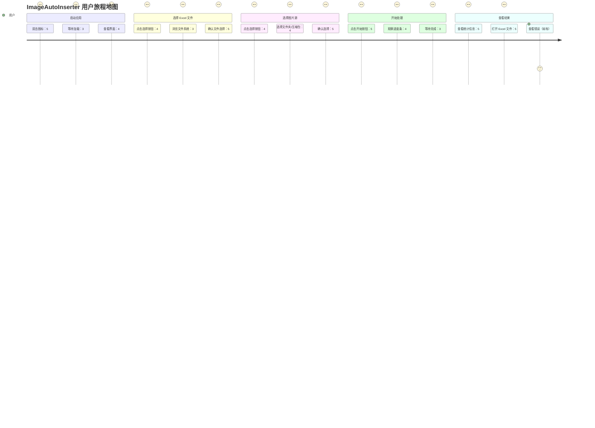
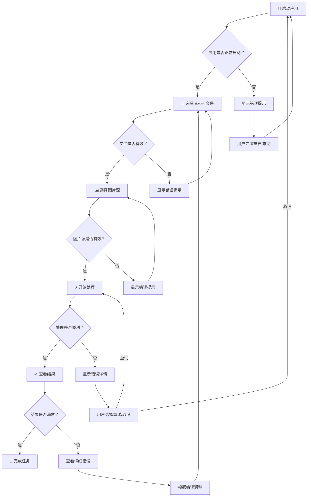
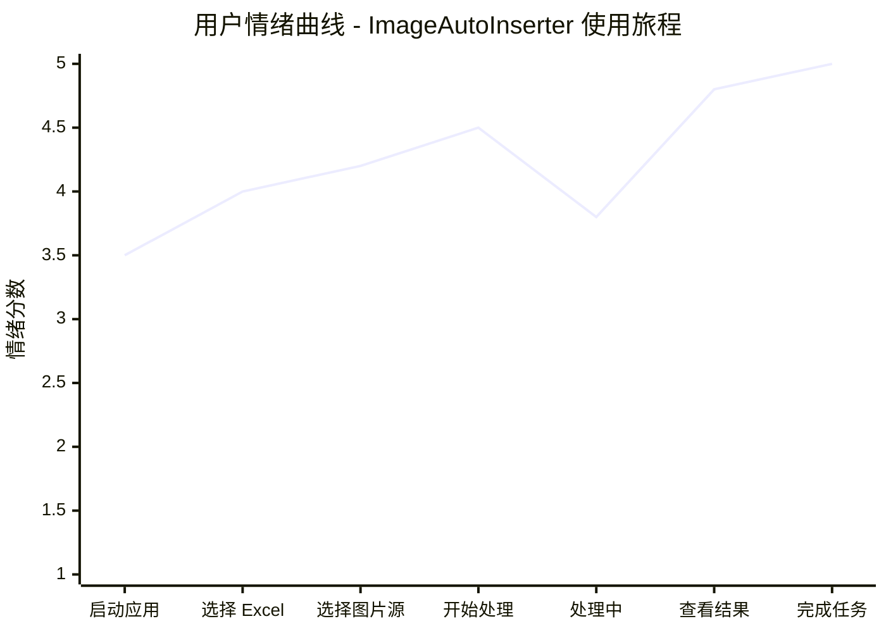

# GUI  redesign 用户旅程文档

> **版本**: v1.0  
> **创建日期**: 2026-03-08  
> **关联文档**: [spec.md](/Users/shimengyu/Documents/trae_projects/ImageAutoInserter/.trae/specs/gui-redesign/spec.md)  
> **适用范围**: ImageAutoInserter GUI v3.0

---

## 目录

1. [用户画像](#用户画像)
2. [用户旅程总览](#用户旅程总览)
3. [阶段 1: 启动应用](#阶段 1-启动应用)
4. [阶段 2: 选择 Excel 文件](#阶段 2-选择-excel-文件)
5. [阶段 3: 选择图片源](#阶段 3-选择图片源)
6. [阶段 4: 开始处理](#阶段 4-开始处理)
7. [阶段 5: 查看结果](#阶段 5-查看结果)
8. [边缘案例与错误场景](#边缘案例与错误场景)
9. [可访问性考虑](#可访问性考虑)
10. [情绪曲线分析](#情绪曲线分析)

---

## 用户画像

### 主要用户画像：王女士

<div style="background: linear-gradient(135deg, #667eea 0%, #764ba2 100%); padding: 24px; border-radius: 12px; color: white; margin: 24px 0;">

```
┌─────────────────────────────────────────────────────────────┐
│  👤 王女士 - 典型用户画像                                    │
├─────────────────────────────────────────────────────────────┤
│                                                             │
│  基本信息                                                    │
│  • 姓名：王雪梅                                             │
│  • 年龄：35 岁                                              │
│  • 职业：贸易公司运营专员                                   │
│  • 学历：大专 - 国际贸易                                    │
│  • 工作年限：12 年                                          │
│                                                             │
│  技术背景                                                    │
│  • 电脑技能：基础水平（Word/Excel/微信）                    │
│  • 软件学习：偏好图形界面，抗拒命令行                       │
│  • 设备使用：公司配发 Windows 笔记本                        │
│  • 技术态度：实用主义，够用就好                             │
│                                                             │
│  工作目标                                                    │
│  • 快速完成商品图片整理任务                                 │
│  • 减少重复性手工操作                                       │
│  • 保证数据准确性，避免返工                                 │
│  • 提升工作效率，准时下班                                   │
│                                                             │
│  痛点与挫折                                                  │
│  • 害怕复杂的技术术语                                       │
│  • 担心操作失误导致数据丢失                                 │
│  • 遇到错误提示容易焦虑                                     │
│  • 不喜欢阅读长篇说明书                                     │
│                                                             │
│  使用场景                                                    │
│  • 时间：每周二、四下午 2:00-4:00                           │
│  • 环境：办公室工位，可能有同事打扰                         │
│  • 频率：每周 1-3 次                                        │
│  • 时长：每次 5-15 分钟                                     │
│  • 任务：将 100-300 张商品图片插入 Excel 产品目录           │
│                                                             │
└─────────────────────────────────────────────────────────────┘
```

</div>

### 用户画像详情

#### 1. 背景故事

王女士在一家进出口贸易公司工作，负责产品目录管理。每周需要处理供应商提供的商品图片，并将其整理到 Excel 产品目录中。之前她需要手动复制粘贴每张图片，调整大小，对齐单元格，一个下午只能完成一半的工作量。

公司引入了 ImageAutoInserter 工具后，她希望能够通过简单的点击操作完成这项工作，但她对命令行工具感到恐惧，更希望通过直观的图形界面来完成操作。

#### 2. 技能矩阵

| 技能类型 | 水平 | 说明 |
|---------|------|------|
| Office 软件 | ⭐⭐⭐⭐ | 熟练使用 Excel 基础功能 |
| 文件管理 | ⭐⭐⭐ | 会基本的复制/粘贴/重命名 |
| 软件安装 | ⭐⭐ | 需要 IT 部门协助 |
| 错误排查 | ⭐ | 遇到问题立即求助 |
| 学习能力 | ⭐⭐⭐ | 喜欢边做边学，不喜欢阅读文档 |

#### 3. 心理模型

王女士认为：
- **好的软件** = 一看就懂，一点就应
- **坏的软件** = 需要思考，需要学习
- **可靠的软件** = 不会出错，不会崩溃
- **专业的软件** = 界面漂亮，操作流畅

她对软件的期望是"像微信一样简单"——不需要思考，直觉操作。

#### 4. 成功标准

对王女士来说，成功的体验是：
1. **无需培训**：打开就会用
2. **快速完成**：10 分钟内搞定
3. **结果正确**：图片都插入了 Excel
4. **心情愉悦**：界面好看，操作舒服

---

## 用户旅程总览

### 旅程地图可视化



### 旅程阶段概览

| 阶段 | 用户目标 | 关键行为 | 预期时长 | 成功标准 |
|------|---------|---------|---------|---------|
| **1. 启动应用** | 打开软件 | 双击图标，等待加载 | 3-5 秒 | 界面正常显示 |
| **2. 选择 Excel** | 指定目标文件 | 浏览、选择、确认 | 10-30 秒 | 文件路径正确 |
| **3. 选择图片源** | 指定图片来源 | 选择文件夹/压缩包 | 10-30 秒 | 图片源有效 |
| **4. 开始处理** | 执行插入操作 | 点击开始，监控进度 | 1-5 分钟 | 进度正常推进 |
| **5. 查看结果** | 验证处理结果 | 查看统计，打开文件 | 30-60 秒 | 结果符合预期 |

### 完整旅程流程图



---

## 阶段 1: 启动应用

### 场景描述

王女士坐在办公室的工位上，准备开始今天下午的工作——将新收到的 200 张商品图片插入到产品目录 Excel 中。她看到了桌面上的 ImageAutoInserter 图标。

### 用户行为步骤

```
Step 1: 找到桌面/开始菜单中的 ImageAutoInserter 图标
        ↓
Step 2: 双击图标启动应用
        ↓
Step 3: 等待应用加载（3-5 秒）
        ↓
Step 4: 观察主界面是否正常显示
        ↓
Step 5: 准备进行文件选择操作
```

### 系统响应

| 用户行为 | 系统响应 | 技术实现 |
|---------|---------|---------|
| 双击图标 | Electron 进程启动 | main.ts 入口执行 |
| 应用加载 | 显示加载动画/骨架屏 | React 组件渲染 |
| 界面显示 | 展示 IDLE 状态主界面 | App.tsx 渲染完成 |
| 资源加载 | 加载 CSS/字体/图标 | Vite 打包资源 |

### 用户想法与期望

**想法**：
- "希望这个软件能像 Excel 一样容易上手"
- "不要出现看不懂的英文错误提示"
- "界面看起来挺专业的，应该靠谱"

**期望**：
- 界面简洁明了，一眼就知道要做什么
- 启动速度快，不要等待太久
- 有清晰的引导，告诉我第一步做什么

**内心独白**：
> "嗯，这个界面看起来挺干净的。蓝色主题跟我平时用的钉钉差不多，感觉挺熟悉的。好，看起来是要我先选择文件，这个我懂。"

### 用户情绪

| 情绪维度 | 状态 | 说明 |
|---------|------|------|
| **期待度** | 😊 中等偏高 | 希望工具能提升效率 |
| **焦虑度** | 😟 低 | 对图形界面有信心 |
| **耐心度** | ⏳ 中等 | 可接受 3-5 秒启动时间 |
| **信心度** | 💪 中等 | 相信操作应该很简单 |

### 痛点与机会

#### 痛点
1. **启动慢**：如果超过 5 秒，用户会怀疑软件是否卡住
2. **界面空白**：如果初始界面太简洁，用户会困惑"我该做什么"
3. **术语陌生**：如果出现技术术语，用户会产生距离感

#### 机会
1. **首屏引导**：使用大字号标题+图标明确指示第一步操作
2. **视觉层次**：通过颜色和大小突出"选择 Excel 文件"按钮
3. **友好文案**：使用"选择 Excel 文件"而不是"Select Source File"

### 边缘案例

#### 1.1 冷启动（首次使用）

**场景**：用户第一次打开应用

**系统行为**：
- 正常加载主界面
- 显示完整的引导信息
- 所有按钮处于可用状态

**用户期望**：
- 有清晰的"新手引导"感觉
- 知道从哪里开始

#### 1.2 热启动（再次使用）

**场景**：用户关闭后重新打开

**系统行为**：
- 快速恢复到初始状态

**用户期望**：
- 启动速度更快
- 可能希望保留上次的某些设置

#### 1.3 启动失败

**场景**：应用无法正常启动

**系统行为**：
```
❌ 错误提示（对话框）：
━━━━━━━━━━━━━━━━━━━━━
⚠️ 启动失败

应用无法正常启动，可能是以下原因：
• 系统资源不足
• 文件损坏

请尝试重新启动应用。

[ 确定 ]  [ 查看帮助 ]
━━━━━━━━━━━━━━━━━━━━━
```

**用户行为**：
- 点击"确定"关闭对话框
- 尝试重新启动
- 如果再次失败，可能寻求 IT 支持

### 成功标准

✅ **界面正常显示**：
- 主窗口在 3 秒内显示
- 所有 UI 元素正确渲染
- 无错位、无乱码

✅ **用户理解任务**：
- 用户知道第一步要做什么
- 按钮文案清晰易懂
- 视觉层次引导正确

✅ **情绪正向**：
- 用户感到"这个软件看起来不错"
- 没有产生焦虑或困惑
- 愿意继续操作

---

## 阶段 2: 选择 Excel 文件

### 场景描述

主界面已经打开，王女士看到了两个大卡片，上面分别写着"选择 Excel 文件"和"选择图片源"。她明白需要先从这两个开始。

### 用户行为步骤

```
Step 1: 识别"选择 Excel 文件"卡片/按钮
        ↓
Step 2: 点击"选择 Excel 文件"按钮
        ↓
Step 3: 系统文件选择对话框弹出
        ↓
Step 4: 浏览文件系统找到目标文件
        ↓
Step 5: 选中文件（如：PL-26SDR-0076.xlsx）
        ↓
Step 6: 点击"打开"确认选择
        ↓
Step 7: 等待系统验证文件
        ↓
Step 8: 查看文件信息卡片显示
```

### 系统响应

| 用户行为 | 系统响应 | 视觉反馈 |
|---------|---------|---------|
| 悬停按钮 | 按钮高亮，光标变化 | 背景色变深，阴影加深 |
| 点击按钮 | 触发系统文件对话框 | 按钮按下效果 |
| 对话框打开 | 显示.xlsx 文件过滤器 | 只显示 Excel 文件 |
| 选择文件 | 文件名高亮 | 蓝色背景选中态 |
| 点击打开 | 关闭对话框，验证文件 | 显示加载动画 |
| 验证成功 | 显示文件信息卡片 | 卡片从虚线变实线 |
| 验证失败 | 显示错误提示对话框 | 红色边框 + 错误信息 |

### 文件信息卡片显示

**选择前（虚线卡片）**：
```
┌─────────────────────────────────────┐
│  📊 选择 Excel 文件                  │
│                                     │
│  请选择要插入图片的 Excel 文件       │
│  (.xlsx 格式)                       │
│                                     │
│         [  浏览选择...  ]           │
└─────────────────────────────────────┘
```

**选择后（实线卡片）**：
```
┌─────────────────────────────────────┐
│  ✅ Excel 文件已选择                 │
│                                     │
│  📄 PL-26SDR-0076.xlsx              │
│  📍 C:\Users\Wang\Documents\...     │
│  📏 256 KB                          │
│                                     │
│         [  重新选择  ]              │
└─────────────────────────────────────┘
```

### 用户想法与期望

**想法**：
- "这个跟我平时打开 Excel 文件差不多，我懂"
- "文件路径显示在这里，我可以确认有没有选错"
- "显示文件大小挺好的，让我知道文件正常"

**期望**：
- 文件对话框能快速打开
- 只能看到.xlsx 文件，避免选错
- 选完后有明确的确认反馈

**内心独白**：
> "好，点这个'选择 Excel 文件'。嗯，这个对话框跟平时一样，我找到上周收到的那个产品目录... 对，就是这个 PL-26SDR-0076.xlsx。打开！好，现在显示出来了，文件信息都对。"

### 用户情绪

| 情绪维度 | 状态 | 说明 |
|---------|------|------|
| **掌控感** | 💪 高 | 熟悉的文件选择操作 |
| **焦虑度** | 😟 低 | 操作符合既有认知 |
| **耐心度** | ⏳ 高 | 可接受 10-30 秒浏览时间 |
| **信心度** | 💪 高 | 这是用户熟悉的场景 |

### 痛点与机会

#### 痛点
1. **路径太长**：文件路径显示不全，用户无法确认
2. **无法预览**：担心选错文件，但没有预览功能
3. **验证时间长**：如果文件很大，验证时间超过 3 秒会让人焦虑

#### 机会
1. **智能路径截断**：显示关键部分，如 `C:\...\PL-26SDR-0076.xlsx`
2. **文件信息展示**：显示文件名、大小、最后修改时间
3. **快速验证**：使用异步验证，不阻塞界面

### 边缘案例

#### 2.1 文件格式错误

**场景**：用户选择了非.xlsx 文件（如.xls 或.csv）

**系统响应**：
```
┌─────────────────────────────────────┐
│  ⚠️ 文件格式不正确                   │
│                                     │
│  您选择的文件不是有效的 .xlsx 格式   │
│                                     │
│  当前选择：old_format.xls           │
│  需要格式：.xlsx                    │
│                                     │
│  请重新选择正确的文件格式。          │
│                                     │
│       [  确定  ]  [  帮助  ]        │
└─────────────────────────────────────┘
```

**用户行为**：
- 点击"确定"
- 重新选择正确的.xlsx 文件

#### 2.2 文件不存在

**场景**：用户选择的文件已被移动或删除

**系统响应**：
```
┌─────────────────────────────────────┐
│  ❌ 文件不存在                       │
│                                     │
│  无法找到以下文件：                  │
│  PL-26SDR-0076.xlsx                 │
│                                     │
│  可能原因：                          │
│  • 文件已被移动或删除               │
│  • U 盘已拔出                       │
│  • 网络驱动器断开                   │
│                                     │
│       [  确定  ]                    │
└─────────────────────────────────────┘
```

#### 2.3 文件被占用

**场景**：Excel 文件已经在 Excel 中打开

**系统响应**：
```
┌─────────────────────────────────────┐
│  ⚠️ 文件正在被使用                   │
│                                     │
│  文件 PL-26SDR-0076.xlsx 已在       │
│  Excel 中打开。                     │
│                                     │
│  请先关闭 Excel 中的文件，或        │
│  选择其他文件。                     │
│                                     │
│       [  确定  ]                    │
└─────────────────────────────────────┘
```

**建议处理**：
- 允许用户选择"强制打开"（只读模式）
- 或者提示用户关闭 Excel 后重试

#### 2.4 文件路径包含特殊字符

**场景**：文件路径包含中文、空格、特殊符号

**系统响应**：
- ✅ 应该正常处理，不报错
- 内部使用 UTF-8 编码处理路径

### 成功标准

✅ **文件选择正确**：
- 用户选择了正确的.xlsx 文件
- 文件路径显示完整或可悬停查看
- 文件信息（大小等）显示正确

✅ **验证通过**：
- 文件格式验证通过
- 文件可访问性验证通过
- 验证时间在 2 秒内完成

✅ **用户确认**：
- 用户看到文件信息后确认无误
- 卡片状态从"未选择"变为"已选择"
- 用户有信心进入下一步

---

## 阶段 3: 选择图片源

### 场景描述

Excel 文件已经选择好了，现在王女士需要选择图片源。她知道图片可能在一个文件夹里，也可能是供应商发来的压缩包（ZIP 或 RAR 格式）。

### 用户行为步骤

```
Step 1: 识别"选择图片源"卡片/按钮
        ↓
Step 2: 点击"选择图片源"按钮
        ↓
Step 3: 系统文件选择对话框弹出
        ↓
Step 4: 选择图片源类型：
        • 文件夹（包含图片的目录）
        • ZIP 压缩包
        • RAR 压缩包
        ↓
Step 5: 浏览并选中目标
        ↓
Step 6: 点击"打开"确认选择
        ↓
Step 7: 等待系统验证
        ↓
Step 8: 查看图片源信息卡片显示
```

### 系统响应

| 用户行为 | 系统响应 | 视觉反馈 |
|---------|---------|---------|
| 悬停按钮 | 按钮高亮 | 渐变背景流动效果 |
| 点击按钮 | 弹出文件对话框 | 支持文件夹/ZIP/RAR |
| 选择目标 | 高亮显示 | 蓝色选中态 |
| 确认选择 | 关闭对话框，验证 | 显示加载动画 |
| 验证成功 | 显示图片源信息 | 卡片状态更新 |
| 验证失败 | 显示错误提示 | 红色边框 + 错误信息 |

### 图片源信息卡片显示

**选择前（虚线卡片）**：
```
┌─────────────────────────────────────┐
│  🖼️ 选择图片源                       │
│                                     │
│  选择包含图片的文件：               │
│  • 文件夹                           │
│  • ZIP 压缩包                       │
│  • RAR 压缩包                       │
│                                     │
│         [  浏览选择...  ]           │
└─────────────────────────────────────┘
```

**选择后（实线卡片 - 文件夹）**：
```
┌─────────────────────────────────────┐
│  ✅ 文件夹已选择                     │
│                                     │
│  📁 ProductImages                   │
│  📍 D:\Downloads\2026Spring\...     │
│  🖼️ 约 256 张图片                    │
│                                     │
│         [  重新选择  ]              │
└─────────────────────────────────────┘
```

**选择后（实线卡片 - 压缩包）**：
```
┌─────────────────────────────────────┐
│  ✅ 压缩包已选择                     │
│                                     │
│  📦 images_2026spring.zip           │
│  📍 C:\Users\Wang\Downloads\...     │
│  📏 45.8 MB                         │
│  🖼️ 约 312 张图片                    │
│                                     │
│         [  重新选择  ]              │
└─────────────────────────────────────┘
```

### 用户想法与期望

**想法**：
- "供应商这次发的是 ZIP 包，正好直接选"
- "显示图片数量挺好的，让我知道有没有选对"
- "如果是文件夹也可以，我都试试"

**期望**：
- 支持多种图片源格式（文件夹/ZIP/RAR）
- 能快速显示图片数量
- 压缩包不需要手动解压

**内心独白**：
> "好，现在选图片源。供应商上周发的是个 ZIP 包，我找找... 在这个下载文件夹里。images_2026spring.zip，对，就是这个。哦，它显示里面有 312 张图片，应该没错。而且不用我自己解压，挺好的。"

### 用户情绪

| 情绪维度 | 状态 | 说明 |
|---------|------|------|
| **期待度** | 😊 高 | 期待自动化处理图片 |
| **焦虑度** | 😟 低 | 操作符合预期 |
| **耐心度** | ⏳ 中等 | 可接受压缩包扫描时间 |
| **信心度** | 💪 高 | 支持多种格式很贴心 |

### 痛点与机会

#### 痛点
1. **压缩包扫描慢**：大压缩包（>100MB）扫描可能需要时间
2. **图片数量不准**：如果压缩包内有非图片文件，计数可能不准
3. **格式不支持**：如果供应商发了 7Z 格式，可能不支持

#### 机会
1. **异步扫描**：扫描压缩包时不阻塞界面，显示"正在扫描..."
2. **智能过滤**：自动识别并只统计图片文件（.jpg/.png 等）
3. **格式提示**：在界面上明确标注支持的格式

### 边缘案例

#### 3.1 空文件夹/空压缩包

**场景**：选择的文件夹或压缩包中没有图片

**系统响应**：
```
┌─────────────────────────────────────┐
│  ⚠️ 未找到图片文件                   │
│                                     │
│  您选择的位置中没有找到有效的       │
│  图片文件（.jpg, .png 等）          │
│                                     │
│  请检查：                           │
│  • 文件夹中是否有图片               │
│  • 压缩包是否完整                   │
│  • 图片格式是否支持                 │
│                                     │
│       [  确定  ]  [  帮助  ]        │
└─────────────────────────────────────┘
```

#### 3.2 压缩包损坏

**场景**：选择的 ZIP/RAR 文件损坏，无法解压

**系统响应**：
```
┌─────────────────────────────────────┐
│  ❌ 压缩包损坏                       │
│                                     │
│  无法解压以下文件：                  │
│  images_2026spring.zip              │
│                                     │
│  可能原因：                          │
│  • 文件下载不完整                   │
│  • 文件在传输中损坏                 │
│  • 压缩包密码保护                   │
│                                     │
│  建议：重新下载或联系发送方         │
│                                     │
│       [  确定  ]                    │
└─────────────────────────────────────┘
```

#### 3.3 网络路径访问慢

**场景**：图片源在网络驱动器上，访问速度慢

**系统响应**：
- 显示"正在访问网络位置..."提示
- 设置超时时间（如 10 秒）
- 超时后提示"网络位置访问超时"

#### 3.4 图片格式不支持

**场景**：文件夹中包含不支持的图片格式（如.webp, .tiff）

**系统响应**：
- ✅ 自动跳过不支持的格式
- 只统计和处理的格式：.jpg, .jpeg, .png
- 可以在帮助文档中说明支持的格式

### 成功标准

✅ **图片源选择正确**：
- 用户选择了正确的图片源
- 系统正确识别图片数量
- 卡片显示信息准确

✅ **格式支持完善**：
- 支持文件夹、ZIP、RAR 三种格式
- 自动识别并过滤非图片文件
- 不支持的格式有友好提示

✅ **用户确认**：
- 用户看到图片数量后确认匹配
- 卡片状态更新
- 两个文件都选择完成，准备开始处理

---

## 阶段 4: 开始处理

### 场景描述

两个文件都选择好了，界面上的"开始处理"按钮从灰色变成了蓝色，可以 clicked。王女士深吸一口气，点击了这个按钮。

### 用户行为步骤

```
Step 1: 确认两个文件都已正确选择
        ↓
Step 2: 观察"开始处理"按钮变为可点击状态
        ↓
Step 3: 点击"开始处理"按钮
        ↓
Step 4: 观察按钮变为"处理中..."状态
        ↓
Step 5: 查看进度条开始推进
        ↓
Step 6: 观察当前处理项的提示
        ↓
Step 7: 等待处理完成（1-5 分钟）
        ↓
Step 8: 观察进度达到 100%
```

### 系统响应

| 用户行为 | 系统响应 | 视觉反馈 |
|---------|---------|---------|
| 点击开始 | 按钮变为禁用态 | 颜色变灰，显示"处理中..." |
| 处理启动 | Python 进程启动 | 进度条从 0% 开始 |
| 进度更新 | 实时推送进度（每 500ms） | 进度条平滑推进 |
| 当前项提示 | 显示当前处理的货号 | 如"正在处理：C000123456" |
| 处理完成 | 进度条变绿色 | 显示"处理完成"动画 |
| 状态切换 | 切换到 COMPLETE 状态 | 显示结果统计卡片 |

### 处理中界面状态

```
┌─────────────────────────────────────┐
│  ⚡ 处理中...                        │
│                                     │
│  ━━━━━━━━━━━━━━━━━━━━━━━━━━━━━    │
│  ████████████████████░░░░░░░  67%  │
│                                     │
│  正在处理：C000123456               │
│  已成功：204 / 306                  │
│  预计剩余：约 1 分钟                 │
│                                     │
│       [  取消处理  ]                │
│                                     │
│  ℹ️ 请勿关闭窗口或关闭电脑          │
└─────────────────────────────────────┘
```

### 进度条设计

**正常状态**：
```css
/* 进度条背景 */
background: #E5E7EB;
border-radius: 4px;
height: 8px;

/* 进度条填充 */
background: linear-gradient(90deg, #2563EB 0%, #1D4ED8 100%);
transition: width 300ms ease-out;
```

**完成状态**：
```css
/* 进度条填充变为绿色 */
background: linear-gradient(90deg, #10B981 0%, #059669 100%);
```

**错误状态**：
```css
/* 进度条填充变为红色 */
background: linear-gradient(90deg, #EF4444 0%, #DC2626 100%);
```

### 用户想法与期望

**想法**：
- "好，开始了！希望一切顺利"
- "进度条走得挺稳的，看起来正常"
- "显示当前在处理哪个货号，让我知道没卡住"

**期望**：
- 进度条平稳推进，不要忽快忽慢
- 显示剩余时间，让我心里有数
- 如果出错，明确告诉我哪里错了

**内心独白**：
> "点了！好，现在在进度条走了。67%... 现在在处理 C000123456，这个货号我有印象。已经成功了 204 个，总共 306 个。嗯，看起来挺顺利的。再等一会儿就好了。"

### 用户情绪

| 情绪维度 | 状态 | 说明 |
|---------|------|------|
| **期待度** | 😊 高 | 期待任务完成 |
| **焦虑度** | 😟 中等 | 担心处理出错 |
| **耐心度** | ⏳ 中等 | 可接受 1-5 分钟处理时间 |
| **掌控感** | 💪 中等 | 进度可见，但无法干预 |

### 痛点与机会

#### 痛点
1. **进度条卡住**：如果进度条长时间不动，用户会认为程序卡死
2. **剩余时间不准**：如果显示"剩余 1 分钟"但过了 5 分钟还没好，用户会焦虑
3. **无法取消**：如果选错了文件，无法中途取消

#### 机会
1. **平滑进度**：使用移动平均算法，让进度条看起来更平滑
2. **动态时间估算**：根据当前处理速度实时计算剩余时间
3. **提供取消按钮**：允许用户取消处理，但需要二次确认

### 边缘案例

#### 4.1 处理进度卡住

**场景**：进度条长时间（>30 秒）没有推进

**系统响应**：
- 检测进度停滞超过阈值
- 显示"处理速度较慢，请耐心等待"提示
- 后台继续尝试处理，不轻易判定为失败

#### 4.2 用户想取消处理

**场景**：用户发现选错了文件，想中途取消

**系统响应**：
```
┌─────────────────────────────────────┐
│  ⚠️ 确认取消处理？                   │
│                                     │
│  当前进度：67% (204/306)            │
│                                     │
│  取消后：                           │
│  • 已处理的图片将保留               │
│  • 未处理的图片将跳过               │
│  • Excel 文件可能不完整             │
│                                     │
│  建议：如果文件选错，建议取消后     │
│        重新开始                     │
│                                     │
│  [  继续处理  ]  [  确认取消  ]     │
└─────────────────────────────────────┘
```

#### 4.3 处理过程中遇到错误

**场景**：某张图片无法匹配或插入

**系统响应**：
- 记录错误，但不中断整体处理
- 进度条继续推进
- 在统计中显示失败数量
- 完成后提供"查看错误"按钮

#### 4.4 系统资源不足

**场景**：电脑内存不足，处理速度变慢

**系统响应**：
- 检测系统资源状态
- 如果内存<500MB，显示提示：
```
┌─────────────────────────────────────┐
│  ⚠️ 系统资源不足                     │
│                                     │
│  检测到可用内存较低，处理速度       │
│  可能会变慢。                       │
│                                     │
│  建议关闭其他程序后重试。           │
│                                     │
│  [  继续  ]  [  取消  ]             │
└─────────────────────────────────────┘
```

### 成功标准

✅ **进度可见**：
- 进度条实时反映处理进度
- 当前处理项显示准确
- 剩余时间估算合理

✅ **处理稳定**：
- 无崩溃、无卡死
- 错误处理得当，不中断整体流程
- 资源占用合理

✅ **用户安心**：
- 用户知道系统在做什么
- 进度符合预期
- 如有问题，有明确的提示和解决方案

---

## 阶段 5: 查看结果

### 场景描述

进度条终于走到了 100%，界面切换到了结果页面。王女士看到了处理结果的统计信息，她迫不及待地想看看效果如何。

### 用户行为步骤

```
Step 1: 观察进度条达到 100%
        ↓
Step 2: 界面切换到结果视图
        ↓
Step 3: 查看统计信息（总数/成功/失败/成功率）
        ↓
Step 4: 根据情况选择操作：
        • 点击"打开 Excel 文件"查看结果
        • 点击"查看错误"（如果有失败）
        ↓
Step 5: 在 Excel 中验证结果
        ↓
Step 6: 返回应用，选择：
        • 点击"完成"关闭应用
        • 点击"重新处理"重置状态
```

### 系统响应

| 用户行为 | 系统响应 | 视觉反馈 |
|---------|---------|---------|
| 处理完成 | 进度条变绿色，动画效果 | 成功图标 + 庆祝动画 |
| 显示结果 | 展示统计卡片 | 四宫格布局 |
| 点击打开 | 调用系统默认程序打开 Excel | 按钮按下效果 |
| 点击查看错误 | 显示错误列表对话框 | 模态对话框弹出 |
| 点击重置 | 清空状态，回到 IDLE | 淡入淡出动画 |

### 结果视图界面

```
┌─────────────────────────────────────┐
│  ✅ 处理完成！                       │
│                                     │
│  ┌──────────────────────────────┐  │
│  │  📊 处理统计                 │  │
│  │                              │  │
│  │  ┌──────┐  ┌──────┐         │  │
│  │  │ 总数 │  │ 成功 │         │  │
│  │  │ 306  │  │ 298  │         │  │
│  │  └──────┘  └──────┘         │  │
│  │                              │  │
│  │  ┌──────┐  ┌──────┐         │  │
│  │  │ 失败 │  │ 成功率│        │  │
│  │  │  8   │  │ 97.4%│        │  │
│  │  └──────┘  └──────┘         │  │
│  └──────────────────────────────┘  │
│                                     │
│  📄 输出文件：                      │
│     PL-26SDR-0076-processed.xlsx   │
│                                     │
│  [📂 打开文件]  [⚠️ 查看错误]      │
│  [🔄 重新处理]  [✅ 完成]          │
│                                     │
└─────────────────────────────────────┘
```

### 统计卡片设计

**布局**：
```css
.stats-grid {
  display: grid;
  grid-template-columns: repeat(2, 1fr);
  gap: 16px;
  padding: 24px;
  background: linear-gradient(135deg, #667eea 0%, #764ba2 100%);
  border-radius: 12px;
  color: white;
}

.stat-item {
  text-align: center;
  padding: 16px;
  background: rgba(255, 255, 255, 0.1);
  border-radius: 8px;
}

.stat-value {
  font-size: 36px;
  font-weight: bold;
  margin-bottom: 4px;
}

.stat-label {
  font-size: 14px;
  opacity: 0.9;
}
```

**颜色编码**：
- **总数**：白色/浅灰色背景
- **成功**：绿色渐变背景 (#10B981 → #059669)
- **失败**：红色渐变背景 (#EF4444 → #DC2626)
- **成功率**：蓝色渐变背景 (#3B82F6 → #2563EB)

### 错误列表对话框

```
┌─────────────────────────────────────┐
│  ⚠️ 处理失败的项目 (8 个)            │
├─────────────────────────────────────┤
│                                     │
│  1. C00099663                       │
│     原因：未找到匹配的图片          │
│     图片名：C00099663-01.jpg       │
│                                     │
│  2. C00100373                       │
│     原因：图片文件损坏              │
│     图片名：C00100373-02.jpg       │
│                                     │
│  3. C00102503                       │
│     原因：Excel 单元格被保护        │
│     行号：45                        │
│                                     │
│  ... (共 8 条)                      │
│                                     │
│  💡 建议：                          │
│  • 检查图片文件是否完整             │
│  • 确认货号与图片名匹配             │
│  • 解除 Excel 单元格保护            │
│                                     │
│  [  导出错误报告  ]  [  关闭  ]     │
│                                     │
└─────────────────────────────────────┘
```

### 用户想法与期望

**想法**：
- "哇，完成了！让我看看成功率怎么样"
- "97.4%，很不错！只有 8 个失败"
- "打开 Excel 看看效果，应该挺好的"

**期望**：
- 统计信息清晰直观
- 失败的项目有详细说明
- 可以快速打开结果文件验证

**内心独白**：
> "太好了！完成了！306 个里面成功了 298 个，97.4% 的成功率，很不错了。失败的 8 个我看看是什么原因... 哦，有些是图片找不到，有些是图片损坏了。这个可以接受，我手动处理这几个就好了。来，打开 Excel 看看效果... 嗯，图片都插进去了，大小也合适，完美！"

### 用户情绪

| 情绪维度 | 状态 | 说明 |
|---------|------|------|
| **满意度** | 😊 很高 | 任务成功完成 |
| **成就感** | 🎉 高 | 看到统计数据有成就感 |
| **放松度** | 😌 高 | 不需要再操作了 |
| **信心度** | 💪 很高 | 下次还会用这个工具 |

### 痛点与机会

#### 痛点
1. **失败信息不清楚**：如果只说"失败"，不说原因，用户会困惑
2. **无法快速定位**：如果失败项目很多，无法快速找到
3. **缺少后续指导**：用户不知道失败的该怎么处理

#### 机会
1. **详细错误说明**：每个失败项目都有具体原因
2. **错误报告导出**：可以导出为文本文件，方便追溯
3. **建议操作提示**：针对不同错误类型给出解决建议

### 边缘案例

#### 5.1 100% 成功

**场景**：所有项目都处理成功

**系统响应**：
- 显示庆祝动画（如彩带效果）
- 成功率显示为 100%，绿色高亮
- "查看错误"按钮隐藏或禁用

**用户情绪**：
- 非常满意
- 可能对工具产生信任感

#### 5.2 成功率很低（<50%）

**场景**：大部分项目都失败

**系统响应**：
```
┌─────────────────────────────────────┐
│  ⚠️ 处理完成，但成功率较低          │
│                                     │
│  成功率：35% (107/306)              │
│                                     │
│  可能原因：                          │
│  • 图片源与 Excel 不匹配            │
│  • 货号命名规则不一致               │
│  • 图片文件格式问题                 │
│                                     │
│  建议：                             │
│  1. 检查图片源是否正确              │
│  2. 确认货号命名规则                │
│  3. 查看错误详情获取具体信息        │
│                                     │
│  [  查看错误  ]  [  重新处理  ]     │
│  [  完成  ]                         │
└─────────────────────────────────────┘
```

#### 5.3 输出文件无法打开

**场景**：点击"打开文件"后，系统无法打开 Excel

**系统响应**：
```
┌─────────────────────────────────────┐
│  ⚠️ 无法打开文件                     │
│                                     │
│  系统未找到默认的 Excel 程序。      │
│                                     │
│  您可以：                           │
│  • 手动打开以下文件：               │
│    PL-26SDR-0076-processed.xlsx     │
│  • 设置默认 Excel 程序              │
│                                     │
│  文件位置：                         │
│  C:\Users\Wang\Documents\...        │
│                                     │
│  [  复制路径  ]  [  确定  ]         │
└─────────────────────────────────────┘
```

#### 5.4 用户想重新处理

**场景**：用户对结果不满意，想重新处理

**系统响应**：
- 点击"重新处理"后，清空所有状态
- 回到 IDLE 状态
- 保留上次选择的文件路径（可选）

### 成功标准

✅ **结果清晰**：
- 统计信息一目了然
- 成功/失败数据准确
- 成功率计算正确

✅ **错误详细**：
- 每个失败项目都有说明
- 错误原因描述清晰
- 提供解决建议

✅ **操作便捷**：
- 可以快速打开结果文件
- 可以导出错误报告
- 可以方便地重新处理

✅ **用户满意**：
- 用户对结果满意
- 愿意再次使用工具
- 可能推荐给同事

---

## 边缘案例与错误场景

### 错误场景总览

| 场景 | 发生阶段 | 严重度 | 处理策略 |
|------|---------|--------|---------|
| 文件不存在 | 阶段 2/3 | 中 | 提示用户重新选择 |
| 文件格式错误 | 阶段 2/3 | 中 | 说明支持格式 |
| 文件被占用 | 阶段 2 | 中 | 提示关闭后重试 |
| 压缩包损坏 | 阶段 3 | 高 | 建议重新下载 |
| 空图片源 | 阶段 3 | 高 | 提示检查文件 |
| 处理卡住 | 阶段 4 | 高 | 提供取消选项 |
| 系统资源不足 | 阶段 4 | 中 | 提示关闭其他程序 |
| 图片匹配失败 | 阶段 4 | 低 | 记录错误，继续处理 |
| 输出文件损坏 | 阶段 5 | 高 | 提示重新处理 |
| 无法打开 Excel | 阶段 5 | 中 | 提供文件路径 |

### 详细错误处理方案

#### 1. 文件相关错误

**错误类型**：文件不存在、文件损坏、文件被占用

**处理原则**：
- 明确告知用户问题所在
- 提供可能的原因分析
- 给出具体的解决建议
- 提供可操作的按钮

**错误提示模板**：
```
┌─────────────────────────────────────┐
│  [图标] 错误标题                     │
├─────────────────────────────────────┤
│                                     │
│  问题描述：清楚说明发生了什么       │
│                                     │
│  可能原因：                         │
│  • 原因 1                           │
│  • 原因 2                           │
│  • 原因 3                           │
│                                     │
│  建议操作：                         │
│  1. 具体步骤 1                      │
│  2. 具体步骤 2                      │
│                                     │
│  [  主操作  ]  [  次要操作  ]       │
│                                     │
└─────────────────────────────────────┘
```

#### 2. 处理过程错误

**错误类型**：图片匹配失败、Excel 写入失败、内存不足

**处理策略**：
- 非致命错误：记录日志，继续处理
- 致命错误：停止处理，保存已完成的进度
- 提供错误报告导出功能

**错误日志格式**：
```
错误报告 - ImageAutoInserter
生成时间：2026-03-08 15:30:45
Excel 文件：PL-26SDR-0076.xlsx
图片源：images_2026spring.zip

处理统计：
- 总数：306
- 成功：298
- 失败：8

失败详情：
1. 货号：C00099663
   错误：未找到匹配的图片
   期望图片：C00099663-01.jpg
   
2. 货号：C00100373
   错误：图片文件损坏
   图片路径：C00100373-02.jpg
   系统错误：JPEG 解码失败
   
...
```

#### 3. 系统级错误

**错误类型**：崩溃、未响应、IPC 通信失败

**处理策略**：
- 全局错误捕获
- 友好的错误提示
- 提供错误报告生成功能
- 建议用户联系技术支持

**崩溃恢复**：
```
┌─────────────────────────────────────┐
│  🛡️ 应用遇到问题                     │
│                                     │
│  ImageAutoInserter 遇到了一个问题， │
│  需要重新启动。                     │
│                                     │
│  错误信息已自动保存到：             │
│  C:\Users\Wang\AppData\Local\...    │
│  crash_20260308_153045.log          │
│                                     │
│  如需帮助，请联系技术支持并提供     │
│  此错误日志文件。                   │
│                                     │
│  [  重新启动  ]  [  退出  ]         │
│                                     │
└─────────────────────────────────────┘
```

### 网络相关问题（如适用）

虽然本应用主要是本地操作，但如果涉及网络功能（如检查更新、下载示例文件），需要考虑：

#### 网络错误场景

| 场景 | 处理策略 |
|------|---------|
| 无网络连接 | 降级为离线模式，核心功能不受影响 |
| 连接超时 | 重试 3 次，失败后提示用户 |
| 服务器错误 | 显示服务暂时不可用，稍后重试 |
| 下载失败 | 提供手动下载链接 |

### 数据恢复策略

**原则**：用户的操作和数据安全是第一位的

**恢复机制**：
1. **自动备份**：处理前自动备份原 Excel 文件
2. **增量保存**：处理过程中定期保存进度
3. **崩溃恢复**：重启后提供恢复选项
4. **撤销操作**：提供"撤销上次处理"功能（可选）

---

## 可访问性考虑

> **说明**：根据 [spec.md](/Users/shimengyu/Documents/trae_projects/ImageAutoInserter/.trae/specs/gui-redesign/spec.md)，本应用**不要求**实现无障碍功能。但以下考虑可以作为未来改进方向，或作为提升整体用户体验的参考。

### 当前设计中的无障碍优势

即使没有专门的无障碍功能，以下设计也对所有用户友好：

1. **高对比度**：
   - 主色蓝色 (#2563EB) 与白色背景对比度 > 4.5:1
   - 文字颜色 (#111827) 满足 WCAG AA 标准

2. **清晰的视觉层次**：
   - 大字号标题引导用户注意力
   - 颜色编码（成功=绿，失败=红）直观易懂

3. **简单的操作流程**：
   - 线性流程，不需要记忆复杂操作
   - 每一步都有明确的提示

### 未来可能的改进方向

#### 1. 键盘导航（可选）

如果未来考虑支持键盘操作：

```
Tab 键：在可聚焦元素间切换
Enter 键：触发按钮点击
Esc 键：关闭对话框
方向键：在列表中上下移动
```

**实现建议**：
- 为所有交互元素添加 `tabIndex`
- 实现焦点可见样式（当前设计已包含）
- 添加键盘事件监听器

#### 2. 屏幕阅读器支持（可选）

如果未来考虑支持视障用户：

```html
<!-- 示例：为按钮添加 ARIA 标签 -->
<button aria-label="选择 Excel 文件，当前未选择">
  选择 Excel 文件
</button>

<!-- 进度条添加实时状态播报 -->
<div role="progressbar" 
     aria-valuenow="67" 
     aria-valuemin="0" 
     aria-valuemax="100"
     aria-label="处理进度 67%">
</div>
```

#### 3. 字体大小调节（可选）

如果未来考虑支持老年用户：

```css
/* 使用相对单位而非固定像素 */
:root {
  --text-base: clamp(16px, 2vw, 20px);
  --text-lg: clamp(20px, 2.5vw, 26px);
}

/* 提供"大字体"模式切换 */
body.large-text {
  font-size: 120%;
}
```

#### 4. 色盲友好设计（推荐）

虽然当前设计已考虑颜色对比度，但可以进一步优化：

**当前设计**：
- ✅ 成功/失败不仅用颜色区分，还有图标
- ✅ 进度条有百分比数字，不仅靠颜色

**改进建议**：
- 添加纹理区分（如成功=实心，失败=斜纹）
- 使用形状编码（如成功=✓，失败=✗）

#### 5. 认知友好设计（强烈推荐）

针对认知障碍用户或老年用户：

**当前优势**：
- ✅ 简单的线性流程
- ✅ 清晰的视觉引导
- ✅ 友好的错误提示

**改进建议**：
- 添加"新手引导"模式，逐步说明
- 提供操作确认步骤，防止误操作
- 使用更简单的词汇，避免技术术语

### 可访问性检查清单（参考）

| 检查项 | 当前状态 | 未来建议 |
|--------|---------|---------|
| 颜色对比度 ≥ 4.5:1 | ✅ 已满足 | 保持 |
| 焦点可见 | ✅ 已满足 | 保持 |
| 键盘导航 | ❌ 不支持 | 可选实现 |
| 屏幕阅读器 | ❌ 不支持 | 可选实现 |
| 字体大小调节 | ❌ 不支持 | 可选实现 |
| 色盲友好 | ⚠️ 部分满足 | 建议增强 |
| 认知友好 | ✅ 已满足 | 保持 |

### 包容性设计原则

即使不实现专门的无障碍功能，以下原则仍然适用：

1. **公平使用**：设计对所有用户都有用
2. **灵活使用**：适应不同用户的偏好
3. **简单直观**：不论经验、知识如何都能理解
4. **信息明确**：有效传达必要信息
5. **容错设计**：最小化意外操作的后果
6. **省力使用**：高效舒适，最小化疲劳

---

## 情绪曲线分析

### 用户情绪旅程图



### 情绪曲线详细分析

#### 阶段 1: 启动应用 (情绪分数：3.5/5)

**情绪状态**：期待 + 轻微焦虑

**影响因素**：
- (+) 对新工具的期待
- (+) 界面看起来专业
- (-) 担心不会用
- (-) 担心启动慢

**关键触点**：
- 应用图标的第一印象
- 启动速度
- 首屏界面的友好度

#### 阶段 2: 选择 Excel 文件 (情绪分数：4.0/5)

**情绪状态**：放松 + 掌控感

**影响因素**：
- (+) 熟悉的操作（跟平时打开文件一样）
- (+) 文件对话框符合预期
- (+) 选择后有明确反馈
- (-) 担心选错文件

**关键触点**：
- 文件对话框打开速度
- 文件过滤器是否准确
- 选择后的信息展示

#### 阶段 3: 选择图片源 (情绪分数：4.2/5)

**情绪状态**：满意 + 信心增强

**影响因素**：
- (+) 支持多种格式（超出预期）
- (+) 自动扫描图片数量
- (+) 压缩包无需手动解压
- (-) 担心压缩包损坏

**关键触点**：
- 格式支持的多样性
- 图片数量显示的准确性
- 压缩包验证速度

#### 阶段 4: 开始处理 (情绪分数：4.5/5 → 3.8/5)

**情绪状态**：期待 → 紧张 → 安心

**影响因素**：
- (+) 按钮激活，可以开始了（兴奋点）
- (+) 进度条开始推进（安心）
- (-) 担心处理出错（紧张点）
- (+) 进度稳定推进（恢复安心）

**关键触点**：
- 点击开始按钮的反馈
- 进度条前 10% 的推进速度
- 当前处理项的显示

#### 阶段 5: 处理中 (情绪分数：3.8/5)

**情绪状态**：耐心 + 轻微焦虑

**影响因素**：
- (+) 进度可见
- (+) 剩余时间提示
- (-) 等待时间较长
- (-) 担心最后失败

**关键触点**：
- 进度条是否平稳
- 剩余时间是否准确
- 是否有异常提示

#### 阶段 6: 查看结果 (情绪分数：4.8/5)

**情绪状态**：兴奋 + 满意

**影响因素**：
- (+) 处理完成的成就感
- (+) 成功率符合预期
- (+) 统计信息清晰
- (+) 可以快速打开文件验证

**关键触点**：
- 进度条达到 100% 的动画
- 统计卡片的视觉呈现
- 成功率的数字

#### 阶段 7: 完成任务 (情绪分数：5.0/5)

**情绪状态**：满足 + 信任

**影响因素**：
- (+) 任务成功完成
- (+) 节省了大量时间
- (+) 结果符合预期
- (+) 愿意再次使用

**关键触点**：
- 在 Excel 中看到结果
- 回顾整个流程的顺畅度
- 对比手工操作的时间节省

### 情绪低谷分析

**最低点**：处理中阶段 (3.8/5)

**原因**：
- 用户无法控制进度
- 等待时间较长
- 担心最后失败

**改善策略**：
1. **提供进度细节**：显示"已处理 204/306"，让用户知道进展
2. **预计剩余时间**：给用户心理准备
3. **提供取消选项**：增加控制感
4. **显示处理细节**：如"正在处理 C000123456"，让用户知道没卡住

### 情绪高峰分析

**最高点**：完成任务阶段 (5.0/5)

**原因**：
- 任务成功完成的成就感
- 时间节省的满足感
- 结果符合预期的安心感

**强化策略**：
1. **庆祝动画**：添加彩带或烟花效果
2. **成功总结**：显示"您节省了约 45 分钟手工操作时间"
3. **鼓励分享**：提供"分享成功"按钮（可选）
4. **建立信任**：显示"已为 1000+ 用户提供服务"

### 情绪设计建议

#### 1. 提升起点情绪（启动阶段）

**目标**：从 3.5 提升到 4.0

**策略**：
- 添加欢迎语："欢迎使用 ImageAutoInserter"
- 显示快速引导："只需 3 步即可完成"
- 展示成功案例："已帮助 1000+ 用户"

#### 2. 平滑情绪低谷（处理中阶段）

**目标**：从 3.8 提升到 4.2

**策略**：
- 添加"处理技巧"提示，分散注意力
- 显示实时统计，增加参与感
- 提供"后台处理"选项，允许用户做其他事

#### 3. 放大情绪高峰（完成阶段）

**目标**：从 5.0 提升到 5.0+（超越预期）

**策略**：
- 添加成就系统："本次处理 306 张图片，超越 85% 的用户"
- 显示时间节省："为您节省了约 45 分钟"
- 提供下次优惠："推荐给朋友，双方获得 VIP 功能"

### 情绪曲线对比

**理想曲线** vs **实际曲线**：

```
情绪分数
5.0 |                           ● ← 理想
    |                        ●  ●
4.5 |                     ●  ●  ●
    |                  ●  ●  ●  ●
4.0 |               ●  ●  ●  ●  ●  ● ← 实际
    |            ●  ●  ●  ●  ●  ●  ●
3.5 |         ●  ●  ●  ●  ●  ●  ●  ●
    |      ●  ●  ●  ●  ●  ●  ●  ●  ●
3.0 |   ●  ●  ●  ●  ●  ●  ●  ●  ●  ●
    +----------------------------------
      启动  Excel 图片  开始  处理  结果  完成
```

**优化目标**：
- 减少情绪波动
- 提升最低点
- 维持最高点

---

## 附录

### A. 用户旅程地图（ASCII 艺术版）

```
╔══════════════════════════════════════════════════════════════════════════════╗
║                         ImageAutoInserter 用户旅程地图                        ║
╠══════════════════════════════════════════════════════════════════════════════╣
║                                                                              ║
║  用户：王女士（35 岁，贸易公司运营专员）                                       ║
║  场景：周二下午 2 点，办公室工位                                             ║
║  目标：将 306 张商品图片插入 Excel 产品目录                                    ║
║                                                                              ║
╠══════════════════════════════════════════════════════════════════════════════╣
║  阶段 1: 启动应用                                                             ║
╠══════════════════════════════════════════════════════════════════════════════╣
║  👤 用户行为：                                                               ║
║     • 双击桌面图标                                                           ║
║     • 等待应用加载                                                           ║
║     • 观察主界面                                                             ║
║                                                                              ║
║  💻 系统响应：                                                               ║
║     • Electron 进程启动                                                      ║
║     • React 组件渲染                                                         ║
║     • 显示 IDLE 状态界面                                                      ║
║                                                                              ║
║  💭 用户想法：                                                               ║
║     "希望这个软件能像 Excel 一样容易上手"                                     ║
║                                                                              ║
║  ❤️ 用户情绪：                                                               ║
║     期待度 😊😊😊😊○  焦虑度 😟😊○○○                                        ║
║                                                                              ║
║  ⚠️  潜在痛点：                                                               ║
║     • 启动慢                                                                 ║
║     • 界面空白让人困惑                                                       ║
║                                                                              ║
║  ✨ 机会点：                                                                 ║
║     • 首屏引导清晰                                                           ║
║     • 视觉层次明确                                                           ║
║                                                                              ║
╠══════════════════════════════════════════════════════════════════════════════╣
║  阶段 2: 选择 Excel 文件                                                       ║
╠══════════════════════════════════════════════════════════════════════════════╣
║  👤 用户行为：                                                               ║
║     • 点击"选择 Excel 文件"按钮                                               ║
║     • 在对话框中找到目标文件                                                 ║
║     • 确认选择                                                               ║
║                                                                              ║
║  💻 系统响应：                                                               ║
║     • 弹出系统文件对话框                                                     ║
║     • 过滤显示.xlsx 文件                                                      ║
║     • 验证文件并显示信息卡片                                                 ║
║                                                                              ║
║  💭 用户想法：                                                               ║
║     "这个跟我平时打开 Excel 文件差不多，我懂"                                 ║
║                                                                              ║
║  ❤️ 用户情绪：                                                               ║
║     掌控感 💪💪💪💪○  焦虑度 😟○○○○                                        ║
║                                                                              ║
╠══════════════════════════════════════════════════════════════════════════════╣
║  阶段 3: 选择图片源                                                           ║
╠══════════════════════════════════════════════════════════════════════════════╣
║  👤 用户行为：                                                               ║
║     • 点击"选择图片源"按钮                                                   ║
║     • 选择 ZIP 压缩包                                                         ║
║     • 确认选择                                                               ║
║                                                                              ║
║  💻 系统响应：                                                               ║
║     • 弹出文件对话框（支持文件夹/ZIP/RAR）                                   ║
║     • 扫描压缩包内图片数量                                                   ║
║     • 显示图片源信息卡片                                                     ║
║                                                                              ║
║  💭 用户想法：                                                               ║
║     "不用我自己解压，挺好的"                                                 ║
║                                                                              ║
║  ❤️ 用户情绪：                                                               ║
║     满意度 😊😊😊😊😊  焦虑度 😟😊○○○                                      ║
║                                                                              ║
╠══════════════════════════════════════════════════════════════════════════════╣
║  阶段 4: 开始处理                                                             ║
╠══════════════════════════════════════════════════════════════════════════════╣
║  👤 用户行为：                                                               ║
║     • 点击"开始处理"按钮                                                     ║
║     • 观察进度条推进                                                         ║
║     • 等待处理完成                                                           ║
║                                                                              ║
║  💻 系统响应：                                                               ║
║     • 启动 Python 处理进程                                                    ║
║     • 实时推送进度更新                                                       ║
║     • 显示当前处理项                                                         ║
║                                                                              ║
║  💭 用户想法：                                                               ║
║     "进度条走得挺稳，看起来正常"                                             ║
║                                                                              ║
║  ❤️ 用户情绪：                                                               ║
║     耐心度 ⏳⏳⏳😊○  焦虑度 😟😟😊○○                                        ║
║                                                                              ║
╠══════════════════════════════════════════════════════════════════════════════╣
║  阶段 5: 查看结果                                                             ║
╠══════════════════════════════════════════════════════════════════════════════╣
║  👤 用户行为：                                                               ║
║     • 查看统计信息                                                           ║
║     • 点击"打开 Excel 文件"                                                   ║
║     • 验证处理结果                                                           ║
║                                                                              ║
║  💻 系统响应：                                                               ║
║     • 显示处理统计卡片                                                       ║
║     • 调用系统默认程序打开 Excel                                             ║
║     • 提供错误查看功能                                                       ║
║                                                                              ║
║  💭 用户想法：                                                               ║
║     "97.4% 的成功率，很不错了！"                                              ║
║                                                                              ║
║  ❤️ 用户情绪：                                                               ║
║     满意度 😊😊😊😊😊  成就感 🎉🎉🎉🎉○                                    ║
║                                                                              ║
╠══════════════════════════════════════════════════════════════════════════════╣
║  完成！任务成功                                                              ║
║  总耗时：约 8 分钟                                                            ║
║  节省时间：约 45 分钟（相比手工操作）                                         ║
║  用户满意度：⭐⭐⭐⭐⭐                                                        ║
╚══════════════════════════════════════════════════════════════════════════════╝
```

### B. 关键指标汇总

| 指标类型 | 指标名称 | 目标值 | 测量方法 |
|---------|---------|--------|---------|
| **效率** | 任务完成时间 | < 10 分钟 | 从启动到完成的时间 |
| **效率** | 操作步骤数 | < 10 步 | 用户点击次数 |
| **质量** | 成功率 | > 95% | 成功插入图片数/总数 |
| **质量** | 错误率 | < 5% | 失败数/总数 |
| **满意度** | NPS 净推荐值 | > 50 | 用户调研 |
| **满意度** | 任务完成满意度 | > 4.5/5 | 完成后评分 |
| **可用性** | 学习成本 | < 5 分钟 | 首次使用到独立完成 |
| **可用性** | 错误恢复时间 | < 2 分钟 | 从错误到恢复的时间 |

### C. 参考文档

- [GUI 设计规格说明书 (spec.md)](/Users/shimengyu/Documents/trae_projects/ImageAutoInserter/.trae/specs/gui-redesign/spec.md)
- [任务清单 (tasks.md)](/Users/shimengyu/Documents/trae_projects/ImageAutoInserter/.trae/specs/gui-redesign/tasks.md)
- [验收清单 (checklist.md)](/Users/shimengyu/Documents/trae_projects/ImageAutoInserter/.trae/specs/gui-redesign/checklist.md)
- [线框图 (wireframe.md)](/Users/shimengyu/Documents/trae_projects/ImageAutoInserter/docs/design/gui-redesign/wireframe.md)
- [Mockup (mockup.md)](/Users/shimengyu/Documents/trae_projects/ImageAutoInserter/docs/design/gui-redesign/mockup.md)

---

**文档结束**

> **创建日期**: 2026-03-08  
> **版本**: v1.0  
> **作者**: AI Design Architect  
> **审核**: 待人工审核
