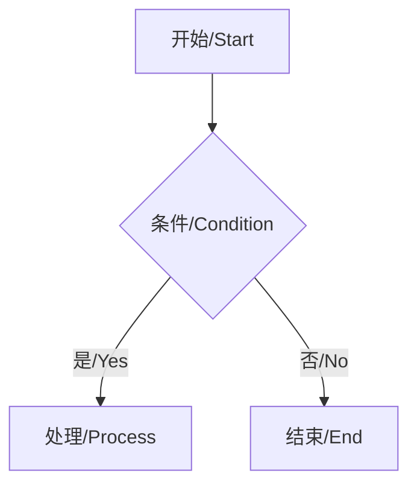

# 中英文术语参考手册 (Chinese-English Terminology Reference)

> **版本**: v1.0  
> **创建日期**: 2026-03-08  
> **状态**: 初稿  
> **适用范围**: ImageAutoInserter 项目全体开发人员  
> **相关文档**: [glossary.md](../design/gui-redesign/glossary.md) | [api-reference.md](../components/api-reference.md)

---

## 目录

1. [通用 GUI 术语](#通用-gui-术语)
2. [React/TypeScript 术语](#reacttypescript-术语)
3. [Electron 术语](#electron-术语)
4. [测试术语](#测试术语)
5. [版本控制术语](#版本控制术语)
6. [性能术语](#性能术语)
7. [常用短语和表达](#常用短语和表达)
8. [易错术语 (False Friends)](#易错术语-false-friends)
9. [缩写和首字母缩略词](#缩写和首字母缩略词)
10. [文化注释和使用指南](#文化注释和使用指南)

---

## 通用 GUI 术语 (General GUI Terms)

### A

#### 按钮
- **英文**: Button
- **缩写**: -
- **定义**: 用户界面中可点击的交互元素，用于触发特定操作
- **中文示例**: 点击"提交"按钮保存表单数据
- **英文示例**: Click the "Submit" button to save the form data

#### 边框
- **英文**: Border
- **缩写**: -
- **定义**: 围绕 UI 元素的线条，用于视觉分隔或强调
- **中文示例**: 为输入框添加 2px 的实线边框
- **英文示例**: Add a 2px solid border around the input field

#### 背景色
- **英文**: Background Color
- **缩写**: BG Color
- **定义**: UI 元素背后的颜色
- **中文示例**: 将主背景色设置为浅灰色
- **英文示例**: Set the primary background color to light gray

### C

#### 卡片
- **英文**: Card
- **缩写**: -
- **定义**: 包含相关内容的矩形容器组件
- **中文示例**: 使用卡片组件展示文件信息
- **英文示例**: Use a card component to display file information

#### 复选框
- **英文**: Checkbox
- **缩写**: -
- **定义**: 允许用户选择或取消选择选项的方形控件
- **中文示例**: 勾选复选框以接受条款
- **英文示例**: Check the checkbox to accept the terms

#### 容器
- **英文**: Container
- **缩写**: -
- **定义**: 用于组织和布局其他 UI 元素的组件
- **中文示例**: 将所有内容包裹在一个最大宽度的容器中
- **英文示例**: Wrap all content in a max-width container

### D

#### 对话框
- **英文**: Dialog / Modal
- **缩写**: -
- **定义**: 覆盖在主界面上的弹出窗口，用于显示重要信息或收集用户输入
- **中文示例**: 显示确认对话框询问用户是否删除
- **英文示例**: Show a confirmation dialog asking the user to delete

#### 下拉菜单
- **英文**: Dropdown Menu
- **缩写**: -
- **定义**: 点击后展开选项列表的菜单
- **中文示例**: 从下拉菜单中选择一个主题
- **英文示例**: Select a theme from the dropdown menu

### F

#### 表单
- **英文**: Form
- **缩写**: -
- **定义**: 收集用户输入的一组字段
- **中文示例**: 填写表单以注册账户
- **英文示例**: Fill out the form to register an account

#### 焦点
- **英文**: Focus
- **缩写**: -
- **定义**: 当前接收键盘输入的 UI 元素状态
- **中文示例**: 输入框获得焦点时显示蓝色边框
- **英文示例**: Show a blue border when the input field receives focus

### G

#### 网格布局
- **英文**: Grid Layout
- **缩写**: -
- **定义**: 使用行和列组织内容的二维布局系统
- **中文示例**: 使用网格布局排列统计卡片
- **英文示例**: Use grid layout to arrange statistics cards

### H

#### 悬停状态
- **英文**: Hover State
- **缩写**: -
- **定义**: 鼠标指针停留在元素上时的视觉状态
- **中文示例**: 按钮悬停状态改变背景色
- **英文示例**: Change background color on button hover state

### I

#### 输入框
- **英文**: Input Field / Text Input
- **缩写**: -
- **定义**: 允许用户输入文本的表单控件
- **中文示例**: 在输入框中填写您的邮箱地址
- **英文示例**: Enter your email address in the input field

#### 图标
- **英文**: Icon
- **缩写**: -
- **定义**: 表示功能或内容的小型图形符号
- **中文示例**: 在按钮左侧添加搜索图标
- **英文示例**: Add a search icon to the left of the button

### L

#### 标签
- **英文**: Label / Tag
- **缩写**: -
- **定义**: 描述性文本或分类标记
- **中文示例**: 为每个文件添加分类标签
- **英文示例**: Add category labels to each file

#### 链接
- **英文**: Link / Hyperlink
- **缩写**: -
- **定义**: 可点击跳转到其他位置的文本或元素
- **中文示例**: 点击链接查看详细信息
- **英文示例**: Click the link to view more details

### M

#### 菜单
- **英文**: Menu
- **缩写**: -
- **定义**: 提供操作选项的列表
- **中文示例**: 从文件菜单中选择打开选项
- **英文示例**: Select Open from the File menu

#### 模态框
- **英文**: Modal Dialog
- **缩写**: Modal
- **定义**: 阻止用户与主界面交互的对话框
- **中文示例**: 模态框关闭前无法操作背景内容
- **英文示例**: Cannot interact with background content until modal is closed

### N

#### 导航栏
- **英文**: Navigation Bar
- **缩写**: Navbar
- **定义**: 包含导航链接的界面元素
- **中文示例**: 顶部导航栏包含主页和设置链接
- **英文示例**: The top navigation bar contains Home and Settings links

### P

#### 面板
- **英文**: Panel
- **缩写**: -
- **定义**: 界面中独立的区域，用于展示特定内容
- **中文示例**: 在右侧面板显示详细信息
- **英文示例**: Display detailed information in the right panel

#### 占位符文本
- **英文**: Placeholder Text
- **缩写**: -
- **定义**: 输入框中提示用户输入内容的灰色文本
- **中文示例**: 输入框的占位符文本提示用户输入邮箱
- **英文示例**: The placeholder text prompts users to enter email

#### 弹出提示
- **英文**: Popover / Tooltip
- **缩写**: -
- **定义**: 鼠标悬停时显示的小提示框
- **中文示例**: 悬停在图标上显示弹出提示
- **英文示例**: Hover over the icon to show a tooltip

### R

#### 单选按钮
- **英文**: Radio Button
- **缩写**: -
- **定义**: 允许从多个选项中选择一个的圆形控件
- **中文示例**: 选择一个单选按钮以设置优先级
- **英文示例**: Select a radio button to set the priority

#### 下拉列表
- **英文**: Select Dropdown / Combo Box
- **缩写**: -
- **定义**: 允许从列表中选择一项的控件
- **中文示例**: 从下拉列表中选择国家
- **英文示例**: Select a country from the dropdown list

### S

#### 滚动条
- **英文**: Scrollbar
- **缩写**: -
- **定义**: 用于在内容超出可视区域时滚动的界面元素
- **中文示例**: 向下滚动滚动条查看更多内容
- **英文示例**: Scroll down the scrollbar to see more content

#### 侧边栏
- **英文**: Sidebar
- **缩写**: -
- **定义**: 界面侧边的垂直区域，通常用于导航
- **中文示例**: 左侧边栏包含导航菜单
- **英文示例**: The left sidebar contains the navigation menu

#### 滑块
- **英文**: Slider
- **缩写**: -
- **定义**: 允许通过拖动选择数值范围的控件
- **中文示例**: 拖动滑块调整音量
- **英文示例**: Drag the slider to adjust the volume

#### 状态栏
- **英文**: Status Bar
- **缩写**: -
- **定义**: 显示应用程序当前状态的界面元素
- **中文示例**: 状态栏显示处理进度
- **英文示例**: The status bar shows the processing progress

### T

#### 表格
- **英文**: Table
- **缩写**: -
- **定义**: 以行和列形式组织数据的组件
- **中文示例**: 使用表格展示销售数据
- **英文示例**: Use a table to display sales data

#### 切换开关
- **英文**: Toggle Switch
- **缩写**: Toggle
- **定义**: 用于在两个状态之间切换的控件
- **中文示例**: 使用切换开关启用或禁用通知
- **英文示例**: Use a toggle switch to enable or disable notifications

#### 工具栏
- **英文**: Toolbar
- **缩写**: -
- **定义**: 包含常用操作按钮的水平条
- **中文示例**: 工具栏包含保存、打印按钮
- **英文示例**: The toolbar contains Save and Print buttons

#### 提示框
- **英文**: Toast / Snackbar
- **缩写**: -
- **定义**: 短暂显示的轻量级消息通知
- **中文示例**: 操作成功后显示提示框
- **英文示例**: Show a toast after successful operation

---

## React/TypeScript 术语 (React/TypeScript Terms)

### A

#### 箭头函数
- **英文**: Arrow Function
- **缩写**: -
- **定义**: ES6 中定义函数的简洁语法，不绑定自己的 this
- **中文示例**: 使用箭头函数作为事件处理器
- **英文示例**: Use an arrow function as the event handler

#### 数组方法
- **英文**: Array Methods
- **缩写**: -
- **定义**: JavaScript 数组内置的方法（map、filter、reduce 等）
- **中文示例**: 使用 map 方法转换数组元素
- **英文示例**: Use the map method to transform array elements

### C

#### 回调函数
- **英文**: Callback Function
- **缩写**: Callback
- **定义**: 作为参数传递给另一个函数并在稍后执行的函数
- **中文示例**: 数据加载完成后调用回调函数
- **英文示例**: Call the callback function after data loading completes

#### 类组件
- **英文**: Class Component
- **缩写**: -
- **定义**: 使用 ES6 class 定义的 React 组件
- **中文示例**: 类组件使用 render 方法返回 JSX
- **英文示例**: Class components use the render method to return JSX

#### 组合
- **英文**: Composition
- **缩写**: -
- **定义**: 通过组合多个简单组件构建复杂组件的模式
- **中文示例**: 使用组合模式复用 UI 代码
- **英文示例**: Use composition pattern to reuse UI code

#### 条件渲染
- **英文**: Conditional Rendering
- **缩写**: -
- **定义**: 根据条件动态显示或隐藏组件
- **中文示例**: 使用条件渲染显示登录状态
- **英文示例**: Use conditional rendering to show login status

#### 上下文 API
- **英文**: Context API
- **缩写**: -
- **定义**: React 提供的全局状态共享机制
- **中文示例**: 使用上下文 API 共享主题设置
- **英文示例**: Use Context API to share theme settings

### D

#### 解构赋值
- **英文**: Destructuring Assignment
- **缩写**: -
- **定义**: 从数组或对象中提取值并赋给变量的语法
- **中文示例**: 使用解构赋值提取 props 属性
- **英文示例**: Use destructuring assignment to extract props properties

#### DOM
- **英文**: Document Object Model
- **缩写**: DOM
- **定义**: 网页的结构化表示，JavaScript 可通过 DOM API 操作页面
- **中文示例**: 使用 ref 直接访问 DOM 元素
- **英文示例**: Use ref to access DOM elements directly

### E

#### 事件处理器
- **英文**: Event Handler
- **缩写**: -
- **定义**: 响应用户操作（点击、输入等）的函数
- **中文示例**: 点击事件处理器打开模态框
- **英文示例**: Click event handler opens the modal

#### 事件冒泡
- **英文**: Event Bubbling
- **缩写**: -
- **定义**: 事件从目标元素向上传播到 DOM 树根部的机制
- **中文示例**: 阻止事件冒泡防止触发父元素事件
- **英文示例**: Prevent event bubbling to avoid triggering parent element events

### F

#### 函数组件
- **英文**: Function Component
- **缩写**: -
- **定义**: 使用 JavaScript 函数定义的 React 组件
- **中文示例**: 函数组件接收 props 返回 JSX
- **英文示例**: Function components receive props and return JSX

### G

#### 泛型
- **英文**: Generics
- **缩写**: -
- **定义**: TypeScript 中创建可复用组件的类型，允许类型参数化
- **中文示例**: 使用泛型创建可处理多种类型的工具函数
- **英文示例**: Use generics to create utility functions that handle multiple types

### H

#### Hook
- **英文**: Hook
- **缩写**: -
- **定义**: React 提供的函数，允许在函数组件中使用状态和生命周期
- **中文示例**: 使用 useState Hook 管理组件状态
- **英文示例**: Use the useState Hook to manage component state

### I

#### 接口
- **英文**: Interface
- **缩写**: -
- **定义**: TypeScript 中定义对象结构的类型契约
- **中文示例**: 定义接口描述用户对象的结构
- **英文示例**: Define an interface to describe the structure of a user object

#### 不可变数据
- **英文**: Immutable Data
- **缩写**: -
- **定义**: 创建后不能修改的数据，更新时需创建新副本
- **中文示例**: 使用不可变数据避免状态突变
- **英文示例**: Use immutable data to avoid state mutations

### J

#### JSX
- **英文**: JavaScript XML
- **缩写**: JSX
- **定义**: JavaScript 的语法扩展，允许在 JavaScript 中编写类 HTML 代码
- **中文示例**: 在 JSX 中使用大括号嵌入表达式
- **英文示例**: Use curly braces in JSX to embed expressions

### K

#### 键 (Key)
- **英文**: Key
- **缩写**: -
- **定义**: React 列表中用于标识每个元素的唯一标识符
- **中文示例**: 为列表项添加唯一的键属性
- **英文示例**: Add a unique key prop to list items

### L

#### 生命周期方法
- **英文**: Lifecycle Methods
- **缩写**: -
- **定义**: 组件在创建、更新和销毁时调用的特殊方法
- **中文示例**: 在组件挂载时调用生命周期方法获取数据
- **英文示例**: Call lifecycle method to fetch data when component mounts

#### 字面量类型
- **英文**: Literal Type
- **缩写**: -
- **定义**: TypeScript 中精确指定值的类型
- **中文示例**: 使用字面量类型限制状态值
- **英文示例**: Use literal types to constrain state values

### M

#### 映射类型
- **英文**: Mapped Types
- **缩写**: -
- **定义**: TypeScript 中基于现有类型创建新类型的机制
- **中文示例**: 使用映射类型创建只读版本
- **英文示例**: Use mapped types to create a read-only version

### P

#### Props
- **英文**: Properties
- **缩写**: Props
- **定义**: 父组件传递给子组件的只读数据
- **中文示例**: 通过 props 传递配置给子组件
- **英文示例**: Pass configuration to child component via props

#### 受控组件
- **英文**: Controlled Component
- **缩写**: -
- **定义**: 表单数据由 React 状态管理的组件
- **中文示例**: 使用受控组件管理表单输入
- **英文示例**: Use controlled components to manage form inputs

### R

#### Reducer
- **英文**: Reducer
- **缩写**: -
- **定义**: 纯函数，根据当前状态和动作返回新状态
- **中文示例**: Reducer 函数处理状态更新逻辑
- **英文示例**: Reducer function handles state update logic

#### Ref
- **英文**: Reference
- **缩写**: Ref
- **定义**: 用于直接访问 DOM 元素或保存可变值的引用
- **中文示例**: 使用 ref 获取输入框的 DOM 节点
- **英文示例**: Use ref to get the DOM node of the input field

#### 渲染
- **英文**: Render
- **缩写**: -
- **定义**: 将组件转换为 UI 的过程
- **中文示例**: React 渲染组件到 DOM
- **英文示例**: React renders components to the DOM

#### 重新渲染
- **英文**: Re-render
- **缩写**: -
- **定义**: 组件因状态或 props 变化而重新生成 UI
- **中文示例**: 状态更新触发组件重新渲染
- **英文示例**: State update triggers component re-render

### S

#### 状态
- **英文**: State
- **缩写**: -
- **定义**: 组件内部管理的数据，变化时触发重新渲染
- **中文示例**: 使用状态跟踪用户输入
- **英文示例**: Use state to track user input

#### 副作用
- **英文**: Side Effect
- **缩写**: -
- **定义**: 影响外部世界或依赖外部世界的操作（如 API 调用、DOM 操作）
- **中文示例**: 使用 useEffect 处理副作用
- **英文示例**: Use useEffect to handle side effects

#### 展开运算符
- **英文**: Spread Operator
- **缩写**: -
- **定义**: 将数组或对象展开为独立元素的语法（...）
- **中文示例**: 使用展开运算符复制对象属性
- **英文示例**: Use spread operator to copy object properties

### T

#### 类型别名
- **英文**: Type Alias
- **缩写**: -
- **定义**: TypeScript 中为类型定义快捷名称
- **中文示例**: 使用类型别名简化复杂类型
- **英文示例**: Use type alias to simplify complex types

#### 类型推断
- **英文**: Type Inference
- **缩写**: -
- **定义**: TypeScript 自动推导变量类型的能力
- **中文示例**: TypeScript 通过类型推断确定变量类型
- **英文示例**: TypeScript determines variable type through type inference

#### 类型守卫
- **英文**: Type Guard
- **缩写**: -
- **定义**: 运行时检查，用于缩小类型范围
- **中文示例**: 使用类型守卫检查变量类型
- **英文示例**: Use type guard to check variable type

### U

#### 联合类型
- **英文**: Union Type
- **缩写**: -
- **定义**: TypeScript 中表示多种可能类型的类型
- **中文示例**: 使用联合类型接受多种输入
- **英文示例**: Use union type to accept multiple inputs

#### 工具类型
- **英文**: Utility Types
- **缩写**: -
- **定义**: TypeScript 提供的全局类型工具（Partial、Pick、Omit 等）
- **中文示例**: 使用 Partial 工具类型创建可选属性
- **英文示例**: Use Partial utility type to create optional properties

### V

#### 虚拟 DOM
- **英文**: Virtual DOM
- **缩写**: vDOM
- **定义**: React 在内存中维护的 DOM 表示，用于优化性能
- **中文示例**: React 使用虚拟 DOM 减少真实 DOM 操作
- **英文示例**: React uses virtual DOM to reduce real DOM operations

---

## Electron 术语 (Electron Terms)

### A

#### 应用生命周期
- **英文**: Application Lifecycle
- **缩写**: -
- **定义**: Electron 应用从启动到退出的完整过程
- **中文示例**: 监听应用生命周期事件处理启动逻辑
- **英文示例**: Listen to application lifecycle events to handle startup logic

### B

#### 浏览器窗口
- **英文**: BrowserWindow
- **缩写**: -
- **定义**: Electron 中创建和管理应用窗口的类
- **中文示例**: 创建新的 BrowserWindow 实例显示主界面
- **英文示例**: Create a new BrowserWindow instance to display the main interface

### C

#### 上下文桥接
- **英文**: Context Bridge
- **缩写**: -
- **定义**: Electron 提供的安全机制，允许预加载脚本安全地暴露 API 给渲染进程
- **中文示例**: 使用上下文桥接暴露 IPC 方法给渲染进程
- **英文示例**: Use context bridge to expose IPC methods to renderer process

#### 内容安全策略
- **英文**: Content Security Policy
- **缩写**: CSP
- **定义**: 安全功能，防止跨站脚本攻击 (XSS)
- **中文示例**: 配置 CSP 防止恶意脚本注入
- **英文示例**: Configure CSP to prevent malicious script injection

### D

#### 默认应用
- **英文**: Default Application
- **缩写**: -
- **定义**: 系统用于打开特定类型文件的应用程序
- **中文示例**: 设置 Electron 应用为某些文件类型的默认应用
- **英文示例**: Set Electron app as default application for certain file types

### I

#### IPC (进程间通信)
- **英文**: Inter-Process Communication
- **缩写**: IPC
- **定义**: Electron 主进程和渲染进程之间的通信机制
- **中文示例**: 使用 IPC 在进程间传递消息
- **英文示例**: Use IPC to pass messages between processes

#### IPC 通道
- **英文**: IPC Channel
- **缩写**: -
- **定义**: 主进程和渲染进程之间通信的命名通道
- **中文示例**: 通过 IPC 通道发送文件选择请求
- **英文示例**: Send file selection request through IPC channel

#### IPC 调用
- **英文**: IPC Invoke
- **缩写**: -
- **定义**: 渲染进程向主进程发送异步请求并等待响应
- **中文示例**: 使用 IPC 调用打开文件对话框
- **英文示例**: Use IPC invoke to open file dialog

#### IPC 发送
- **英文**: IPC Send
- **缩写**: -
- **定义**: 渲染进程向主进程发送单向消息（不等待响应）
- **中文示例**: 使用 IPC 发送开始处理通知
- **英文示例**: Use IPC send to notify start processing

### M

#### 主进程
- **英文**: Main Process
- **缩写**: -
- **定义**: Electron 应用的入口进程，负责创建窗口、调用原生 API
- **中文示例**: 主进程管理应用生命周期和窗口
- **英文示例**: Main process manages application lifecycle and windows

#### 菜单
- **英文**: Menu
- **缩写**: -
- **定义**: Electron 提供的原生应用程序菜单
- **中文示例**: 创建包含文件、编辑选项的菜单
- **英文示例**: Create menu with File and Edit options

### N

#### 节点集成
- **英文**: Node.js Integration
- **缩写**: -
- **定义**: Electron 允许在渲染进程中使用 Node.js API
- **中文示例**: 启用节点集成以访问文件系统
- **英文示例**: Enable Node.js integration to access file system

#### 原生模块
- **英文**: Native Module
- **缩写**: -
- **定义**: 使用 C/C++ 编写并编译的 Node.js 模块
- **中文示例**: 使用原生模块访问系统功能
- **英文示例**: Use native module to access system features

### P

#### 预加载脚本
- **英文**: Preload Script
- **缩写**: -
- **定义**: 在渲染进程加载前运行的脚本，用于安全地暴露 API
- **中文示例**: 预加载脚本暴露安全的 IPC 方法
- **英文示例**: Preload script exposes safe IPC methods

#### 进程优先级
- **英文**: Process Priority
- **缩写**: -
- **定义**: 操作系统分配给进程的优先级
- **中文示例**: 设置 Electron 进程优先级提高性能
- **英文示例**: Set Electron process priority to improve performance

### R

#### 渲染进程
- **英文**: Renderer Process
- **缩写**: -
- **定义**: 负责显示网页内容和管理用户交互的进程
- **中文示例**: 渲染进程运行 React 应用
- **英文示例**: Renderer process runs React application

#### 远程模块
- **英文**: Remote Module
- **缩写**: -
- **定义**: 允许渲染进程调用主进程对象（已弃用）
- **中文示例**: 避免使用远程模块，改用 IPC
- **英文示例**: Avoid using remote module, use IPC instead

### S

#### 沙盒
- **英文**: Sandbox
- **缩写**: -
- **定义**: 限制渲染进程权限的安全机制
- **中文示例**: 启用沙盒模式提高安全性
- **英文示例**: Enable sandbox mode to improve security

#### 系统托盘
- **英文**: System Tray
- **缩写**: -
- **定义**: 操作系统任务栏中的应用图标区域
- **中文示例**: 在系统托盘显示应用图标
- **英文示例**: Display app icon in system tray

### T

#### 托盘
- **英文**: Tray
- **缩写**: -
- **定义**: Electron 提供的创建系统托盘图标的类
- **中文示例**: 创建托盘图标显示右键菜单
- **英文示例**: Create tray icon to show context menu

### W

#### 窗口管理
- **英文**: Window Management
- **缩写**: -
- **定义**: 创建、配置和控制应用窗口的过程
- **中文示例**: 使用窗口管理处理多窗口场景
- **英文示例**: Use window management to handle multi-window scenarios

---

## 测试术语 (Testing Terms)

### A

#### 断言
- **英文**: Assertion
- **缩写**: -
- **定义**: 测试中验证预期结果的语句
- **中文示例**: 添加断言验证返回值
- **英文示例**: Add assertion to verify return value

#### 可访问性测试
- **英文**: Accessibility Test
- **缩写**: A11y Test
- **定义**: 验证应用对残障用户的可用性
- **中文示例**: 运行可访问性测试检查键盘导航
- **英文示例**: Run accessibility test to check keyboard navigation

#### 验收测试
- **英文**: Acceptance Test
- **缩写**: -
- **定义**: 验证系统是否满足业务需求的测试
- **中文示例**: 执行验收测试确认功能完整
- **英文示例**: Execute acceptance test to confirm feature completeness

### B

#### 基准测试
- **英文**: Benchmark Test
- **缩写**: -
- **定义**: 测量系统性能的测试
- **中文示例**: 运行基准测试比较不同版本的性能
- **英文示例**: Run benchmark test to compare performance of different versions

#### 边界值测试
- **英文**: Boundary Value Test
- **缩写**: -
- **定义**: 测试输入范围的边界条件
- **中文示例**: 边界值测试覆盖最小值和最大值
- **英文示例**: Boundary value test covers minimum and maximum values

### C

#### 代码覆盖
- **英文**: Code Coverage
- **缩写**: Coverage
- **定义**: 测试执行的代码比例
- **中文示例**: 代码覆盖率达到 80% 的目标
- **英文示例**: Achieve 80% code coverage target

#### 组件测试
- **英文**: Component Test
- **缩写**: -
- **定义**: 测试独立 UI 组件的功能
- **中文示例**: 组件测试验证按钮点击行为
- **英文示例**: Component test verifies button click behavior

#### 契约测试
- **英文**: Contract Test
- **缩写**: -
- **定义**: 验证组件间接口契约的测试
- **中文示例**: 契约测试确保 IPC 消息格式正确
- **英文示例**: Contract test ensures IPC message format is correct

### D

#### 数据驱动测试
- **英文**: Data-Driven Test
- **缩写**: -
- **定义**: 使用多组数据执行的测试
- **中文示例**: 数据驱动测试覆盖多种输入场景
- **英文示例**: Data-driven test covers multiple input scenarios

#### 动态测试
- **英文**: Dynamic Test
- **缩写**: -
- **定义**: 运行时执行代码的测试
- **中文示例**: 动态测试验证实际功能
- **英文示例**: Dynamic test verifies actual functionality

### E

#### 端到端测试
- **英文**: End-to-End Test
- **缩写**: E2E Test
- **定义**: 测试完整用户流程的测试
- **中文示例**: 端到端测试模拟真实用户操作
- **英文示例**: E2E test simulates real user operations

#### 异常测试
- **英文**: Exception Test
- **缩写**: -
- **定义**: 验证异常处理的测试
- **中文示例**: 异常测试确认错误被正确捕获
- **英文示例**: Exception test confirms errors are caught correctly

### F

#### 功能测试
- **英文**: Functional Test
- **缩写**: -
- **定义**: 验证功能是否按需求工作的测试
- **中文示例**: 功能测试验证文件处理流程
- **英文示例**: Functional test verifies file processing workflow

#### 模糊测试
- **英文**: Fuzz Test
- **缩写**: -
- **定义**: 使用随机无效输入测试系统鲁棒性
- **中文示例**: 模糊测试发现潜在崩溃
- **英文示例**: Fuzz test discovers potential crashes

### I

#### 集成测试
- **英文**: Integration Test
- **缩写**: -
- **定义**: 测试多个组件协作的测试
- **中文示例**: 集成测试验证主进程和渲染进程通信
- **英文示例**: Integration test verifies main and renderer process communication

### L

#### 负载测试
- **英文**: Load Test
- **缩写**: -
- **定义**: 测试系统在高负载下的表现
- **中文示例**: 负载测试评估大量数据处理能力
- **英文示例**: Load test evaluates large data processing capability

### M

#### 模拟对象
- **英文**: Mock Object
- **缩写**: Mock
- **定义**: 模拟真实对象行为的测试替身
- **中文示例**: 使用模拟对象替代真实 API 调用
- **英文示例**: Use mock object to replace real API call

#### 变异测试
- **英文**: Mutation Test
- **缩写**: -
- **定义**: 通过修改代码验证测试有效性的方法
- **中文示例**: 变异测试检测测试用例的缺陷
- **英文示例**: Mutation test detects defects in test cases

### N

#### 负面测试
- **英文**: Negative Test
- **缩写**: -
- **定义**: 验证系统正确处理无效输入的测试
- **中文示例**: 负面测试确认错误输入被拒绝
- **英文示例**: Negative test confirms invalid input is rejected

### P

#### 性能测试
- **英文**: Performance Test
- **缩写**: -
- **定义**: 测量系统响应速度和资源使用的测试
- **中文示例**: 性能测试测量启动时间
- **英文示例**: Performance test measures startup time

#### 冒烟测试
- **英文**: Smoke Test
- **缩写**: -
- **定义**: 验证基本功能是否正常的快速测试
- **中文示例**: 冒烟测试确认应用可以启动
- **英文示例**: Smoke test confirms application can start

### R

#### 回归测试
- **英文**: Regression Test
- **缩写**: -
- **定义**: 验证新代码未破坏现有功能的测试
- **中文示例**: 回归测试确保修复未引入新问题
- **英文示例**: Regression test ensures fix doesn't introduce new issues

### S

#### 静态测试
- **英文**: Static Test
- **缩写**: -
- **定义**: 不执行代码的测试（如代码审查、静态分析）
- **中文示例**: 静态测试检查代码规范
- **英文示例**: Static test checks code style

#### 存根
- **英文**: Stub
- **缩写**: -
- **定义**: 提供固定响应的简化函数，用于替代真实依赖
- **中文示例**: 使用存根模拟 API 响应
- **英文示例**: Use stub to simulate API response

### T

#### 测试装置
- **英文**: Test Fixture
- **缩写**: Fixture
- **定义**: 测试执行前的预设环境或数据
- **中文示例**: 测试装置准备用户数据
- **英文示例**: Test fixture prepares user data

#### 测试替身
- **英文**: Test Double
- **缩写**: -
- **定义**: 替代真实对象的通用术语（包括 Mock、Stub 等）
- **中文示例**: 使用测试替身隔离被测组件
- **英文示例**: Use test double to isolate component under test

#### 测试驱动开发
- **英文**: Test-Driven Development
- **缩写**: TDD
- **定义**: 先写测试再写实现的开发方法
- **中文示例**: 遵循测试驱动开发流程
- **英文示例**: Follow test-driven development workflow

#### 测试套件
- **英文**: Test Suite
- **缩写**: -
- **定义**: 组织在一起的相关测试集合
- **中文示例**: 测试套件包含所有组件测试
- **英文示例**: Test suite contains all component tests

#### 测试用例
- **英文**: Test Case
- **缩写**: -
- **定义**: 验证特定功能或场景的单个测试
- **中文示例**: 测试用例覆盖登录成功场景
- **英文示例**: Test case covers login success scenario

### U

#### 单元测试
- **英文**: Unit Test
- **缩写**: -
- **定义**: 测试最小代码单元（函数、方法）的测试
- **中文示例**: 单元测试验证工具函数逻辑
- **英文示例**: Unit test verifies utility function logic

#### 用户验收测试
- **英文**: User Acceptance Test
- **缩写**: UAT
- **定义**: 由最终用户执行的验收测试
- **中文示例**: 用户验收测试确认满足业务需求
- **英文示例**: User acceptance test confirms business requirements are met

### V

#### 视觉回归测试
- **英文**: Visual Regression Test
- **缩写**: -
- **定义**: 检测 UI 视觉变化的测试
- **中文示例**: 视觉回归测试捕获意外样式变化
- **英文示例**: Visual regression test catches unintended style changes

#### 验证
- **英文**: Verification
- **缩写**: -
- **定义**: 确认产品正确构建的过程（是否正确地构建了产品）
- **中文示例**: 验证确保实现符合设计
- **英文示例**: Verification ensures implementation matches design

#### 确认
- **英文**: Validation
- **缩写**: -
- **定义**: 确认构建了正确产品的过程（是否构建了正确的产品）
- **中文示例**: 确认确保满足用户需求
- **英文示例**: Validation ensures user needs are met

---

## 版本控制术语 (Version Control Terms)

### B

#### 分支
- **英文**: Branch
- **缩写**: -
- **定义**: 代码库的独立开发线
- **中文示例**: 创建新分支开发功能
- **英文示例**: Create new branch to develop feature

#### 基础分支
- **英文**: Base Branch
- **缩写**: -
- **定义**: 合并请求的目标分支
- **中文示例**: 将功能分支合并到基础分支
- **英文示例**: Merge feature branch into base branch

#### 裸仓库
- **英文**: Bare Repository
- **缩写**: -
- **定义**: 没有工作目录的 Git 仓库，通常用作远程仓库
- **中文示例**: 远程仓库通常是裸仓库
- **英文示例**: Remote repository is usually a bare repository

### C

#### 提交
- **英文**: Commit
- **缩写**: -
- **定义**: 对代码库的更改记录
- **中文示例**: 提交包含代码更改和描述信息
- **英文示例**: Commit contains code changes and description

#### 提交信息
- **英文**: Commit Message
- **缩写**: -
- **定义**: 描述提交更改的文本
- **中文示例**: 编写清晰的提交信息说明更改内容
- **英文示例**: Write clear commit message explaining changes

#### 冲突
- **英文**: Conflict
- **缩写**: -
- **定义**: 合并时两个分支对同一文件的同一行做了不同修改
- **中文示例**: 解决合并冲突
- **英文示例**: Resolve merge conflict

#### 克隆
- **英文**: Clone
- **缩写**: -
- **定义**: 创建远程仓库的本地副本
- **中文示例**: 克隆远程仓库到本地
- **英文示例**: Clone remote repository to local

#### 检出
- **英文**: Checkout
- **缩写**: -
- **定义**: 切换分支或恢复文件
- **中文示例**: 检出功能分支开始开发
- **英文示例**: Checkout feature branch to start development

### D

#### 差异
- **英文**: Diff
- **缩写**: -
- **定义**: 显示文件之间或提交之间的更改
- **中文示例**: 查看提交差异了解更改内容
- **英文示例**: View commit diff to understand changes

#### 分离头指针
- **英文**: Detached HEAD
- **缩写**: -
- **定义**: HEAD 直接指向提交而非分支的状态
- **中文示例**: 分离头指针状态下提交可能丢失
- **英文示例**: Commits in detached HEAD state may be lost

### F

#### 取回
- **英文**: Fetch
- **缩写**: -
- **定义**: 从远程仓库下载对象和引用
- **中文示例**: 取回远程分支更新
- **英文示例**: Fetch remote branch updates

#### 快进合并
- **英文**: Fast-Forward Merge
- **缩写**: -
- **定义**: 源分支的提交可以直接添加到目标分支历史中的合并
- **中文示例**: 快进合并不创建合并提交
- **英文示例**: Fast-forward merge doesn't create merge commit

#### 分叉
- **英文**: Fork
- **缩写**: -
- **定义**: 创建仓库的独立副本
- **中文示例**: 分叉仓库进行独立开发
- **英文示例**: Fork repository for independent development

### H

#### HEAD
- **英文**: HEAD
- **缩写**: HEAD
- **定义**: 指向当前分支最新提交的指针
- **中文示例**: HEAD 指向当前分支的最新提交
- **英文示例**: HEAD points to the latest commit of current branch

### M

#### 合并
- **英文**: Merge
- **缩写**: -
- **定义**: 将一个分支的更改集成到另一个分支
- **中文示例**: 合并功能分支到主分支
- **英文示例**: Merge feature branch to main branch

#### 合并提交
- **英文**: Merge Commit
- **缩写**: -
- **定义**: 记录两个分支合并的特殊提交
- **中文示例**: 合并提交有两个父提交
- **英文示例**: Merge commit has two parent commits

#### 合并冲突
- **英文**: Merge Conflict
- **缩写**: -
- **定义**: 合并时发生的冲突
- **中文示例**: 手动解决合并冲突
- **英文示例**: Manually resolve merge conflict

#### 主分支
- **英文**: Main Branch / Master Branch
- **缩写**: -
- **定义**: 主要的开发分支
- **中文示例**: 将更改合并到主分支
- **英文示例**: Merge changes to main branch

### P

#### 拉取请求
- **英文**: Pull Request
- **缩写**: PR
- **定义**: 请求将更改从一个分支合并到另一个分支
- **中文示例**: 创建拉取请求请求代码审查
- **英文示例**: Create pull request for code review

#### 推送
- **英文**: Push
- **缩写**: -
- **定义**: 将本地提交上传到远程仓库
- **中文示例**: 推送本地提交到远程
- **英文示例**: Push local commits to remote

#### 拉取
- **英文**: Pull
- **缩写**: -
- **定义**: 从远程仓库获取并合并更改
- **中文示例**: 拉取远程更改到本地
- **英文示例**: Pull remote changes to local

### R

#### 变基
- **英文**: Rebase
- **缩写**: -
- **定义**: 将提交历史重新应用到新的基础提交
- **中文示例**: 变基使提交历史线性化
- **英文示例**: Rebase makes commit history linear

#### 远程仓库
- **英文**: Remote Repository
- **缩写**: Remote
- **定义**: 托管在服务器上的仓库
- **中文示例**: 推送更改到远程仓库
- **英文示例**: Push changes to remote repository

#### 重置
- **英文**: Reset
- **缩写**: -
- **定义**: 将当前分支重置到特定提交
- **中文示例**: 重置分支到之前的提交
- **英文示例**: Reset branch to previous commit

#### 还原
- **英文**: Revert
- **缩写**: -
- **定义**: 创建新提交撤销之前的更改
- **中文示例**: 还原错误提交
- **英文示例**: Revert incorrect commit

### S

#### 暂存区
- **英文**: Staging Area
- **缩写**: -
- **定义**: 准备提交的更改区域
- **中文示例**: 将更改添加到暂存区
- **英文示例**: Add changes to staging area

#### 贮藏
- **英文**: Stash
- **缩写**: -
- **定义**: 临时保存未提交的更改
- **中文示例**: 贮藏当前更改切换分支
- **英文示例**: Stash current changes to switch branch

#### 标签
- **英文**: Tag
- **缩写**: -
- **定义**: 指向特定提交的永久标记
- **中文示例**: 为发布版本添加标签
- **英文示例**: Add tag for release version

#### 工作树
- **英文**: Working Tree
- **缩写**: -
- **定义**: 包含项目文件的目录
- **中文示例**: 工作树包含当前代码
- **英文示例**: Working tree contains current code

### W

#### 工作流
- **英文**: Workflow
- **缩写**: -
- **定义**: 团队使用版本控制的约定方式
- **中文示例**: 遵循 Git 工作流管理分支
- **英文示例**: Follow Git workflow to manage branches

---

## 性能术语 (Performance Terms)

### B

#### 瓶颈
- **英文**: Bottleneck
- **缩写**: -
- **定义**: 限制整体性能的系统组件
- **中文示例**: 网络请求是性能瓶颈
- **英文示例**: Network request is the performance bottleneck

#### 缓冲
- **英文**: Buffering
- **缩写**: -
- **定义**: 临时存储数据以平衡速度差异
- **中文示例**: 使用缓冲提高数据读取效率
- **英文示例**: Use buffering to improve data read efficiency

### C

#### 缓存
- **英文**: Cache
- **缩写**: -
- **定义**: 存储数据以便快速访问的机制
- **中文示例**: 使用缓存减少重复计算
- **英文示例**: Use cache to reduce redundant calculations

#### 缓存命中
- **英文**: Cache Hit
- **缩写**: -
- **定义**: 请求的数据在缓存中找到
- **中文示例**: 缓存命中率高表示缓存有效
- **英文示例**: High cache hit rate indicates effective cache

#### 缓存未命中
- **英文**: Cache Miss
- **缩写**: -
- **定义**: 请求的数据不在缓存中
- **中文示例**: 缓存未命中导致从源加载
- **英文示例**: Cache miss causes loading from source

#### 代码分割
- **英文**: Code Splitting
- **缩写**: -
- **定义**: 将代码分成多个包按需加载
- **中文示例**: 使用代码分割减少初始加载时间
- **英文示例**: Use code splitting to reduce initial load time

### D

#### 防抖
- **英文**: Debounce
- **缩写**: -
- **定义**: 限制函数在特定时间内只执行一次
- **中文示例**: 使用防抖优化搜索输入
- **英文示例**: Use debounce to optimize search input

#### 延迟
- **英文**: Delay / Latency
- **缩写**: -
- **定义**: 操作开始到完成的时间间隔
- **中文示例**: 网络延迟影响响应时间
- **英文示例**: Network latency affects response time

#### 抖动
- **英文**: Jitter
- **缩写**: -
- **定义**: 延迟的变化量
- **中文示例**: 抖动影响用户体验一致性
- **英文示例**: Jitter affects user experience consistency

#### DOM 操作
- **英文**: DOM Manipulation
- **缩写**: -
- **定义**: 修改 DOM 结构的操作
- **中文示例**: 减少 DOM 操作提高性能
- **英文示例**: Reduce DOM manipulation to improve performance

#### 重绘
- **英文**: Repaint
- **缩写**: -
- **定义**: 元素外观变化但不影响布局的重新绘制
- **中文示例**: 颜色变化触发重绘
- **英文示例**: Color change triggers repaint

#### 回流
- **英文**: Reflow / Layout
- **缩写**: -
- **定义**: 计算元素位置和大小的过程
- **中文示例**: 频繁回流严重影响性能
- **英文示例**: Frequent reflows severely impact performance

### F

#### 帧率
- **英文**: Frame Rate
- **缩写**: FPS (Frames Per Second)
- **定义**: 每秒渲染的帧数
- **中文示例**: 保持 60 FPS 确保流畅动画
- **英文示例**: Maintain 60 FPS for smooth animation

#### 首屏渲染
- **英文**: First Paint
- **缩写**: FP
- **定义**: 浏览器首次渲染任何内容的时间
- **中文示例**: 优化首屏渲染时间
- **英文示例**: Optimize first paint time

#### 首次内容绘制
- **英文**: First Contentful Paint
- **缩写**: FCP
- **定义**: 浏览器首次渲染文本、图片等内容的
- **中文示例**: FCP 是重要的性能指标
- **英文示例**: FCP is an important performance metric

#### 首次输入延迟
- **英文**: First Input Delay
- **缩写**: FID
- **定义**: 用户首次交互到浏览器响应的时间
- **中文示例**: FID 影响交互体验
- **英文示例**: FID affects interaction experience

### L

#### 懒加载
- **英文**: Lazy Loading
- **缩写**: -
- **定义**: 延迟加载直到需要时才加载资源
- **中文示例**: 使用懒加载优化图片加载
- **英文示例**: Use lazy loading to optimize image loading

#### 加载时间
- **英文**: Load Time
- **缩写**: -
- **定义**: 页面完全加载所需的时间
- **中文示例**: 优化资源减少加载时间
- **英文示例**: Optimize resources to reduce load time

#### 延迟加载
- **英文**: Deferred Loading
- **缩写**: -
- **定义**: 将资源加载推迟到关键内容加载后
- **中文示例**: 使用延迟加载提高首屏速度
- **英文示例**: Use deferred loading to improve first screen speed

### M

#### 内存泄漏
- **英文**: Memory Leak
- **缩写**: -
- **定义**: 程序不再使用的内存未被释放
- **中文示例**: 内存泄漏导致应用变慢
- **英文示例**: Memory leak causes application slowdown

#### 内存使用
- **英文**: Memory Usage
- **缩写**: -
- **定义**: 应用消耗的内存量
- **中文示例**: 监控内存使用防止泄漏
- **英文示例**: Monitor memory usage to prevent leaks

### O

#### 优化
- **英文**: Optimization
- **缩写**: -
- **定义**: 改进性能的过程
- **中文示例**: 性能优化提高响应速度
- **英文示例**: Performance optimization improves response speed

### P

#### 性能分析
- **英文**: Profiling
- **缩写**: -
- **定义**: 测量应用性能指标的过程
- **中文示例**: 使用性能分析工具识别瓶颈
- **英文示例**: Use profiling tools to identify bottlenecks

#### 预加载
- **英文**: Preloading
- **缩写**: -
- **定义**: 提前加载资源以便快速使用
- **中文示例**: 预加载关键资源提高性能
- **英文示例**: Preload critical resources to improve performance

#### 预取
- **英文**: Prefetching
- **缩写**: -
- **定义**: 在需要前预先获取资源
- **中文示例**: 预取下一页数据减少等待
- **英文示例**: Prefetch next page data to reduce waiting

### R

#### 渲染性能
- **英文**: Rendering Performance
- **缩写**: -
- **定义**: 浏览器渲染内容的效率
- **中文示例**: 优化渲染性能提高帧率
- **英文示例**: Optimize rendering performance to improve frame rate

#### 响应时间
- **英文**: Response Time
- **缩写**: -
- **定义**: 请求发出到收到响应的时间
- **中文示例**: 响应时间影响用户体验
- **英文示例**: Response time affects user experience

### S

#### 节流
- **英文**: Throttle
- **缩写**: -
- **定义**: 限制函数在特定时间内最多执行一次
- **中文示例**: 使用节流控制滚动事件处理
- **英文示例**: Use throttle to control scroll event handling

#### 启动时间
- **英文**: Startup Time
- **缩写**: -
- **定义**: 应用从启动到可用的时间
- **中文示例**: 优化启动时间提高用户体验
- **英文示例**: Optimize startup time to improve user experience

#### 吞吐量
- **英文**: Throughput
- **缩写**: -
- **定义**: 单位时间内处理的请求数量
- **中文示例**: 提高吞吐量处理更多请求
- **英文示例**: Increase throughput to handle more requests

#### 时间到交互
- **英文**: Time to Interactive
- **缩写**: TTI
- **定义**: 页面完全可交互的时间
- **中文示例**: TTI 是核心 Web 性能指标
- **英文示例**: TTI is a core web performance metric

### V

#### 虚拟列表
- **英文**: Virtual List
- **缩写**: -
- **定义**: 只渲染可视区域列表项的技术
- **中文示例**: 使用虚拟列表优化长列表性能
- **英文示例**: Use virtual list to optimize long list performance

### W

#### 网页核心指标
- **英文**: Web Vitals
- **缩写**: -
- **定义**: Google 提出的关键性能指标集合
- **中文示例**: 监控网页核心指标优化体验
- **英文示例**: Monitor web vitals to optimize experience

---

## 常用短语和表达 (Common Phrases and Expressions)

### 代码审查短语 (Code Review Phrases)

#### 中文短语

| 短语 | 使用场景 | 示例 |
|------|----------|------|
| 建议重构 | 代码结构需要改进 | 建议重构这段逻辑以提高可读性 |
| 考虑边界情况 | 测试覆盖不完整 | 请考虑边界情况，如空值或极大值 |
| 添加注释 | 代码难以理解 | 建议添加注释说明这个算法的意图 |
| 提取函数 | 代码过长 | 建议提取为独立函数以便复用 |
| 命名不清晰 | 变量或函数名不明确 | 变量名不够清晰，建议使用更具描述性的名称 |
| 存在性能问题 | 代码效率低 | 这里存在性能问题，建议使用缓存 |
| 缺少错误处理 | 未处理异常 | 缺少错误处理，请添加 try-catch 块 |
| 违反单一职责 | 函数职责过多 | 这个函数违反单一职责原则，建议拆分 |
| 代码重复 | 重复逻辑 | 代码重复，建议提取为公共函数 |
| 需要单元测试 | 缺少测试 | 需要单元测试覆盖这个功能 |

#### English Phrases

| Phrase | Usage Context | Example |
|--------|---------------|---------|
| Consider refactoring | Code structure needs improvement | Consider refactoring this logic to improve readability |
| Think about edge cases | Test coverage incomplete | Please think about edge cases, such as null values or extreme values |
| Add comments | Code is hard to understand | Consider adding comments to explain the intent of this algorithm |
| Extract to function | Code is too long | Suggest extracting to a separate function for reusability |
| Unclear naming | Variable or function name is ambiguous | The variable name is unclear, suggest using a more descriptive name |
| Performance concern | Code is inefficient | There's a performance concern here, consider using caching |
| Missing error handling | Exceptions not handled | Missing error handling, please add try-catch block |
| Violates SRP | Function has too many responsibilities | This function violates Single Responsibility Principle, suggest splitting |
| Code duplication | Duplicate logic | Code duplication detected, suggest extracting to common function |
| Needs unit tests | Missing tests | Needs unit tests to cover this functionality |

### 提交信息短语 (Commit Message Phrases)

#### 中文前缀

| 前缀 | 类型 | 使用场景 |
|------|------|----------|
| feat: | 功能 | 添加新功能 |
| fix: | 修复 | 修复 bug |
| docs: | 文档 | 文档更新 |
| style: | 格式 | 代码格式调整（不影响功能） |
| refactor: | 重构 | 代码重构（不添加功能或修复 bug） |
| test: | 测试 | 添加或更新测试 |
| chore: | 杂项 | 构建过程、依赖管理等 |
| perf: | 性能 | 性能优化 |
| ci: | CI/CD | 持续集成配置 |
| build: | 构建 | 构建系统或外部依赖 |

#### 英文前缀

| Prefix | Type | Usage |
|--------|------|-------|
| feat: | Feature | Add new feature |
| fix: | Fix | Fix bug |
| docs: | Documentation | Documentation update |
| style: | Style | Code formatting (no functional change) |
| refactor: | Refactor | Code refactoring (no feature addition or bug fix) |
| test: | Test | Add or update tests |
| chore: | Chore | Build process, dependency management |
| perf: | Performance | Performance optimization |
| ci: | CI/CD | Continuous integration configuration |
| build: | Build | Build system or external dependencies |

#### 完整提交信息示例

**中文示例**:
```
feat: 添加文件拖放功能

- 实现文件拖放区域组件
- 添加拖放事件处理器
- 支持多文件同时拖放
- 更新用户界面显示拖放状态

Closes #123
```

**English Example**:
```
feat: add file drag-and-drop functionality

- Implement file drag-and-drop area component
- Add drag-and-drop event handlers
- Support multiple files drag-and-drop simultaneously
- Update UI to show drag-and-drop status

Closes #123
```

### 文档短语 (Documentation Phrases)

#### 中文短语

| 短语 | 使用场景 | 示例 |
|------|----------|------|
| 本文档描述 | 文档开头 | 本文档描述项目的架构设计 |
| 适用范围 | 说明文档适用性 | 适用范围：全体开发人员 |
| 前提条件 | 列出前置要求 | 前提条件：已安装 Node.js 16+ |
| 快速开始 | 入门指南 | 快速开始：按照以下步骤安装 |
| 详细说明 | 深入解释 | 详细说明请参考附录 |
| 注意事项 | 重要提示 | 注意事项：此操作不可逆 |
| 最佳实践 | 推荐做法 | 最佳实践：使用 TypeScript 编写组件 |
| 常见问题 | FAQ | 常见问题解答见下文 |
| 相关文档 | 交叉引用 | 相关文档：[API 参考](./api.md) |
| 变更历史 | 版本记录 | 变更历史记录所有版本更新 |

#### English Phrases

| Phrase | Usage Context | Example |
|--------|---------------|---------|
| This document describes | Document introduction | This document describes the project architecture |
| Scope | Document applicability | Scope: All development team members |
| Prerequisites | List requirements | Prerequisites: Node.js 16+ installed |
| Quick Start | Getting started guide | Quick Start: Follow these steps to install |
| Detailed explanation | In-depth explanation | See appendix for detailed explanation |
| Important notes | Critical information | Important notes: This operation is irreversible |
| Best practices | Recommended approach | Best practices: Use TypeScript for components |
| FAQ | Frequently asked questions | FAQ section below |
| Related documents | Cross-reference | Related documents: [API Reference](./api.md) |
| Change history | Version log | Change history records all version updates |

### 错误信息短语 (Error Message Phrases)

#### 中文错误信息

| 错误类型 | 标准格式 | 示例 |
|----------|----------|------|
| 文件未找到 | 文件不存在：{路径} | 文件不存在：/path/to/file.txt |
| 权限错误 | 没有权限：{操作} | 没有权限：写入文件 |
| 网络错误 | 网络请求失败：{原因} | 网络请求失败：连接超时 |
| 验证失败 | 验证失败：{字段} | 验证失败：邮箱格式不正确 |
| 配置错误 | 配置错误：{配置项} | 配置错误：缺少必要配置项 API_KEY |
| 运行时错误 | 运行时错误：{描述} | 运行时错误：无法解析 JSON |
| 类型错误 | 类型错误：期望{类型 A}，收到{类型 B} | 类型错误：期望字符串，收到数字 |
| 空值错误 | 空值错误：{对象} 不能为空 | 空值错误：用户对象不能为空 |
| 范围错误 | 超出范围：{值} 不在 {最小值}-{最大值} | 超出范围：50 不在 0-100 |
| 依赖错误 | 依赖缺失：{模块名} | 依赖缺失：lodash 未安装 |

#### English Error Messages

| Error Type | Standard Format | Example |
|------------|----------------|---------|
| File not found | File not found: {path} | File not found: /path/to/file.txt |
| Permission error | Permission denied: {operation} | Permission denied: write file |
| Network error | Network request failed: {reason} | Network request failed: connection timeout |
| Validation error | Validation failed: {field} | Validation failed: invalid email format |
| Configuration error | Configuration error: {config item} | Configuration error: missing required config API_KEY |
| Runtime error | Runtime error: {description} | Runtime error: unable to parse JSON |
| Type error | Type error: expected {type A}, received {type B} | Type error: expected string, received number |
| Null error | Null error: {object} cannot be null | Null error: user object cannot be null |
| Range error | Out of range: {value} not in {min}-{max} | Out of range: 50 not in 0-100 |
| Dependency error | Dependency missing: {module name} | Dependency missing: lodash not installed |

---

## 易错术语 (False Friends)

### 常见误译术语

| 中文术语 | 正确英文 | 错误英文 | 说明 |
|----------|----------|----------|------|
| 默认值 | Default value | Defaut value | "Default" 易拼写错误 |
| 环境 | Environment | Enviroment | 少一个字母 "n" |
| 依赖 | Dependency | Dependence | "Dependence" 是依赖性，非技术术语 |
| 参数 | Parameter | Argument | 函数定义用 parameter，调用用 argument |
| 异常 | Exception | Error | Exception 是特定类型的 Error |
| 实现 | Implement | Realize | "Realize" 是意识到，Implement 是实现 |
| 库 | Library | Lib | 正式文档应使用 Library |
| 框架 | Framework | Frame | "Frame" 是框架，非技术框架 |
| 部署 | Deploy | Deployed | 动词用 Deploy，形容词用 Deployed |
| 配置 | Configuration | Config | 正式文档用 Configuration，代码可用 Config |
| 初始化 | Initialize | Init | 正式文档用 Initialize，代码可用 Init |
| 验证 | Validate | Verify | Validate 是验证有效性，Verify 是验证真实性 |
| 序列化 | Serialize | Serialise | 美式英语用 Serialize |
| 授权 | Authorize | Authenticate | Authorize 是授权，Authenticate 是认证 |
| 认证 | Authenticate | Authorize | Authenticate 是验证身份，Authorize 是授予权限 |

### 使用示例对比

#### 1. Parameter vs Argument

**❌ 错误**:
```typescript
// 函数定义
function calculate(argument1: number, argument2: number) {}
```

**✅ 正确**:
```typescript
// 函数定义使用 parameter
function calculate(parameter1: number, parameter2: number) {}

// 函数调用使用 argument
calculate(5, 10) // 5 and 10 are arguments
```

#### 2. Exception vs Error

**❌ 错误**:
```typescript
// 混用术语
try {
  // code
} catch (error) {
  throw new Error("An exception occurred") // 不一致
}
```

**✅ 正确**:
```typescript
try {
  // code
} catch (error) {
  throw new Error("An error occurred") // 一致
}
// 或
try {
  // code
} catch (exception) {
  throw new Exception("An exception occurred") // 一致
}
```

#### 3. Validate vs Verify

**❌ 错误**:
```typescript
// 验证用户身份（应为 authenticate）
validateUserCredentials(credentials)

// 验证输入格式（应为 validate）
verifyInputFormat(input)
```

**✅ 正确**:
```typescript
// 认证用户身份
authenticateUser(credentials)

// 验证输入格式
validateInputFormat(input)

// 验证数据真实性
verifyDataIntegrity(data)
```

#### 4. Authorize vs Authenticate

**❌ 错误**:
```typescript
// 登录（应为 authenticate）
authorizeUser(username, password)

// 检查权限（应为 authorize）
authenticateUserAccess(resource)
```

**✅ 正确**:
```typescript
// 登录认证
authenticateUser(username, password)

// 授权访问
authorizeUserAccess(resource, permission)
```

#### 5. Deploy vs Deployed

**❌ 错误**:
```markdown
## How to deployed the application
```

**✅ 正确**:
```markdown
## How to deploy the application  // 动词
## Deployed application  // 形容词
```

---

## 缩写和首字母缩略词 (Abbreviations and Acronyms)

### GUI 相关

| 缩写 | 全称 (英文) | 全称 (中文) | 说明 |
|------|------------|------------|------|
| GUI | Graphical User Interface | 图形用户界面 | 相对于 CLI |
| CLI | Command Line Interface | 命令行界面 | 文本界面 |
| UI | User Interface | 用户界面 | 用户交互界面 |
| UX | User Experience | 用户体验 | 用户使用体验 |
| IDE | Integrated Development Environment | 集成开发环境 | 如 VSCode |
| API | Application Programming Interface | 应用程序接口 | 软件间接口 |
| SDK | Software Development Kit | 软件开发工具包 | 开发工具集合 |

### 技术相关

| 缩写 | 全称 (英文) | 全称 (中文) | 说明 |
|------|------------|------------|------|
| JS | JavaScript | JavaScript | 编程语言 |
| TS | TypeScript | TypeScript | 类型化 JavaScript |
| CSS | Cascading Style Sheets | 层叠样式表 | 样式语言 |
| HTML | HyperText Markup Language | 超文本标记语言 | 网页标记语言 |
| DOM | Document Object Model | 文档对象模型 | 网页结构表示 |
| JSON | JavaScript Object Notation | JavaScript 对象表示法 | 数据格式 |
| XML | eXtensible Markup Language | 可扩展标记语言 | 标记语言 |
| HTTP | HyperText Transfer Protocol | 超文本传输协议 | 网络协议 |
| HTTPS | HTTP Secure | 安全超文本传输协议 | 加密 HTTP |
| TCP/IP | Transmission Control Protocol/Internet Protocol | 传输控制协议/网际协议 | 网络协议族 |
| URL | Uniform Resource Locator | 统一资源定位符 | 网址 |
| URI | Uniform Resource Identifier | 统一资源标识符 | 资源标识 |

### Electron 相关

| 缩写 | 全称 (英文) | 全称 (中文) | 说明 |
|------|------------|------------|------|
| IPC | Inter-Process Communication | 进程间通信 | Electron 通信机制 |
| R→M | Renderer to Main | 渲染进程到主进程 | IPC 方向 |
| M→R | Main to Renderer | 主进程到渲染进程 | IPC 方向 |
| CSP | Content Security Policy | 内容安全策略 | 安全机制 |
| XSS | Cross-Site Scripting | 跨站脚本攻击 | 安全威胁 |
| CSRF | Cross-Site Request Forgery | 跨站请求伪造 | 安全威胁 |

### React 相关

| 缩写 | 全称 (英文) | 全称 (中文) | 说明 |
|------|------------|------------|------|
| JSX | JavaScript XML | JavaScript XML | JavaScript 语法扩展 |
| vDOM | Virtual DOM | 虚拟 DOM | 内存中 DOM 表示 |
| SPA | Single Page Application | 单页应用 | 网页应用类型 |
| CSR | Client-Side Rendering | 客户端渲染 | 浏览器端渲染 |
| SSR | Server-Side Rendering | 服务端渲染 | 服务器端渲染 |
| SSG | Static Site Generation | 静态站点生成 | 预先生成 HTML |
| HOC | Higher-Order Component | 高阶组件 | React 模式 |
| RFC | React Function Component | React 函数组件 | 函数式组件 |

### 测试相关

| 缩写 | 全称 (英文) | 全称 (中文) | 说明 |
|------|------------|------------|------|
| TDD | Test-Driven Development | 测试驱动开发 | 开发方法 |
| BDD | Behavior-Driven Development | 行为驱动开发 | 开发方法 |
| E2E | End to End | 端到端 | 测试类型 |
| UAT | User Acceptance Test | 用户验收测试 | 测试类型 |
| CI/CD | Continuous Integration/Continuous Deployment | 持续集成/持续部署 | 开发流程 |
| A11y | Accessibility | 可访问性 | 无障碍测试 |
| WCAG | Web Content Accessibility Guidelines | 网页内容无障碍指南 | 无障碍标准 |
| AAA | Level AAA | AAA 级别 | WCAG 最高级别 |
| AA | Level AA | AA 级别 | WCAG 中级别 |

### 性能相关

| 缩写 | 全称 (英文) | 全称 (中文) | 说明 |
|------|------------|------------|------|
| FPS | Frames Per Second | 帧率 | 性能指标 |
| FP | First Paint | 首次绘制 | 性能指标 |
| FCP | First Contentful Paint | 首次内容绘制 | 性能指标 |
| FID | First Input Delay | 首次输入延迟 | 性能指标 |
| TTI | Time to Interactive | 可交互时间 | 性能指标 |
| LCP | Largest Contentful Paint | 最大内容绘制 | 性能指标 |
| CLS | Cumulative Layout Shift | 累积布局偏移 | 性能指标 |
| RUM | Real User Monitoring | 真实用户监控 | 监控方法 |

### 版本控制相关

| 缩写 | 全称 (英文) | 全称 (中文) | 说明 |
|------|------------|------------|------|
| VCS | Version Control System | 版本控制系统 | 如 Git |
| SCM | Source Control Management | 源代码管理 | 版本控制 |
| PR | Pull Request | 拉取请求 | GitHub 功能 |
| MR | Merge Request | 合并请求 | GitLab 功能 |
| README | Read Me | 自述文件 | 项目说明文件 |
| TODO | To Do | 待办 | 待办事项 |
| FIXME | Fix Me | 修复我 | 需要修复的代码 |
| XXX | XXX | 警告标记 | 需要注意的代码 |

### 项目管理相关

| 缩写 | 全称 (英文) | 全称 (中文) | 说明 |
|------|------------|------------|------|
| MVP | Minimum Viable Product | 最小可行产品 | 产品版本 |
| OKR | Objectives and Key Results | 目标与关键成果 | 目标管理 |
| KPI | Key Performance Indicator | 关键绩效指标 | 绩效指标 |
| ROI | Return on Investment | 投资回报率 | 商业指标 |
| ETA | Estimated Time of Arrival | 预计到达时间 | 时间估算 |
| ETC | Estimated Time to Completion | 预计完成时间 | 时间估算 |
| ASAP | As Soon As Possible | 尽快 | 时间要求 |
| EOD | End of Day | 下班前 | 截止时间 |
| COB | Close of Business | 营业结束前 | 截止时间 |

### 其他常用缩写

| 缩写 | 全称 (英文) | 全称 (中文) | 说明 |
|------|------------|------------|------|
| etc. | et cetera | 等等 | 列举未尽 |
| i.e. | id est | 即 | 换句话说 |
| e.g. | exempli gratia | 例如 | 举例 |
| vs. | versus | 对比 | 对比 |
| approx. | approximately | 大约 | 近似值 |
| max. | maximum | 最大值 | 最大值 |
| min. | minimum | 最小值 | 最小值 |
| avg. | average | 平均值 | 平均值 |
| temp. | temporary | 临时 | 临时 |
| prod. | production | 生产环境 | 正式环境 |
| dev. | development | 开发环境 | 开发环境 |
| staging | staging | 预发布环境 | 测试环境 |

---

## 文化注释和使用指南 (Cultural Notes and Usage Guidelines)

### 何时使用中文 vs 英文

#### 代码中使用英文

**规则**: 所有代码相关元素必须使用英文

**包括**:
- ✅ 变量名：`userName`, `isLoading`
- ✅ 函数名：`calculateTotal()`, `handleClick()`
- ✅ 类名：`UserService`, `DataProcessor`
- ✅ 文件名：`user-service.ts`, `data-processor.ts`
- ✅ 目录名：`/src/components`, `/src/utils`
- ✅ 注释：代码注释使用英文或中文（团队统一）
- ✅ 提交信息：建议使用英文（国际化团队）

**示例**:
```typescript
// ✅ 正确
const userName = "John";
function calculateTotal(items: Item[]): number { }
class UserService { }

// ❌ 错误
const 用户名 = "John";
function 计算总计 (items: Item[]): number { }
class 用户服务 { }
```

#### 文档中使用中文

**规则**: 面向中文团队的文档使用中文

**包括**:
- ✅ 需求文档
- ✅ 设计文档
- ✅ 用户手册
- ✅ 内部 Wiki
- ✅ 会议纪要

**例外**:
- 国际化项目使用英文
- API 文档使用英文（便于国际交流）
- 技术术语保留英文（如 "React Hook"）

#### 用户界面中的语言选择

**规则**: 根据目标用户群体决定

**中文界面**:
- 目标用户主要是中文使用者
- 企业内部系统
- 中国市场产品

**英文界面**:
- 国际化产品
- 开发者工具
- 技术产品

**双语界面**:
- 过渡期产品
- 需要支持多语言
- 提供语言切换选项

### 代码注释规范

#### 注释语言选择

**团队全中文**: 注释使用中文
```typescript
/**
 * 计算订单总价格
 * @param items - 商品列表
 * @param discount - 折扣率 (0.0-1.0)
 * @returns 总价格
 */
function calculateTotal(items: Item[], discount: number): number { }
```

**国际化团队**: 注释使用英文
```typescript
/**
 * Calculate total order price
 * @param items - List of items
 * @param discount - Discount rate (0.0-1.0)
 * @returns Total price
 */
function calculateTotal(items: Item[], discount: number): number { }
```

#### 注释层级

**文件级注释** (必须包含):
```typescript
/**
 * @file user-service.ts
 * @description 用户服务模块，处理用户相关逻辑
 * @author 开发团队
 * @version 1.0.0
 */
```

**类级注释** (必须包含):
```typescript
/**
 * 用户服务类
 * 提供用户相关的 CRUD 操作
 */
class UserService { }
```

**函数级注释** (必须包含):
```typescript
/**
 * 根据 ID 获取用户
 * @param userId - 用户 ID
 * @returns 用户对象，不存在返回 null
 * @throws UserNotFoundError 当用户不存在时
 */
async getUserById(userId: string): Promise<User | null> { }
```

**行内注释** (必要时):
```typescript
// 使用防抖优化性能，限制 300ms 内只执行一次
const debouncedSearch = debounce(search, 300);
```

### 文档语言指南

#### 技术文档结构

**标准结构**:
```markdown
# 标题 (中文)

> **版本**: v1.0  
> **创建日期**: 2026-03-08  
> **状态**: 初稿  

## 目录

1. [概述](#概述)
2. [需求](#需求)
3. [设计](#设计)
4. [实现](#实现)

## 概述

简要描述...

## 术语表

| 中文 | English | 说明 |
|------|---------|------|
| 用户 | User | 系统使用者 |
```

#### 中英文混排规范

**保留英文术语**:
- ✅ React Hook
- ✅ Electron IPC
- ✅ TypeScript Interface
- ✅ CSS-in-JS
- ✅ Server-Side Rendering (SSR)

**首次出现时标注**:
```markdown
首次提到时：虚拟 DOM（Virtual DOM，简称 vDOM）
后续提到：vDOM
```

**代码块保持英文**:
````markdown
✅ 正确:
```typescript
interface User {
  id: string;
  name: string;
}
```

❌ 错误:
```typescript
接口 用户 {
  id: string;
  姓名：string;
}
```
````

#### 图表标注

**流程图**:


**标注方式**:
- 中文文档：中文标注（可附英文）
- 英文文档：英文标注
- 国际化文档：双语标注

### 跨文化交流建议

#### 与英语国家开发者协作

**注意事项**:
1. 使用简单清晰的英文
2. 避免中文拼音缩写
3. 提供必要的上下文
4. 使用标准技术术语

**示例**:
```markdown
❌ 不推荐:
这个 bug 是因为 async/await 没处理好，导致竞态条件

✅ 推荐:
This bug is caused by improper handling of async/await, 
resulting in a race condition
```

#### 代码审查礼仪

**中文团队**:
```markdown
**建议**:
- 这个函数可以拆分成更小的函数
- 建议添加单元测试覆盖边界情况
- 变量命名可以更清晰一些
```

**国际团队**:
```markdown
**Suggestions**:
- Consider splitting this function into smaller functions
- Suggest adding unit tests for edge cases
- Variable naming could be more descriptive
```

#### 避免文化特定表达

**避免**:
- ❌ "这个功能很 666"（中文网络用语）
- ❌ "这个实现太 hacky 了"（英文俚语）
- ❌ "这个 bug 很神奇"（文化特定）

**使用**:
- ✅ "这个功能很强大"
- ✅ "这个实现不够规范"
- ✅ "这个 bug 难以复现"

### 本地化最佳实践

#### 字符串外部化

**❌ 硬编码**:
```typescript
<button>提交</button>
```

**✅ 外部化**:
```typescript
<button>{t('button.submit')}</button>
```

#### 日期和数字格式

**使用标准库**:
```typescript
import { format } from 'date-fns';
import { zhCN, enUS } from 'date-fns/locale';

// 中文格式
format(date, 'yyyy 年 MM 月 dd 日', { locale: zhCN });

// 英文格式
format(date, 'MMMM dd, yyyy', { locale: enUS });
```

#### 复数形式处理

**英文复数**:
```typescript
// ✅ 正确处理复数
const message = `${count} ${count === 1 ? 'item' : 'items'}`;

// ✅ 使用国际化库
import { plural } from '@lingui/macro';
const message = plural(count, {
  one: '# item',
  other: '# items',
});
```

**中文无需复数**:
```typescript
// ✅ 中文无需变化
const message = `${count} 个项目`;
```

---

## 附录：快速参考卡片 (Appendix: Quick Reference Card)

### 日常开发常用术语

| 场景 | 中文 | English |
|------|------|---------|
| 开始开发 | 拉取最新代码 | Pull latest code |
| 创建分支 | 创建功能分支 | Create feature branch |
| 编写代码 | 实现功能 | Implement feature |
| 编写测试 | 添加单元测试 | Add unit tests |
| 提交代码 | 提交更改 | Commit changes |
| 推送代码 | 推送到远程 | Push to remote |
| 请求审查 | 创建 PR | Create PR |
| 修复问题 | 解决审查意见 | Address review comments |
| 合并代码 | 合并到主分支 | Merge to main |
| 部署 | 部署到生产 | Deploy to production |

### Git 命令对照

| 中文描述 | Git 命令 | 说明 |
|----------|----------|------|
| 克隆仓库 | `git clone <url>` | 创建本地副本 |
| 创建分支 | `git checkout -b <branch>` | 创建并切换 |
| 查看状态 | `git status` | 显示更改 |
| 添加文件 | `git add <file>` | 添加到暂存区 |
| 提交更改 | `git commit -m "message"` | 提交 |
| 推送分支 | `git push origin <branch>` | 推送到远程 |
| 拉取更新 | `git pull` | 获取并合并 |
| 切换分支 | `git checkout <branch>` | 切换 |
| 合并分支 | `git merge <branch>` | 合并 |
| 查看历史 | `git log` | 提交历史 |

### 调试常用语

| 中文 | English | 使用场景 |
|------|---------|----------|
| 重现 bug | Reproduce bug | 描述问题 |
| 调试代码 | Debug code | 查找原因 |
| 查看日志 | Check logs | 分析错误 |
| 设置断点 | Set breakpoint | 调试器 |
| 单步执行 | Step through | 调试器 |
| 检查变量 | Inspect variables | 调试器 |
| 修复问题 | Fix issue | 解决问题 |
| 验证修复 | Verify fix | 确认修复 |
| 回归测试 | Regression test | 防止复发 |
| 更新文档 | Update docs | 同步文档 |

---

## 变更历史

| 版本 | 日期 | 变更内容 | 作者 |
|------|------|----------|------|
| v1.0 | 2026-03-08 | 初始版本，创建完整的中英文术语参考手册 | AI Assistant |

---

**文档结束**
