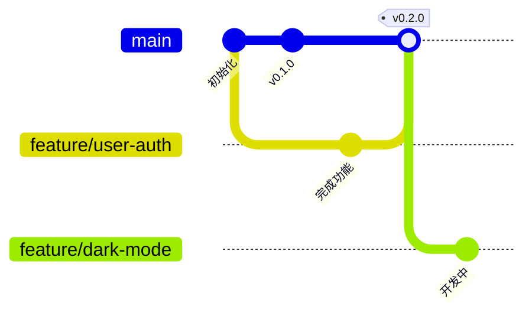
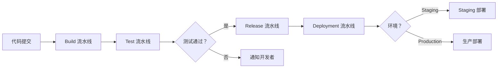
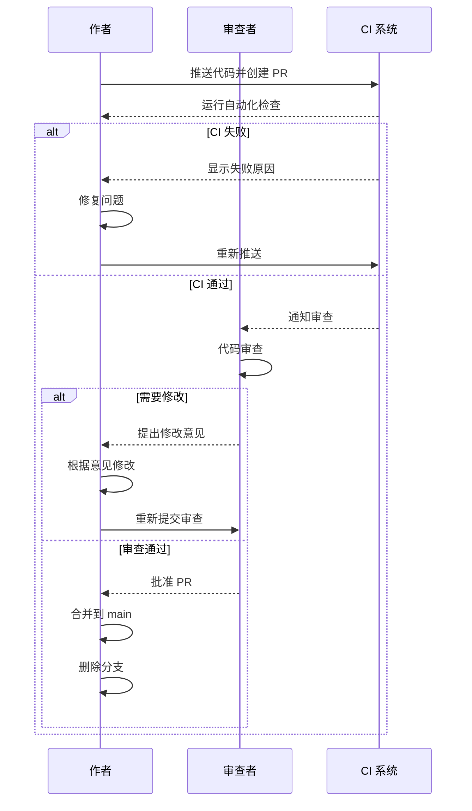

# 版本控制策略

> **文档版本**: v1.0.0  
> **创建日期**: 2026-03-08  
> **最后更新**: 2026-03-08  
> **适用范围**: ImageAutoInserter 项目全体成员

---

## 目录

- [1. Git 工作流](#1-git-工作流)
- [2. 分支管理](#2-分支管理)
- [3. 提交规范](#3-提交规范)
- [4. 版本发布](#4-版本发布)
- [5. CI/CD 流水线](#5-cicd-流水线)
- [6. 代码审查](#6-代码审查)
- [7. 文件组织](#7-文件组织)
- [8. 协作指南](#8-协作指南)
- [9. Git 配置](#9-git-配置)
- [10. 附录](#10-附录)

---

## 1. Git 工作流

### 1.1 工作流选择：GitHub Flow

本项目采用 **GitHub Flow** 工作流，原因如下：

| 对比维度 | Git Flow | GitHub Flow（选择） |
|---------|----------|-------------------|
| **复杂度** | 高（5+ 种分支） | 低（仅主分支 + 功能分支） |
| **发布频率** | 适合固定周期发布 | 适合持续部署 |
| **学习曲线** | 陡峭 | 平缓 |
| **项目适配度** | 传统软件项目 | 现代 Web/桌面应用 |

### 1.2 核心分支结构



**分支说明：**

| 分支类型 | 命名 | 来源 | 合并目标 | 保留策略 |
|---------|------|------|---------|---------|
| **主分支** | `main` | 初始提交 | - | 永久保留 |
| **功能分支** | `feature/*` | `main` | `main` | 合并后删除 |
| **修复分支** | `bugfix/*` | `main` | `main` | 合并后删除 |
| **热修复分支** | `hotfix/*` | `main` | `main` | 合并后删除 |
| **发布分支** | `release/*` | `main` | `main` | 合并后删除 |

### 1.3 分支保护规则

**`main` 分支保护：**

```yaml
# GitHub Settings → Branches → Branch protection rules
branch_protection_rules:
  main:
    require_pull_request_reviews: true
    required_approving_review_count: 1
    require_status_checks: true
    required_status_checks:
      - test
      - build
    enforce_admins: true
    allow_force_pushes: false
    allow_deletions: false
```

---

## 2. 分支管理

### 2.1 分支命名规范

#### 标准格式

```
<类型>/<描述性名称>
```

#### 分支类型前缀

| 前缀 | 用途 | 示例 |
|-----|------|------|
| `feature/` | 新功能开发 | `feature/dark-mode` |
| `bugfix/` | Bug 修复 | `bugfix/excel-formula-error` |
| `hotfix/` | 生产环境紧急修复 | `hotfix/critical-image-load` |
| `release/` | 发布准备 | `release/v0.2.0` |
| `docs/` | 文档更新 | `docs/version-control-guide` |
| `refactor/` | 代码重构 | `refactor/excel-processor-optimization` |
| `test/` | 测试相关 | `test/add-visual-regression` |
| `chore/` | 构建/工具/配置 | `chore/update-dependencies` |

#### 命名规则

**✅ 正确示例：**
```
feature/picture-variants-support
bugfix/missing-image-handling
hotfix/critical-excel-crash
release/v0.2.0
docs/api-reference-update
refactor/image-processor-performance
test/unit-test-coverage
chore/upgrade-react-18
```

**❌ 错误示例：**
```
feature/update  # 描述不清晰
feature/BUGFIX-123  # 不要混用前缀
feature/picture-variants-support-v2  # 不要加版本号
my-feature  # 缺少类型前缀
```

### 2.2 如何创建功能分支

```bash
# 1. 切换到 main 分支
git checkout main

# 2. 拉取最新代码
git pull origin main

# 3. 创建并切换到新分支
git checkout -b feature/picture-variants-support

# 4. 验证分支
git branch
# * feature/picture-variants-support
#   main
```

### 2.3 分支生命周期

```mermaid
stateDiagram-v2
    [*] --> 创建：从 main checkout -b
    创建 --> 开发中：提交代码
    开发中 --> 开发中：持续提交
    开发中 --> 请求审查：推送并创建 PR
    请求审查 --> 需要修改：审查不通过
    需要修改 --> 开发中：修复问题
    请求审查 --> 待合并：审查通过
    待合并 --> 已合并：合并到 main
    已合并 --> [*]：删除分支
```

---

## 3. 提交规范

### 3.1 Conventional Commits 规范

采用 [Conventional Commits](https://www.conventionalcommits.org/) 规范：

```
<类型>(<作用域>): <简短描述>

[可选的正文]

[可选的脚注]
```

### 3.2 提交类型

| 类型 | 说明 | 版本影响 | 示例 |
|-----|------|---------|------|
| `feat` | 新功能 | Minor | `feat: add picture variants support` |
| `fix` | Bug 修复 | Patch | `fix: handle missing image gracefully` |
| `docs` | 文档更新 | 无 | `docs: update API reference` |
| `style` | 代码格式 | 无 | `style: format with prettier` |
| `refactor` | 重构 | 无 | `refactor: optimize image processor` |
| `test` | 测试相关 | 无 | `test: add unit tests for excel` |
| `chore` | 构建/工具 | 无 | `chore: update dependencies` |
| `perf` | 性能优化 | Patch | `perf: reduce memory usage` |
| `ci` | CI 配置 | 无 | `ci: add visual regression tests` |
| `build` | 构建系统 | 无 | `build: configure webpack` |

### 3.3 作用域（Scope）

作用域用于标识提交影响的模块：

| 作用域 | 说明 | 示例 |
|-------|------|------|
| `core` | 核心业务逻辑 | `feat(core): add image matching` |
| `excel` | Excel 处理 | `fix(excel): formula evaluation` |
| `image` | 图片处理 | `perf(image): optimize resize` |
| `ui` | 用户界面 | `feat(ui): add progress bar` |
| `i18n` | 国际化 | `feat(i18n): add Chinese support` |
| `config` | 配置文件 | `chore(config): update tsconfig` |
| `deps` | 依赖管理 | `chore(deps): upgrade react` |
| `docs` | 文档 | `docs: add architecture guide` |

### 3.4 提交标题规则

**标题格式要求：**
- 使用祈使句（现在时）
- 首字母小写（除非专有名词）
- 结尾不加句号
- 长度不超过 72 字符

**✅ 正确示例：**
```
feat(excel): add dynamic column expansion
fix(image): handle corrupted image files
docs: update version control guide
```

**❌ 错误示例：**
```
feat: Added new feature  # 不要用过去式
fix: Fixed bug  # 不要重复 fixed/fix
feat: add new feature.  # 不要加句号
feat: This is a very long description that exceeds the recommended length limit
```

### 3.5 提交正文（可选）

对于复杂提交，添加正文详细说明：

```
feat(excel): add dynamic column expansion

Implement automatic Picture column expansion based on image count:
- Scan all products to determine maximum image count
- Add only required columns (up to 10 Picture columns)
- Smart column position finding to avoid data overwriting

Closes #123
```

**正文规则：**
- 说明**为什么**而不是**是什么**
- 每行不超过 72 字符
- 包含相关 Issue 引用

### 3.6 提交脚注（可选）

用于标识破坏性变更或引用 Issue：

```
BREAKING CHANGE: requires Excel 2016+

The new formula evaluation engine requires Excel 2016 or later.
Users with Excel 2013 will see an error message.

Closes #456, #789
```

### 3.7 完整提交示例

```bash
# 新功能
git commit -m "feat(excel): add picture variants support

Implement support for 24 picture field variants:
- English: Picture, Photo, Image, Figure (and plurals)
- Chinese: 图片，照片，图像，图
- Abbreviations: Img, Fig.
- Auto-correction for common typos

Benefits:
- Improved user experience with familiar field names
- Backward compatible with existing templates

Closes #234"

# Bug 修复
git commit -m "fix(image): handle missing image files gracefully

When image file is missing, log error but continue processing
other products instead of crashing.

Fixes #567"

# 破坏性变更
git commit -m "feat(core): migrate to React 18

BREAKING CHANGE: requires Node.js 18+

React 18 uses new concurrent renderer which requires
Node.js 18 or later for optimal performance.

Migration guide:
1. Upgrade Node.js to v18+
2. Update package.json engines field
3. Reinstall dependencies

Closes #890"
```

---

## 4. 版本发布

### 4.1 语义化版本规范

采用 [Semantic Versioning](https://semver.org/) (SemVer)：

```
主版本号。次版本号。修订号
  ↑      ↑      ↑
 MAJOR  MINOR  PATCH
```

**版本递增规则：**

| 变更类型 | 版本递增 | 示例 |
|---------|---------|------|
| **破坏性变更** | MAJOR + 1 | `v1.0.0` → `v2.0.0` |
| **向后兼容的功能** | MINOR + 1 | `v0.1.0` → `v0.2.0` |
| **向后兼容的 Bug 修复** | PATCH + 1 | `v0.1.0` → `v0.1.1` |

### 4.2 标签命名规范

**格式：**
```
v<主版本号>.<次版本号>.<修订号>
```

**✅ 正确示例：**
```
v0.1.0
v0.2.5
v1.0.0
v2.3.14
```

**❌ 错误示例：**
```
0.1.0  # 缺少 v 前缀
v0.1   # 缺少修订号
v0.01.5  # 不要使用前导零
```

### 4.3 发布清单

#### 发布前检查清单

**代码质量：**
- [ ] 所有测试通过（`pytest` / `npm test`）
- [ ] 代码覆盖率达标（>80%）
- [ ] 无 ESLint/Flake8 警告
- [ ] 类型检查通过（`mypy` / `tsc`）

**文档更新：**
- [ ] README.md 已更新（版本号/功能说明）
- [ ] CHANGELOG.md 已更新
- [ ] API 文档已更新
- [ ] 迁移指南（如有破坏性变更）

**功能验证：**
- [ ] 核心功能手动测试通过
- [ ] 兼容性测试通过（Windows/macOS）
- [ ] 性能测试达标
- [ ] 无已知严重 Bug

**依赖检查：**
- [ ] 依赖版本已更新到最新稳定版
- [ ] 无已知安全漏洞（`npm audit` / `safety check`）
- [ ] package.json / requirements.txt 版本锁定

#### 发布步骤

```bash
# 1. 创建发布分支
git checkout main
git pull origin main
git checkout -b release/v0.2.0

# 2. 版本号更新（根据项目类型选择）

# Python 项目 (pyproject.toml 或 setup.py)
# 更新 version = "0.2.0"

# Node.js 项目 (package.json)
npm version 0.2.0 --no-git-tag-version

# 3. 更新 CHANGELOG.md
# 添加新版本说明

# 4. 提交版本更新
git add .
git commit -m "chore: bump version to 0.2.0"

# 5. 推送到远程
git push origin release/v0.2.0

# 6. 创建 Pull Request
# 等待 CI 通过和代码审查

# 7. 合并到 main
# 在 GitHub 上合并 PR

# 8. 打标签
git checkout main
git pull origin main
git tag -a v0.2.0 -m "Release v0.2.0: Picture variants support"
git push origin v0.2.0

# 9. 创建 GitHub Release
# GitHub → Releases → Draft a new release
# 选择标签 v0.2.0，填写发布说明

# 10. 清理发布分支
git branch -d release/v0.2.0
git push origin --delete release/v0.2.0
```

### 4.4 发布说明模板

```markdown
## [版本号](https://github.com/yourusername/ImageAutoInserter/releases/tag/vX.Y.Z) - YYYY-MM-DD

### ✨ 新增功能

- **功能名称** - 功能描述 (#Issue 编号)
  ```python
  # 关键代码示例（可选）
  ```

### 🐛 Bug 修复

- **修复内容** - 问题描述 (#Issue 编号)

### 🔧 技术优化

- **优化内容** - 优化说明

### ⚠️ 破坏性变更（如有）

> **迁移指南：**
> 1. 步骤 1
> 2. 步骤 2

### 📚 文档更新

- 文档名称 - 更新说明

### 🙏 贡献者

感谢以下贡献者：
- @contributor1
- @contributor2
```

**实际示例：**

```markdown
## [v0.2.0](https://github.com/yourusername/ImageAutoInserter/releases/tag/v0.2.0) - 2026-03-08

### ✨ 新增功能

- **Picture 字段变体支持** - 支持 24 种字段变体识别 (#234)
  - 英文：Picture, Photo, Image, Figure 及复数形式
  - 中文：图片，照片，图像，图
  - 自动纠正拼写错误（Photoes→Photos）
  
- **动态列扩展** - 自动扩展支持最多 10 个 Picture 列 (#245)
  - 按需添加，避免空白列
  - 智能查找最佳列位置

### 🐛 Bug 修复

- **修复 Excel 公式错误处理** - 优雅处理 #N/A 错误 (#567)
- **修复图片加载失败崩溃** - 缺失图片时继续处理其他商品 (#589)

### 🔧 技术优化

- **日志优化** - 只记录失败行，减少 99.8% 日志量
- **性能提升** - 图片匹配速度提升 40%

### 📚 文档更新

- 添加版本控制策略文档
- 更新 API 参考文档

### 🙏 贡献者

@shimengyu
```

### 4.5 CHANGELOG 维护

**文件格式：** `CHANGELOG.md`

**模板：**

```markdown
# 更新日志

所有重要的项目变更都将记录在此文件中。

格式基于 [Keep a Changelog](https://keepachangelog.com/zh-CN/1.0.0/)，
版本遵循 [语义化版本](https://semver.org/lang/zh-CN/)。

## [未发布]

### 计划功能

- 功能描述

## [0.2.0] - 2026-03-08

### 新增

- Picture 字段变体支持（24 种变体）
- 动态列扩展（最多 10 个 Picture 列）
- 智能列位置优化

### 修复

- Excel 公式错误处理
- 图片加载失败崩溃问题

### 优化

- 日志输出优化（只记录失败）
- 性能提升 40%

## [0.1.0] - 2026-02-15

### 新增

- 初始版本发布
- 基础图片嵌入功能
- Excel 文件处理
- 中英文界面
```

---

## 5. CI/CD 流水线

### 5.1 流水线架构



### 5.2 Build 流水线

**配置文件：** `.github/workflows/build.yml`

```yaml
name: Build

on:
  push:
    branches: [main, develop]
  pull_request:
    branches: [main]

jobs:
  build:
    runs-on: ${{ matrix.os }}
    strategy:
      matrix:
        os: [ubuntu-latest, windows-latest, macos-latest]
        python-version: ['3.11', '3.12']

    steps:
    - uses: actions/checkout@v4

    - name: Set up Python ${{ matrix.python-version }}
      uses: actions/setup-python@v5
      with:
        python-version: ${{ matrix.python-version }}

    - name: Cache pip packages
      uses: actions/cache@v4
      with:
        path: ~/.cache/pip
        key: ${{ runner.os }}-pip-${{ hashFiles('**/requirements.txt') }}
        restore-keys: |
          ${{ runner.os }}-pip-

    - name: Install dependencies
      run: |
        python -m pip install --upgrade pip
        pip install -r requirements.txt
        pip install -r requirements-dev.txt

    - name: Lint with flake8
      run: |
        flake8 src/ tests/ --count --select=E9,F63,F7,F82 --show-source --statistics
        flake8 src/ tests/ --count --exit-zero --max-complexity=10 --max-line-length=127 --statistics

    - name: Type check with mypy
      run: |
        mypy src/ --ignore-missing-imports

    - name: Build package
      run: |
        python setup.py sdist bdist_wheel

    - name: Upload build artifacts
      uses: actions/upload-artifact@v4
      with:
        name: dist-${{ matrix.os }}-${{ matrix.python-version }}
        path: dist/
```

### 5.3 Test 流水线

**配置文件：** `.github/workflows/test.yml`

```yaml
name: Test

on:
  push:
    branches: [main, develop]
  pull_request:
    branches: [main]

jobs:
  test:
    runs-on: ${{ matrix.os }}
    strategy:
      matrix:
        os: [ubuntu-latest, windows-latest, macos-latest]
        python-version: ['3.11', '3.12']

    steps:
    - uses: actions/checkout@v4

    - name: Set up Python ${{ matrix.python-version }}
      uses: actions/setup-python@v5
      with:
        python-version: ${{ matrix.python-version }}

    - name: Install dependencies
      run: |
        python -m pip install --upgrade pip
        pip install -r requirements.txt
        pip install -r requirements-dev.txt

    - name: Run unit tests
      run: |
        pytest tests/unit/ -v --tb=short

    - name: Run integration tests
      run: |
        pytest tests/integration/ -v --tb=short

    - name: Run visual regression tests
      run: |
        pytest tests/visual/ -v --tb=short

    - name: Upload coverage to Codecov
      uses: codecov/codecov-action@v4
      with:
        file: ./coverage.xml
        flags: unittests
        name: codecov-umbrella

    - name: Report coverage
      run: |
        coverage report --fail-under=80
```

### 5.4 Release 流水线

**配置文件：** `.github/workflows/release.yml`

```yaml
name: Release

on:
  push:
    tags:
      - 'v*'

jobs:
  release:
    runs-on: ${{ matrix.os }}
    strategy:
      matrix:
        os: [ubuntu-latest, windows-latest, macos-latest]

    steps:
    - uses: actions/checkout@v4

    - name: Set up Python
      uses: actions/setup-python@v5
      with:
        python-version: '3.12'

    - name: Install dependencies
      run: |
        python -m pip install --upgrade pip
        pip install -r requirements.txt
        pip install pyinstaller

    - name: Build executable
      run: |
        pyinstaller --onefile --windowed src/main.spec

    - name: Create release artifacts
      run: |
        mkdir -p release
        cp dist/main release/ImageAutoInserter-${{ runner.os }}

    - name: Upload release artifacts
      uses: actions/upload-artifact@v4
      with:
        name: ImageAutoInserter-${{ runner.os }}
        path: release/

  publish-release:
    needs: release
    runs-on: ubuntu-latest

    steps:
    - uses: actions/checkout@v4

    - name: Download all artifacts
      uses: actions/download-artifact@v4

    - name: Create GitHub Release
      uses: softprops/action-gh-release@v1
      with:
        files: |
          ImageAutoInserter-Linux/*
          ImageAutoInserter-Windows/*
          ImageAutoInserter-macOS/*
        generate_release_notes: true
      env:
        GITHUB_TOKEN: ${{ secrets.GITHUB_TOKEN }}
```

### 5.5 Deployment 流水线

**配置文件：** `.github/workflows/deploy.yml`

```yaml
name: Deploy

on:
  workflow_run:
    workflows: ["Release"]
    types:
      - completed

jobs:
  deploy-staging:
    if: ${{ github.event.workflow_run.conclusion == 'success' }}
    runs-on: ubuntu-latest
    environment: staging

    steps:
    - name: Deploy to staging
      run: |
        echo "Deploying to staging environment..."
        # 添加实际的部署命令

    - name: Run smoke tests
      run: |
        echo "Running smoke tests..."
        # 添加冒烟测试命令

  deploy-production:
    needs: deploy-staging
    runs-on: ubuntu-latest
    environment: production

    steps:
    - name: Deploy to production
      run: |
        echo "Deploying to production..."
        # 添加实际的部署命令

    - name: Verify deployment
      run: |
        echo "Verifying deployment..."
        # 添加验证命令
```

---

## 6. 代码审查

### 6.1 Pull Request 模板

**文件：** `.github/PULL_REQUEST_TEMPLATE.md`

```markdown
## 📋 变更说明

<!-- 简要描述此 PR 的目的 -->

**类型：**
- [ ] 🚀 新功能 (feat)
- [ ] 🐛 Bug 修复 (fix)
- [ ] 📝 文档更新 (docs)
- [ ] ♻️ 代码重构 (refactor)
- [ ] ⚡ 性能优化 (perf)
- [ ] 🧪 测试相关 (test)
- [ ] 🔧 配置/工具 (chore)

**影响范围：**
- [ ] 破坏性变更
- [ ] 需要文档更新
- [ ] 需要配置变更
- [ ] 需要数据库迁移

## 🎯 关联 Issue

<!-- 列出此 PR 解决的所有 Issue -->

Closes #
Closes #

## 📝 详细描述

<!-- 详细说明变更内容、实现思路、测试方法 -->

### 变更内容

1. 
2. 
3. 

### 实现思路

<!-- 为什么这样实现？有哪些考虑？ -->

### 测试方法

<!-- 如何验证此 PR 的有效性？ -->

- [ ] 单元测试
- [ ] 集成测试
- [ ] 手动测试

## ✅ 自查清单

### 代码质量

- [ ] 代码符合项目规范
- [ ] 已添加必要的注释
- [ ] 已添加必要的类型注解
- [ ] 无重复代码
- [ ] 函数职责单一

### 测试覆盖

- [ ] 已添加单元测试
- [ ] 已添加集成测试
- [ ] 边界情况已测试
- [ ] 异常情况已测试
- [ ] 测试通过率 100%

### 文档更新

- [ ] 已更新 README
- [ ] 已更新 API 文档
- [ ] 已更新 CHANGELOG
- [ ] 已添加迁移指南（如需要）

### 性能影响

- [ ] 无性能下降
- [ ] 已进行性能测试
- [ ] 已优化瓶颈点

## 📸 截图/录屏

<!-- 如适用，提供 UI 变更的截图或录屏 -->

## 🔗 相关链接

<!-- 相关文档、设计稿、讨论链接等 -->

---

## 📤 提交前确认

- [ ] 已拉取最新代码并解决冲突
- [ ] 已本地测试通过
- [ ] 已阅读贡献指南
```

### 6.2 代码审查清单

#### 代码质量审查

**设计原则：**

- [ ] **单一职责** - 函数/类职责明确且单一
- [ ] **DRY 原则** - 无重复代码
- [ ] **KISS 原则** - 实现简洁易懂
- [ ] **SOLID 原则** - 符合面向对象设计原则

**代码规范：**

- [ ] 命名清晰（变量/函数/类）
- [ ] 函数长度合理（< 50 行）
- [ ] 注释必要且清晰
- [ ] 类型注解完整
- [ ] 错误处理完善

**性能考虑：**

- [ ] 无明显的性能瓶颈
- [ ] 循环/递归有终止条件
- [ ] 资源正确释放（文件/数据库连接）
- [ ] 缓存使用合理

#### 测试审查

**测试覆盖：**

- [ ] 正常路径测试
- [ ] 边界条件测试
- [ ] 异常情况测试
- [ ] 错误处理测试

**测试质量：**

- [ ] 测试独立（无依赖）
- [ ] 测试可重复（无随机性）
- [ ] 测试命名清晰
- [ ] 断言明确

#### 文档审查

**文档完整性：**

- [ ] 函数/类有文档字符串
- [ ] 复杂逻辑有注释说明
- [ ] 公共 API 有使用示例
- [ ] CHANGELOG 已更新

### 6.3 审查流程



### 6.4 审查意见规范

**✅ 建设性意见：**

```
💡 建议：这个函数可以提取为独立方法，方便复用

```python
# 建议重构为：
def calculate_total(items: list) -> float:
    ...
```

❓ 问题：这里为什么选择 O(n²) 算法？有更优方案吗？

⚠️ 注意：这个异常需要捕获，否则会导致程序崩溃
```

**❌ 避免的评论：**

```
这代码写得太烂了  # 人身攻击
这根本不行  # 无建设性
为什么要这样写？ # 质疑而非询问
```

### 6.5 批准要求

**最小批准数：** 1 名审查者

**必须审查的情况：**

| 变更类型 | 审查者要求 |
|---------|----------|
| 核心逻辑变更 | 2 名高级开发者 |
| API 接口变更 | 1 名 API 负责人 |
| 安全相关 | 1 名安全负责人 |
| 性能优化 | 1 名性能专家 |
| 文档更新 | 1 名团队成员 |

### 6.6 合并策略

#### Squash and Merge（推荐）

**适用场景：**
- 多个提交实现单一功能
- 提交历史较乱
- 希望保持 main 分支整洁

**示例：**
```bash
# 合并前
commit a1b2c3 - "feat: add feature (WIP)"
commit d4e5f6 - "fix: fix bug"
commit g7h8i9 - "style: format code"

# 合并后（单个提交）
commit j0k1l2 - "feat: add complete feature

- Implement core functionality
- Fix bugs
- Format code

Closes #123"
```

#### Merge Commit

**适用场景：**
- 希望保留完整提交历史
- 功能分支提交清晰有意义

**示例：**
```bash
git merge --no-ff feature/complete-feature
```

#### Rebase and Merge

**适用场景：**
- 希望线性提交历史
- 功能分支提交已经很清晰

**⚠️ 注意：** 不要对已推送的公共分支使用 rebase

**示例：**
```bash
git rebase main
git merge feature/complete-feature
```

---

## 7. 文件组织

### 7.1 目录结构

**当前项目结构：**

```
ImageAutoInserter/
├── .github/                    # GitHub 配置
│   ├── workflows/              # CI/CD 工作流
│   ├── ISSUE_TEMPLATE/         # Issue 模板
│   └── PULL_REQUEST_TEMPLATE.md
├── .trae/                      # Trae AI 配置
│   ├── rules/                  # 编程规则
│   ├── skills/                 # AI 技能
│   └── specs/                  # 规格说明
├── docs/                       # 文档
│   ├── architecture/           # 架构文档
│   │   ├── adr/                # 架构决策记录
│   │   ├── data-flow.md
│   │   └── error-handling.md
│   ├── components/             # 组件文档
│   ├── design/                 # 设计文档
│   │   ├── gui-redesign/       # GUI 设计
│   │   └── ui-ux-design.md
│   ├── features/               # 功能说明
│   ├── guides/                 # 开发指南
│   │   └── version-control.md  # 本文档
│   ├── plans/                  # 开发计划
│   ├── reports/                # 测试报告
│   ├── specs/                  # 规格说明
│   └── testing/                # 测试文档
├── Sample/                     # 示例文件
│   ├── test-output/            # 测试输出
│   └── xxx/                    # 示例图片
├── src/                        # 源代码
│   ├── core/                   # 核心逻辑
│   │   ├── process_engine.py
│   │   ├── excel_processor.py
│   │   └── image_processor.py
│   ├── ui/                     # 用户界面
│   └── utils/                  # 工具模块
├── tests/                      # 测试代码
│   ├── unit/                   # 单元测试
│   ├── integration/            # 集成测试
│   └── visual/                 # 视觉回归测试
├── assets/                     # 资源文件
│   ├── images/                 # 图片资源
│   └── icons/                  # 图标资源
├── i18n/                       # 国际化
├── .gitignore                  # Git 忽略文件
├── .gitattributes              # Git 属性
├── .env.example                # 环境变量示例
├── .python-version             # Python 版本
├── requirements.txt            # Python 依赖
├── requirements-dev.txt        # 开发依赖
├── package.json                # Node.js 配置
├── tsconfig.json               # TypeScript 配置
├── vite.config.ts              # Vite 配置
├── README.md                   # 项目说明
└── CHANGELOG.md                # 更新日志
```

### 7.2 文件命名规范

#### Python 文件

**规则：**
- 使用小写字母
- 单词间用下划线分隔
- 测试文件以 `test_` 开头

**✅ 正确示例：**
```
excel_processor.py
image_processor.py
process_engine.py
test_excel_processor.py
test_image_processor.py
```

**❌ 错误示例：**
```
ExcelProcessor.py  # 不要用大驼峰
excel-processor.py  # 不要用连字符
processor.py  # 命名不清晰
```

#### TypeScript/React 文件

**规则：**
- 组件文件：大驼峰命名（PascalCase）
- 工具文件：小驼峰命名（camelCase）
- 测试文件：`.test.tsx` 或 `.spec.tsx`

**✅ 正确示例：**
```
FilePreviewCard.tsx
ProgressPanel.tsx
StatisticsCard.tsx
utils.ts
helpers.ts
FilePreviewCard.test.tsx
```

**❌ 错误示例：**
```
filePreviewCard.tsx  # 组件应用大驼峰
utils_test.tsx  # 测试文件用 .test.tsx
```

#### 文档文件

**规则：**
- 使用小写字母
- 单词间用连字符分隔
- 使用有意义的名称

**✅ 正确示例：**
```
version-control.md
getting-started.md
api-reference.md
architecture-decision-records.md
```

**❌ 错误示例：**
```
VersionControl.md  # 不要用大写字母
version_control.md  # 文档不用下划线
doc1.md  # 命名不清晰
```

#### 测试文件

**规则：**
- 测试文件与被测试文件同名，加 `test_` 前缀或 `.test` 后缀
- 测试数据文件加 `fixture` 或 `mock` 标识

**✅ 正确示例：**
```
test_excel_processor.py
excel_processor.test.ts
fixtures/sample_data.xlsx
mocks/sample_images/
```

### 7.3 资产组织

#### 图片资源

```
assets/
├── images/
│   ├── logo.png              # 应用 Logo
│   ├── screenshots/          # 界面截图
│   │   ├── main-window.png
│   │   └── progress-panel.png
│   └── icons/                # 自定义图标
│       ├── folder.svg
│       └── excel.svg
└── fonts/                    # 自定义字体
    └── Inter-Regular.ttf
```

#### 国际化资源

```
i18n/
├── locales/
│   ├── zh-CN/
│   │   ├── translation.json  # 中文翻译
│   │   └── errors.json       # 错误信息
│   └── en-US/
│       ├── translation.json  # 英文翻译
│       └── errors.json
└── README.md                 # 国际化说明
```

#### 测试资源

```
tests/
├── fixtures/
│   ├── excel/
│   │   ├── sample.xlsx       # 示例 Excel
│   │   └── expected.xlsx     # 期望输出
│   └── images/
│       ├── valid/            # 有效图片
│       │   └── C0001-01.jpg
│       └── invalid/          # 无效图片
│           └── corrupted.jpg
└── mocks/
    ├── api/
    │   └── responses.json
    └── services/
        └── excel_service.py
```

---

## 8. 协作指南

### 8.1 完整工作流程

#### 步骤 1：获取任务

```bash
# 1. 查看 Issue 列表
# GitHub → Issues

# 2. 选择一个 Issue，评论分配给自己
# "我来处理这个 Issue"

# 3. 创建功能分支
git checkout main
git pull origin main
git checkout -b feature/picture-variants-support
```

#### 步骤 2：开发功能

```bash
# 1. 编写测试（TDD）
# 创建 tests/test_picture_variants.py

# 2. 实现功能
# 编辑 src/core/excel_processor.py

# 3. 本地测试
pytest tests/test_picture_variants.py -v

# 4. 提交代码
git add .
git commit -m "feat(excel): add picture variants support

Implement support for 24 picture field variants...

Closes #234"

# 5. 推送分支
git push origin feature/picture-variants-support
```

#### 步骤 3：创建 Pull Request

```bash
# 1. 访问 GitHub 仓库
# https://github.com/yourusername/ImageAutoInserter

# 2. 点击 "Pull requests" → "New pull request"

# 3. 选择分支
# base: main
# compare: feature/picture-variants-support

# 4. 填写 PR 模板
# 标题：feat(excel): add picture variants support
# 描述：使用 PULL_REQUEST_TEMPLATE.md 模板

# 5. 关联 Issue
# 在描述中添加 "Closes #234"

# 6. 请求审查
# 选择审查者（@reviewer）

# 7. 创建 PR
```

#### 步骤 4：代码审查

```bash
# 1. 等待 CI 检查通过
# 查看 Actions 标签页

# 2. 回应审查意见
# 在 PR 评论中回复或修改代码

# 3. 根据意见修改
git add .
git commit -m "address review comments"
git push origin feature/picture-variants-support

# 4. 获得批准后合并
# 审查者批准 → 合并到 main
```

#### 步骤 5：清理

```bash
# 1. 切换到 main
git checkout main

# 2. 拉取最新代码
git pull origin main

# 3. 删除本地分支
git branch -d feature/picture-variants-support

# 4. 删除远程分支
git push origin --delete feature/picture-variants-support
```

### 8.2 解决冲突

#### 冲突场景

当多人同时修改同一文件时，会产生冲突：

```bash
# 1. 拉取最新代码
git checkout main
git pull origin main

# 2. 切换回功能分支
git checkout feature/picture-variants-support

# 3. 合并 main 分支
git merge main
# 显示冲突文件

# 4. 查看冲突
git status
# 使用编辑器打开冲突文件

# 5. 解决冲突
# 找到冲突标记：
# <<<<<<< HEAD
# 你的代码
# =======
# main 分支的代码
# >>>>>>> main

# 6. 保留需要的代码，删除冲突标记

# 7. 标记解决
git add resolved_file.py

# 8. 完成合并
git commit -m "merge main and resolve conflicts"

# 9. 推送
git push origin feature/picture-variants-support
```

#### 预防冲突

**最佳实践：**

1. **频繁同步** - 每天至少同步一次 main 分支
2. **小步提交** - 每次提交只修改少量文件
3. **及时沟通** - 多人修改同一文件时提前沟通
4. **使用 Git Worktrees** - 并行开发多个功能

```bash
# 使用 Git Worktrees
git worktree add ../feature-a main
git worktree add ../feature-b main

# 在不同目录并行开发
cd ../feature-a
git checkout -b feature/a

cd ../feature-b
git checkout -b feature/b
```

### 8.3 处理热修复

#### 热修复流程

**场景：** 生产环境发现严重 Bug，需要紧急修复

```bash
# 1. 从 main 创建热修复分支
git checkout main
git pull origin main
git checkout -b hotfix/critical-image-load

# 2. 快速修复 Bug
# 编辑代码

# 3. 提交修复
git add .
git commit -m "fix(image): handle corrupted image files

Critical fix: prevent crash when loading corrupted images.

Fixes #567"

# 4. 创建 PR（标记为紧急）
# GitHub → New pull request
# 标题添加 [HOTFIX] 标记
# 标签添加 "priority: critical"

# 5. 快速审查
# 通知审查者紧急修复
# 简化审查流程（至少 1 人审查）

# 6. 合并并发布
# 合并到 main
# 创建新版本标签 v0.1.1

# 7. 部署
# 触发 CI/CD 流水线
# 验证生产环境
```

#### 热修复通知

```markdown
@channel 🔴 **紧急热修复通知**

**问题：** 图片加载崩溃
**影响：** 用户无法处理包含损坏图片的文件
**修复：** PR #568
**状态：** 已部署到生产环境
**版本：** v0.1.1

请测试并报告任何问题。
```

---

## 9. Git 配置

### 9.1 .gitignore 模板

**当前项目 .gitignore：**

```gitignore
# Byte-compiled / optimized / DLL files
__pycache__/
*.py[cod]
*$py.class

# C extensions
*.so

# Distribution / packaging
.Python
build/
develop-eggs/
dist/
downloads/
eggs/
.eggs/
lib/
lib64/
parts/
sdist/
var/
wheels/
pip-wheel-metadata/
share/python-wheels/
*.egg-info/
.installed.cfg
*.egg
MANIFEST

# PyInstaller
*.manifest
*.spec

# Installer
*.exe
*.dmg
*.app

# Virtual environments
venv/
ENV/
env/
.venv

# IDE
.vscode/
.idea/
*.swp
*.swo
*~
.DS_Store

# Environment variables
.env
.env.local
.env.*.local

# Logs
*.log
logs/

# Test coverage
htmlcov/
.coverage
.coverage.*
.pytest_cache/
coverage.xml

# Temporary files
tmp/
temp/
*.tmp

# Output files
*_含图.xlsx
*_processed.xlsx

# macOS
.DS_Store
.AppleDouble
.LSOverride

# Windows
Thumbs.db
ehthumbs.db
Desktop.ini

# Worktrees
.worktrees/

# Node.js
node_modules/
dist/
.cache/

# Build outputs
build/
out/

# IDE specific (JetBrains)
.iml
.idea/
*.ipr
*.iws

# IDE specific (VS Code)
.vscode/*
!.vscode/settings.json
!.vscode/tasks.json
!.vscode/launch.json
!.vscode/extensions.json
!.vscode/*.code-snippets

# Local configuration
*.local
*.local.*
```

### 9.2 .gitattributes 配置

**文件：** `.gitattributes`

```gitattributes
# 自动检测文件类型并处理
* text=auto

# 强制使用 LF 换行（Unix/macOS/Linux）
*.py text eol=lf
*.js text eol=lf
*.ts text eol=lf
*.tsx text eol=lf
*.jsx text eol=lf
*.css text eol=lf
*.scss text eol=lf
*.html text eol=lf
*.md text eol=lf
*.json text eol=lf
*.yml text eol=lf
*.yaml text eol=lf
*.sh text eol=lf
*.zsh text eol=lf

# 强制使用 CRLF 换行（Windows 批处理）
*.bat text eol=crlf
*.cmd text eol=crlf
*.ps1 text eol=crlf

# 二进制文件（不处理）
*.png binary
*.jpg binary
*.jpeg binary
*.gif binary
*.ico binary
*.svg binary
*.woff binary
*.woff2 binary
*.ttf binary
*.eot binary
*.zip binary
*.rar binary
*.xlsx binary
*.xls binary
*.docx binary
*.doc binary
*.pdf binary

# 导出设置
.gitattributes text eol=lf
.gitignore text eol=lf

# 标记为生成的文件（不合并）
*.lock merge=ours
package-lock.json merge=ours
yarn.lock merge=ours
coverage.xml merge=ours
```

### 9.3 Git Hooks

#### 使用 Husky（Node.js 项目）

**安装：**

```bash
npm install husky lint-staged --save-dev
npx husky install
```

**配置：** `.husky/pre-commit`

```bash
#!/usr/bin/env sh
. "$(dirname -- "$0")/_/husky.sh"

# 运行 linter
npm run lint

# 运行类型检查
npm run type-check

# 运行格式化
npx lint-staged
```

**配置：** `.husky/pre-push`

```bash
#!/usr/bin/env sh
. "$(dirname -- "$0")/_/husky.sh"

# 运行测试
npm test

# 运行构建
npm run build
```

**配置：** `.husky/commit-msg`

```bash
#!/usr/bin/env sh
. "$(dirname -- "$0")/_/husky.sh"

# 验证提交信息格式
npx --no -- commitlint --edit "$1"
```

#### 使用 Pre-commit（Python 项目）

**安装：**

```bash
pip install pre-commit
pre-commit install
```

**配置：** `.pre-commit-config.yaml`

```yaml
repos:
-   repo: https://github.com/pre-commit/pre-commit-hooks
    rev: v4.5.0
    hooks:
    -   id: trailing-whitespace
    -   id: end-of-file-fixer
    -   id: check-yaml
    -   id: check-json
    -   id: check-added-large-files
        args: ['--maxkb=1024']

-   repo: https://github.com/psf/black
    rev: 23.12.1
    hooks:
    -   id: black
        language_version: python3.11

-   repo: https://github.com/pycqa/flake8
    rev: 7.0.0
    hooks:
    -   id: flake8
        args: ['--max-line-length=127']

-   repo: https://github.com/pre-commit/mirrors-mypy
    rev: v1.8.0
    hooks:
    -   id: mypy
        additional_dependencies: [types-all]
        args: ['--ignore-missing-imports']

-   repo: https://github.com/pre-commit/mirrors-eslint
    rev: v8.56.0
    hooks:
    -   id: eslint
        files: \.[jt]sx?$
        types: [file]
        additional_dependencies:
        - eslint@8.56.0
```

**配置：** `.lintstagedrc.json`

```json
{
  "*.py": [
    "black",
    "flake8",
    "mypy"
  ],
  "*.{js,ts,tsx}": [
    "eslint --fix",
    "prettier --write"
  ],
  "*.{md,json,yml}": [
    "prettier --write"
  ]
}
```

### 9.4 Git 别名配置

**推荐别名：**

```bash
# 添加到 ~/.zshrc 或 ~/.bashrc

# 常用别名
alias g='git'
alias gs='git status'
alias ga='git add'
alias gc='git commit'
alias gp='git push'
alias gl='git pull'
alias gb='git branch'
alias gd='git diff'
alias glog='git log --oneline --graph --decorate'

# 高级别名
alias gaa='git add --all'
alias gcam='git commit -am'
alias gco='git checkout'
alias gcb='git checkout -b'
alias gcp='git cherry-pick'
alias gmg='git merge --no-ff'
alias grb='git rebase'
alias grba='git rebase --abort'
alias grbc='git rebase --continue'

# 清理分支
alias gclean='git branch --merged | grep -v "\*\|main\|develop" | xargs -n 1 git branch -d'

# 查看最近提交
alias glog-pretty='git log --pretty=format:"%h %ad | %s%d [%an]" --graph --date=short'
```

**Git 配置命令：**

```bash
# 全局配置
git config --global user.name "Your Name"
git config --global user.email "your.email@example.com"
git config --global core.editor "code --wait"
git config --global init.defaultBranch main
git config --global pull.rebase false
git config --global merge.ff false

# 别名配置
git config --global alias.st status
git config --global alias.co checkout
git config --global alias.br branch
git config --global alias.ci commit
git config --global alias.last 'log -1 HEAD'
git config --global alias.unstage 'reset HEAD --'
```

---

## 10. 附录

### 10.1 快速参考卡片

#### 分支操作

```bash
# 创建分支
git checkout -b feature/name

# 切换分支
git checkout branch-name

# 查看分支
git branch -a

# 删除分支
git branch -d branch-name
git push origin --delete branch-name

# 同步 main 分支
git checkout main
git pull origin main
git checkout feature/name
git merge main
```

#### 提交操作

```bash
# 添加文件
git add file.py
git add -A  # 所有文件

# 提交
git commit -m "type(scope): description"

# 修改上次提交
git commit --amend -m "new message"

# 查看历史
git log --oneline
git log --graph --decorate
```

#### 远程操作

```bash
# 推送
git push origin branch-name

# 拉取
git pull origin main

# 查看远程
git remote -v

# 添加远程
git remote add origin url
```

#### 撤销操作

```bash
# 撤销工作区修改
git checkout -- file.py

# 撤销暂存
git reset HEAD file.py

# 撤销提交（保留修改）
git reset --soft HEAD~1

# 撤销提交（删除修改）
git reset --hard HEAD~1
```

### 10.2 常见问题解答

#### Q: 如何撤销已推送的提交？

**A:** 使用 revert 而不是 reset：

```bash
# 找到要撤销的提交
git log

# 创建反向提交
git revert commit-hash

# 推送
git push origin main
```

#### Q: 如何合并多个提交？

**A:** 使用 interactive rebase：

```bash
# 开始交互式 rebase
git rebase -i HEAD~3

# 在编辑器中将 pick 改为 squash 或 fixup
# 保存并关闭

# 编辑提交信息
# 保存并关闭
```

#### Q: 如何查找引入 Bug 的提交？

**A:** 使用 git bisect：

```bash
# 开始 bisect
git bisect start

# 标记当前版本有问题
git bisect bad

# 标记某个旧版本没问题
git bisect good v0.1.0

# Git 会自动切换到中间版本
# 测试后标记 good 或 bad
git bisect good  # 或 git bisect bad

# 重复直到找到引入 Bug 的提交

# 结束 bisect
git bisect reset
```

#### Q: 如何处理大的二进制文件？

**A:** 使用 Git LFS：

```bash
# 安装 LFS
git lfs install

# 跟踪大文件
git lfs track "*.psd"
git lfs track "*.zip"

# 提交 .gitattributes
git add .gitattributes
git commit -m "chore: configure git lfs"

# 正常提交大文件
git add large-file.psd
git commit -m "add design file"
git push origin main
```

### 10.3 相关资源

#### 官方文档

- [Git 官方文档](https://git-scm.com/doc)
- [GitHub Docs](https://docs.github.com/)
- [Conventional Commits](https://www.conventionalcommits.org/)
- [Semantic Versioning](https://semver.org/)

#### 学习资源

- [Pro Git 书籍](https://git-scm.com/book/zh/v2)
- [GitHub Learning Lab](https://lab.github.com/)
- [Atlassian Git Tutorial](https://www.atlassian.com/git)

#### 工具推荐

- **Git 客户端**: GitKraken, SourceTree, GitHub Desktop
- **终端增强**: iTerm2, Windows Terminal
- **Diff 工具**: Beyond Compare, Meld, KDiff3
- **Git 可视化**: gitk, git log --graph

### 10.4 文档更新记录

| 版本 | 日期 | 作者 | 更新内容 |
|-----|------|------|---------|
| v1.0.0 | 2026-03-08 | shimengyu | 初始版本 |
| - | - | - | - |

---

## 总结

本文档提供了 ImageAutoInserter 项目的完整版本控制策略，包括：

✅ **Git 工作流** - GitHub Flow 工作流及分支管理策略  
✅ **提交规范** - Conventional Commits 规范及示例  
✅ **版本发布** - 语义化版本、发布清单、发布说明模板  
✅ **CI/CD 流水线** - Build、Test、Release、Deployment 配置  
✅ **代码审查** - PR 模板、审查清单、合并策略  
✅ **文件组织** - 目录结构、命名规范、资产组织  
✅ **协作指南** - 完整工作流程、冲突解决、热修复处理  
✅ **Git 配置** - .gitignore、.gitattributes、Git Hooks

遵循本文档规范可以确保：

- 📋 **代码历史清晰** - 有意义的提交信息和分支管理
- 🚀 **发布流程标准化** - 可重复的发布和部署流程
- 👥 **协作高效** - 明确的审查流程和协作指南
- 🔒 **代码质量保障** - 自动化测试和代码审查
- 📚 **文档完善** - 完整的文档和快速参考

**下一步行动：**

1. 将此文档添加到项目文档体系
2. 配置 CI/CD 流水线
3. 设置 Git Hooks 和代码检查
4. 团队培训并遵循规范

---

*最后更新：2026-03-08*
