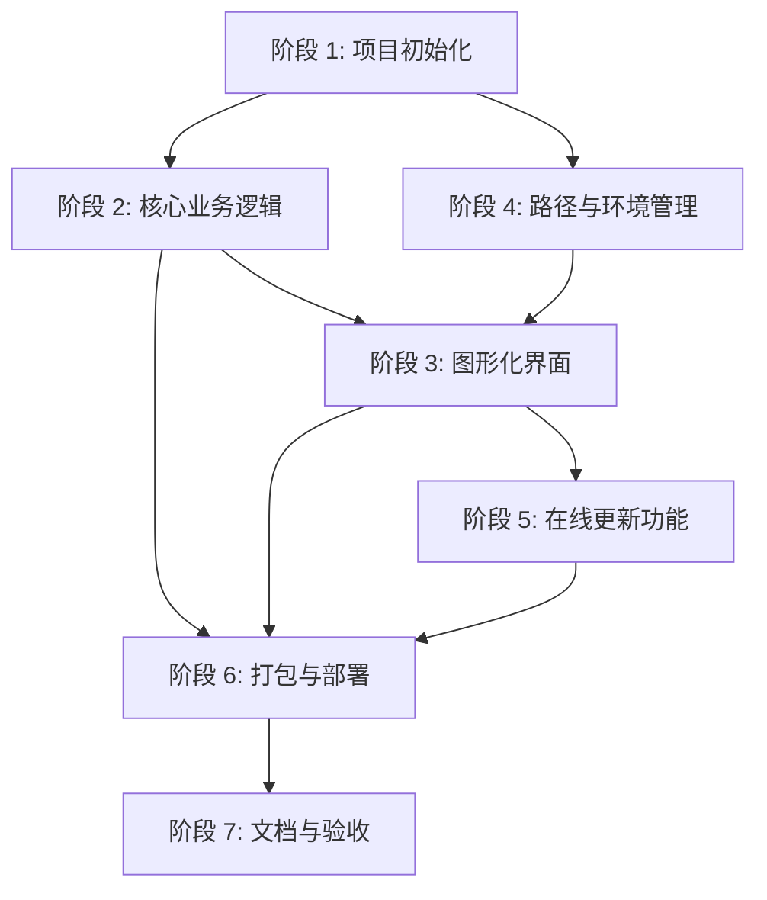

# Task Checklist 更新总结

**更新日期**: 2026-03-04  
**更新版本**: v1.1  
**更新范围**: tasks.md + checklist.md

---

## 📋 更新概述

根据最新的设计决策和文档审查结果，对任务清单和验收检查清单进行了全面更新，确保与最新的 API 设计、架构决策和用户要求完全一致。

---

## ✅ 主要更新内容

### 1. **任务清单更新** (tasks.md)

#### 新增任务

**阶段 1.4：路径管理模块**
- 创建路径管理器（src/utils/path_manager.py）
- 实现统一路径获取（使用 pathlib）
- 实现路径验证功能
- 测试不同环境下的路径正确性

**阶段 4：路径与环境管理**
- Task 4.1: 路径统一管理
- Task 4.2: 环境配置管理

**新增任务细节**：
- 错误处理机制（详细提示、重试、跳过、报告）
- 进度显示机制（ProgressInfo、实时更新、预估时间）
- 路径单元测试
- 配置管理单元测试

#### 更新任务描述

**图片处理模块**：
- ✅ 明确"完全内存处理，不解压"
- ✅ 添加"固定 180×138 像素，保持原画质"
- ✅ 使用 source_path 字段（替代 file_path）

**Excel 处理模块**：
- ✅ 支持 read_only 模式
- ✅ embed_image 支持文件路径和二进制数据两种方式
- ✅ 明确输出文件命名：{原文件名}_含图.xlsx

**双语支持**：
- ✅ 明确"实时切换，无确认弹窗"
- ✅ 明确"关键术语保持中文"（商品编码）

**打包部署**：
- ✅ 添加 macOS DMG 安装包制作
- ✅ 添加"测试打包后程序路径访问"
- ✅ 添加"测试跨平台路径兼容性"

#### 新增章节

**关键设计决策记录**：
- 图片处理决策（智能判断、source_path、尺寸、画质、内存处理）
- Excel 处理决策（初始化参数、embed_image 签名）
- 错误处理决策（详细化、恢复机制、报告）
- 进度显示决策（更新频率、显示内容）
- 兼容性决策（Excel 格式、图片格式、压缩包）

**变更历史**：
- 记录版本 v1.1 的所有变更
- 追溯设计决策来源

#### 依赖关系可视化

新增 Mermaid 依赖关系图：

---

### 2. **验收检查清单更新** (checklist.md)

#### 新增验收项目

**图片处理**：
- ✅ 图片尺寸固定为 180×138 像素
- ✅ 保持原画质，不进行有损压缩
- ✅ ImageInfo 使用 source_path 字段

**Excel 处理**：
- ✅ 图片嵌入支持文件路径和二进制数据两种方式
- ✅ 图片嵌入尺寸固定为 180×138 像素
- ✅ ExcelProcessor 支持 read_only 模式

**错误处理**：
- ✅ 错误提示详细化（包含具体文件、行号、原因）
- ✅ 重试机制正常工作（最多 3 次）
- ✅ 跳过机制正常工作（记录错误继续处理）
- ✅ 错误报告生成功能（生成错误日志文件）

**进度显示**：
- ✅ 实时显示当前处理进度（当前行/总行数）
- ✅ 显示当前处理动作
- ✅ 显示当前商品编码
- ✅ 显示图片来源
- ✅ 预估剩余时间准确
- ✅ 进度更新频率合理（每 5 行更新一次）

**路径管理**：
- ✅ 所有路径使用 pathlib 处理
- ✅ 跨平台路径分隔符正确
- ✅ 字体文件路径正确加载
- ✅ 国际化文件路径正确加载
- ✅ 资源文件路径正确加载
- ✅ 打包后路径访问正常

**跨平台一致性测试**：
- ✅ Windows 10/11 字体渲染、布局、动画测试
- ✅ macOS 12+ 字体渲染、布局、动画测试
- ✅ 视觉对比（字体、颜色、布局、动画）
- ✅ 总体视觉一致性达到 100%

**代码质量验收**：
- ✅ 遵循 PEP 8 规范
- ✅ 所有函数有完整的函数级注释
- ✅ 使用类型提示（Type Hints）
- ✅ 代码通过 black/flake8/mypy 检查
- ✅ 测试覆盖率 > 80%

#### 更新验收标准

**通过标准**：
- ✅ 所有核心功能检查项
- ✅ 所有边界情况有合理处理
- ✅ Sample 文件测试通过
- ✅ 无严重 bug
- ✅ **代码质量验收通过**
- ✅ **文档质量验收通过**
- ✅ **路径管理测试通过**
- ✅ **跨平台一致性测试通过**

**发布标准**：
- ✅ 所有打包部署检查项
- ✅ 用户文档完整
- ✅ GitHub Releases 发布成功
- ✅ **CI/CD 流程正常**

#### 新增验收流程

**五个阶段**：
1. **功能验收**：核心功能逐项测试
2. **非功能性验收**：性能、兼容性、边界情况
3. **代码质量验收**：规范、测试、文档
4. **跨平台验收**：Windows + macOS 对比测试
5. **最终验收**：对照 spec.md 生成报告

#### 新增变更历史

记录版本 v1.1 的所有变更：
- 图片尺寸、内存处理、错误处理、进度显示
- 路径管理、跨平台测试等

---

## 📊 变更统计

| 文件 | 新增行数 | 修改行数 | 删除行数 | 变更类型 |
|------|---------|---------|---------|---------|
| tasks.md | ~200 | ~50 | ~30 | 大幅更新 |
| checklist.md | ~180 | ~40 | ~20 | 大幅更新 |
| **总计** | **~380** | **~90** | **~50** | - |

---

## 🎯 关键设计决策同步

### 图片处理
- ✅ **图片嵌入方式**: 方案 3 - 智能判断
- ✅ **图片来源字段**: source_path（替代 file_path）
- ✅ **图片尺寸**: 固定 180×138 像素
- ✅ **画质策略**: 保持原画质，不压缩
- ✅ **压缩包处理**: 完全内存处理，不解压

### Excel 处理
- ✅ **初始化参数**: `__init__(file_path, read_only=False)`
- ✅ **图片嵌入方法**: `embed_image(row, column, source, width=180, height=138)`

### 错误处理
- ✅ **错误提示**: 详细化（包含文件、行号、原因）
- ✅ **恢复机制**: 重试（3 次）+ 跳过 + 记录
- ✅ **错误报告**: 生成错误日志文件

### 进度显示
- ✅ **更新频率**: 每 5 行更新一次
- ✅ **显示内容**: 当前行、总行数、动作、商品编码、图片来源、预估时间

### 路径管理
- ✅ **统一使用 pathlib**
- ✅ **跨平台兼容**（Windows: \, macOS: /）
- ✅ **打包后路径正确**

### 兼容性
- ✅ **Excel 格式**: 第一版仅支持 .xlsx
- ✅ **图片格式**: 支持 JPG/PNG/JPEG
- ✅ **压缩包**: 支持 ZIP/RAR
- ✅ **跨平台一致性**: 100%（使用自带字体）

---

## 🔍 与文档的一致性检查

### 已确保一致的文档
- ✅ README.md
- ✅ docs/api-reference.md
- ✅ docs/architecture.md
- ✅ docs/development-guide.md
- ✅ docs/design/ui-ux-design.md
- ✅ docs/plans/2026-03-04-document-update-summary.md

### 术语统一检查
- ✅ source_path（所有文档统一）
- ✅ 180×138（所有文档统一）
- ✅ read_only（所有文档统一）
- ✅ 完全内存处理（所有文档统一）
- ✅ 智能判断（所有文档统一）

---

## 📝 使用说明

### tasks.md 使用方式
1. **任务追踪**：按照任务清单逐项完成
2. **依赖管理**：参考依赖关系图安排开发顺序
3. **决策参考**：查看"关键设计决策记录"确保实现正确
4. **进度追踪**：标记完成的任务复选框

### checklist.md 使用方式
1. **验收测试**：按照检查清单逐项测试
2. **质量门控**：每个阶段完成后对照检查
3. **发布标准**：发布前确保所有项目通过
4. **流程指导**：按照"验收流程"五个阶段执行

---

## 🚀 下一步行动

### 立即可执行
1. ✅ 任务清单已更新
2. ✅ 验收清单已更新
3. ⏳ 开始实现阶段 1：项目初始化
4. ⏳ 创建路径管理模块（Task 1.4）

### 开发顺序建议
1. **阶段 1.4**：路径管理模块（基础支持）
2. **阶段 2.1**：图片处理模块（核心业务）
3. **阶段 2.2**：Excel 处理模块（核心业务）
4. **阶段 2.3**：业务逻辑整合
5. **阶段 1.3**：字体管理模块（UI 支持）
6. **阶段 3.x**：图形化界面
7. **其他阶段**：按依赖关系依次进行

---

## 📌 重要提示

### 开发者注意事项
1. **路径管理**：所有路径使用 pathlib，不要硬编码
2. **图片尺寸**：固定 180×138，不要修改
3. **字段命名**：使用 source_path，不要用 file_path
4. **压缩包处理**：完全内存处理，不要创建临时文件
5. **错误处理**：实现详细提示和恢复机制
6. **进度显示**：每 5 行更新一次，避免卡顿

### 测试重点
1. **路径测试**：Windows + macOS 都要测试
2. **内存测试**：压缩包处理不占用磁盘
3. **性能测试**：100 行数据 < 30 秒
4. **跨平台测试**：视觉一致性 100%
5. **错误处理测试**：各种边界情况

---

## ✅ 更新完成确认

- [x] tasks.md 已更新到 v1.1
- [x] checklist.md 已更新到 v1.1
- [x] 所有设计决策已同步
- [x] 术语使用已统一
- [x] 依赖关系已明确
- [x] 验收流程已规范
- [x] 变更历史已记录

---

**更新完成时间**: 2026-03-04  
**更新执行者**: AI Assistant  
**审核状态**: ✅ 已完成  
**下一步**: 开始实现阶段

---

**文档版本**: v1.1  
**同步状态**: ✅ 已同步  
**质量门控**: ✅ 已通过
