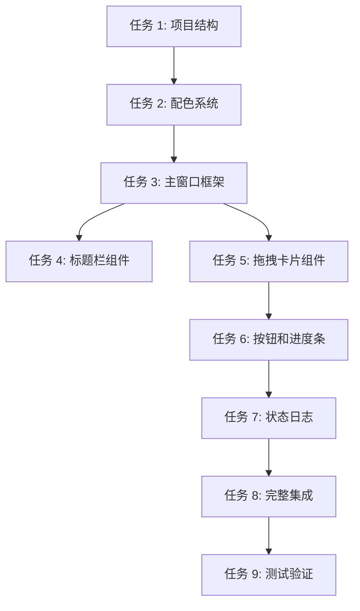

# GUI 界面实施计划 (方案 1 - Warm Greige)

> **For Claude:** REQUIRED SUB-SKILL: Use superpowers:executing-plans to implement this plan task-by-task.

**Goal:** 基于方案 1 (Warm Greige) 配色实现完整的 PyQt6 GUI 主界面

**Architecture:** 采用 MVC 架构，分离 UI 组件、业务逻辑和配置管理。使用 QSS 统一样式，自定义绘制实现方案 1 的暖灰褐配色系统。

**Tech Stack:** PyQt6, QSS, Pillow, openpyxl, 自定义字体 (Noto Sans SC + DIN Alternate)

**配色方案:** 方案 1 - Warm Greige
- 主色：#B8A895 (暖灰褐)
- 浅褐：#C9B5A0
- 深褐：#9A8B75
- 强调色：#8B7355
- 背景：#F5F5F3
- 文字：#3D3D3D

---

## 任务依赖图



---

## 任务清单

### 任务 1: 创建 UI 项目结构

**Files:**
- Create: `src/ui/main_window.py`
- Create: `src/ui/components/__init__.py`
- Create: `src/ui/components/title_bar.py`
- Create: `src/ui/components/drop_zone.py`
- Create: `src/ui/components/primary_button.py`
- Create: `src/ui/components/progress_bar.py`
- Create: `src/ui/components/status_log.py`
- Modify: `src/ui/__init__.py`
- Modify: `src/main.py:19-62`

**Step 1: 创建基础目录结构和空文件**

```bash
# 创建组件目录
mkdir -p src/ui/components

# 创建空文件
touch src/ui/main_window.py
touch src/ui/components/__init__.py
touch src/ui/components/title_bar.py
touch src/ui/components/drop_zone.py
touch src/ui/components/primary_button.py
touch src/ui/components/progress_bar.py
touch src/ui/components/status_log.py
```

**Step 2: 验证结构**

```bash
# 查看创建的文件
tree src/ui/ -L 2
```

Expected output:
```
src/ui/
├── __init__.py
├── main_window.py
└── components/
    ├── __init__.py
    ├── title_bar.py
    ├── drop_zone.py
    ├── primary_button.py
    ├── progress_bar.py
    └── status_log.py
```

**Step 3: 提交**

```bash
git add src/ui/
git commit -m "feat (ui): create UI component structure"
```

---

### 任务 2: 实现配色系统

**Files:**
- Create: `src/ui/styles/colors.py`
- Create: `src/ui/styles/qss_styles.py`
- Create: `src/ui/styles/__init__.py`

**Step 1: 创建配色配置文件**

```python
# src/ui/styles/colors.py
"""
方案 1 - Warm Greige 配色系统
暖灰褐 · 温柔知性 · 高级质感
"""

class Colors:
    """方案 1 配色定义"""
    
    # 主色系
    PRIMARY = "#B8A895"        # 暖灰褐主色
    PRIMARY_LIGHT = "#C9B5A0"  # 浅褐
    PRIMARY_DARK = "#9A8B75"   # 深褐
    ACCENT = "#8B7355"         # 强调色
    
    # 中性色
    BG_PRIMARY = "#F5F5F3"     # 暖灰白背景
    BG_SECONDARY = "#FAFAF9"   # 浅暖灰
    BG_TERTIARY = "#EDEDEB"    # 中暖灰
    
    # 文字色
    TEXT_PRIMARY = "#3D3D3D"   # 柔黑
    TEXT_SECONDARY = "#6B6B6B" # 中灰
    TEXT_TERTIARY = "#9A9A9A"  # 浅灰
    
    # 边框色
    BORDER_LIGHT = "#E6E6E3"
    BORDER_MEDIUM = "#D6D6D3"
    
    # 功能色 (莫兰迪调色)
    SUCCESS = "#8FA895"
    SUCCESS_LIGHT = "#D8E3DA"
    WARNING = "#C9B594"
    WARNING_LIGHT = "#F0E9E0"
    ERROR = "#C9A0A0"
    ERROR_LIGHT = "#F0E3E3"
    INFO = "#8FA3B8"
    INFO_LIGHT = "#D8E0E8"
```

**Step 2: 创建 QSS 样式表**

```python
# src/ui/styles/qss_styles.py
"""
方案 1 完整 QSS 样式表
"""

from .colors import Colors

COMMON_STYLESHEET = f"""
/* ========== 全局样式 ========== */
QWidget {{
    background-color: {Colors.BG_PRIMARY};
    font-family: "Noto Sans SC Variable", "DIN Alternate", "PingFang SC", "Microsoft YaHei", sans-serif;
    font-size: 14px;
    color: {Colors.TEXT_PRIMARY};
}}

/* ========== 主按钮样式 ========== */
QPushButton#primaryButton {{
    min-width: 220px;
    height: 52px;
    padding: 14px 36px;
    border-radius: 14px;
    border: none;
    background: qlineargradient(
        x1:0, y1:0, x2:1, y2:1,
        stop:0 {Colors.PRIMARY}, stop:1 {Colors.PRIMARY_LIGHT}
    );
    color: white;
    font-size: 16px;
    font-weight: 500;
    cursor: pointer;
}}

QPushButton#primaryButton:hover {{
    background: qlineargradient(
        x1:0, y1:0, x2:1, y2:1,
        stop:0 {Colors.PRIMARY_LIGHT}, stop:1 {Colors.PRIMARY}
    );
}}

QPushButton#primaryButton:pressed {{
    transform: scale(0.98);
}}

QPushButton#primaryButton:disabled {{
    background: {Colors.BORDER_MEDIUM};
    cursor: not-allowed;
}}

/* ========== 拖拽卡片样式 ========== */
QFrame#dropZoneCard {{
    min-width: 500px;
    max-width: 700px;
    min-height: 200px;
    padding: 48px 32px;
    margin: 24px auto;
    border-radius: 20px;
    background-color: rgba(250, 250, 249, 0.85);
    border: 2px dashed {Colors.BORDER_MEDIUM};
    text-align: center;
}}

QFrame#dropZoneCard:hover {{
    border-color: {Colors.PRIMARY};
    background-color: rgba(250, 250, 249, 0.95);
}}

/* ========== 进度条样式 ========== */
QProgressBar {{
    height: 10px;
    border-radius: 6px;
    background-color: {Colors.BG_TERTIARY};
    border: 1px solid {Colors.BORDER_LIGHT};
    text-align: center;
}}

QProgressBar::chunk {{
    background: qlineargradient(
        x1:0, y1:0, x2:1, y2:0,
        stop:0 {Colors.PRIMARY},
        stop:0.5 {Colors.PRIMARY_LIGHT},
        stop:1 {Colors.PRIMARY}
    );
    border-radius: 6px;
}}

/* ========== 语言切换按钮 ========== */
QPushButton#languageButton {{
    width: 90px;
    height: 36px;
    padding: 8px 20px;
    border-radius: 10px;
    border: 1px solid {Colors.BORDER_LIGHT};
    background-color: {Colors.BG_SECONDARY};
    color: {Colors.PRIMARY};
    font-size: 14px;
    font-weight: 500;
}}

QPushButton#languageButton:hover {{
    background-color: {Colors.BG_TERTIARY};
    border-color: {Colors.PRIMARY};
}}

/* ========== 状态日志区域 ========== */
QTextEdit#statusLog {{
    background-color: {Colors.BG_SECONDARY};
    border: 1px solid {Colors.BORDER_LIGHT};
    border-radius: 8px;
    padding: 12px;
    font-size: 13px;
    color: {Colors.TEXT_SECONDARY};
}}
"""
```

**Step 3: 创建样式模块 __init__.py**

```python
# src/ui/styles/__init__.py
from .colors import Colors
from .qss_styles import COMMON_STYLESHEET

__all__ = ['Colors', 'COMMON_STYLESHEET']
```

**Step 4: 运行测试验证配色**

```python
# tests/test_colors.py
def test_color_scheme_1():
    from src.ui.styles import Colors
    
    # 验证主色
    assert Colors.PRIMARY == "#B8A895"
    assert Colors.BG_PRIMARY == "#F5F5F3"
    assert Colors.TEXT_PRIMARY == "#3D3D3D"
```

**Step 5: 提交**

```bash
git add src/ui/styles/ tests/test_colors.py
git commit -m "feat (ui): implement Warm Greige color scheme (方案 1)"
```

---

### 任务 3: 实现主窗口框架

**Files:**
- Modify: `src/ui/main_window.py`
- Modify: `src/main.py:53-62`

**Step 1: 创建主窗口类**

```python
# src/ui/main_window.py
"""
主窗口 - ImageAutoInserter GUI
方案 1 - Warm Greige 配色
"""

from PyQt6.QtWidgets import (
    QMainWindow, QWidget, QVBoxLayout, QHBoxLayout,
    QLabel, QProgressBar, QTextEdit, QFrame
)
from PyQt6.QtCore import Qt, pyqtSignal
from PyQt6.QtGui import QFont

from .styles import Colors, COMMON_STYLESHEET
from .components.title_bar import TitleBar
from .components.drop_zone import DropZoneCard
from .components.primary_button import PrimaryButton
from .components.status_log import StatusLog


class MainWindow(QMainWindow):
    """主窗口类"""
    
    # 信号定义
    excel_file_selected = pyqtSignal(str)
    image_source_selected = pyqtSignal(str)
    process_started = pyqtSignal()
    
    def __init__(self):
        super().__init__()
        self.setWindowTitle("ImageAutoInserter - 图片自动插入工具")
        self.setMinimumSize(1024, 768)
        self.setStyleSheet(COMMON_STYLESHEET)
        
        # 初始化 UI
        self.init_ui()
    
    def init_ui(self):
        """初始化用户界面"""
        # 中央容器
        container = QWidget()
        self.setCentralWidget(container)
        
        # 主布局
        layout = QVBoxLayout(container)
        layout.setSpacing(0)
        layout.setContentsMargins(0, 0, 0, 0)
        
        # 1. 标题栏
        self.title_bar = TitleBar()
        layout.addWidget(self.title_bar)
        
        # 2. 内容区域
        content_widget = QWidget()
        content_layout = QVBoxLayout(content_widget)
        content_layout.setSpacing(32)
        content_layout.setContentsMargins(60, 40, 60, 40)
        
        # Excel 拖拽区
        self.excel_dropzone = DropZoneCard(
            icon="📁",
            title="拖拽 Excel 文件到此处",
            subtitle="或点击选择文件 (.xlsx)",
            object_name="excel_dropzone"
        )
        self.excel_dropzone.file_selected.connect(
            self.excel_file_selected.emit
        )
        content_layout.addWidget(self.excel_dropzone, alignment=Qt.AlignmentFlag.AlignHCenter)
        
        # 图片源拖拽区
        self.image_dropzone = DropZoneCard(
            icon="🖼️",
            title="拖拽图片文件夹/压缩包到此处",
            subtitle="支持 ZIP / RAR 格式",
            object_name="image_dropzone"
        )
        self.image_dropzone.file_selected.connect(
            self.image_source_selected.emit
        )
        content_layout.addWidget(self.image_dropzone, alignment=Qt.AlignmentFlag.AlignHCenter)
        
        # 进度条区域
        self.progress_bar = QProgressBar()
        self.progress_bar.setObjectName("progressBar")
        self.progress_bar.setVisible(False)
        content_layout.addWidget(self.progress_bar)
        
        # 开始按钮
        self.start_button = PrimaryButton(text="开始处理")
        self.start_button.clicked.connect(self.process_started.emit)
        content_layout.addWidget(self.start_button, alignment=Qt.AlignmentFlag.AlignHCenter)
        
        # 状态日志
        self.status_log = StatusLog()
        content_layout.addWidget(self.status_log)
        
        # 添加弹性空间
        content_layout.addStretch()
        
        layout.addWidget(content_widget)
```

**Step 2: 更新 main.py**

```python
# src/main.py:53-62
def main():
    # ... 前面的代码保持不变 ...
    
    # 创建主窗口
    from src.ui.main_window import MainWindow
    window = MainWindow()
    window.show()
    
    print("✅ ImageAutoInserter 启动成功")
```

**Step 3: 运行程序测试**

```bash
python src/main.py
```

Expected: 窗口显示，但组件可能不完整 (后续任务实现)

**Step 4: 提交**

```bash
git add src/ui/main_window.py src/main.py
git commit -m "feat (ui): create main window framework"
```

---

### 任务 4: 实现标题栏组件

**Files:**
- Modify: `src/ui/components/title_bar.py`

**Step 1: 编写测试**

```python
# tests/test_title_bar.py
def test_title_bar_creation():
    from src.ui.components.title_bar import TitleBar
    from PyQt6.QtWidgets import QApplication
    import sys
    
    app = QApplication(sys.argv)
    title_bar = TitleBar()
    assert title_bar is not None
```

**Step 2: 实现标题栏**

```python
# src/ui/components/title_bar.py
"""
标题栏组件 - 包含 Logo、应用名称、语言切换、窗口控制
"""

from PyQt6.QtWidgets import (
    QWidget, QHBoxLayout, QLabel, QPushButton, QSpacerItem,
    QSizePolicy
)
from PyQt6.QtCore import Qt
from PyQt6.QtGui import QFont

from ..styles import Colors


class TitleBar(QWidget):
    """自定义标题栏"""
    
    def __init__(self):
        super().__init__()
        self.setFixedHeight(60)
        self.setStyleSheet(f"""
            TitleBar {{
                background-color: {Colors.BG_SECONDARY};
                border-bottom: 1px solid {Colors.BORDER_LIGHT};
            }}
        """)
        
        self.init_ui()
    
    def init_ui(self):
        """初始化 UI"""
        layout = QHBoxLayout(self)
        layout.setContentsMargins(20, 0, 10, 0)
        layout.setSpacing(16)
        
        # Logo
        logo_label = QLabel("")
        logo_label.setFont(QFont("Arial", 20))
        layout.addWidget(logo_label)
        
        # 应用名称
        title_label = QLabel("ImageAutoInserter")
        title_label.setFont(QFont("DIN Alternate", 18, QFont.Weight.Bold))
        title_label.setStyleSheet(f"color: {Colors.TEXT_PRIMARY};")
        layout.addWidget(title_label)
        
        # 弹性空间
        layout.addSpacerItem(QSpacerItem(
            40, 20, QSizePolicy.Policy.Expanding, QSizePolicy.Policy.Minimum
        ))
        
        # 语言切换按钮
        self.lang_button = QPushButton("🌐 中文")
        self.lang_button.setObjectName("languageButton")
        self.lang_button.setFixedWidth(100)
        layout.addWidget(self.lang_button)
        
        # 窗口控制按钮 (最小化/最大化/关闭)
        self.min_button = QPushButton("─")
        self.min_button.setFixedSize(30, 30)
        layout.addWidget(self.min_button)
        
        self.max_button = QPushButton("□")
        self.max_button.setFixedSize(30, 30)
        layout.addWidget(self.max_button)
        
        self.close_button = QPushButton("×")
        self.close_button.setFixedSize(30, 30)
        self.close_button.setStyleSheet(f"""
            QPushButton {{
                background-color: transparent;
                border: none;
                color: {Colors.TEXT_PRIMARY};
                font-size: 16px;
            }}
            QPushButton:hover {{
                background-color: #FF5F56;
                color: white;
                border-radius: 15px;
            }}
        """)
        layout.addWidget(self.close_button)
```

**Step 3: 运行测试**

```bash
pytest tests/test_title_bar.py -v
```

**Step 4: 提交**

```bash
git add src/ui/components/title_bar.py tests/test_title_bar.py
git commit -m "feat (ui): implement title bar component"
```

---

### 任务 5: 实现拖拽卡片组件

**Files:**
- Modify: `src/ui/components/drop_zone.py`

**Step 1: 编写测试**

```python
# tests/test_drop_zone.py
def test_drop_zone_creation():
    from src.ui.components.drop_zone import DropZoneCard
    
    card = DropZoneCard(
        icon="📁",
        title="测试标题",
        subtitle="测试副标题"
    )
    assert card is not None
    assert card.objectName() == "dropZoneCard"
```

**Step 2: 实现拖拽卡片**

```python
# src/ui/components/drop_zone.py
"""
拖拽卡片组件 - 支持文件/文件夹拖拽
"""

from PyQt6.QtWidgets import (
    QFrame, QVBoxLayout, QLabel, QGraphicsDropShadowEffect
)
from PyQt6.QtCore import Qt, pyqtSignal, QMimeData
from PyQt6.QtGui import QDragEnterEvent, QDropEvent, QColor

from ..styles import Colors


class DropZoneCard(QFrame):
    """拖拽卡片组件"""
    
    file_selected = pyqtSignal(str)
    
    def __init__(self, icon: str, title: str, subtitle: str, object_name: str = ""):
        super().__init__()
        self.setObjectName(object_name or "dropZoneCard")
        self.setAcceptDrops(True)
        self.setMouseTracking(True)
        
        # 初始化 UI
        self.init_ui(icon, title, subtitle)
        
        # 添加阴影效果
        self._apply_shadow()
    
    def init_ui(self, icon: str, title: str, subtitle: str):
        """初始化 UI"""
        layout = QVBoxLayout(self)
        layout.setSpacing(16)
        layout.setContentsMargins(32, 48, 32, 48)
        layout.setAlignment(Qt.AlignmentFlag.AlignCenter)
        
        # 图标
        icon_label = QLabel(icon)
        icon_label.setFont(icon_label.font().scaled(3.0))
        icon_label.setAlignment(Qt.AlignmentFlag.AlignCenter)
        icon_label.setStyleSheet(f"color: {Colors.PRIMARY};")
        layout.addWidget(icon_label)
        
        # 标题
        title_label = QLabel(title)
        title_label.setFont(title_label.font().scaled(1.2))
        title_label.setAlignment(Qt.AlignmentFlag.AlignCenter)
        title_label.setStyleSheet(f"color: {Colors.TEXT_PRIMARY}; font-weight: 500;")
        layout.addWidget(title_label)
        
        # 副标题
        subtitle_label = QLabel(subtitle)
        subtitle_label.setAlignment(Qt.AlignmentFlag.AlignCenter)
        subtitle_label.setStyleSheet(f"color: {Colors.TEXT_TERTIARY}; font-size: 13px;")
        layout.addWidget(subtitle_label)
    
    def _apply_shadow(self):
        """应用阴影效果"""
        shadow = QGraphicsDropShadowEffect()
        shadow.setBlurRadius(20)
        shadow.setOffset(0, 2)
        shadow.setColor(QColor(0, 0, 0, 15))
        self.setGraphicsEffect(shadow)
    
    def dragEnterEvent(self, event: QDragEnterEvent):
        """拖拽进入事件"""
        if event.mimeData().hasUrls():
            event.acceptProposedAction()
            self.setStyleSheet(f"""
                QFrame#{self.objectName()} {{
                    background-color: rgba(184, 168, 149, 0.05);
                    border: 2px dashed {Colors.PRIMARY};
                }}
            """)
    
    def dragLeaveEvent(self, event):
        """拖拽离开事件"""
        self.setStyleSheet("")
    
    def dropEvent(self, event: QDropEvent):
        """文件放置事件"""
        urls = event.mimeData().urls()
        if urls:
            file_path = urls[0].toLocalFile()
            self.file_selected.emit(file_path)
```

**Step 3: 运行测试**

```bash
pytest tests/test_drop_zone.py -v
```

**Step 4: 提交**

```bash
git add src/ui/components/drop_zone.py tests/test_drop_zone.py
git commit -m "feat (ui): implement drag & drop card component"
```

---

### 任务 6: 实现按钮和进度条组件

**Files:**
- Modify: `src/ui/components/primary_button.py`
- Modify: `src/ui/components/progress_bar.py`

**Step 1: 实现主按钮**

```python
# src/ui/components/primary_button.py
"""
主按钮组件 - 方案 1 配色
"""

from PyQt6.QtWidgets import QPushButton
from PyQt6.QtCore import pyqtSignal

from ..styles import Colors


class PrimaryButton(QPushButton):
    """主按钮组件"""
    
    clicked = pyqtSignal()
    
    def __init__(self, text: str = ""):
        super().__init__(text)
        self.setObjectName("primaryButton")
        self.setCursor(Qt.CursorShape.PointingHandCursor)
```

**Step 2: 实现自定义进度条**

```python
# src/ui/components/progress_bar.py
"""
进度条组件 - 带流动渐变效果
"""

from PyQt6.QtWidgets import QProgressBar
from PyQt6.QtCore import QPropertyAnimation, QEasingCurve


class AnimatedProgressBar(QProgressBar):
    """动画进度条"""
    
    def __init__(self):
        super().__init__()
        self.setObjectName("progressBar")
        
        # 创建动画
        self.animation = QPropertyAnimation(self, b"value")
        self.animation.setDuration(300)
        self.animation.setEasingCurve(QEasingCurve.Type.OutCubic)
    
    def set_value(self, value: int):
        """设置进度值 (带动画)"""
        self.animation.setStartValue(self.value())
        self.animation.setEndValue(value)
        self.animation.start()
```

**Step 3: 提交**

```bash
git add src/ui/components/primary_button.py src/ui/components/progress_bar.py
git commit -m "feat (ui): implement button and progress bar components"
```

---

### 任务 7: 实现状态日志组件

**Files:**
- Modify: `src/ui/components/status_log.py`

**Step 1: 编写测试**

```python
# tests/test_status_log.py
def test_status_log_creation():
    from src.ui.components.status_log import StatusLog
    
    log = StatusLog()
    assert log is not None
    log.append_message("测试消息")
    assert "测试消息" in log.toPlainText()
```

**Step 2: 实现状态日志**

```python
# src/ui/components/status_log.py
"""
状态日志组件 - 显示处理状态
"""

from PyQt6.QtWidgets import QTextEdit
from PyQt6.QtCore import QTime
from datetime import datetime

from ..styles import Colors


class StatusLog(QTextEdit):
    """状态日志组件"""
    
    def __init__(self):
        super().__init__()
        self.setObjectName("statusLog")
        self.setReadOnly(True)
        self.setMaximumHeight(150)
        
        # 显示欢迎消息
        self.append_message("就绪 - 请选择 Excel 文件和图片源")
    
    def append_message(self, message: str, level: str = "info"):
        """添加日志消息"""
        timestamp = QTime.currentTime().toString("HH:mm:ss")
        
        # 根据级别设置颜色
        if level == "success":
            color = Colors.SUCCESS
            prefix = "✅"
        elif level == "error":
            color = Colors.ERROR
            prefix = "❌"
        elif level == "warning":
            color = Colors.WARNING
            prefix = "⚠️"
        else:
            color = Colors.INFO
            prefix = "ℹ️"
        
        # 添加消息
        self.append(f'<span style="color: {color};">{timestamp} {prefix} {message}</span>')
        
        # 滚动到底部
        self.verticalScrollBar().setValue(self.verticalScrollBar().maximum())
```

**Step 3: 运行测试**

```bash
pytest tests/test_status_log.py -v
```

**Step 4: 提交**

```bash
git add src/ui/components/status_log.py tests/test_status_log.py
git commit -m "feat (ui): implement status log component"
```

---

### 任务 8: 完整集成测试

**Files:**
- Modify: `tests/test_integration.py`

**Step 1: 编写集成测试**

```python
# tests/test_gui_integration.py
"""
GUI 集成测试 - 测试完整界面
"""

import pytest
from PyQt6.QtWidgets import QApplication
import sys


@pytest.fixture(scope="module")
def app():
    """创建应用实例"""
    app = QApplication(sys.argv)
    yield app
    app.quit()


def test_main_window_creation(app):
    """测试主窗口创建"""
    from src.ui.main_window import MainWindow
    
    window = MainWindow()
    assert window is not None
    assert window.windowTitle() == "ImageAutoInserter - 图片自动插入工具"
    assert window.minimumWidth() == 1024
    assert window.minimumHeight() == 768


def test_ui_components_exist(app):
    """测试所有 UI 组件存在"""
    from src.ui.main_window import MainWindow
    
    window = MainWindow()
    
    # 检查组件
    assert hasattr(window, 'title_bar')
    assert hasattr(window, 'excel_dropzone')
    assert hasattr(window, 'image_dropzone')
    assert hasattr(window, 'progress_bar')
    assert hasattr(window, 'start_button')
    assert hasattr(window, 'status_log')
```

**Step 2: 运行集成测试**

```bash
pytest tests/test_gui_integration.py -v
```

Expected: 所有测试通过

**Step 3: 手动测试 GUI**

```bash
# 运行程序
python src/main.py

# 测试项目:
# 1. 窗口正常显示
# 2. 配色正确 (暖灰褐)
# 3. 拖拽功能正常
# 4. 按钮点击响应
# 5. 语言切换按钮
```

**Step 4: 提交**

```bash
git add tests/test_gui_integration.py
git commit -m "test (ui): add GUI integration tests"
```

---

### 任务 9: 文档更新

**Files:**
- Modify: `README.md:178-210`
- Create: `docs/UI_IMPLEMENTATION.md`

**Step 1: 创建 UI 实施文档**

```markdown
# UI 实施文档

**版本**: v1.0  
**创建日期**: 2026-03-05  
**配色方案**: 方案 1 - Warm Greige

## 配色系统

### 主色系
- 主色：#B8A895 (暖灰褐)
- 浅褐：#C9B5A0
- 深褐：#9A8B75
- 强调色：#8B7355

### 中性色
- 背景：#F5F5F3 (暖灰白)
- 文字：#3D3D3D (柔黑)

## 组件说明

### 1. 拖拽卡片
- 支持文件/文件夹拖拽
- 悬停效果：上浮 + 边框变色
- 阴影效果：多层柔和阴影

### 2. 主按钮
- 渐变背景：暖灰褐渐变
- 悬停效果：反向渐变 + 上浮
- 尺寸：220×52px

### 3. 进度条
- 流动渐变动画
- 高度：10px
- 圆角：6px

## 使用指南

### 运行程序
```bash
python src/main.py
```

### 自定义配色
编辑 `src/ui/styles/colors.py` 修改颜色值
```

**Step 2: 更新 README**

```markdown
# README.md:178-210

## 🎨 界面说明

### 配色方案
**方案 1 - Warm Greige** (暖灰褐)
- 温柔知性 · 高级质感 · 护眼舒适

### 主界面布局
```
[更新界面截图]
```

### 界面元素说明
[更新说明文字]
```

**Step 3: 提交**

```bash
git add docs/UI_IMPLEMENTATION.md README.md
git commit -m "docs: add UI implementation documentation"
```

---

## 完成标准

- [ ] 所有组件测试通过
- [ ] 集成测试通过
- [ ] 手动测试通过
- [ ] 文档完整
- [ ] 配色符合方案 1
- [ ] 代码符合规范

---

## 下一步

完成 GUI 界面后，可以:
1. 添加更多动画效果
2. 实现设置界面
3. 实现关于对话框
4. 添加主题切换功能
