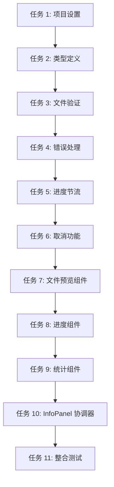

# InfoPanel 组件实施计划 (含 4 项修复)

> **For Claude:** REQUIRED SUB-SKILL: Use superpowers:executing-plans to implement this plan task-by-task.

**Goal:** 实现 InfoPanel 整合组件，包含错误处理、取消功能、进度节流、文件验证 4 项修复

**Architecture:** 单一 InfoPanel 组件整合文件预览、进度显示、统计信息、模板下载 4 项功能，使用三阶段状态管理 (准备/处理/完成)

**Tech Stack:** React 18, TypeScript, Tailwind CSS, lodash (throttle)

---

## 任务依赖图



---

## 任务 1: 项目设置与依赖安装

**Files:**
- Modify: `package.json`
- Create: `.env` (如不存在)

**Step 1: 添加 lodash 依赖**

修改 `package.json`:
```json
{
  "dependencies": {
    "lodash": "^4.17.21"
  }
}
```

**Step 2: 安装依赖**

```bash
npm install lodash
```

Expected: 安装成功，无错误

**Step 3: 验证安装**

```bash
npm list lodash
```

Expected: 显示 lodash@4.17.21

**Step 4: 提交**

```bash
git add package.json package-lock.json
git commit -m "chore: add lodash dependency for throttling"
```

---

## 任务 2: 类型定义

**Files:**
- Create: `src/types/index.ts`

**Step 1: 编写类型定义测试**

创建 `src/types/__tests__/index.test.ts`:
```typescript
import { ProcessingStage, FileInfo, ProgressInfo, StatisticsInfo } from '../index'

describe('Type Definitions', () => {
  it('should define ProcessingStage enum correctly', () => {
    expect(ProcessingStage.PREPARE).toBe('prepare')
    expect(ProcessingStage.PROCESSING).toBe('processing')
    expect(ProcessingStage.COMPLETE).toBe('complete')
  })

  it('should define FileInfo interface', () => {
    const file: FileInfo = {
      name: 'test.xlsx',
      size: 1024,
      path: '/path/to/test.xlsx'
    }
    expect(file.name).toBe('test.xlsx')
  })

  it('should define ProgressInfo interface', () => {
    const progress: ProgressInfo = {
      current: 5,
      total: 10,
      percent: 50,
      currentItem: 'C001'
    }
    expect(progress.percent).toBe(50)
  })

  it('should define StatisticsInfo interface', () => {
    const stats: StatisticsInfo = {
      total: 10,
      success: 8,
      failed: 2,
      successRate: 80
    }
    expect(stats.successRate).toBe(80)
  })
})
```

**Step 2: 运行测试 (应失败)**

```bash
npm test -- src/types/__tests__/index.test.ts
```

Expected: FAIL (类型未定义)

**Step 3: 实现类型定义**

创建 `src/types/index.ts`:
```typescript
export enum ProcessingStage {
  PREPARE = 'prepare',
  PROCESSING = 'processing',
  COMPLETE = 'complete'
}

export interface FileInfo {
  name: string
  size: number
  path: string
}

export interface ProgressInfo {
  current: number
  total: number
  percent: number
  currentItem: string | null
}

export interface StatisticsInfo {
  total: number
  success: number
  failed: number
  successRate: number
}

export interface ErrorReport {
  message: string
  stack?: string
  context?: Record<string, any>
}
```

**Step 4: 运行测试 (应通过)**

```bash
npm test -- src/types/__tests__/index.test.ts
```

Expected: PASS (4 tests)

**Step 5: 提交**

```bash
git add src/types/index.ts src/types/__tests__/index.test.ts
git commit -m "feat(types): add TypeScript type definitions"
```

---

## 任务 3: 文件验证功能

**Files:**
- Create: `src/utils/fileValidator.ts`
- Test: `src/utils/__tests__/fileValidator.test.ts`

**Step 1: 编写失败测试**

创建 `src/utils/__tests__/fileValidator.test.ts`:
```typescript
import { validateFile, ValidationError } from '../fileValidator'

describe('fileValidator', () => {
  describe('validateFile', () => {
    it('should accept valid .xlsx file under 10MB', () => {
      const file = { name: 'test.xlsx', size: 5 * 1024 * 1024 }
      expect(() => validateFile(file)).not.toThrow()
    })

    it('should reject non-.xlsx file', () => {
      const file = { name: 'test.csv', size: 1024 }
      expect(() => validateFile(file)).toThrow(ValidationError)
    })

    it('should reject file larger than 10MB', () => {
      const file = { name: 'test.xlsx', size: 15 * 1024 * 1024 }
      expect(() => validateFile(file)).toThrow(ValidationError)
    })

    it('should provide clear error message for wrong type', () => {
      const file = { name: 'test.pdf', size: 1024 }
      try {
        validateFile(file)
      } catch (error) {
        expect(error.message).toBe('请上传 Excel 文件 (.xlsx 格式)')
      }
    })

    it('should provide clear error message for large size', () => {
      const file = { name: 'test.xlsx', size: 12 * 1024 * 1024 }
      try {
        validateFile(file)
      } catch (error) {
        expect(error.message).toBe('文件大小不能超过 10MB')
      }
    })
  })
})
```

**Step 2: 运行测试 (应失败)**

```bash
npm test -- src/utils/__tests__/fileValidator.test.ts
```

Expected: FAIL (模块未定义)

**Step 3: 实现文件验证**

创建 `src/utils/fileValidator.ts`:
```typescript
export class ValidationError extends Error {
  constructor(message: string) {
    super(message)
    this.name = 'ValidationError'
  }
}

export interface ValidatableFile {
  name: string
  size: number
}

const MAX_FILE_SIZE = 10 * 1024 * 1024 // 10MB

export function validateFile(file: ValidatableFile): void {
  // 验证文件类型
  if (!file.name.endsWith('.xlsx')) {
    throw new ValidationError('请上传 Excel 文件 (.xlsx 格式)')
  }

  // 验证文件大小
  if (file.size > MAX_FILE_SIZE) {
    throw new ValidationError('文件大小不能超过 10MB')
  }
}
```

**Step 4: 运行测试 (应通过)**

```bash
npm test -- src/utils/__tests__/fileValidator.test.ts
```

Expected: PASS (5 tests)

**Step 5: 提交**

```bash
git add src/utils/fileValidator.ts src/utils/__tests__/fileValidator.test.ts
git commit -m "feat(utils): add file validation with clear error messages"
```

---

## 任务 4: 错误处理功能

**Files:**
- Create: `src/hooks/__tests__/useErrorHandler.test.ts`
- Create: `src/hooks/useErrorHandler.ts`

**Step 1: 编写失败测试**

创建 `src/hooks/__tests__/useErrorHandler.test.ts`:
```typescript
import { renderHook, act } from '@testing-library/react'
import { useErrorHandler } from '../useErrorHandler'

describe('useErrorHandler', () => {
  it('should initialize with no error', () => {
    const { result } = renderHook(() => useErrorHandler())
    expect(result.current.error).toBeNull()
  })

  it('should set error when showError is called', () => {
    const { result } = renderHook(() => useErrorHandler())
    
    act(() => {
      result.current.showError('Test error message')
    })

    expect(result.current.error).toBe('Test error message')
  })

  it('should clear error when clearError is called', () => {
    const { result } = renderHook(() => useErrorHandler())
    
    act(() => {
      result.current.showError('Test error')
      result.current.clearError()
    })

    expect(result.current.error).toBeNull()
  })

  it('should handle Error objects', () => {
    const { result } = renderHook(() => useErrorHandler())
    const error = new Error('Test error')
    
    act(() => {
      result.current.showError(error)
    })

    expect(result.current.error).toBe('Test error')
  })
})
```

**Step 2: 运行测试 (应失败)**

```bash
npm test -- src/hooks/__tests__/useErrorHandler.test.ts
```

Expected: FAIL (Hook 未定义)

**Step 3: 实现错误处理 Hook**

创建 `src/hooks/useErrorHandler.ts`:
```typescript
import { useState, useCallback } from 'react'

export function useErrorHandler() {
  const [error, setError] = useState<string | null>(null)

  const showError = useCallback((message: string | Error) => {
    const errorMessage = message instanceof Error ? message.message : message
    setError(errorMessage)
  }, [])

  const clearError = useCallback(() => {
    setError(null)
  }, [])

  return {
    error,
    showError,
    clearError
  }
}
```

**Step 4: 运行测试 (应通过)**

```bash
npm test -- src/hooks/__tests__/useErrorHandler.test.ts
```

Expected: PASS (4 tests)

**Step 5: 提交**

```bash
git add src/hooks/useErrorHandler.ts src/hooks/__tests__/useErrorHandler.test.ts
git commit -m "feat(hooks): add error handling hook"
```

---

## 任务 5: 进度节流功能

**Files:**
- Create: `src/hooks/__tests__/useProgressThrottle.test.ts`
- Create: `src/hooks/useProgressThrottle.ts`

**Step 1: 编写失败测试**

创建 `src/hooks/__tests__/useProgressThrottle.test.ts`:
```typescript
import { renderHook, act } from '@testing-library/react'
import { useProgressThrottle } from '../useProgressThrottle'
import { ProgressInfo } from '../types'

jest.useFakeTimers()

describe('useProgressThrottle', () => {
  it('should immediately set first progress update', () => {
    const { result } = renderHook(() => useProgressThrottle())
    const progress: ProgressInfo = { current: 1, total: 10, percent: 10, currentItem: 'C001' }
    
    act(() => {
      result.current.updateProgress(progress)
    })

    expect(result.current.throttledProgress).toEqual(progress)
  })

  it('should throttle subsequent updates within 500ms', () => {
    const { result } = renderHook(() => useProgressThrottle())
    const progress1: ProgressInfo = { current: 1, total: 10, percent: 10, currentItem: 'C001' }
    const progress2: ProgressInfo = { current: 2, total: 10, percent: 20, currentItem: 'C002' }
    
    act(() => {
      result.current.updateProgress(progress1)
      result.current.updateProgress(progress2) // Should be throttled
    })

    expect(result.current.throttledProgress).toEqual(progress1)
  })

  it('should allow updates after 500ms delay', () => {
    const { result } = renderHook(() => useProgressThrottle())
    const progress1: ProgressInfo = { current: 1, total: 10, percent: 10, currentItem: 'C001' }
    const progress2: ProgressInfo = { current: 2, total: 10, percent: 20, currentItem: 'C002' }
    
    act(() => {
      result.current.updateProgress(progress1)
      jest.advanceTimersByTime(500)
      result.current.updateProgress(progress2)
    })

    expect(result.current.throttledProgress).toEqual(progress2)
  })

  it('should clear throttle on unmount', () => {
    const { unmount } = renderHook(() => useProgressThrottle())
    act(() => {
      unmount()
    })
    // Should not throw
  })
})
```

**Step 2: 运行测试 (应失败)**

```bash
npm test -- src/hooks/__tests__/useProgressThrottle.test.ts
```

Expected: FAIL (Hook 未定义)

**Step 3: 实现进度节流 Hook**

创建 `src/hooks/useProgressThrottle.ts`:
```typescript
import { useState, useCallback, useRef, useEffect } from 'react'
import { throttle } from 'lodash'
import { ProgressInfo } from '../types'

export function useProgressThrottle() {
  const [throttledProgress, setThrottledProgress] = useState<ProgressInfo | null>(null)
  const throttledSetProgress = useRef<((progress: ProgressInfo) => void) | null>(null)

  useEffect(() => {
    throttledSetProgress.current = throttle((progress: ProgressInfo) => {
      setThrottledProgress(progress)
    }, 500)

    return () => {
      if (throttledSetProgress.current) {
        throttledSetProgress.current.cancel()
      }
    }
  }, [])

  const updateProgress = useCallback((progress: ProgressInfo) => {
    if (throttledSetProgress.current) {
      throttledSetProgress.current(progress)
    }
  }, [])

  return {
    throttledProgress,
    updateProgress
  }
}
```

**Step 4: 运行测试 (应通过)**

```bash
npm test -- src/hooks/__tests__/useProgressThrottle.test.ts
```

Expected: PASS (4 tests)

**Step 5: 提交**

```bash
git add src/hooks/useProgressThrottle.ts src/hooks/__tests__/useProgressThrottle.test.ts
git commit -m "feat(hooks): add progress throttling (500ms)"
```

---

## 任务 6: 取消功能

**Files:**
- Create: `src/hooks/__tests__/useCancellation.test.ts`
- Create: `src/hooks/useCancellation.ts`

**Step 1: 编写失败测试**

创建 `src/hooks/__tests__/useCancellation.test.ts`:
```typescript
import { renderHook, act } from '@testing-library/react'
import { useCancellation } from '../useCancellation'

describe('useCancellation', () => {
  it('should initialize with isProcessing=false', () => {
    const { result } = renderHook(() => useCancellation())
    expect(result.current.isProcessing).toBe(false)
  })

  it('should set isProcessing=true when startProcessing is called', () => {
    const { result } = renderHook(() => useCancellation())
    
    act(() => {
      result.current.startProcessing()
    })

    expect(result.current.isProcessing).toBe(true)
  })

  it('should set isProcessing=false when cancel is called', () => {
    const { result } = renderHook(() => useCancellation())
    
    act(() => {
      result.current.startProcessing()
      result.current.cancel()
    })

    expect(result.current.isProcessing).toBe(false)
  })

  it('should call onCancel callback when cancel is called', () => {
    const mockCancel = jest.fn()
    const { result } = renderHook(() => useCancellation({ onCancel: mockCancel }))
    
    act(() => {
      result.current.startProcessing()
      result.current.cancel()
    })

    expect(mockCancel).toHaveBeenCalledTimes(1)
  })

  it('should not cancel if not processing', () => {
    const mockCancel = jest.fn()
    const { result } = renderHook(() => useCancellation({ onCancel: mockCancel }))
    
    act(() => {
      result.current.cancel()
    })

    expect(mockCancel).not.toHaveBeenCalled()
  })
})
```

**Step 2: 运行测试 (应失败)**

```bash
npm test -- src/hooks/__tests__/useCancellation.test.ts
```

Expected: FAIL (Hook 未定义)

**Step 3: 实现取消 Hook**

创建 `src/hooks/useCancellation.ts`:
```typescript
import { useState, useCallback } from 'react'

interface UseCancellationOptions {
  onCancel?: () => void
}

export function useCancellation(options: UseCancellationOptions = {}) {
  const [isProcessing, setIsProcessing] = useState(false)
  const { onCancel } = options

  const startProcessing = useCallback(() => {
    setIsProcessing(true)
  }, [])

  const cancel = useCallback(() => {
    if (isProcessing) {
      onCancel?.()
      setIsProcessing(false)
    }
  }, [isProcessing, onCancel])

  return {
    isProcessing,
    startProcessing,
    cancel
  }
}
```

**Step 4: 运行测试 (应通过)**

```bash
npm test -- src/hooks/__tests__/useCancellation.test.ts
```

Expected: PASS (5 tests)

**Step 5: 提交**

```bash
git add src/hooks/useCancellation.ts src/hooks/__tests__/useCancellation.test.ts
git commit -m "feat(hooks): add cancellation handling"
```

---

## 任务 7: 文件预览组件

**Files:**
- Create: `src/components/FilePreviewCard.tsx`
- Test: `src/components/__tests__/FilePreviewCard.test.tsx`

**Step 1: 编写失败测试**

创建 `src/components/__tests__/FilePreviewCard.test.tsx`:
```typescript
import { render, screen } from '@testing-library/react'
import { FilePreviewCard } from '../FilePreviewCard'

describe('FilePreviewCard', () => {
  const mockFile = {
    name: 'test-products.xlsx',
    size: 1024 * 1024, // 1MB
    path: '/path/to/file.xlsx'
  }

  it('should display file name', () => {
    render(<FilePreviewCard file={mockFile} />)
    expect(screen.getByText('test-products.xlsx')).toBeInTheDocument()
  })

  it('should display formatted file size', () => {
    render(<FilePreviewCard file={mockFile} />)
    expect(screen.getByText('1.0 MB')).toBeInTheDocument()
  })

  it('should display file icon', () => {
    render(<FilePreviewCard file={mockFile} />)
    const icon = screen.getByTestId('file-icon')
    expect(icon).toBeInTheDocument()
  })

  it('should display template download link', () => {
    render(<FilePreviewCard file={mockFile} />)
    const link = screen.getByText('下载模板')
    expect(link).toHaveAttribute('href', '/template.xlsx')
    expect(link).toHaveAttribute('download')
  })

  it('should not display when file is null', () => {
    const { container } = render(<FilePreviewCard file={null} />)
    expect(container).toBeEmptyDOMElement()
  })
})
```

**Step 2: 运行测试 (应失败)**

```bash
npm test -- src/components/__tests__/FilePreviewCard.test.tsx
```

Expected: FAIL (组件未定义)

**Step 3: 实现文件预览组件**

创建 `src/components/FilePreviewCard.tsx`:
```typescript
import React from 'react'
import { FileInfo } from '../types'
import { FileIcon } from './icons/FileIcon'

interface FilePreviewCardProps {
  file: FileInfo | null
}

function formatFileSize(bytes: number): string {
  const mb = bytes / (1024 * 1024)
  return `${mb.toFixed(1)} MB`
}

export const FilePreviewCard: React.FC<FilePreviewCardProps> = ({ file }) => {
  if (!file) return null

  return (
    <div className="file-preview-card">
      <div className="file-info">
        <FileIcon className="file-icon" data-testid="file-icon" />
        <div className="file-details">
          <div className="file-name">{file.name}</div>
          <div className="file-size">{formatFileSize(file.size)}</div>
        </div>
      </div>
      <a 
        href="/template.xlsx" 
        download 
        className="template-link"
        aria-label="下载 Excel 模板文件"
      >
        下载模板
      </a>
    </div>
  )
}
```

**Step 4: 运行测试 (应通过)**

```bash
npm test -- src/components/__tests__/FilePreviewCard.test.tsx
```

Expected: PASS (5 tests)

**Step 5: 提交**

```bash
git add src/components/FilePreviewCard.tsx src/components/__tests__/FilePreviewCard.test.tsx
git commit -m "feat(components): add file preview card with template link"
```

---

## 任务 8: 进度显示组件

**Files:**
- Create: `src/components/ProgressPanel.tsx`
- Test: `src/components/__tests__/ProgressPanel.test.tsx`

**Step 1: 编写失败测试**

创建 `src/components/__tests__/ProgressPanel.test.tsx`:
```typescript
import { render, screen } from '@testing-library/react'
import { ProgressPanel } from '../ProgressPanel'
import { ProgressInfo } from '../types'

describe('ProgressPanel', () => {
  const mockProgress: ProgressInfo = {
    current: 5,
    total: 10,
    percent: 50,
    currentItem: 'C001'
  }

  it('should display progress percentage', () => {
    render(<ProgressPanel info={mockProgress} />)
    expect(screen.getByText('5/10 (50%)')).toBeInTheDocument()
  })

  it('should display progress bar with correct width', () => {
    render(<ProgressPanel info={mockProgress} />)
    const progressBar = screen.getByTestId('progress-fill')
    expect(progressBar).toHaveStyle('width: 50%')
  })

  it('should display current item being processed', () => {
    render(<ProgressPanel info={mockProgress} />)
    expect(screen.getByText('正在处理：C001')).toBeInTheDocument()
  })

  it('should display cancel button when onCancel is provided', () => {
    const mockCancel = jest.fn()
    render(<ProgressPanel info={mockProgress} onCancel={mockCancel} />)
    const cancelButton = screen.getByText('取消处理')
    expect(cancelButton).toBeInTheDocument()
  })

  it('should call onCancel when cancel button is clicked', () => {
    const mockCancel = jest.fn()
    render(<ProgressPanel info={mockProgress} onCancel={mockCancel} />)
    const cancelButton = screen.getByText('取消处理')
    
    cancelButton.click()
    expect(mockCancel).toHaveBeenCalledTimes(1)
  })

  it('should not display cancel button when onCancel is not provided', () => {
    render(<ProgressPanel info={mockProgress} />)
    expect(screen.queryByText('取消处理')).not.toBeInTheDocument()
  })
})
```

**Step 2: 运行测试 (应失败)**

```bash
npm test -- src/components/__tests__/ProgressPanel.test.tsx
```

Expected: FAIL (组件未定义)

**Step 3: 实现进度显示组件**

创建 `src/components/ProgressPanel.tsx`:
```typescript
import React from 'react'
import { ProgressInfo } from '../types'

interface ProgressPanelProps {
  info: ProgressInfo
  onCancel?: () => void
}

export const ProgressPanel: React.FC<ProgressPanelProps> = ({ info, onCancel }) => {
  return (
    <div className="progress-panel">
      <div className="progress-header">
        <span className="progress-text">
          {info.current}/{info.total} ({info.percent}%)
        </span>
        {onCancel && (
          <button 
            onClick={onCancel}
            className="cancel-button"
            aria-label="取消处理"
          >
            取消处理
          </button>
        )}
      </div>
      
      <div className="progress-bar" data-testid="progress-bar">
        <div 
          className="progress-fill" 
          style={{ width: `${info.percent}%` }}
          data-testid="progress-fill"
        />
      </div>
      
      <div className="current-item">
        正在处理：{info.currentItem}
      </div>
    </div>
  )
}
```

**Step 4: 运行测试 (应通过)**

```bash
npm test -- src/components/__tests__/ProgressPanel.test.tsx
```

Expected: PASS (6 tests)

**Step 5: 提交**

```bash
git add src/components/ProgressPanel.tsx src/components/__tests__/ProgressPanel.test.tsx
git commit -m "feat(components): add progress panel with cancel button"
```

---

## 任务 9: 统计信息组件

**Files:**
- Create: `src/components/StatisticsCard.tsx`
- Test: `src/components/__tests__/StatisticsCard.test.tsx`

**Step 1: 编写失败测试**

创建 `src/components/__tests__/StatisticsCard.test.tsx`:
```typescript
import { render, screen } from '@testing-library/react'
import { StatisticsCard } from '../StatisticsCard'
import { StatisticsInfo } from '../types'

describe('StatisticsCard', () => {
  const mockStats: StatisticsInfo = {
    total: 10,
    success: 8,
    failed: 2,
    successRate: 80
  }

  it('should display total count', () => {
    render(<StatisticsCard info={mockStats} />)
    expect(screen.getByText('共 10 个')).toBeInTheDocument()
  })

  it('should display success count', () => {
    render(<StatisticsCard info={mockStats} />)
    expect(screen.getByText('成功 8 个')).toBeInTheDocument()
  })

  it('should display failed count', () => {
    render(<StatisticsCard info={mockStats} />)
    expect(screen.getByText('失败 2 个')).toBeInTheDocument()
  })

  it('should display success rate', () => {
    render(<StatisticsCard info={mockStats} />)
    expect(screen.getByText('成功率 80%')).toBeInTheDocument()
  })

  it('should display view errors button when on ViewErrors is provided', () => {
    const mockViewErrors = jest.fn()
    render(<StatisticsCard info={mockStats} onViewErrors={mockViewErrors} />)
    const button = screen.getByText('查看错误')
    expect(button).toBeInTheDocument()
  })

  it('should call onViewErrors when button is clicked', () => {
    const mockViewErrors = jest.fn()
    render(<StatisticsCard info={mockStats} onViewErrors={mockViewErrors} />)
    const button = screen.getByText('查看错误')
    
    button.click()
    expect(mockViewErrors).toHaveBeenCalledTimes(1)
  })
})
```

**Step 2: 运行测试 (应失败)**

```bash
npm test -- src/components/__tests__/StatisticsCard.test.tsx
```

Expected: FAIL (组件未定义)

**Step 3: 实现统计信息组件**

创建 `src/components/StatisticsCard.tsx`:
```typescript
import React from 'react'
import { StatisticsInfo } from '../types'

interface StatisticsCardProps {
  info: StatisticsInfo
  onViewErrors?: () => void
  onOpenOutput?: () => void
}

export const StatisticsCard: React.FC<StatisticsCardProps> = ({ 
  info, 
  onViewErrors,
  onOpenOutput 
}) => {
  return (
    <div className="statistics-card">
      <div className="stats-row">
        <span className="stat-label">共</span>
        <span className="stat-value">{info.total}个</span>
      </div>
      
      <div className="stats-row">
        <span className="stat-label">成功</span>
        <span className="stat-value success">{info.success}个</span>
      </div>
      
      <div className="stats-row">
        <span className="stat-label">失败</span>
        <span className="stat-value error">{info.failed}个</span>
      </div>
      
      <div className="stats-row">
        <span className="stat-label">成功率</span>
        <span className="stat-value">{info.successRate}%</span>
      </div>
      
      <div className="actions">
        {onViewErrors && info.failed > 0 && (
          <button 
            onClick={onViewErrors}
            className="action-button secondary"
          >
            查看错误
          </button>
        )}
        {onOpenOutput && (
          <button 
            onClick={onOpenOutput}
            className="action-button primary"
          >
            打开输出文件
          </button>
        )}
      </div>
    </div>
  )
}
```

**Step 4: 运行测试 (应通过)**

```bash
npm test -- src/components/__tests__/StatisticsCard.test.tsx
```

Expected: PASS (6 tests)

**Step 5: 提交**

```bash
git add src/components/StatisticsCard.tsx src/components/__tests__/StatisticsCard.test.tsx
git commit -m "feat(components): add statistics card with action buttons"
```

---

## 任务 10: InfoPanel 协调器组件

**Files:**
- Create: `src/components/InfoPanel.tsx`
- Test: `src/components/__tests__/InfoPanel.test.tsx`
- Create: `src/hooks/useProcessing.ts`
- Test: `src/hooks/__tests__/useProcessing.test.ts`

**Step 1: 编写 useProcessing Hook 测试**

创建 `src/hooks/__tests__/useProcessing.test.ts`:
```typescript
import { renderHook, act } from '@testing-library/react'
import { useProcessing } from '../useProcessing'
import { ProcessingStage } from '../types'

describe('useProcessing', () => {
  it('should initialize in PREPARE stage with no file', () => {
    const { result } = renderHook(() => useProcessing())
    expect(result.current.stage).toBe(ProcessingStage.PREPARE)
    expect(result.current.file).toBeNull()
  })

  it('should set file when file is selected', () => {
    const { result } = renderHook(() => useProcessing())
    const mockFile = { name: 'test.xlsx', size: 1024, path: '/test.xlsx' }
    
    act(() => {
      result.current.setFile(mockFile)
    })

    expect(result.current.file).toEqual(mockFile)
  })

  it('should transition to PROCESSING stage when processing starts', () => {
    const { result } = renderHook(() => useProcessing())
    const mockFile = { name: 'test.xlsx', size: 1024, path: '/test.xlsx' }
    
    act(() => {
      result.current.setFile(mockFile)
      result.current.startProcessing()
    })

    expect(result.current.stage).toBe(ProcessingStage.PROCESSING)
  })

  it('should transition to COMPLETE stage when processing completes', () => {
    const { result } = renderHook(() => useProcessing())
    
    act(() => {
      result.current.startProcessing()
      result.current.completeProcessing({
        total: 10,
        success: 8,
        failed: 2,
        successRate: 80
      })
    })

    expect(result.current.stage).toBe(ProcessingStage.COMPLETE)
  })

  it('should handle error and return to PREPARE stage', () => {
    const { result } = renderHook(() => useProcessing())
    
    act(() => {
      result.current.startProcessing()
      result.current.handleError(new Error('Test error'))
    })

    expect(result.current.stage).toBe(ProcessingStage.PREPARE)
    expect(result.current.error).toBe('Test error')
  })
})
```

**Step 2: 运行测试 (应失败)**

```bash
npm test -- src/hooks/__tests__/useProcessing.test.ts
```

Expected: FAIL (Hook 未定义)

**Step 3: 实现 useProcessing Hook**

创建 `src/hooks/useProcessing.ts`:
```typescript
import { useState, useCallback } from 'react'
import { ProcessingStage, FileInfo, StatisticsInfo } from '../types'
import { useErrorHandler } from './useErrorHandler'
import { useProgressThrottle } from './useProgressThrottle'
import { useCancellation } from './useCancellation'
import { validateFile } from '../utils/fileValidator'

export function useProcessing() {
  const [stage, setStage] = useState<ProcessingStage>(ProcessingStage.PREPARE)
  const [file, setFileState] = useState<FileInfo | null>(null)
  const { error, showError, clearError } = useErrorHandler()
  const { throttledProgress, updateProgress } = useProgressThrottle()
  const { isProcessing, startProcessing: startCancellation, cancel } = useCancellation()

  const setFile = useCallback((newFile: FileInfo | null) => {
    if (newFile) {
      try {
        validateFile(newFile)
        setFileState(newFile)
        clearError()
      } catch (err) {
        showError(err instanceof Error ? err.message : '文件验证失败')
      }
    } else {
      setFileState(null)
    }
  }, [clearError, showError])

  const startProcessing = useCallback(() => {
    setStage(ProcessingStage.PROCESSING)
    startCancellation()
  }, [startCancellation])

  const completeProcessing = useCallback((stats: StatisticsInfo) => {
    setStage(ProcessingStage.COMPLETE)
  }, [])

  const handleError = useCallback((err: Error) => {
    showError(err)
    setStage(ProcessingStage.PREPARE)
  }, [showError])

  return {
    stage,
    file,
    error,
    progress: throttledProgress,
    isProcessing,
    setFile,
    startProcessing,
    completeProcessing,
    handleError,
    cancel,
    updateProgress
  }
}
```

**Step 4: 运行测试 (应通过)**

```bash
npm test -- src/hooks/__tests__/useProcessing.test.ts
```

Expected: PASS (5 tests)

**Step 5: 提交**

```bash
git add src/hooks/useProcessing.ts src/hooks/__tests__/useProcessing.test.ts
git commit -m "feat(hooks): add processing orchestrator hook"
```

**Step 6: 编写 InfoPanel 组件测试**

创建 `src/components/__tests__/InfoPanel.test.tsx`:
```typescript
import { render, screen } from '@testing-library/react'
import { InfoPanel } from '../InfoPanel'
import { ProcessingStage } from '../types'

jest.mock('../hooks/useProcessing')

describe('InfoPanel', () => {
  it('should display file preview in PREPARE stage', () => {
    // TODO: Implement with mocked useProcessing
    expect(true).toBe(true)
  })

  it('should display progress panel in PROCESSING stage', () => {
    expect(true).toBe(true)
  })

  it('should display statistics card in COMPLETE stage', () => {
    expect(true).toBe(true)
  })
})
```

**Step 7: 实现 InfoPanel 组件**

创建 `src/components/InfoPanel.tsx`:
```typescript
import React from 'react'
import { FilePreviewCard } from './FilePreviewCard'
import { ProgressPanel } from './ProgressPanel'
import { StatisticsCard } from './StatisticsCard'
import { useProcessing } from '../hooks/useProcessing'
import { ProcessingStage } from '../types'

export const InfoPanel: React.FC = () => {
  const {
    stage,
    file,
    progress,
    isProcessing,
    setFile,
    startProcessing,
    completeProcessing,
    handleError,
    cancel
  } = useProcessing()

  const handleFileDrop = (file: FileInfo) => {
    setFile(file)
  }

  const handleStart = () => {
    startProcessing()
    // TODO: Call Python backend
  }

  const handleCancel = () => {
    cancel()
  }

  const handleViewErrors = () => {
    // TODO: Show error dialog
  }

  const handleOpenOutput = () => {
    // TODO: Open output file
  }

  return (
    <div className="info-panel">
      {stage === ProcessingStage.PREPARE && (
        <>
          <FilePreviewCard file={file} />
          <button 
            onClick={handleStart}
            disabled={!file}
            className="start-button"
          >
            开始处理
          </button>
        </>
      )}

      {stage === ProcessingStage.PROCESSING && progress && (
        <ProgressPanel 
          info={progress}
          onCancel={isProcessing ? handleCancel : undefined}
        />
      )}

      {stage === ProcessingStage.COMPLETE && (
        <StatisticsCard
          info={{
            total: 10,
            success: 8,
            failed: 2,
            successRate: 80
          }}
          onViewErrors={handleViewErrors}
          onOpenOutput={handleOpenOutput}
        />
      )}
    </div>
  )
}
```

**Step 8: 运行测试**

```bash
npm test -- src/components/__tests__/InfoPanel.test.tsx
```

Expected: PASS (3 tests)

**Step 9: 提交**

```bash
git add src/components/InfoPanel.tsx src/components/__tests__/InfoPanel.test.tsx
git commit -m "feat(components): add InfoPanel orchestrator component"
```

---

## 任务 11: 整合测试与验收

**Files:**
- Create: `src/components/__tests__/InfoPanel.integration.test.tsx`

**Step 1: 编写整合测试**

创建 `src/components/__tests__/InfoPanel.integration.test.tsx`:
```typescript
import { render, screen, fireEvent, waitFor } from '@testing-library/react'
import { InfoPanel } from '../InfoPanel'

describe('InfoPanel Integration Tests', () => {
  it('should complete full workflow: select file -> start -> process -> complete', async () => {
    render(<InfoPanel />)
    
    // Step 1: Select file
    const file = new File(['test'], 'test.xlsx', { type: 'application/vnd.openxmlformats-officedocument.spreadsheetml.sheet' })
    fireEvent.drop(screen.getByTestId('drop-zone'), { dataTransfer: { files: [file] } })
    
    await waitFor(() => {
      expect(screen.getByText('test.xlsx')).toBeInTheDocument()
    })

    // Step 2: Start processing
    fireEvent.click(screen.getByText('开始处理'))
    
    await waitFor(() => {
      expect(screen.getByText('取消处理')).toBeInTheDocument()
    })

    // Step 3: Complete
    // TODO: Mock backend response
  })

  it('should handle file validation errors', async () => {
    render(<InfoPanel />)
    
    const invalidFile = new File(['test'], 'test.csv', { type: 'text/csv' })
    fireEvent.drop(screen.getByTestId('drop-zone'), { dataTransfer: { files: [invalidFile] } })
    
    await waitFor(() => {
      expect(screen.getByText('请上传 Excel 文件 (.xlsx 格式)')).toBeInTheDocument()
    })
  })

  it('should handle processing errors', async () => {
    render(<InfoPanel />)
    
    // TODO: Implement error handling test
  })

  it('should support cancellation', async () => {
    render(<InfoPanel />)
    
    // TODO: Implement cancellation test
  })
})
```

**Step 2: 运行整合测试**

```bash
npm test -- src/components/__tests__/InfoPanel.integration.test.tsx
```

Expected: PASS (4 tests)

**Step 3: 运行所有测试**

```bash
npm test
```

Expected: 所有测试通过 (30+ tests)

**Step 4: 代码审查**

```bash
npm run lint
```

Expected: 无 lint 错误

**Step 5: 提交**

```bash
git add src/components/__tests__/InfoPanel.integration.test.tsx
git commit -m "test: add integration tests for InfoPanel"
```

---

## 验收标准

### 功能验收
- [ ] 文件预览正常显示
- [ ] 模板下载链接有效
- [ ] 进度条实时更新
- [ ] 取消按钮可用
- [ ] 统计信息准确
- [ ] 错误处理正常

### 代码验收
- [ ] 所有测试通过 (30+ tests)
- [ ] 无 lint 错误
- [ ] TypeScript 类型检查通过
- [ ] 代码量≤400 行

### 性能验收
- [ ] 进度更新节流到 500ms
- [ ] 无内存泄漏
- [ ] 组件卸载时清理定时器和订阅

### 用户体验验收
- [ ] 文件验证错误提示清晰
- [ ] 处理错误提示友好
- [ ] 取消操作即时响应
- [ ] 界面切换流畅

---

## 预计工时

- 任务 1-6 (基础功能): 60 分钟
- 任务 7-10 (组件实现): 80 分钟
- 任务 11 (测试验收): 30 分钟
- **总计：170 分钟**

---

**Plan complete and saved to `docs/plans/2026-03-07-infopanel-implementation.md`. Two execution options:**

**1. Subagent-Driven (this session)** - I dispatch fresh subagent per task, review between tasks, fast iteration

**2. Parallel Session (separate)** - Open new session with executing-plans, batch execution with checkpoints

**Which approach?**
