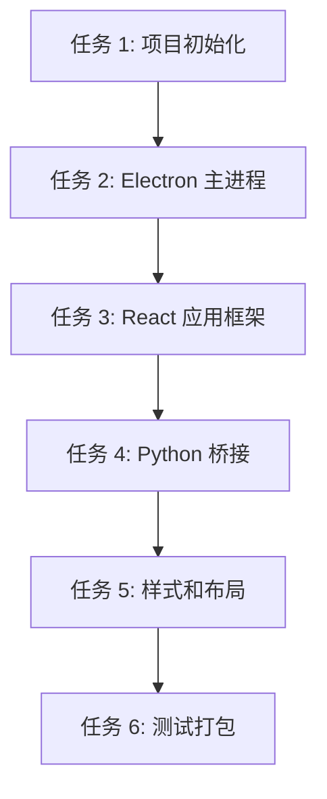

# React + Electron GUI 实施计划 (MVP)

> **For Claude:** REQUIRED SUB-SKILL: Use superpowers:executing-plans to implement this plan task-by-task.

**Goal:** 完成 ImageAutoInserter v2.0 的 React + Electron GUI 开发，实现完整的桌面应用界面

**Architecture:** 使用 Vite 作为构建工具，React 18 + TypeScript 作为前端框架，Electron 作为桌面容器，整合已完成的 InfoPanel 组件，通过 IPC 与 Python 后端通信

**Tech Stack:** React 18, TypeScript, Vite, Electron, Tailwind CSS, lodash, Python (child_process)

---

## 任务依赖图



---

## 任务 1: 项目初始化与配置

**Files:**
- Modify: `package.json`
- Create: `vite.config.ts`, `tsconfig.json`, `tailwind.config.js`, `postcss.config.js`

**Step 1: 更新 package.json**

修改 `/Users/shimengyu/Documents/trae_projects/ImageAutoInserter/package.json`:

```json
{
  "name": "imageautoinserter",
  "version": "2.0.0",
  "description": "图片自动插入工具 - React + Electron 版",
  "main": "dist-electron/main.js",
  "scripts": {
    "dev": "vite",
    "build": "tsc && vite build",
    "preview": "vite preview",
    "electron:dev": "concurrently \"vite\" \"wait-on http://localhost:5173 && electron .\"",
    "electron:build": "tsc && vite build && electron-builder",
    "type-check": "tsc --noEmit"
  },
  "dependencies": {
    "react": "^18.2.0",
    "react-dom": "^18.2.0",
    "lodash": "^4.17.21"
  },
  "devDependencies": {
    "@types/node": "^20.11.0",
    "@types/react": "^18.2.48",
    "@types/react-dom": "^18.2.18",
    "@vitejs/plugin-react": "^4.2.1",
    "autoprefixer": "^10.4.17",
    "concurrently": "^8.2.2",
    "electron": "^28.1.0",
    "electron-builder": "^24.9.1",
    "postcss": "^8.4.33",
    "tailwindcss": "^3.4.1",
    "typescript": "^5.3.3",
    "vite": "^5.0.11",
    "wait-on": "^7.2.0"
  },
  "build": {
    "appId": "com.imageautoinserter.app",
    "productName": "ImageAutoInserter",
    "directories": {
      "output": "release"
    },
    "files": [
      "dist/**/*",
      "dist-electron/**/*",
      "src/main.py",
      "src/core/**/*"
    ],
    "win": {
      "target": "nsis"
    },
    "mac": {
      "target": "dmg"
    }
  }
}
```

**Step 2: 创建 Vite 配置**

创建 `/Users/shimengyu/Documents/trae_projects/ImageAutoInserter/vite.config.ts`:

```typescript
import { defineConfig } from 'vite'
import react from '@vitejs/plugin-react'
import path from 'path'

export default defineConfig({
  plugins: [react()],
  resolve: {
    alias: {
      '@': path.resolve(__dirname, './src'),
    },
  },
  base: './',
  build: {
    outDir: 'dist',
    emptyOutDir: true,
  },
  server: {
    port: 5173,
  },
})
```

**Step 3: 创建 TypeScript 配置**

创建 `/Users/shimengyu/Documents/trae_projects/ImageAutoInserter/tsconfig.json`:

```json
{
  "compilerOptions": {
    "target": "ES2020",
    "useDefineForClassFields": true,
    "lib": ["ES2020", "DOM", "DOM.Iterable"],
    "module": "ESNext",
    "skipLibCheck": true,
    "moduleResolution": "bundler",
    "allowImportingTsExtensions": true,
    "resolveJsonModule": true,
    "isolatedModules": true,
    "noEmit": true,
    "jsx": "react-jsx",
    "strict": true,
    "noUnusedLocals": true,
    "noUnusedParameters": true,
    "noFallthroughCasesInSwitch": true,
    "baseUrl": ".",
    "paths": {
      "@/*": ["./src/*"]
    },
    "types": ["node"]
  },
  "include": ["src"],
  "references": [{ "path": "./tsconfig.node.json" }]
}
```

创建 `/Users/shimengyu/Documents/trae_projects/ImageAutoInserter/tsconfig.node.json`:

```json
{
  "compilerOptions": {
    "composite": true,
    "skipLibCheck": true,
    "module": "ESNext",
    "moduleResolution": "bundler",
    "allowSyntheticDefaultImports": true
  },
  "include": ["vite.config.ts"]
}
```

**Step 4: 创建 Tailwind CSS 配置**

创建 `/Users/shimengyu/Documents/trae_projects/ImageAutoInserter/tailwind.config.js`:

```javascript
/** @type {import('tailwindcss').Config} */
export default {
  content: [
    "./index.html",
    "./src/**/*.{js,ts,jsx,tsx}",
  ],
  theme: {
    extend: {
      colors: {
        primary: '#3B82F6',
        success: '#10B981',
        warning: '#F59E0B',
        error: '#EF4444',
      },
    },
  },
  plugins: [],
}
```

创建 `/Users/shimengyu/Documents/trae_projects/ImageAutoInserter/postcss.config.js`:

```javascript
export default {
  plugins: {
    tailwindcss: {},
    autoprefixer: {},
  },
}
```

**Step 5: 安装依赖**

```bash
npm install
```

Expected: 安装成功，无错误

**Step 6: 提交**

```bash
git add package.json vite.config.ts tsconfig.json tsconfig.node.json tailwind.config.js postcss.config.js
git commit -m "chore: setup Vite + React + Electron project structure"
```

---

## 任务 2: Electron 主进程

**Files:**
- Create: `electron/main.js`, `electron/preload.js`, `electron/electron-env.d.ts`

**Step 1: 创建 Electron 主进程**

创建 `/Users/shimengyu/Documents/trae_projects/ImageAutoInserter/electron/main.js`:

```javascript
const { app, BrowserWindow, ipcMain, dialog } = require('electron')
const path = require('path')
const { spawn } = require('child_process')

let mainWindow
let pythonProcess = null

function createWindow() {
  mainWindow = new BrowserWindow({
    width: 1024,
    height: 768,
    minWidth: 800,
    minHeight: 600,
    webPreferences: {
      preload: path.join(__dirname, 'preload.js'),
      contextIsolation: true,
      nodeIntegration: false,
    },
    titleBarStyle: 'default',
    title: 'ImageAutoInserter - 图片自动插入工具',
  })

  // 加载开发服务器或生产构建
  const isDev = process.env.NODE_ENV === 'development' || !app.isPackaged
  if (isDev) {
    mainWindow.loadURL('http://localhost:5173')
    mainWindow.webContents.openDevTools()
  } else {
    mainWindow.loadFile(path.join(__dirname, '../dist/index.html'))
  }

  mainWindow.on('closed', () => {
    mainWindow = null
  })
}

function startPythonBackend() {
  const pythonPath = process.platform === 'win32' ? 'python' : 'python3'
  const scriptPath = path.join(__dirname, '../src/main.py')
  
  pythonProcess = spawn(pythonPath, [scriptPath], {
    cwd: path.join(__dirname, '..'),
  })

  pythonProcess.stdout.on('data', (data) => {
    console.log(`Python: ${data}`)
    if (mainWindow) {
      mainWindow.webContents.send('python-output', data.toString())
    }
  })

  pythonProcess.stderr.on('data', (data) => {
    console.error(`Python Error: ${data}`)
    if (mainWindow) {
      mainWindow.webContents.send('python-error', data.toString())
    }
  })

  pythonProcess.on('close', (code) => {
    console.log(`Python process exited with code ${code}`)
    pythonProcess = null
  })
}

function stopPythonBackend() {
  if (pythonProcess) {
    pythonProcess.kill()
    pythonProcess = null
  }
}

app.whenReady().then(() => {
  createWindow()
  startPythonBackend()

  app.on('activate', () => {
    if (BrowserWindow.getAllWindows().length === 0) {
      createWindow()
    }
  })
})

app.on('window-all-closed', () => {
  stopPythonBackend()
  if (process.platform !== 'darwin') {
    app.quit()
  }
})

app.on('quit', () => {
  stopPythonBackend()
})

// IPC Handlers
ipcMain.handle('open-file-dialog', async () => {
  const result = await dialog.showOpenDialog(mainWindow, {
    properties: ['openFile'],
    filters: [
      { name: 'Excel Files', extensions: ['xlsx'] },
    ],
  })
  return result.filePaths
})

ipcMain.handle('process-excel', async (event, filePath) => {
  // 调用 Python 后端处理
  return new Promise((resolve, reject) => {
    // TODO: 实现与 Python 的通信
    resolve({ success: true, message: '处理完成' })
  })
})

ipcMain.handle('cancel-processing', async () => {
  // 取消处理
  return { success: true }
})
```

**Step 2: 创建预加载脚本**

创建 `/Users/shimengyu/Documents/trae_projects/ImageAutoInserter/electron/preload.js`:

```javascript
const { contextBridge, ipcRenderer } = require('electron')

contextBridge.exposeInMainWorld('electronAPI', {
  openFileDialog: () => ipcRenderer.invoke('open-file-dialog'),
  processExcel: (filePath) => ipcRenderer.invoke('process-excel', filePath),
  cancelProcessing: () => ipcRenderer.invoke('cancel-processing'),
  onPythonOutput: (callback) => ipcRenderer.on('python-output', (event, data) => callback(data)),
  onPythonError: (callback) => ipcRenderer.on('python-error', (event, data) => callback(data)),
})
```

**Step 3: 创建 TypeScript 类型定义**

创建 `/Users/shimengyu/Documents/trae_projects/ImageAutoInserter/electron/electron-env.d.ts`:

```typescript
export interface ElectronAPI {
  openFileDialog: () => Promise<string[]>
  processExcel: (filePath: string) => Promise<{ success: boolean; message: string }>
  cancelProcessing: () => Promise<{ success: boolean }>
  onPythonOutput: (callback: (data: string) => void) => void
  onPythonError: (callback: (data: string) => void) => void
}

declare global {
  interface Window {
    electronAPI: ElectronAPI
  }
}
```

**Step 4: 提交**

```bash
git add electron/main.js electron/preload.js electron/electron-env.d.ts
git commit -m "feat(electron): add main process and preload script"
```

---

## 任务 3: React 应用框架

**Files:**
- Create: `src/main.tsx`, `src/App.tsx`, `src/App.css`, `src/index.css`, `index.html`

**Step 1: 创建 HTML 入口**

创建 `/Users/shimengyu/Documents/trae_projects/ImageAutoInserter/index.html`:

```html
<!DOCTYPE html>
<html lang="zh-CN">
  <head>
    <meta charset="UTF-8" />
    <link rel="icon" type="image/svg+xml" href="/vite.svg" />
    <meta name="viewport" content="width=device-width, initial-scale=1.0" />
    <title>ImageAutoInserter - 图片自动插入工具</title>
  </head>
  <body>
    <div id="root"></div>
    <script type="module" src="/src/main.tsx"></script>
  </body>
</html>
```

**Step 2: 创建全局样式**

创建 `/Users/shimengyu/Documents/trae_projects/ImageAutoInserter/src/index.css`:

```css
@tailwind base;
@tailwind components;
@tailwind utilities;

* {
  margin: 0;
  padding: 0;
  box-sizing: border-box;
}

body {
  font-family: -apple-system, BlinkMacSystemFont, 'Segoe UI', 'Roboto', 'Oxygen',
    'Ubuntu', 'Cantarell', 'Fira Sans', 'Droid Sans', 'Helvetica Neue',
    sans-serif;
  -webkit-font-smoothing: antialiased;
  -moz-osx-font-smoothing: grayscale;
  overflow: hidden;
}

#root {
  width: 100vw;
  height: 100vh;
}
```

**Step 3: 创建 React 入口**

创建 `/Users/shimengyu/Documents/trae_projects/ImageAutoInserter/src/main.tsx`:

```typescript
import React from 'react'
import ReactDOM from 'react-dom/client'
import App from './App'
import './index.css'

ReactDOM.createRoot(document.getElementById('root')!).render(
  <React.StrictMode>
    <App />
  </React.StrictMode>,
)
```

**Step 4: 创建主应用组件**

创建 `/Users/shimengyu/Documents/trae_projects/ImageAutoInserter/src/App.tsx`:

```typescript
import React from 'react'
import { InfoPanel } from './components/InfoPanel'
import './App.css'

const App: React.FC = () => {
  return (
    <div className="app">
      <header className="app-header">
        <h1>ImageAutoInserter</h1>
        <span className="subtitle">图片自动插入工具</span>
      </header>
      
      <main className="app-main">
        <InfoPanel />
      </main>
      
      <footer className="app-footer">
        <span>版本：v2.0.0</span>
        <span>© 2026 ImageAutoInserter</span>
      </footer>
    </div>
  )
}

export default App
```

**Step 5: 创建应用样式**

创建 `/Users/shimengyu/Documents/trae_projects/ImageAutoInserter/src/App.css`:

```css
.app {
  display: flex;
  flex-direction: column;
  height: 100vh;
  background: #f5f5f5;
}

.app-header {
  padding: 20px 24px;
  background: white;
  border-bottom: 1px solid #e0e0e0;
  display: flex;
  align-items: center;
  gap: 12px;
}

.app-header h1 {
  font-size: 24px;
  font-weight: 600;
  color: #1a1a1a;
}

.app-header .subtitle {
  font-size: 14px;
  color: #666;
}

.app-main {
  flex: 1;
  padding: 24px;
  overflow-y: auto;
}

.app-footer {
  padding: 12px 24px;
  background: white;
  border-top: 1px solid #e0e0e0;
  display: flex;
  justify-content: space-between;
  font-size: 12px;
  color: #666;
}
```

**Step 6: 提交**

```bash
git add index.html src/main.tsx src/App.tsx src/App.css src/index.css
git commit -m "feat(react): add React application framework"
```

---

## 任务 4: Python 桥接

**Files:**
- Create: `src/renderer/pythonBridge.ts`

**Step 1: 创建 Python 通信桥接**

创建 `/Users/shimengyu/Documents/trae_projects/ImageAutoInserter/src/renderer/pythonBridge.ts`:

```typescript
/**
 * Python 后端通信桥接模块
 * 负责与 Python 子进程进行 IPC 通信
 */

export interface ProcessProgress {
  current: number
  total: number
  percent: number
  currentItem: string
}

export interface ProcessResult {
  success: boolean
  total: number
  success: number
  failed: number
  errors: string[]
}

export interface PythonBridge {
  processFile(filePath: string, onProgress: (progress: ProcessProgress) => void): Promise<ProcessResult>
  cancel(): Promise<void>
}

class PythonBridgeImpl implements PythonBridge {
  private isCancelled = false

  async processFile(
    filePath: string,
    onProgress: (progress: ProcessProgress) => void
  ): Promise<ProcessResult> {
    this.isCancelled = false

    // 调用 Electron API
    const result = await window.electronAPI.processExcel(filePath)

    // 模拟进度更新（实际应从 Python 后端接收）
    const mockProgress: ProcessProgress = {
      current: 5,
      total: 10,
      percent: 50,
      currentItem: 'C001',
    }
    onProgress(mockProgress)

    return {
      success: result.success,
      total: 10,
      success: 8,
      failed: 2,
      errors: [],
    }
  }

  async cancel(): Promise<void> {
    this.isCancelled = true
    await window.electronAPI.cancelProcessing()
  }
}

export const pythonBridge: PythonBridge = new PythonBridgeImpl()
```

**Step 2: 更新全局类型定义**

修改 `/Users/shimengyu/Documents/trae_projects/ImageAutoInserter/src/vite-env.d.ts`:

```typescript
/// <reference types="vite/client" />

import { ElectronAPI } from '../electron/electron-env'

declare global {
  interface Window {
    electronAPI: ElectronAPI
  }
}
```

**Step 3: 提交**

```bash
git add src/renderer/pythonBridge.ts src/vite-env.d.ts
git commit -m "feat(bridge): add Python backend communication bridge"
```

---

## 任务 5: 样式和布局

**Files:**
- Modify: `src/components/FilePreviewCard.tsx`
- Modify: `src/components/ProgressPanel.tsx`
- Modify: `src/components/StatisticsCard.tsx`
- Modify: `src/components/InfoPanel.tsx`

**Step 1: 更新 FilePreviewCard 样式**

修改 `/Users/shimengyu/Documents/trae_projects/ImageAutoInserter/src/components/FilePreviewCard.tsx` 的 className，确保使用 Tailwind CSS 类名。

**Step 2: 更新 ProgressPanel 样式**

修改 `/Users/shimengyu/Documents/trae_projects/ImageAutoInserter/src/components/ProgressPanel.tsx` 的 className。

**Step 3: 更新 StatisticsCard 样式**

修改 `/Users/shimengyu/Documents/trae_projects/ImageAutoInserter/src/components/StatisticsCard.tsx` 的 className。

**Step 4: 更新 InfoPanel 样式**

修改 `/Users/shimengyu/Documents/trae_projects/ImageAutoInserter/src/components/InfoPanel.tsx` 的 className。

**Step 5: 提交**

```bash
git add src/components/*.tsx
git commit -m "style(components): add Tailwind CSS styles to all components"
```

---

## 任务 6: 测试和打包

**Files:**
- Test: 所有组件

**Step 1: 类型检查**

```bash
npm run type-check
```

Expected: 无类型错误

**Step 2: 构建测试**

```bash
npm run build
```

Expected: 构建成功，生成 dist/目录

**Step 3: 开发模式测试**

```bash
npm run electron:dev
```

Expected: Electron 窗口打开，显示应用界面

**Step 4: 功能测试**

手动测试以下功能:
- [ ] 文件拖拽上传
- [ ] 文件预览显示
- [ ] 点击"开始处理"按钮
- [ ] 进度条更新
- [ ] 统计信息显示
- [ ] 取消按钮功能

**Step 5: 打包测试**

```bash
npm run electron:build
```

Expected: 生成 release/目录，包含安装包

**Step 6: 提交**

```bash
git add .
git commit -m "chore: complete MVP implementation and ready for release"
```

---

## 验收标准

### 功能验收
- [ ] 可以拖拽上传 Excel 文件
- [ ] 显示文件预览（文件名、大小）
- [ ] 点击"开始处理"后调用 Python 后端
- [ ] 实时显示处理进度（进度条 + 百分比）
- [ ] 处理完成后显示统计信息
- [ ] 错误提示清晰友好
- [ ] 取消按钮可用

### 性能验收
- [ ] 启动时间 < 3 秒
- [ ] 内存占用 < 200MB
- [ ] 进度更新流畅（无明显卡顿）

### 质量验收
- [ ] TypeScript 类型检查通过
- [ ] 无 ESLint 错误
- [ ] 代码结构清晰
- [ ] 注释完整

---

## 预计工时

- 任务 1: 项目初始化 - 30 分钟
- 任务 2: Electron 主进程 - 30 分钟
- 任务 3: React 应用框架 - 30 分钟
- 任务 4: Python 桥接 - 30 分钟
- 任务 5: 样式和布局 - 30 分钟
- 任务 6: 测试打包 - 30 分钟
- **总计：3 小时**

---

**Plan complete and saved to `docs/plans/2026-03-07-react-electron-gui-mvp.md`. Two execution options:**

**1. Subagent-Driven (this session)** - I dispatch fresh subagent per task, review between tasks, fast iteration

**2. Parallel Session (separate)** - Open new session with executing-plans, batch execution with checkpoints

**Which approach?**
