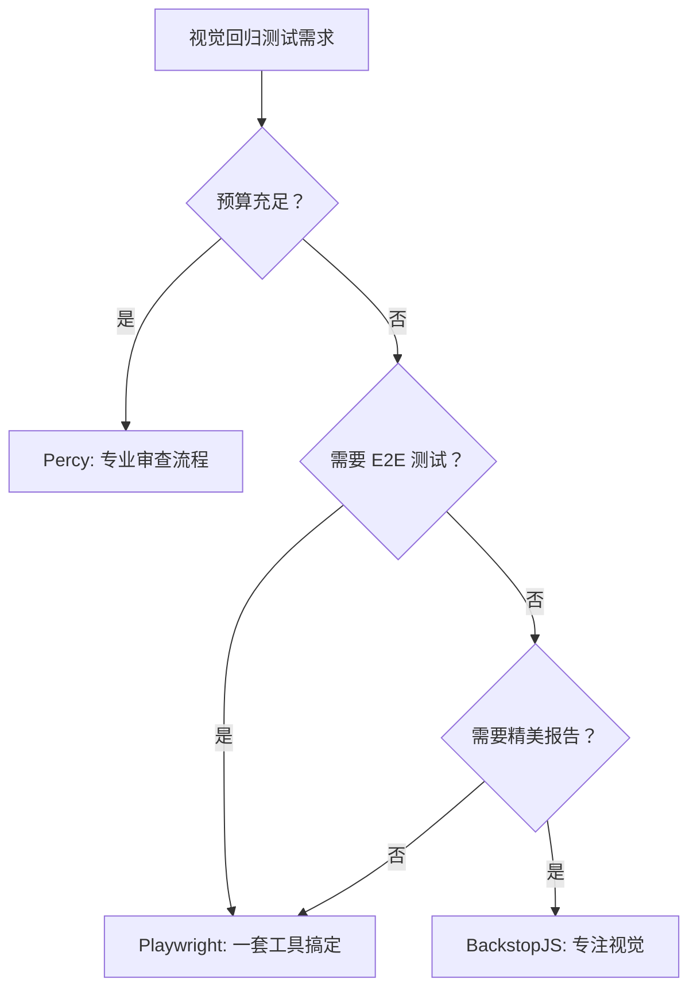
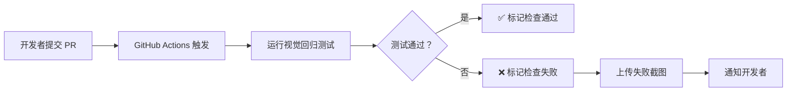

# 视觉回归测试指南

> **版本**: v1.0  
> **创建日期**: 2026-03-08  
> **状态**: 新建  
> **适用范围**: ImageAutoInserter GUI 视觉回归测试  
> **测试框架**: Playwright + Image Comparison

---

## 目录

1. [概述和目的](#概述和目的)
2. [测试范围](#测试范围)
3. [工具选型](#工具选型)
4. [测试环境 setup](#测试环境-setup)
5. [测试用例规格](#测试用例规格)
6. [测试脚本示例](#测试脚本示例)
7. [CI/CD 集成](#cd 集成)
8. [基线管理](#基线管理)
9. [故障排查](#故障排查)
10. [参考文档](#参考文档)

---

## 概述和目的

### 什么是视觉回归测试

视觉回归测试（Visual Regression Testing）是一种通过对比 UI 截图来检测界面视觉变化的自动化测试方法。它能够发现：

- 意外的样式变更（颜色、间距、字体）
- 布局错位和元素重叠
- 响应式断点问题
- 跨平台渲染差异
- 主题切换异常

### 为什么需要视觉回归测试

根据 [checklist.md](file:///Users/shimengyu/Documents/trae_projects/ImageAutoInserter/.trae/specs/gui-redesign/checklist.md#L55-L111) 中的视觉品质验收要求，我们需要确保：

1. **颜色系统一致性**: 主色、强调色、功能色使用正确
2. **间距系统统一性**: 所有 padding/margin/gap 使用 8px 基准系统
3. **圆角系统规范性**: 按钮 8px、卡片 12px、大容器 16px
4. **字体系统准确性**: 字号、字重、行高符合规范
5. **阴影系统轻量化**: shadow-sm/md/lg/xl 统一系统
6. **动画系统流畅性**: 150ms/200ms/300ms 统一时长

### 测试目标

- ✅ 捕获所有组件的视觉回归问题
- ✅ 覆盖所有应用状态（IDLE/READY/PROCESSING/COMPLETE/ERROR）
- ✅ 验证 4 种配色主题的正确性
- ✅ 确保跨平台（macOS/Windows）视觉一致性
- ✅ 集成到 CI/CD 流程，PR 自动审查视觉变更

---

## 测试范围

### ✅ 要测试的内容

#### 1. 组件截图测试

根据 [mockup.md](file:///Users/shimengyu/Documents/trae_projects/ImageAutoInserter/docs/design/gui-redesign/mockup.md#L415-L787) 定义的 5 个核心组件：

| 组件 | 测试内容 | 视觉规格 |
|------|---------|---------|
| **FilePicker** | 未选择状态、已选择状态、禁用状态 | 卡片式布局，圆角 12px，虚线/实线边框 |
| **ProgressBar** | 0%、25%、50%、75%、100% 进度 | 高度 8px，圆角 4px，渐变填充 |
| **ResultView** | 统计卡片展示 | 2×2 网格，160px×100px 卡片，渐变背景 |
| **ErrorDialog** | 错误对话框展示 | 圆角 16px，XL 阴影，警告图标 64px |
| **Button** | 主要按钮、次要按钮、禁用按钮 | 圆角 8px，渐变背景，阴影反馈 |

#### 2. 状态截图测试

根据 [mockup.md](file:///Users/shimengyu/Documents/trae_projects/ImageAutoInserter/docs/design/gui-redesign/mockup.md#L415-L787) 定义的 5 个应用状态：

| 状态 | 触发条件 | 关键视觉元素 |
|------|---------|-------------|
| **IDLE** | 应用启动 | 两个 FilePicker 卡片，选择按钮 |
| **READY** | 文件选择后 | 文件信息卡片，开始按钮激活 |
| **PROCESSING** | 处理中 | 旋转图标，进度条，统计信息 |
| **COMPLETE** | 处理完成 | 成功图标，4 个统计卡片，操作按钮 |
| **ERROR** | 发生错误 | 警告图标，错误卡片，重试按钮 |

#### 3. 主题截图测试

根据 [2026-03-05-ui-theme-system-design.md](file:///Users/shimengyu/Documents/trae_projects/ImageAutoInserter/docs/plans/2026-03-05-ui-theme-system-design.md) 定义的 4 种配色方案：

| 主题 | 主色 | 强调色 | 适用场景 |
|------|------|--------|---------|
| **Warm Greige** | #8B7355 | #D4A574 | 温暖专业感 |
| **Soft Blush** | #D4A5A5 | #B5838D | 柔和优雅 |
| **Muted Sage** | #87A878 | #6B8E6B | 自然清新 |
| **Dusty Lavender** | #9B8AA8 | #7D6B8D | 现代创意 |

#### 4. 响应式截图测试（可选）

| 视口 | 尺寸 | 测试内容 |
|------|------|---------|
| **Desktop** | 800×600 | 标准桌面布局 |
| **Small Desktop** | 640×480 | 最小可用尺寸 |

### ❌ 不测试的内容

根据视觉回归测试最佳实践，以下内容**不应**纳入测试：

| 不测试内容 | 原因 | 替代方案 |
|-----------|------|---------|
| **动态内容** | 文件大小、处理时间、文件名等实时数据会变化 | 使用 Mock 数据固定内容 |
| **动画过程** | 动画中间帧不稳定，容易产生误报 | 只测试动画结束后的最终状态 |
| **Loading 状态** | 旋转角度、进度百分比实时变化 | 使用 CSS 禁用动画后截图 |
| **系统级元素** | 系统对话框、原生控件渲染差异 | 只测试应用内自定义 UI |
| **字体渲染** | 不同 OS 字体渲染有细微差异 | 允许 2-3px 容差 |
| **抗锯齿边缘** | 像素级差异无法避免 | 使用模糊比较算法 |

---

## 工具选型

### 推荐方案：Playwright + Image Comparison

#### 为什么选择 Playwright

| 评估维度 | Playwright | Puppeteer | Cypress |
|---------|-----------|-----------|---------|
| **跨浏览器** | Chromium/Firefox/WebKit | 仅 Chromium | 仅 Chromium |
| **跨平台** | macOS/Windows/Linux | macOS/Windows/Linux | macOS/Windows/Linux |
| **截图质量** | ⭐⭐⭐⭐⭐ | ⭐⭐⭐⭐ | ⭐⭐⭐ |
| **CI/CD 集成** | ⭐⭐⭐⭐⭐ | ⭐⭐⭐⭐ | ⭐⭐⭐⭐ |
| **学习曲线** | 中等 | 中等 | 平缓 |
| **社区支持** | Microsoft 维护 | Google 维护 | 独立维护 |

#### Playwright 视觉回归测试功能

```typescript
// 内置截图对比功能
await expect(page).toHaveScreenshot('snapshot.png', {
  maxDiffPixels: 100,        // 允许的最大差异像素数
  maxDiffPixelRatio: 0.01,   // 允许的差异比例（1%）
  threshold: 0.2,            // 颜色阈值（0-1，越小越严格）
  fullPage: false,           // 是否截取整个页面
  animations: 'disabled',    // 禁用动画
  caret: 'hide',             // 隐藏输入框光标
  scale: 'css',              // 使用 CSS 缩放
});
```

### 替代方案对比

#### 方案 2：Percy（云基方案）

| 特性 | Percy | Playwright |
|------|-------|-----------|
| **部署方式** | SaaS 云服务 | 本地/自托管 |
| **价格** | $199/月（免费额度有限） | 免费开源 |
| **审查流程** | 专业 UI 审查界面 | 需要自建审查流程 |
| **集成难度** | 低（SDK 集成） | 中（需配置 CI） |
| **数据隐私** | 截图上传云端 | 数据完全可控 |
| **适用场景** | 企业团队，预算充足 | 开源项目，成本敏感 |

#### 方案 3：BackstopJS（开源方案）

| 特性 | BackstopJS | Playwright |
|------|-----------|-----------|
| **专门化** | 专注视觉回归测试 | 通用 E2E 测试框架 |
| **配置复杂度** | 高（JSON 配置） | 低（代码配置） |
| **浏览器支持** | Puppeteer/Playwright | 原生支持多浏览器 |
| **报告界面** | 精美对比报告 | 基础 HTML 报告 |
| **维护状态** | 社区维护 | Microsoft 官方维护 |
| **推荐度** | ⭐⭐⭐ | ⭐⭐⭐⭐⭐ |

### 工具选型决策



**本项目选择**: **Playwright** 
- ✅ 免费开源，符合项目成本约束
- ✅ 同时满足 E2E 测试和视觉回归测试需求
- ✅ Microsoft 官方维护，长期支持
- ✅ 与 GitHub Actions 无缝集成

---

## 测试环境 Setup

### 1. 安装步骤

#### Step 1: 初始化 Node.js 项目（如尚未初始化）

```bash
cd /Users/shimengyu/Documents/trae_projects/ImageAutoInserter
npm init -y
```

#### Step 2: 安装 Playwright

```bash
npm install -D @playwright/test
npx playwright install
```

#### Step 3: 安装 Playwright 浏览器

```bash
npx playwright install chromium
npx playwright install firefox  # 可选
npx playwright install webkit   # 可选
```

#### Step 4: 验证安装

```bash
npx playwright --version
# 输出示例：Version 1.42.0
```

### 2. 目录结构

```
/Users/shimengyu/Documents/trae_projects/ImageAutoInserter/
├── tests/
│   ├── visual/
│   │   ├── specs/
│   │   │   ├── file-picker.spec.ts
│   │   │   ├── progress-bar.spec.ts
│   │   │   ├── result-view.spec.ts
│   │   │   ├── error-dialog.spec.ts
│   │   │   ├── state-transitions.spec.ts
│   │   │   └── theme-variations.spec.ts
│   │   ├── fixtures/
│   │   │   ├── mock-data.ts
│   │   │   └── test-utils.ts
│   │   └── screenshots/
│   │       ├── baseline/
│   │       │   ├── components/
│   │       │   ├── states/
│   │       │   ├── themes/
│   │       │   └── responsive/
│   │       └── current/
│   ├── e2e/
│   │   └── main-flow.spec.ts
│   └── unit/
│       └── components.test.ts
├── playwright.config.ts
├── package.json
└── .github/
    └── workflows/
        └── visual-regression.yml
```

### 3. 配置文件

创建 `playwright.config.ts`：

```typescript
import { defineConfig, devices } from '@playwright/test';

export default defineConfig({
  // 测试目录
  testDir: './tests',
  
  // 超时设置
  timeout: 30 * 1000,
  expect: {
    timeout: 5000
  },
  
  // 失败重试
  retries: process.env.CI ? 2 : 0,
  
  // 并行执行
  workers: process.env.CI ? 1 : undefined,
  
  // 报告器
  reporter: [
    ['html', { outputFolder: 'playwright-report' }],
    ['json', { outputFile: 'test-results.json' }],
    ['junit', { outputFile: 'junit-results.xml' }],
  ],
  
  // 视觉回归测试配置
  use: {
    // 基础 URL（本地开发环境）
    baseURL: 'http://localhost:5173',
    
    // 截图配置
    screenshot: 'only-on-failure',
    video: 'retain-on-failure',
    trace: 'retain-on-failure',
    
    // 浏览器上下文
    viewport: { width: 800, height: 600 },
    deviceScaleFactor: 1, // 禁用 DPR 避免模糊
  },
  
  // 视觉回归测试专用配置
  projects: [
    {
      name: 'chromium-visual',
      use: { 
        ...devices['Desktop Chrome'],
        viewport: { width: 800, height: 600 },
      },
    },
    {
      name: 'webkit-visual',
      use: { 
        ...devices['Desktop Safari'],
        viewport: { width: 800, height: 600 },
      },
    },
  ],
  
  // Web 服务器配置（自动启动开发服务器）
  webServer: {
    command: 'npm run dev',
    url: 'http://localhost:5173',
    reuseExistingServer: !process.env.CI,
    timeout: 120 * 1000,
  },
});
```

### 4. 基线截图管理

#### 基线目录结构

```
tests/visual/screenshots/baseline/
├── components/
│   ├── file-picker-idle.png
│   ├── file-picker-ready.png
│   ├── file-picker-disabled.png
│   ├── progress-bar-0.png
│   ├── progress-bar-25.png
│   ├── progress-bar-50.png
│   ├── progress-bar-75.png
│   ├── progress-bar-100.png
│   ├── result-view-complete.png
│   └── error-dialog-error.png
├── states/
│   ├── state-idle.png
│   ├── state-ready.png
│   ├── state-processing.png
│   ├── state-complete.png
│   └── state-error.png
├── themes/
│   ├── theme-warm-greige.png
│   ├── theme-soft-blush.png
│   ├── theme-muted-sage.png
│   └── theme-dusty-lavender.png
└── responsive/
    ├── desktop-800x600.png
    └── small-640x480.png
```

#### 生成基线截图

```bash
# 首次生成基线（本地环境）
npx playwright test --update-snapshots

# 验证基线质量
npx playwright test tests/visual/specs/
```

---

## 测试用例规格

### 1. 组件截图测试

#### FilePicker 组件

```typescript
// tests/visual/specs/file-picker.spec.ts
import { test, expect } from '@playwright/test';

test.describe('FilePicker Component', () => {
  test('should render idle state correctly', async ({ page }) => {
    // 导航到 IDLE 状态
    await page.goto('/');
    
    // 等待组件渲染
    const filePicker = page.locator('[data-testid="file-picker-excel"]');
    await expect(filePicker).toBeVisible();
    
    // 截图对比
    await expect(filePicker).toHaveScreenshot('file-picker-idle.png', {
      maxDiffPixels: 50,
      threshold: 0.2,
    });
  });

  test('should render ready state correctly', async ({ page }) => {
    await page.goto('/');
    
    // Mock 文件选择
    await page.evaluate(() => {
      window.__MOCK_FILE__ = {
        name: 'product_list.xlsx',
        path: '/Users/shimengyu/Documents/product_list.xlsx',
        size: 2457600,
      };
    });
    
    // 触发文件选择
    await page.click('[data-testid="btn-select-excel"]');
    await page.waitForTimeout(500); // 等待状态更新
    
    const filePicker = page.locator('[data-testid="file-picker-excel"]');
    await expect(filePicker).toHaveScreenshot('file-picker-ready.png', {
      maxDiffPixels: 50,
      threshold: 0.2,
    });
  });

  test('should render disabled state correctly', async ({ page }) => {
    await page.goto('/');
    
    const filePicker = page.locator('[data-testid="file-picker-image"]');
    const button = filePicker.locator('button');
    
    // 验证禁用状态
    await expect(button).toBeDisabled();
    await expect(filePicker).toHaveScreenshot('file-picker-disabled.png', {
      maxDiffPixels: 50,
      threshold: 0.2,
    });
  });
});
```

#### ProgressBar 组件

```typescript
// tests/visual/specs/progress-bar.spec.ts
import { test, expect } from '@playwright/test';

test.describe('ProgressBar Component', () => {
  const progressValues = [0, 25, 50, 75, 100];

  for (const progress of progressValues) {
    test(`should render ${progress}% progress correctly`, async ({ page }) => {
      await page.goto('/');
      
      // 进入 PROCESSING 状态
      await page.evaluate((progress) => {
        window.__MOCK_STATE__ = {
          phase: 'PROCESSING',
          progress,
          current: 'C000123456',
        };
      }, progress);
      
      // 禁用动画（避免截图时进度条在运动）
      await page.addStyleTag({
        content: `
          .progress-fill {
            transition: none !important;
            animation: none !important;
          }
        `,
      });
      
      const progressBar = page.locator('[data-testid="progress-bar"]');
      await expect(progressBar).toHaveScreenshot(`progress-bar-${progress}.png`, {
        maxDiffPixels: 30,
        threshold: 0.15,
      });
    });
  }
});
```

#### ResultView 组件

```typescript
// tests/visual/specs/result-view.spec.ts
import { test, expect } from '@playwright/test';

test.describe('ResultView Component', () => {
  test('should render complete state correctly', async ({ page }) => {
    await page.goto('/');
    
    // Mock 完成状态数据
    await page.evaluate(() => {
      window.__MOCK_STATE__ = {
        phase: 'COMPLETE',
        result: {
          total: 100,
          success: 98,
          failed: 2,
          successRate: 98,
        },
      };
    });
    
    const resultView = page.locator('[data-testid="result-view"]');
    await expect(resultView).toBeVisible();
    
    // 截图对比
    await expect(resultView).toHaveScreenshot('result-view-complete.png', {
      maxDiffPixels: 100,
      threshold: 0.2,
    });
  });

  test('should render stat cards with correct colors', async ({ page }) => {
    await page.goto('/');
    
    await page.evaluate(() => {
      window.__MOCK_STATE__ = {
        phase: 'COMPLETE',
        result: {
          total: 100,
          success: 98,
          failed: 2,
          successRate: 98,
        },
      };
    });
    
    // 验证统计卡片颜色
    const totalCard = page.locator('[data-testid="stat-total"]');
    const successCard = page.locator('[data-testid="stat-success"]');
    const failedCard = page.locator('[data-testid="stat-failed"]');
    const rateCard = page.locator('[data-testid="stat-rate"]');
    
    // 验证颜色（使用 toHaveCSS）
    await expect(totalCard).toHaveCSS('color', 'rgb(37, 99, 235)'); // #2563EB
    await expect(successCard).toHaveCSS('color', 'rgb(16, 185, 129)'); // #10B981
    await expect(failedCard).toHaveCSS('color', 'rgb(239, 68, 68)'); // #EF4444
    await expect(rateCard).toHaveCSS('color', 'rgb(37, 99, 235)'); // #2563EB
  });
});
```

#### ErrorDialog 组件

```typescript
// tests/visual/specs/error-dialog.spec.ts
import { test, expect } from '@playwright/test';

test.describe('ErrorDialog Component', () => {
  test('should render error dialog correctly', async ({ page }) => {
    await page.goto('/');
    
    // Mock 错误状态
    await page.evaluate(() => {
      window.__MOCK_STATE__ = {
        phase: 'ERROR',
        error: {
          message: '文件 "C000123789.jpg" 未找到',
          location: '第 45 行，C 列',
          suggestion: '检查图片源是否包含该文件',
        },
      };
    });
    
    const errorDialog = page.locator('[data-testid="error-dialog"]');
    await expect(errorDialog).toBeVisible();
    
    // 截图对比
    await expect(errorDialog).toHaveScreenshot('error-dialog-error.png', {
      maxDiffPixels: 80,
      threshold: 0.2,
    });
  });

  test('should render error card with correct style', async ({ page }) => {
    await page.goto('/');
    
    await page.evaluate(() => {
      window.__MOCK_STATE__ = {
        phase: 'ERROR',
        error: {
          message: '文件 "C000123789.jpg" 未找到',
          location: '第 45 行，C 列',
          suggestion: '检查图片源是否包含该文件',
        },
      };
    });
    
    const errorCard = page.locator('[data-testid="error-card"]');
    
    // 验证背景色（浅红色 #FEF2F2）
    await expect(errorCard).toHaveCSS('background-color', 'rgb(254, 242, 242)');
    
    // 验证边框色（#FECACA）
    await expect(errorCard).toHaveCSS('border-color', 'rgb(254, 204, 202)');
  });
});
```

### 2. 状态转换测试

```typescript
// tests/visual/specs/state-transitions.spec.ts
import { test, expect } from '@playwright/test';

test.describe('State Transitions', () => {
  test('should capture all states correctly', async ({ page }) => {
    const states = [
      { name: 'idle', mock: { phase: 'IDLE' } },
      { 
        name: 'ready', 
        mock: { 
          phase: 'READY',
          excelFile: {
            name: 'product_list.xlsx',
            path: '/Users/shimengyu/Documents/product_list.xlsx',
            size: 2457600,
          },
          imageSource: {
            name: 'product_images.zip',
            path: '/Users/shimengyu/Downloads/product_images.zip',
            count: 156,
          },
        },
      },
      {
        name: 'processing',
        mock: {
          phase: 'PROCESSING',
          progress: 67,
          current: 'C000123456',
          processed: 67,
          total: 100,
          remainingTime: '2 分钟',
        },
      },
      {
        name: 'complete',
        mock: {
          phase: 'COMPLETE',
          result: {
            total: 100,
            success: 98,
            failed: 2,
            successRate: 98,
          },
        },
      },
      {
        name: 'error',
        mock: {
          phase: 'ERROR',
          error: {
            message: '文件 "C000123789.jpg" 未找到',
            location: '第 45 行，C 列',
            suggestion: '检查图片源是否包含该文件',
          },
        },
      },
    ];

    for (const state of states) {
      await test.step(`Capture ${state.name} state`, async () => {
        await page.goto('/');
        
        // 注入 Mock 状态
        await page.evaluate((mock) => {
          window.__MOCK_STATE__ = mock;
        }, state.mock);
        
        // 等待渲染
        await page.waitForTimeout(500);
        
        // 禁用动画
        await page.addStyleTag({
          content: `
            * {
              transition: none !important;
              animation: none !important;
            }
          `,
        });
        
        // 截取整个应用
        const app = page.locator('[data-testid="app"]');
        await expect(app).toHaveScreenshot(`state-${state.name}.png`, {
          maxDiffPixels: 150,
          threshold: 0.25,
        });
      });
    }
  });
});
```

### 3. 主题变体测试

```typescript
// tests/visual/specs/theme-variations.spec.ts
import { test, expect } from '@playwright/test';

test.describe('Theme Variations', () => {
  const themes = [
    { 
      name: 'warm-greige', 
      primary: '#8B7355',
      accent: '#D4A574',
    },
    { 
      name: 'soft-blush', 
      primary: '#D4A5A5',
      accent: '#B5838D',
    },
    { 
      name: 'muted-sage', 
      primary: '#87A878',
      accent: '#6B8E6B',
    },
    { 
      name: 'dusty-lavender', 
      primary: '#9B8AA8',
      accent: '#7D6B8D',
    },
  ];

  for (const theme of themes) {
    test(`should render ${theme.name} theme correctly`, async ({ page }) => {
      await page.goto('/');
      
      // 应用主题
      await page.evaluate((theme) => {
        document.documentElement.setAttribute('data-theme', theme.name);
        document.documentElement.style.setProperty('--primary', theme.primary);
        document.documentElement.style.setProperty('--accent', theme.accent);
      }, theme);
      
      // 等待主题应用
      await page.waitForTimeout(300);
      
      // 禁用动画
      await page.addStyleTag({
        content: `
          * {
            transition: none !important;
            animation: none !important;
          }
        `,
      });
      
      // 截取应用
      const app = page.locator('[data-testid="app"]');
      await expect(app).toHaveScreenshot(`theme-${theme.name}.png`, {
        maxDiffPixels: 200,
        threshold: 0.3, // 主题颜色差异较大，放宽阈值
      });
      
      // 验证主色应用
      const primaryButton = page.locator('[data-testid="btn-primary"]');
      const backgroundColor = await primaryButton.evaluate((el) => 
        window.getComputedStyle(el).backgroundColor
      );
      
      // 验证颜色（RGB 格式）
      expect(backgroundColor).toContain('rgb(');
    });
  }
});
```

### 4. 响应式测试（可选）

```typescript
// tests/visual/specs/responsive.spec.ts
import { test, expect } from '@playwright/test';

test.describe('Responsive Layouts', () => {
  const viewports = [
    { name: 'desktop', width: 800, height: 600 },
    { name: 'small', width: 640, height: 480 },
  ];

  for (const viewport of viewports) {
    test(`should render ${viewport.name} viewport correctly`, async ({ page }) => {
      // 设置视口
      await page.setViewportSize({ 
        width: viewport.width, 
        height: viewport.height 
      });
      
      await page.goto('/');
      
      // 禁用动画
      await page.addStyleTag({
        content: `
          * {
            transition: none !important;
            animation: none !important;
          }
        `,
      });
      
      // 截图
      await expect(page).toHaveScreenshot(`responsive-${viewport.name}-${viewport.width}x${viewport.height}.png`, {
        fullPage: true,
        maxDiffPixels: 300,
        threshold: 0.3,
      });
    });
  }
});
```

---

## CI/CD 集成

### GitHub Actions 工作流

创建 `.github/workflows/visual-regression.yml`：

```yaml
name: Visual Regression Testing

on:
  push:
    branches: [main, develop]
  pull_request:
    branches: [main, develop]

jobs:
  visual-regression:
    runs-on: ubuntu-latest
    
    steps:
      - name: Checkout code
        uses: actions/checkout@v4
        
      - name: Setup Node.js
        uses: actions/setup-node@v4
        with:
          node-version: '20'
          cache: 'npm'
          
      - name: Install dependencies
        run: npm ci
        
      - name: Install Playwright browsers
        run: npx playwright install --with-deps chromium
        
      - name: Build application
        run: npm run build
        
      - name: Run visual regression tests
        run: npx playwright test tests/visual/
        env:
          CI: true
          
      - name: Upload test report
        uses: actions/upload-artifact@v4
        if: always()
        with:
          name: playwright-report
          path: playwright-report/
          retention-days: 30
          
      - name: Upload failed screenshots
        uses: actions/upload-artifact@v4
        if: failure()
        with:
          name: failed-screenshots
          path: tests/visual/screenshots/current/
          retention-days: 30

  # 可选：与 Percy 集成
  percy-visual-regression:
    runs-on: ubuntu-latest
    if: github.event_name == 'pull_request'
    
    steps:
      - name: Checkout code
        uses: actions/checkout@v4
        
      - name: Setup Node.js
        uses: actions/setup-node@v4
        with:
          node-version: '20'
          
      - name: Install dependencies
        run: npm ci
        
      - name: Install Playwright
        run: npx playwright install --with-deps chromium
        
      - name: Build and serve
        run: |
          npm run build
          npx serve -s dist -l 5173 &
          sleep 5
          
      - name: Run Percy
        env:
          PERCY_TOKEN: ${{ secrets.PERCY_TOKEN }}
        run: npx percy exec -- npx playwright test tests/visual/
```

### PR 审查流程

#### 1. 自动触发



#### 2. 审查步骤

**对于测试失败的情况**：

1. **查看测试报告**
   ```bash
   # 下载 artifact
   gh run download <run-id> --name playwright-report
   
   # 打开 HTML 报告
   open playwright-report/index.html
   ```

2. **对比截图差异**
   - 左侧：基线截图（baseline）
   - 右侧：当前截图（current）
   - 中间：差异高亮（红色=不同像素）

3. **判断变更类型**
   - ✅ **预期变更**: 设计调整、功能优化
   - ❌ **意外回归**: 样式 bug、布局错误

4. **处理方式**
   ```bash
   # 如果是预期变更，更新基线
   npx playwright test --update-snapshots
   
   # 提交更新后的基线
   git add tests/visual/screenshots/baseline/
   git commit -m "test: update visual baseline for [feature]"
   ```

### 失败处理策略

#### 1. 误报处理

常见问题及解决方案：

| 问题 | 原因 | 解决方案 |
|------|------|---------|
| **字体渲染差异** | macOS vs Windows 字体不同 | 提高 `threshold` 到 0.3 |
| **抗锯齿边缘** | 子像素渲染差异 | 使用 `maxDiffPixels` 允许少量差异 |
| **动画状态** | 截图时动画未结束 | 添加 `waitForTimeout()` 或禁用动画 |
| **时间戳/动态数据** | 实时数据变化 | 使用 Mock 数据固定内容 |

#### 2. 配置优化

```typescript
// 针对不同组件使用不同容差
const SNAPSHOT_CONFIG = {
  // 高容差组件（动态内容多）
  highTolerance: {
    maxDiffPixels: 200,
    threshold: 0.3,
  },
  
  // 标准组件
  standard: {
    maxDiffPixels: 100,
    threshold: 0.2,
  },
  
  // 静态组件（严格）
  strict: {
    maxDiffPixels: 30,
    threshold: 0.15,
  },
};
```

---

## 基线管理

### 何时更新基线

#### ✅ 应该更新基线的场景

| 场景 | 示例 | 操作流程 |
|------|------|---------|
| **设计变更** | 调整主色从 #2563EB 到 #8B7355 | 1. 确认设计文档已更新<br>2. 运行 `--update-snapshots`<br>3. 提交新基线 |
| **组件重构** | FilePicker 布局优化 | 1. 验收新设计<br>2. 更新基线<br>3. 在 PR 中说明 |
| **新增状态** | 添加 LOADING 状态 | 1. 创建新测试用例<br>2. 生成新基线<br>3. 提交所有截图 |
| **主题扩展** | 新增第 5 种配色方案 | 1. 添加主题测试<br>2. 生成主题基线<br>3. 更新文档 |

#### ❌ 不应更新基线的场景

| 场景 | 问题 | 正确做法 |
|------|------|---------|
| **测试失败** | 未调查原因直接更新 | 先修复 bug，再更新基线 |
| **模糊变更** | 不确定是否应该变化 | 与设计师确认后再更新 |
| **临时修复** | 使用 `maxDiffPixels: 9999` | 找到根本原因并修复 |

### 如何更新基线

#### 方法 1：全量更新

```bash
# 更新所有测试的基线截图
npx playwright test --update-snapshots

# 验证更新后测试通过
npx playwright test tests/visual/
```

#### 方法 2：定向更新

```bash
# 只更新特定文件的基线
npx playwright test tests/visual/specs/file-picker.spec.ts --update-snapshots

# 只更新特定浏览器
npx playwright test --project=chromium-visual --update-snapshots
```

#### 方法 3：CI 中自动更新（不推荐）

```yaml
# ⚠️ 仅用于特殊场景（如大规模重构）
- name: Update baseline (if needed)
  run: npx playwright test --update-snapshots
  if: github.event_name == 'push' && github.ref == 'refs/heads/develop'
```

### 版本控制策略

#### Git 管理最佳实践

```bash
# .gitignore 配置
# ✅ 跟踪基线截图
# ❌ 不跟踪当前截图（自动生成）

# .gitignore
tests/visual/screenshots/current/
playwright-report/
test-results/
```

#### Git LFS 配置（推荐）

对于大型项目，截图文件可能超过 100MB：

```bash
# 安装 Git LFS
git lfs install

# 跟踪截图文件
git lfs track "tests/visual/screenshots/baseline/**/*.png"

# 验证
git lfs ls-files
```

#### 提交规范

```bash
# 标准提交格式
git commit -m "test(visual): update baseline for FilePicker component

- Update file-picker-ready.png to reflect new design
- Adjust threshold to 0.2 for better accuracy
- Related to PR #123"
```

---

## 故障排查

### 常见失败原因

#### 1. 截图尺寸不一致

**问题**:
```
Error: Screenshot size mismatch:
  Expected: 800x600
  Actual: 800x601
```

**原因**:
- 动态内容导致高度变化
- 字体加载未完成
- CSS 动画影响布局

**解决方案**:
```typescript
// 方案 1: 等待字体加载
await page.evaluate(() => document.fonts.ready);

// 方案 2: 固定容器高度
await page.addStyleTag({
  content: '[data-testid="app"] { height: 600px !important; }',
});

// 方案 3: 使用 fullPage 模式
await expect(page).toHaveScreenshot('snapshot.png', {
  fullPage: true,
});
```

#### 2. 颜色阈值过严

**问题**:
```
Error: Expected image to be the same but was not
Diff: 2.5% pixels are different
```

**原因**:
- 跨平台渲染差异（macOS vs Windows）
- 浏览器抗锯齿算法不同
- 渐变渲染微小差异

**解决方案**:
```typescript
// 调整阈值
await expect(page).toHaveScreenshot('snapshot.png', {
  threshold: 0.3, // 默认 0.2，放宽到 0.3
  maxDiffPixels: 150, // 允许最多 150 个像素不同
});
```

#### 3. 动画导致截图模糊

**问题**:
```
Error: Screenshot captured during animation
```

**原因**:
- 进度条动画未结束
- 淡入淡出效果
- 旋转 Loading 图标

**解决方案**:
```typescript
// 方案 1: 全局禁用动画
await page.addStyleTag({
  content: `
    *, *::before, *::after {
      transition: none !important;
      animation: none !important;
    }
  `,
});

// 方案 2: 等待动画结束
await page.waitForTimeout(1000); // 等待 1 秒

// 方案 3: 使用 Playwright 内置选项
await expect(page).toHaveScreenshot('snapshot.png', {
  animations: 'disabled',
});
```

#### 4. 动态数据导致失败

**问题**:
```
Error: Text content mismatch in screenshot
```

**原因**:
- 文件大小实时变化
- 时间戳不断更新
- 随机 ID 生成

**解决方案**:
```typescript
// 使用 Mock 数据
await page.evaluate(() => {
  window.__MOCK_DATA__ = {
    fileName: 'product_list.xlsx',
    fileSize: 2457600,
    processedCount: 67,
    totalCount: 100,
    timestamp: '2026-03-08 10:00:00', // 固定时间
  };
});

// 或者隐藏动态内容
await page.addStyleTag({
  content: '[data-dynamic] { visibility: hidden; }',
});
```

### 平台差异处理

#### macOS vs Windows

| 差异类型 | 表现 | 解决方案 |
|---------|------|---------|
| **字体渲染** | macOS 字体更清晰，Windows 有锯齿 | 提高 `threshold` 到 0.3 |
| **滚动条** | macOS 隐藏式，Windows 常驻 | 隐藏滚动条：`::-webkit-scrollbar { display: none; }` |
| **DPI 缩放** | macOS Retina vs Windows 100% | 固定 `deviceScaleFactor: 1` |
| **系统字体** | San Francisco vs Segoe UI | 使用 Web Font（如 Inter） |

#### 配置示例

```typescript
// playwright.config.ts
export default defineConfig({
  projects: [
    {
      name: 'macos',
      use: {
        ...devices['Desktop Chrome'],
        deviceScaleFactor: 2, // macOS Retina
      },
    },
    {
      name: 'windows',
      use: {
        ...devices['Desktop Chrome'],
        deviceScaleFactor: 1, // Windows 标准
      },
    },
  ],
  
  // 跨平台对比配置
  use: {
    screenshot: {
      maxDiffPixels: 200, // 允许更多差异
      threshold: 0.3,     // 放宽阈值
    },
  },
});
```

### 性能优化

#### 1. 并行执行

```bash
# CI 环境中串行执行（避免资源竞争）
npx playwright test --workers=1

# 本地开发并行执行
npx playwright test --workers=4
```

#### 2. 缓存优化

```yaml
# .github/workflows/visual-regression.yml
- name: Cache Playwright browsers
  uses: actions/cache@v4
  with:
    path: ~/.cache/ms-playwright
    key: ${{ runner.os }}-playwright-${{ hashFiles('**/package-lock.json') }}
```

#### 3. 选择性运行

```bash
# 只运行失败的测试
npx playwright test --last-failed

# 只运行特定目录
npx playwright test tests/visual/specs/components/
```

---

## 参考文档

### 项目内部文档

- [mockup.md](file:///Users/shimengyu/Documents/trae_projects/ImageAutoInserter/docs/design/gui-redesign/mockup.md) - GUI Mockup 规格文档
- [checklist.md](file:///Users/shimengyu/Documents/trae_projects/ImageAutoInserter/.trae/specs/gui-redesign/checklist.md) - GUI 设计验收检查清单
- [spec.md](file:///Users/shimengyu/Documents/trae_projects/ImageAutoInserter/.trae/specs/gui-redesign/spec.md) - GUI 设计规格文档
- [2026-03-05-ui-theme-system-design.md](file:///Users/shimengyu/Documents/trae_projects/ImageAutoInserter/docs/plans/2026-03-05-ui-theme-system-design.md) - UI 主题系统设计文档

### Playwright 官方文档

- [Visual Comparisons](https://playwright.dev/docs/test-snapshots)
- [Test Configuration](https://playwright.dev/docs/test-configuration)
- [GitHub Actions](https://playwright.dev/docs/ci-intro)

### 视觉回归测试最佳实践

- [Percy Visual Testing Guide](https://docs.percy.io/docs/visual-testing)
- [BackstopJS Documentation](https://github.com/garris/BackstopJS)
- [Chromatic Visual Testing](https://www.chromatic.com/docs/visual-testing)

---

## 附录：快速开始命令

```bash
# 1. 安装依赖
npm install -D @playwright/test
npx playwright install

# 2. 创建测试目录
mkdir -p tests/visual/specs
mkdir -p tests/visual/screenshots/baseline

# 3. 创建配置文件
# 复制本文档中的 playwright.config.ts

# 4. 创建第一个测试
# 复制本文档中的 file-picker.spec.ts

# 5. 生成基线截图
npx playwright test --update-snapshots

# 6. 运行测试
npx playwright test tests/visual/

# 7. 查看报告
npx playwright show-report
```

---

**文档结束**

> 本视觉回归测试指南与 [mockup.md](file:///Users/shimengyu/Documents/trae_projects/ImageAutoInserter/docs/design/gui-redesign/mockup.md) 和 [checklist.md](file:///Users/shimengyu/Documents/trae_projects/ImageAutoInserter/.trae/specs/gui-redesign/checklist.md) 配套使用，确保 GUI 视觉品质的持续验证。
